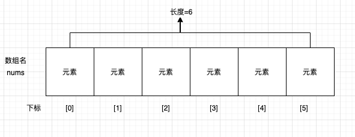
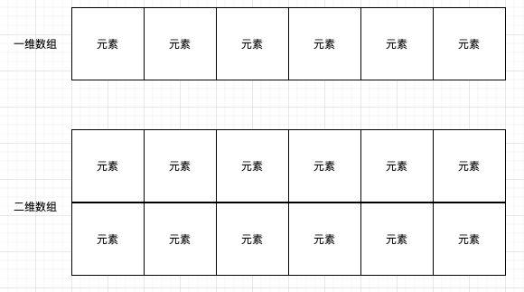
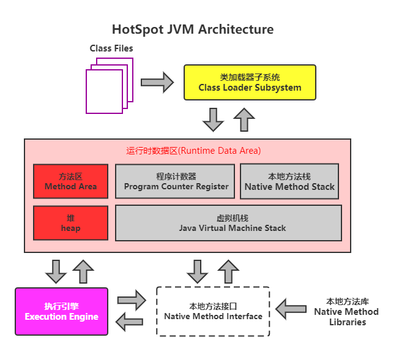
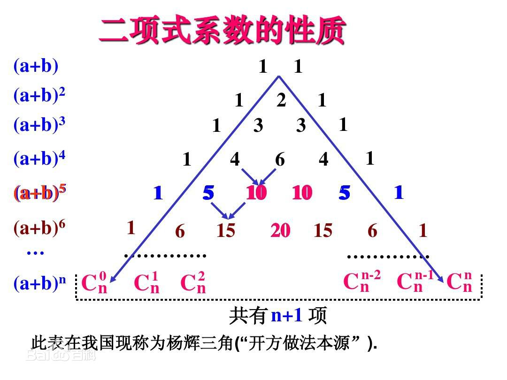

#### 数组概念

数组就是用于存储数据的长度固定的容器，保证多个数据的数据类型要一致

所谓**数组**(array)，就是相同数据类型的元素按一定顺序排列的集合，就是把有限个类型相同的变量用一个名字命名，以便于统一管理他们，然后用编号区分他们，这个名称为**数组名**，编号称为**下标或索引**(index)。组成数组的各个变量称为数组的**元素**(element)。数组中元素的个数称为**数组的长度(**length)。




##### 数组的特点：

- 数组本身是引用**数据类型**，而数组中的元素可以是**任何数据类型**，包括基本数据类型和引用数据类型。

- 数组的长度一旦确定就不能修改。
- 创建数组时会在内存中开辟一整块**连续的空间。**
- 存取元素的速度快，因为可以通过[下标]，直接定位到任意一个元素。
- 数组名中引用的是这块连续空间的首地址。

#### 数组的分类

##### 按照维度区分

- 一维数组：存储一组数据
- 二维数组：存储多组数据，相当于二维表，一行代表一组数据



##### 按照元素类型分

- 基本数据类型的元素：存储基本数据类型值
  - byte
  - short
  - int
  - long
  - float
  - double
  - char
  - boolean

- 引用数据类型的元素：存储对象（本质上存储对象的首地址）
  - 类
  - 数组
  - 接口
  - 枚举
  - 注解
  - 记录


#### 一维数组的声明

```java
//推荐
数组类型[] 数组的名称;
//不推荐
数组类型 数组名[];
```

- 数组的维度：在Java中数组的符号是`[]`,表示一维数组，`[][]`表示二维数组
- 数组的元素类型：即创建数组容器可以存储什么数据类型的数据。
- 数组名：就是代表某个数组的标识符，数组也是变量名，按照变量的命名规范。

```java
public class LinearArrayDeclaration {
    public static void main(String[] args) {
        int [] ages;
        float price[];
        String [] foods;
        }
}
```

#### 一维数组初始化

- 如果数组变量的初始化和数组的元素的赋值操作同时进行，称为静态初始化。
- 静态初始化，本质就是用静态数据（编译时已知）为数组初始化。此时数组的长度由静态数据个数决定。
- new 创建数组使用的关键字。因为数组本身是引用数据类型，所以用new创建数组实体。

##### 静态初始化

```java
数据类型[] 数组名 = new 数据类型[]{元素1,元素2,元素3,....};

或者

数据类型 [] 数组名;
数组名 = new 数据类型[]{元素1,元素2,元素3,....};
```

```java
public class StaticArrayInitialization {
    public static void main(String[] args) {
        int[] ages = new int[]{1, 2, 3, 5, 6, 8};
        double[] price2 = {18.5, 17.2, 20.5};
        String[] foods;
        foods = new String[]{"麻婆豆腐", "宫保鸡丁", "青椒肉丝"};
    }
}
```

##### 动态初始化

数组变量的初始化和数组元素赋值操作分开进行，即为动态初始化。

动态初始化中，只确定了元素的个数（数组长度），而元素此时只是默认值，还并未真正赋值。

```java
数组存储的元素的数据类型[] 数组名字 = new 数组存储的元素的数据类型[长度];

或

数组存储的数据类型[] 数组名字;
数组名字 = new 数组存储的数据类型[长度];
```

> [长度]：数组的长度，表示数组容器中最多存储的元素。

```java
public class ArrayDynamicInitialization {
    public static void main(String[] args) {
        int [] scores = new int[4];
        scores[0] = 1;
        scores[1] = 2;
        scores[2] = 3;
        scores[3] = 4;
        double [] price = new double[4];
        price[0] = 1.9;
        float [] price2 = new float[3];
        price2[2] = 1.8f;
    }
}
```

##### 数组遍历

```java
public class ArrayTraversal {
    public static void main(String[] args) {
        String [] foods = new String[]{"麻婆豆腐","宫保鸡丁","青椒肉丝"};
        for (int i = 0; i < foods.length; i++) {
            System.out.println(foods[i]);
        }
    }
}
```

##### 数组元素默认值

数组是引用数据类型，使用动态初始化方式创建 数组时，元素值只是默认值

```java
public class ArrayDefaultAttribute {
    public static void main(String[] args) {
        int [] scores = new int[4];
        System.out.println(scores[2]);  //输出 0
        double [] price = new double[4];
        System.out.println(price[1]);   //输出0.0
        float [] price2 = new float[3];
        System.out.println(price2[2]);  //输出0.0
        boolean [] flag = new boolean[2];
        System.out.println(flag[1]);    //输出false
        char gender[] = new char[4];
        System.out.println(gender[3]);  //输出0或'\u0000'
        if (gender[3] == 0){
            System.out.println("gender == 0");
        }
        String [] foods = new String[10];   //null
        System.out.println(foods[2]);
    }
}
```

##### 一维数组内存分析

提高运算效率，就对空间进行了不同区域的划分，因为每一片区域都有特定的处理数据方式和内存管理方式



| 区域名称   | 作用                                                         |
| ---------- | ------------------------------------------------------------ |
| `虚拟机栈` | 用于存储正在执行的每个Java方法的局部变量表等。局部变量表存放了编译期可知长度<br>的各种基本数据类型、对象引用，方法执行完，自动释放。 |
| `堆内存`   | 存储对象（包括数组对象），new创建的，都存储在堆内存          |
| `方法区`   | 存储已被虚拟机加载的类信息、常量、（静态变量）、即使编译器编译后的代码等数据 |
| 本地方法栈 | 当程序调用了native的本地方法时，本地方法执行期间的内存区域   |
| 程序计数器 | 程序计数器是CPU中的寄存器，它包含每一个线程下一条要执行的指令地址 |

> 因为数组第一个元素距离数组首地址间隔0个单位格；所以数组下标由0开始

```java
public class ArrayTest {
    public static void main(String[] args) {
        String [] foods = new String[]{"麻婆豆腐","宫保鸡丁","青椒肉丝"};
        String [] foods2 = new String[3];
        foods2 = foods;
        System.out.println(foods);  //[Ljava.lang.String;@1540e19d
        System.out.println(foods2); //[Ljava.lang.String;@1540e19d
    }
}
```

#### 多维数组

##### 二维数组语法

```java
//推荐
元素的数据类型[][] 二维数组的名称;

//不推荐
元素的数据类型  二维数组名[][];
//不推荐
元素的数据类型[]  二维数组名[];
```

```java
public class ArrayDeclaration {
    public static void main(String[] args) {
        int[][] grades;
        String[][] names;
    }
}
```

##### 静态初始化

```java
public class StaticArrayInitialization {
    public static void main(String[] args) {
        int[][] arr = {{1,2,3},{4,5,6},{7,8}};
        String[][] arr2 = new String[][]{{"Java","C++","Python"},{"风清扬","东方不败"}};
        int[][] arr3;
        arr3 = new int[][]{{1,2,3},{4,5,6},{7,8}};
    }
}
```

##### 动态初始化

```java
public class ArrayDynamicInitialization {
    public static void main(String[] args) {
        int[][] arr = new int[3][];
        arr[1] = new int[]{1,2,3,4};
        arr[2] = new int[]{1,2,3,4};

        String[][] arr2 = new String[2][3];
        arr2 = new String[][]{{"Java","C++","Python"},{"风清扬","东方不败","令狐冲"}};
    }
}
```

##### 二维数组遍历

```java
public class ArrayTraversal {
    public static void main(String[] args) {
        int[][] arr = new int[3][];
        arr[1] = new int[]{1, 2, 3, 4};
        arr[2] = new int[]{1, 2, 3, 4};

        String[][] arr2 = new String[2][3];
        arr2 = new String[][]{{"Java", "C++", "Python"}, {"风清扬", "东方不败", "令狐冲"}};

        for (int i = 0; i < arr2.length; i++) {
            for (int j = 0; j < arr2[i].length; j++) {
                System.out.print(arr2[i][j] + "\t");
            }
            System.out.println();
        }
    }
}
```

##### 杨辉三角形

- 第一行有1个元素，第n行有n个元素
- 每一行的第一个元素和最后一个元素都是1
- 从第三行开始，对于非第一个元素和最后一个元素的元素



```java
public class ArrayPascalsTriangle {
    public static void main(String[] args) {
        int[][] triangle = new int[10][];
        for (int i = 0; i < triangle.length; i++) {
            triangle[i] = new int[i+1];
            triangle[i][0] = triangle[i][i] = 1;
            for (int j = 1; j < i; j++) {
                triangle[i][j] = triangle[i-1][j] + triangle[i-1][j-1];
            }
        }
        for (int i = 0; i < triangle.length; i++) {
            for (int j = 0; j < triangle[i].length; j++) {
                System.out.print(triangle[i][j]+"\t");
            }
            System.out.println();
        }
    }
}
```

##### 数组列子

**举例1：**求数组元素中偶数的个数

```java
public class ArrayElementEvenCount {
    public static void main(String[] args) {
        int[] arr = {4, 5, 6, 1, 9};
        int count = 0;
        for (int i = 0; i < arr.length; i++) {
            if (arr[i] % 2 == 0) {
                count++;
            }
        }
        System.out.println(count);
    }
}
```

**举例2：**求数组元素的最大值

```java
public class ArrayMax {
    public static void main(String[] args) {
        int[] arr = {4, 5, 6, 1, 9};
        int temp = arr[0];
        for (int i = 1; i < arr.length; i++) {
            if (arr[i] > temp) {
                temp = arr[i];
            }
        }
        System.out.println(temp);
    }
}
```

**举例3：**找最大值及其第一次出现的下标

```java
public class ArrayMaxIndex {
    public static void main(String[] args) {
        int[] arr = {4, 5, 6, 1, 9};
        int temp = arr[0];
        int index = 0;
        for (int i = 1; i < arr.length; i++) {
            if (arr[i] > temp){
                temp = arr[i];
                index = i;
            }
        }
        System.out.println(temp + "\t" +index);
    }
}
```

#### 数组元素反转

- 数组对称位置的元素互换


```java
public class ArrayReversel {
    public static void main(String[] args) {
        int[] arr = {1,2,3,4,5};
        for (int i = 0; i < arr.length; i++) {
            System.out.print(arr[i]+"\t");
        }
        int temp;
        for (int i = 0; i < arr.length/2; i++) {
            temp = arr[i];
            arr[i] = arr[arr.length-1-i];
            arr[arr.length-1-i] = temp;
        }
        System.out.println();
        for (int i = 0; i < arr.length; i++) {
            System.out.print(arr[i]+"\t");
        }
    }
}
```

#### 数组的扩容与缩容

##### 数组扩容

```java
public class ArrayExtend {
    public static void main(String[] args) {
        int[] arr = new int[]{1,2,3,4,5};
        int[] newArr = new int[arr.length*2];
        for (int i = 0; i < arr.length; i++) {
            newArr[i] = arr[i];
        }
        newArr[arr.length] = 10;
        newArr[arr.length+1] = 20;
        newArr[arr.length+2] = 30;
        arr = newArr;
        for (int i = 0; i < arr.length; i++) {
            System.out.print(arr[i]+"\t");
        }
    }
}
```

##### 数组缩容

```java
public class ArrayReduce {
    public static void main(String[] args) {
        int[] arr = new int[]{1,2,3,4,5,6,7};
        int delIndex = 4;
//        第一种
//        for (int i = delIndex; i < arr.length-1; i++) {
//            arr[i] = arr[i+1];
//        }
//        arr[arr.length-1] = 0;
//        第二种
        int[] newArr = new int[arr.length-1];
        for (int i = 0; i < arr.length; i++) {
            if (i == delIndex){
                continue;
            }
            if (i < delIndex){
                newArr[i] = arr[i];
            }else {
                newArr[i-1] = arr[i];
            }
        }
        arr = newArr;
        for (int i = 0; i < arr.length; i++) {
            System.out.print(arr[i]+"\t");
        }
    }
}
```

#### 数组元素查找

##### 顺序查找

```java
public class ArrayOrderSearch {
    public static void main(String[] args) {
        int[] arr = {4,5,6,1,9};
        int value = 6;
        int index = -1;
        for (int i = 0; i < arr.length; i++) {
            if (value == arr[i]){
                index = i;
                break;
            }
        }
        if (index<0){
            System.out.println("没找到");
        }else {
            System.out.println("找到了:"+value + "下标："+ index);
        }
    }
}
```

##### 二分查找法

```java
public class ArrayBinarySearch {
    public static void main(String[] args) {
        int[] arr = new int[]{-99, -54, -2, 0, 2, 33, 43, 256, 999};
        int value = 32;
        int head = 0;
        int tail = arr.length - 1;
        boolean isFlag = true;
        while (head <= tail) {
            int mid = (head + tail) / 2;
            if (arr[mid] == value) {
                System.out.println("找到了；下标：" + mid);
                isFlag = false;
                break;
            } else if (arr[mid] > value) {
                tail = mid - 1;
            } else {
                head = mid + 1;
            }
        }
        if (isFlag) {
            System.out.println("没找到");
        }
    }
}
```

#### 数组排序

##### 冒泡排序

```java
public class ArraryBubbleSort {
    public static void main(String[] args) {
        int[] arr = new int[]{6,9,2,9,1};
        for (int i = 0; i < arr.length-1; i++) {        //一共n躺
            boolean exchange = true;    //无序
            for (int j = 0; j < arr.length-i-1; j++) {
                if (arr[j] > arr[j+1]){
                    int temp = arr[j];
                    arr[j] = arr[j+1];
                    arr[j+1] = temp;
                    exchange = false;   //如果有交换表示数组是无序
                }
            }
            if (exchange){      //如果一趟没有交换说明数组是有序的
                break;
            }
        }
        for (int i = 0; i < arr.length; i++) {
            System.out.print(arr[i] +"\t");
        }
    }
}
```

#### Arrays工具类

java.util.Arrays类即为操作数组的工具类，包含了用来操作数组的各种方法。

- 数组元素拼接
- 数组排序
- 数组元素的二分查找
- 数组的复制
- 比较两个数组是否相等
- 填充数组

```java
public class ArraysDemo {
    public static void main(String[] args) {
        int[] arr = new int[]{5, 7, 6, 4, 9, 1, 3};
        System.out.println(Arrays.toString(arr));
        Arrays.sort(arr);       //排序
        System.out.println(Arrays.toString(arr));
        int value = Arrays.binarySearch(arr, 9);    //二分查找返回下标
        System.out.println(value);
        int[] arr2 = new int[]{5, 7, 6, 4, 9, 1, 3};
        int[] arr3 = new int[]{5, 7, 6, 4, 9, 1, 3};
        System.out.println(arr2 == arr3);   //false
        System.out.println(Arrays.equals(arr3, arr2));  //true
        int[] arr4 = Arrays.copyOf(arr3, 5);
        int[] arr5 = Arrays.copyOf(arr3, 7);
        System.out.println(Arrays.toString(arr4));
        System.out.println(Arrays.toString(arr5));
        Arrays.fill(arr5,12);   //[12, 12, 12, 12, 12, 12, 12]将数组所有元素值替换为val
        System.out.println(Arrays.toString(arr5));
    }
}
```

