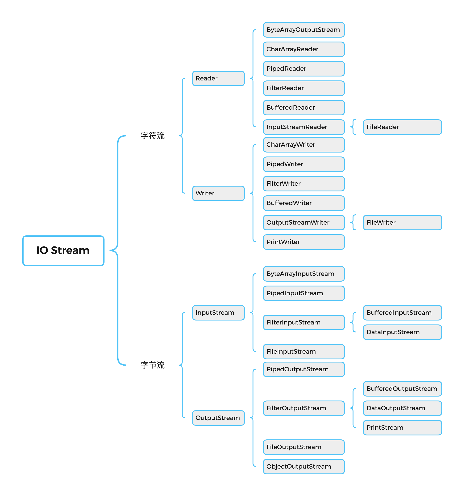
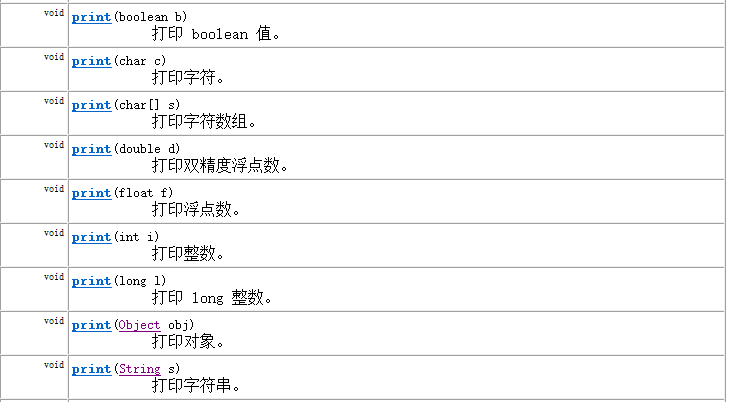

### java.io.File类的使用

#### 概述

- File类及各种流，都定义在java.io包下
- 一个File对象代表硬盘或网络中可能存在的一个文件或文件目录（万事万物皆对象）。
- File能新建、删除、重命名文件和目录，但File不能访问文件内容本身。如果需要访问文件内容本身，则需要使用输入/输出流
  - File对象可以作为参数传递给流的构造器
- 想要在Java程序中表示一个真实存在的文件或目录，那么必须有一个File对象，但是Java程序中的一个File对象，可能没有一个真实存在的文件或目录。

#### 构造器

- `public File(String pathname) ` ：以pathname为路径创建File对象，可以是绝对路径或相对路径，如果pathname是以相对路径，则默认的当前路径在系统属性user.dir中存储。
  - 绝对路径：从盘符开始的路径，是一个完整的路径
  - 相对路径：相对于当前目录的路径
    - IDEA中，main方法中的文件相对路径，是相对于当前工程
    - IDEA中，单元测试方法的中的文件相对路径，是相对于当前module
- `public File(String parent, String child) ` ：以parent为父路径，child为子路径创建File对象
- `public File(File parent, String child)` ：根据一个父File对象和子文件路径创建File对象

```java
public class FileTest {
    public static void main(String[] args) {
        File file = new File("hello.txt");
        System.out.println(file.getName());
        System.out.println(file.getAbsolutePath()); //JavaSE/hello.txt
    }
    @Test
    public void test01(){
        File file = new File("hello.txt");
        System.out.println(file.getName());
        System.out.println(file.getAbsolutePath()); //JavaSE/io/hello.txt
    }
    @Test
    public void test02(){
        File file = new File("/Users/canvs/Desktop/JAVA/JavaSE/io/","hello.txt");
        System.out.println(file.getName()); //hello.txt
    }
    @Test
    public void test03(){
        File file = new File("/Users/canvs/Desktop/JAVA/JavaSE/io/");
        File file2 = new File(file,"hello.txt");
    }
    @Test
    public void test04(){
        File file = new File("/Users/canvs/Desktop/JAVA/JavaSE/io/hello.txt");
        System.out.println("文件目录名称："+file.getName());
        System.out.println("文件目录构造路径："+file.getPath());
        System.out.println("是否是文件："+file.isFile());
        System.out.println("文件目录的父目录："+file.getParent());
    }
    @Test
    public void test05(){
        File file = new File("hello.txt");
        System.out.println("文件目录名称："+file.getName());
        System.out.println("文件目录构造路径："+file.getPath());
        System.out.println("是否是文件："+file.isFile());
        System.out.println("文件目录的父目录："+file.getParent());
        System.out.println("文件目录的父目录："+file.getAbsoluteFile().getParent());
    }
}
```

> 注意：
>
> - 当构造路径是绝对路径时，那么getPath和getAbsolutePath结果一样
>
> - 当构造路径是相对路径时，那么getAbsolutePath的路径 = user.dir的路径+构造路径

#### 常用方法

##### 获取文件和目录基本信息

- public String getName()：获取名称
- public String getPath()：获取路径
- public String getAbsolutePath()：获取绝对路径
- public File getAbsoluteFile()：获取绝对路径的File对象
- public String getParent()：获取上层路径，若无返回null
- public long length()：获取文件的长度（字节数）。不能获取目录的长度
- public long lastModified()：获取最近修改时间，时间戳。

> 如果File对象代表的文件或目录不存在，则File对象实例初始化时，就会用硬盘中对应文件或目录的属性为File对象的属性赋值，否则除了路径和名称，File对象的其他属性将会保留默认值，

```java
public class FileInfoMethodTest {
    @Test
    public void test01(){
        File file = new File("hello.txt");
        System.out.println("文件名："+file.getName());
        System.out.println("文件路父目录："+file.getParent());
        System.out.println("文件路径："+file.getAbsolutePath());
        System.out.println("文件路径："+file.getAbsoluteFile().getAbsolutePath());
        System.out.println("文件长度："+file.length());
        System.out.println("最近修改时间："+ new SimpleDateFormat("yyyy-MM-dd HH:mm:ss").format(new Date(file.lastModified())));
    }
    @Test
    public void test02(){
        File file = new File("src");
        System.out.println("文件名："+file.getName());
        System.out.println("文件路父目录："+file.getParent());
        System.out.println("文件路径："+file.getAbsolutePath());
        System.out.println("文件路径："+file.getAbsoluteFile().getAbsolutePath());
        System.out.println("文件长度："+file.length());
        System.out.println("最近修改时间："+ new SimpleDateFormat("yyyy-MM-dd HH:mm:ss").format(new Date(file.lastModified())));
    }
}
```

##### 列出目录的下一级

- public String[] list()：返回一个String数组，表示该File目录中的所有子文件或目录
- public File[] listFile()：返回一个File数组，表示该File目录中的所有子文件或目录
- java.io.FilenameFilter：实现此接口的类实例可用于过滤器文件名
  - boolean accept(File dir,String name) ：测试指定文件是否应该包含在某一文件列表中
- java.io.FileFilter：用于抽象路径名(File对象)的过滤器
  - boolean accept(File pathname)：测试pathname是否应该包含在当前File目录中 若符合则返回true

```java
public class DirListFilesTest {
    @Test
    public void test01(){
        File file = new File("src/com/canvs/");
        for (File fl : file.listFiles()) System.out.println(fl.getName());
    }
    @Test
    public void test02(){
        File file = new File("src/com/canvs/");
        for (String fs : file.list()) System.out.println(fs);
    }
    @Test
    public void test03(){
        File file = new File("/Users/canvs/Desktop/JAVA/JavaSE/README/imgs/");
        File[] files = file.listFiles(new FileFilter() {
            @Override
            public boolean accept(File pathname) {
                return pathname.getName().endsWith(".jpg");
            }
        });
        for (File fs : files) System.out.println(fs.getName());
    }
    @Test
    public void test04(){
        File file = new File("/Users/canvs/Desktop/JAVA/JavaSE/README/imgs/");
        File[] files = file.listFiles(new FilenameFilter() {
            @Override
            public boolean accept(File dir, String name) {
                return name.endsWith(".jpg");
            }
        });
        for (File fs : files) System.out.println(fs);
    }
}
```

##### File类的重命名

- public boolean renameTo(File dest)：把文件重命名为指定的文件路径

##### 判断功能的方法

- public boolean exists()：判断文件或目录是否实际存在
- public boolean isDirectory()：判断是否为目录
- public boolean isFile()：判断是否为文件
- public boolean canRead()：判断是否可读
- public boolean canWrite()：判断是否可写
- public boolean isHidden()：判断是否隐藏

```java
public class FileIsTest {
    @Test
    public void test01(){
        String src = "hello.txt";
        String desc = "hello_copy.txt";
        File file = new File(src);
        file.renameTo(new File(desc));
    }
    @Test
    public void test02(){
        String desc = "hello_copy.txt";
        File file = new File(desc);
        System.out.println("文件目录是否存在"+file.exists());
        System.out.println("是否为文件："+file.isFile());
        System.out.println("是否为目录："+file.isDirectory());
        System.out.println("是否可读："+file.canRead());
        System.out.println("是否可写："+file.canWrite());
        System.out.println("是否隐藏："+file.isHidden());
    }
    @Test
    public void test03(){
        String desc = "src/com/canvs/";
        File file = new File(desc);
        System.out.println("文件目录是否存在："+file.exists());
        System.out.println("是否为文件："+file.isFile());
        System.out.println("是否为目录："+file.isDirectory());
        System.out.println("是否可读："+file.canRead());
        System.out.println("是否可写："+file.canWrite());
        System.out.println("是否隐藏："+file.isHidden());
    }
}
```

##### 创建、删除功能

- public boolean createNewFile()：创建文件，若文件存在，则不创建，返回false
- public boolean mkdir()：创建文件目录。如果此文件目录存在，则不创建。如果此文件目录的上层目录不存在，也不创建
- public boolean mkdirs()：创建文件目录，如果上层文件目录不存在，一并创建
- public boolean delete()：删除文件或目录，删除一个目录，则该文件目录下不能包含文件或目录才能删除

```java
public class FileCreateDeleteTest {
    @Test
    public void test01() {
        File file = new File("/Users/canvs/Desktop/Test/hello.java");
        try {
            System.out.println(file.createNewFile() ? "创建成功！" : "创建失败！");
        } catch (IOException e) {
            throw new RuntimeException(e);
        }
    }
    @Test
    public void test02() {
        File file = new File("/Users/canvs/Desktop/Test/hello/");
        System.out.println(file.mkdir() ? "创建成功！" : "创建失败！");
    }
    @Test
    public void test03(){
        File file = new File("/Users/canvs/Desktop/Test/hello1/test/");
        System.out.println(file.mkdirs() ? "创建成功！" : "创建失败！");
    }
    @Test
    public void test04(){
        File file = new File("/Users/canvs/Desktop/Test/","hello.java");
        System.out.println(file.delete()? "删除成功":"删除失败");
        File file2 = new File("/Users/canvs/Desktop/Test/","hello1/test/");
        System.out.println(file2.delete() ? "删除成功":"删除失败");
    }
}
```

#### 练习

练习1:遍历指定目录所有文件名称，包括子文件目录中的文件。

- 并计算指定目录占用空间的大小
- 删除指定文件目录及其下的所有文件

```java
public class ListFilesTest {
    public static void main(String[] args) {
        String src = "/Users/canvs/Desktop/test/";
        printSubFile(new File(src));
        System.out.println(getDirectorySize(new File(src)));
        deleteDirctory(new File(src));
    }
    public static void printSubFile(File file) {
        if (file.isFile()) {
            System.out.println(file.getPath());
        } else if (file.isDirectory()) {
            File[] files = file.listFiles();
            if (files != null) for (File fs : files) printSubFile(fs);
        }
    }
    public static Long getDirectorySize(File file) {
        long size = 0;
        if (file.isDirectory()) {
            File[] files = file.listFiles();
            if (files != null) for (File fs : files) size += getDirectorySize(fs);
        }else if (file.isFile()) size += file.length();
        return size;
    }
    public static void deleteDirctory(File file) {
        if (file.isDirectory()) {
            File[] files = file.listFiles();
            if (files != null) for (File fs : files) deleteDirctory(fs);
        }
        file.delete();
    }
}
```

### IO流原理及流的分类

#### Java IO原理

- Java程序中，对于数据的输入/输出操作以`流(Stream)`的方式进行，可以看作是一种数据的流动。

  

- I/O流中的I/O式`Input/Output`的缩写，I/O技术式非常实用的技术，用于处理设备之间的数据传输。如读/写文件，网络通讯等。

  - 输入Input：读取外部数据（磁盘、光盘等存储设备的数据）到程序（内存）中。
  - 输出Output：将程序（内存）数据输出到磁盘、光盘等存储设备中。


#### 流的分类

`java.io`包下提供了各种流类和接口，用于获取不同种类的数据，并通过标准的方法输入或输出数据。



- 按数据的流向不同分为：输入流和输出流

  - 输入流：把数据从其他设备上读取到内存中的流
    - 以InputStream、Reader结尾
  - 输出流：把数据从内存中写出到其他设备上的流
    - 以OutputStream、Writer结尾

- 按操作数据单位的不同分为：字节流（8bit）和字符流（16bit）

  - 字节流：以字节为单位，读写数据的流
    - 以InputStream、OutputStream结尾
  - 字符流：以字符为单位，读写数据的流
    - 以Reader、Writer结尾

- 根据IO流的角色不同分为：节点流和处理流

  - 节点流：直接冲数据源或目的地读写数据

  

  - 处理流：不直接连接到数据源或目的地，而是连接在已存在的流（节点流或处理流）之上，通过对数据的处理为程序提供更为强大的读写功能。

  

#### 流的API

- Java的IO流共涉及40多个类，实际上非常规则，都是如下4个抽象基类派生的

| 抽象基类 |   输入流    |    输出流    |
| :------: | :---------: | :----------: |
|  字节流  | InputStream | OutputStream |
|  字符流  |   Reader    |    Writer    |

- 由这4个派生出来的子类名称都是以其父类名作为子类名后缀

| 分类       | 字节输入流           | 字节输出流            | 字符输入流        | 字符输出流         |
| :--------- | -------------------- | --------------------- | ----------------- | ------------------ |
| 抽象基类   | Inputstream          | Outputstream          | Reader            | Writer             |
| 访问文件   | FilelnputStream      | FileOutputStream      | FileReader        | FileWriter         |
| 访问数组   | ByteArraylnputStream | ByteArrayOutputStream | CharArrayReader   | CharArrayWriter    |
| 访问管道   | PipedlnputStream     | PipedOutputStream     | PipedReader       | PipedWriter        |
| 访问字符串 |                      |                       | StringReader      | StringWriter       |
| 缓冲流     | BufferedlnputStream  | BufferedOuputStream   | BufferedReader    | BufferedWriter     |
| 转换流     |                      |                       | InputstreamReader | OutputStreamWriter |
| 对象流     | ObjectlnputStream    | ObjectOutputStream    |                   |                    |
|            | FilterlnputStream    | FilterOutputStream    | FilterReader      | FilterWriter       |
| 打印流     |                      | Printstream           |                   | PrintWriter        |
| 推回输入流 | PushbacklnputStream  |                       | PushbackReader    |                    |
| 特殊流     | DatalnputStream      | DataOutputStream      |                   |                    |

##### 常用的节点流：

- 文件流：FileInputStream、FileOutputStream、FileReader、FileWriter
- 字节/字符数组流：ByteArrayInputStream、ByteArrayOutputStream、CharArrayReader、CharArrayWriter
  - 对数组进行处理的节点流（对应的不再是文件，而是内存中的一个数组）

##### 常用处理流：

- 缓冲流：BufferedInputStream、BufferedOutputStream、BufferedReader、BufferedWriter
  - 作用：增加缓冲功能，避免频繁读写硬盘，进而提升读写效率
- 转换流：InputStreamReader、OutputStreamReader
  - 作用：实现字节流和字符流之间的转换。
- 对象流：ObjectInputStream、ObjectOutputStream
  - 作用：提供直接读写Java对象功能

### 流节点：FileReader/FileWriter

#### Reader与Writer

Java提供一些字符流，以字符为单位读写数据，专门用于处理文本文件。不能操作图片、视频等非文本文件

> 常见的文本文件有：.txt、.java、.c、.cpp、.py等
>
> 注意：.doc、.xls、.ppt

#### 字符输入流：Reader

`java.io.Reader`抽象类是表示用于读取字符流的所有类的父类，可以读取字符信息到内存中。它定义了字符输入流的基本功性功能方法。

- public int read()：从字符流读取一个字符。虽然读取了一个字符，但是会自动提升为int类型。返回该字符的Unicode编码值。如果已经到达末尾了，则返回-1。
- public int read(char[] cbuf)：从输入流中读取一些字符，并将它们存储到字符数组cbuf中，每次最多读取cbuf.length个字符。返回实际读取的字符个数。如果已经到达流末尾，没有数据可读，则返回-1
- public int read(char[] cbuf, int off, int len)：从输入流中读取一些字符，并将它们存储到字符数组cbuf中，从cbuf[off]开始位置存储。每次最多读取len个字符。返回实际读取的字符个数。如果已经到达流末尾，没有数据可读，则返回-1。
- public void close()：关闭此流并释放此流相关联的任何系统资源。

> 注意：当完成流的操作时，必须调用close()方法，释放系统资源，否则会造成内存泄漏。

#### 字符输出流：Writer

`java.io.Writer`抽象类表示用于写出字符流的所有类的父类，将指定的字符信息写出到目的地。它定义了直接输出流的基本共性功能方法。

- public void writer(int c)：写出单个字符
- public void writer(char[] cbuf)：写出字符数组
- public void writer(char[] cbuf, int off, int len)：写出字符数组从off开始到len结束部分内容；
- public void writer(String str)：写出字符串
- public void writer(String str, int off, int len)：写出字符串从off开始到len结束部分内容；
- public void flush()：刷新该流的缓冲
- public void close()：关闭此流

#### FileReader与FileWriter

#### FileReader

`java.io.FileReader`类用于读取字符文件，构造时使用系统默认的字符编码和默认字符缓冲区。

- FileReader(File file)：创建新的FileReader，给定要读取的File对象。
- FileReader(String fileName)：创建一个新的FileReader，给定要读取的文件的名称。

**举例**：读取hello.txt文件中的字符数据，并输出到控制台

```java
public class FileReaderTest {
    @Test
    public void test01() {
        File file = new File("hello_copy.txt");
        FileReader fr = null;
        try {
            fr = new FileReader(file);
            int data;
            while ((data = fr.read()) != -1) System.out.print((char) data);
        } catch (IOException e) {
            e.printStackTrace();
        } finally {
            try {
                if (fr != null) fr.close();
            } catch (IOException e) {
                e.printStackTrace();
            }
        }
    }
    @Test
    public void test02() {
        File file = new File("hello_copy.txt");
        FileReader fr = null;
        try {
            fr = new FileReader(file);
            char[] cbuf = new char[5];
            int len;
            //错误方式
            //while ((len=fr.read(cbuf)) != -1) System.out.print(new String(cbuf));
            while ((len = fr.read(cbuf)) != -1) System.out.print(new String(cbuf, 0, len));
        } catch (IOException e) {
            e.printStackTrace();
        } finally {
            try {
                if (fr != null) fr.close();
            } catch (IOException e) {
                e.printStackTrace();
            }
        }
    }
    @Test
    public void test03() {
        FileReader fr = null;
        try {
            fr = new FileReader("hello_copy.txt");
            char[] cbuf = new char[5];
            int len;
            //错误方式
            //while ((len=fr.read(cbuf)) != -1) System.out.print(new String(cbuf));
            while ((len = fr.read(cbuf)) != -1) System.out.print(new String(cbuf, 0, len));
        } catch (IOException e) {
            e.printStackTrace();
        } finally {
            try {
                if (fr != null) fr.close();
            } catch (IOException e) {
                e.printStackTrace();
            }
        }
    }
}
```

**不同实现方式的类比：**


#### FileWriter

`java.io.FileWriter`类用于写出字符到文件，构造时使用默认的字符编码和默认字节缓冲区。

- FileWriter(File file)：创建一个新的FileWriter，给定要读取的File对象。
- FileWriter(File file, boolean append)：创建一个新的FileWriter，指明是否在现有文件末尾追加内容。
- FileWriter(String fileName)：创建一个新的FileWriter，给定要读取的文件的名称。

```java
public class FileWriterTest {
    @Test
    public void test04() {
        FileWriter fw = null;
        try {
            fw = new FileWriter("hello1.txt",true);
            fw.write("Hello World!");
            fw.write("你好");
            fw.write(123);
            Thread.sleep(10000);
        } catch (Exception e) {
            e.printStackTrace();
        } finally {
            try {
                if (fw != null) fw.close();
            } catch (IOException e) {
                e.printStackTrace();
            }
        }
    }
    @Test
    public void test05() {
        File src = new File("hello_copy.txt");
        File desc = new File("hello.txt");
        FileReader fr = null;
        FileWriter fw = null;
        try {
            fr = new FileReader(src);
            fw = new FileWriter(desc);
            char[] cbuf = new char[5];
            int len;
            while ((len = fr.read(cbuf)) != -1) fw.write(cbuf, 0, len);
        } catch (IOException e) {
            e.printStackTrace();
        } finally {
            try {
                if (fw != null) fw.close();
                if (fr != null) fr.close();
            } catch (IOException e) {
                e.printStackTrace();
            }
        }
    }
}
```

##### 小结：

- 因为出现流资源的调用，为了避免内存泄漏，需要使用try-catch-finally处理异常
- 对于输入流来说，File类的对象必须在屋里磁盘上存在，否则执行就会报FileNotFoundException。如果传入的是一个目录，则会报IOException异常。
- 对于输出流来说，File类的对象是可以不存在的。
  - 如果File类的对象不存在，则可以在输出的过程中，自动创建File类的对象
  - 如果File类的对象存在
    - 如果调用FileWriter(File file)或者FileWriter(File file, false)，输出时会新建File文件覆盖已有的文件
    - 如果调用FileWriter(File file, true)构造器，则在现有的文件末尾追加写出内容

#### flush(刷新)

因为内置缓冲区的原因，如果FileWriter不关闭输出流，无法写出字符到文件中。但是关闭的流对象，是无法继续写出数据的。如果我们既想写出数据，又想继续使用流，就需要`public void flush()`方法。

- flush()：刷新缓冲区，流对象可以继续使用。
- close()：线刷新缓冲区，然后通知系统释放资源。流对象不可以再被使用了。

> 注意：即便是flush()方法写出了数据，操作的最后还是需要调用close方法，释放系统资源。

```java
public class FileWriterFlushTest {
    @Test
    public void test1() {
        FileWriter fw = null;
        try {
            fw = new FileWriter(new File("a.txt"));
            fw.write("Hello");
            fw.flush();
            fw.write("world");
            fw.flush();
            fw.write("!");
            fw.flush();
        } catch (Exception e) {
            e.printStackTrace();
        } finally {
            try {
                if (fw != null) fw.close();
            } catch (IOException e) {
                throw new RuntimeException(e);
            }
        }
    }
}
```

### 流节点：FileInputStream/FileOutputStream

如果读取或写出的数据是非文本文件，则Reader、Writer就无能为力了，必须使用字节流。

#### 字节输入流：InputStream

`java.io.InputStream`抽象类是表示字节输入流的所有类的超类，可以读取字节信息到内存中。它定义了字节输入流的基本共性功能方法。

- public int read()：从输入流读取一个字节，如果没有数据可读，则返回-1
- public int read(byte[] b)：从输入流中读取一些字节数，并将它们存储到字节数组b中。每次最多读取b.length个字节。返回实际读取字节个数。如果没有数据可读，则返回-1
- public int read(byte[] b, int off, int len)：从输入流中读取一些字节数，并将它们存储到字节数组b中，从b[off]开始存储，每次最多读取len个字节。返回实际读取的字节个数。如果没有数据可读，则返回-1
- public void close()：关闭此输入流并释放与此流相关联的任何系统资源。

#### 字节输出流：OutputStream

`java.io.OutputStream`抽象类是表示字节输出流的所有类的超类，将指定的字节信息写出到目的地。它定义了字节输出流的基本共性功能方法。

- public void writer(int b)：将指定的字节输出流。虽然参数为int类型四个字节，但是只会保留一个字节的信息写出。
- public void writer(byte[] b)：将b.length字节从指定的数组写入此输出流。
- public void writer(byte[] b ,int off, int len)：从指定的字节数组写入len字节，从偏移量off开始输出到此输出流。
- public void flush()：刷新此输出流并强制任何缓冲的输出字节被写出。
- public void close()：关闭此输出流相关联的流和系统资源

#### FileInputStream

`java.io.FileInputStream`类是文件输入流，从文件中读取字节。

- FileInputStream(File file)：通过打开与实际文件的连接来创建一个FileInputStream，该文件由文件系统中的File对象file命名。
- FileInputStream(String name)：通过打开与实际文件的连接来创建一个FileInputStream，该文件由文件系统中的路径名name命名。

```java
public class FileInputStreamTest {
    @Test
    public void test01() {
        File file = new File("hello.txt");
        FileInputStream fis = null;
        try {
            fis = new FileInputStream(file);
            byte[] b = new byte[10];
            int len;
            while ((len = fis.read(b)) != -1) {
                System.out.print(new String(b, 0, len));
            }
        } catch (IOException e) {
            e.printStackTrace();
        } finally {
            try {
                if (fis != null) fis.close();
            } catch (IOException e) {
                throw new RuntimeException(e);
            }
        }
    }
    @Test
    public void test02() {
        FileInputStream fis = null;
        try {
            fis = new FileInputStream("hello.txt");
            int len;
            //读取到中文会乱码，读取中文使用read(byte[] b)
            while ((len = fis.read()) != -1) System.out.print((char) len);
        } catch (IOException e) {
            throw new RuntimeException(e);
        } finally {
            try {
                if (fis != null) fis.close();
            } catch (IOException e) {
                e.printStackTrace();
            }
        }
    }
}
```

#### FileOutputStream

`java.io.FileOutputStream`类是文件输出流，用于将数据写出到文件

- public FileOutputStream(File file)：创建文件输出流，写出由指定的File对象表示的文件
- public FileOutputStream(String  name)：创建文件输出流，指定的名称问写出文件。
- public FileOutputStream(File file, boolean append)：创建文件输出流，指明是否在现有文件末尾追加内容

```java
public class FileOutputStreamTest {
    @Test
    public void test01() throws IOException {
        File file = new File("c.txt");
        FileOutputStream fos = new FileOutputStream(file);
        fos.write(97);
        fos.write(98);
        fos.write(99);
        fos.close();
    }
    @Test
    public void test02() {
        FileOutputStream fos = null;
        try {
            fos = new FileOutputStream("a.txt", true);
            byte[] b = "hello".getBytes();
            fos.write(b, 0, 4);
            fos.write("world".getBytes());
        } catch (IOException e) {
            throw new RuntimeException(e);
        } finally {
            try {
                if (fos != null) fos.close();
            } catch (IOException e) {
                e.printStackTrace();
            }
        }
    }
    @Test
    public void test03() {
        String src = "MyRunnable.java";
        String desc = "MyRunnable_copy.java";
        FileInputStream fis = null;
        FileOutputStream fos = null;
        try {
            fis = new FileInputStream(src);
            fos = new FileOutputStream(desc);
            byte[] b = new byte[1024];
            int len;
            while ((len = fis.read(b)) != -1) {
                fos.write(b, 0, len);
            }
        } catch (IOException e) {
            e.printStackTrace();
        } finally {
            try {
                if (fos != null) fos.close();
            } catch (IOException e) {
               e.printStackTrace();
            }
            try {
                if (fis != null) fis.close();
            } catch (IOException e) {
                e.printStackTrace();
            }
        }
    }
}
```

#### 练习：实现图片加密操作

```java
public class PictureEncryption {
    public static void main(String[] args) throws FileNotFoundException {
//        	encryption(new File("zhouhuiming.jpeg"));
            decryption(new File("encryption_zhouhuiming.jpeg"));
    }
    public static void encryption(File file) {
        FileInputStream fis = null;
        FileOutputStream fos = null;
        try {
            fis = new FileInputStream(file);
            fos = new FileOutputStream("encryption_" + file.getName());
            byte[] buffer = new byte[1024];
            int len;
            while ((len = fis.read(buffer)) != -1) {
              //给每个字节做异或运算
                for (int i = 0; i < buffer.length; i++) buffer[i] ^= 5;
                fos.write(buffer, 0, len);
            }
            System.out.println("加密成功！");
        } catch (IOException e) {
            e.printStackTrace();
        } finally {
            try {
                if (fos != null) fos.close();
            } catch (IOException e) {
                e.printStackTrace();
            }
            try {
                if (fis != null) fis.close();
            } catch (IOException e) {
                e.printStackTrace();
            }
        }
    }
    public static void decryption(File file) {
        FileInputStream fis = null;
        FileOutputStream fos = null;
        try {
            fis = new FileInputStream(file);
            fos = new FileOutputStream("decryption_" + file.getName());
            byte[] buffer = new byte[1024];
            int len;
            while ((len = fis.read(buffer)) != -1) {
                for (int i = 0; i < buffer.length; i++) buffer[i] ^= 5;
                fos.write(buffer,0,len);
            }
            System.out.println("解密成功！");
        } catch (IOException e) {
            e.printStackTrace();
        } finally {
            try {
                if (fos != null) fos.close();
            } catch (IOException e) {
                e.printStackTrace();
            }
            try {
                if (fis != null) fis.close();
            } catch (IOException e) {
                e.printStackTrace();
            }
        }
    }
}
```

### 处理流：缓冲流

- 为了提高数据读写的速度，Java API提供了带缓冲功能的流类：缓冲流。
- 缓冲流要套接在相应的节点流之上，根据数据操作单位可以吧缓冲流分为：
  - 字节缓冲流：BufferedInputStream、BufferedOutputStream
  - 字符缓冲流：BufferedReader、BufferedWriter
- 缓冲流的基本原理：在创建流对象时，内部会创建一个缓冲区数组（缺省使用8192个字节(8kb)的缓冲区），通过缓冲区读写，减少系统IO次数，从而提高读写的效率。


#### 构造器

- public BufferedInputStream(InputStream in)：创建一个新的字节型的缓冲输入流
- public BufferedOutputStream(OutputStream out)：创建一个新的字节型的缓冲输出流
- public BufferedReader(Reader in)：创建一个新的字符型的缓冲输入流
- public BufferedWriter(writer out)：创建一个新的字符型的缓冲输出流

```java
public class BufferedTest {
    @Test
    public void test01() throws IOException {
        BufferedInputStream bis = new BufferedInputStream(new FileInputStream("hello.txt"));
        BufferedOutputStream bos = new BufferedOutputStream(new FileOutputStream("hello.txt"));
        BufferedReader br = new BufferedReader(new FileReader("hello.txt"));
        BufferedWriter bw = new BufferedWriter(new FileWriter("hello.txt"));
    }
}
```

#### 效率测试

```java
public class BufferedStreamTest {
    public static void copyFileWithFileStream(File src,File desc) {
        FileInputStream fis = null;
        FileOutputStream fos = null;
        try {
            fis = new FileInputStream(src);
            fos = new FileOutputStream(desc);
            byte[] b = new byte[1024];
            int len;
            while ((len = fis.read(b)) != -1) fos.write(b, 0, len);
        } catch (IOException e) {
            e.printStackTrace();
        } finally {
            try {
                if (fos != null) fos.close();
            } catch (IOException e) {
                e.printStackTrace();
            }
            try {
                if (fis != null) fis.close();
            } catch (IOException e) {
                e.printStackTrace();
            }
        }
    }
    public static void copyFileWithBufferedStream(File src,File desc) {
        BufferedInputStream bis = null;
        BufferedOutputStream bos = null;
        try {
            bis = new BufferedInputStream(new FileInputStream(src));
            bos = new BufferedOutputStream(new FileOutputStream(desc));
            byte[] buffer = new byte[1024];
            int len;
            while ((len = bis.read(buffer)) != -1) bos.write(buffer, 0, len);
        } catch (IOException e) {
            throw new RuntimeException(e);
        } finally {
            try {
                if (bos != null) bos.close();
                if (bis != null) bis.close();
            } catch (IOException e) {
                e.printStackTrace();
            }
        }
    }
    @Test
    public void test1() {
        long start = System.currentTimeMillis();
        String src = "/Users/canvs/Desktop/Test/2-4.Djangocms实战-2.ts";
        String desc = "/Users/canvs/Desktop/Test/Djangocms实战-2.ts";
        copyFileWithFileStream(new File(src),new File(desc));
        long end = System.currentTimeMillis();
        System.out.println(end - start);      //1220
    }
    @Test
    public void test2(){
        long start = System.currentTimeMillis();
        String src = "/Users/canvs/Desktop/Test/2-4.Djangocms实战-2.ts";
        String desc = "/Users/canvs/Desktop/Test/Djangocms实战-2.ts";
        copyFileWithBufferedStream(new File(src),new File(desc));
        long end = System.currentTimeMillis();
        System.out.println(end - start);    //384
    }
}
```

#### 字符缓冲流特有方法

字符缓冲流的基本方法与普通字符流调用方式一致；特有方法：

- BufferedReader：public String readLine()：读一行文字。
- BufferedWriter：public void newLine()：写一行行分隔符，由系统属性定义符号

```java
public class BufferedIOLineTest {
    @Test
    public void test01() {
        BufferedWriter bw = null;
        try {
            bw = new BufferedWriter(new FileWriter("hello.txt", true));
            bw.write("hello world");
            bw.newLine();
            bw.write("你好 世界");
        } catch (IOException e) {
            e.printStackTrace();
        } finally {
            try {
                if (bw != null) bw.close();
            } catch (IOException e) {
                e.printStackTrace();
            }
        }
    }
    @Test
    public void test02() {
        BufferedReader br = null;
        try {
            br = new BufferedReader(new FileReader("hello.txt"));
            System.out.println(br.readLine());  //hello world
            System.out.println(br.readLine()); //你好 世界
        } catch (IOException e) {
            e.printStackTrace();
        } finally {
            try {
                if (br != null) br.close();
            } catch (IOException e) {
                e.printStackTrace();
            }
        }
    }
    @Test
    public void test03() {
        BufferedReader br = null;
        try {
            br = new BufferedReader(new FileReader("table.html"));
            String data;
            while ((data = br.readLine()) != null) System.out.println(data);
        } catch (IOException e) {
            e.printStackTrace();
        } finally {
            try {
                if (br != null) br.close();
            } catch (IOException e) {
                e.printStackTrace();
            }
        }
    }
}
```

> 说明：
>
> - 涉及到嵌套的多个流时，如果都显示关闭的话，需要先关闭外层的流，再关闭内层的流
> - 其实在开发中，只需要关闭最外层的流即可，因为在关闭外层流时，内层的流也会被关闭。

#### 练习：

姓氏统计：一个文本文件中存储着北京所有高校在校生的姓名，格式如下：

```txt
每行一个名字，姓与名以空格分隔：
张 三
李 四
王 小五
```

```java
public class Exer {
    public static void main(String[] args) throws IOException {
        HashMap<String,Integer> map = new HashMap<>();
        File file = new File("IO/NameList.txt");
        BufferedReader br = new BufferedReader(new FileReader(file));
        String data;
        while ((data = br.readLine())!=null){
            String firstName = data.split(" ")[0];
            if (map.containsKey(firstName)){
                map.put(firstName,map.get(firstName)+1);
            }else{
                map.put(firstName,1);
            }
        }
        System.out.println(map);
        br.close();
        Set<Map.Entry<String, Integer>> entries = map.entrySet();
        Iterator<Map.Entry<String, Integer>> iterator = entries.iterator();
        while (iterator.hasNext()) System.out.println(iterator.next());
    }
}
```

### 处理流：转换流

```java
public class Problem {
    public static void main(String[] args) throws IOException {
        FileReader fr = new FileReader(new File("/Users/canvs/Desktop/JAVA/dbcp_gbk.txt"));
        int data;
        while ((data = fr.read())!=-1) System.out.print((char) data);
        fr.close();
    }
}

输出结果：
dbcp���ӳس��û�����������
```

针对文本文件，现在使用一个字节流进行数据的读入，希望将数据显示在控制台上。此时针对包含中文的文本数据，可能会出现乱码。

**作用**：转换流是字节与字符间的桥梁


#### InputStreamReader

- 转换流`java.io.InputStreamReader`，是Reader的子类，是从字节流到字符流的桥梁。它读取字节，并使用指定的字符集将其解码为字符。它的字符集可以由名称指定，也可以接受平台的默认字符集。
- 构造器
  - InputStreamReader(InputStream in)：创建一个使用默认字符集的字符流
  - InputStreamReader(InputStream in, String charsetName)：创建一个指定字符集的字符流

```java
public class InputStreamReaderTest {
    @Test
    public void test01() throws FileNotFoundException, UnsupportedEncodingException {
        FileInputStream fis = new FileInputStream(new File("hello.txt"));
        InputStreamReader isr = new InputStreamReader(fis);
        InputStreamReader isr1 = new InputStreamReader(fis,"utf-8");
    }
    @Test
    public void test02() {
        FileInputStream fis = null;
        try {
            fis = new FileInputStream(new File
                    ("/Users/canvs/Desktop/JAVA/dbcp_gbk.txt"));
            InputStreamReader isr = new InputStreamReader(fis, "gbk");
            int len;
            while ((len = isr.read()) != -1) System.out.print((char) len);
        } catch (IOException e) {
            throw new RuntimeException(e);
        } finally {
            try {
                if (fis != null) fis.close();
            } catch (IOException e) {
                throw new RuntimeException(e);
            }
        }
    }
}
```

#### OutputStreamWriter

- 转换流`java.io.OutputStreamWriter`，是Writer的子类，是从字符流到字节流的桥梁。使用指定的字符集将字符编码为字节。它的字符集可以由名称指定，也可以接受平台的默认字符集。
- 构造器
  - OutputStreamWriter(OutputStream in)：创建一个使用默认字符集的字节流
  - OutputStreamWriter(OutputStream in, String charsetName)：创建一个指定字符集的字节流

```java
public class OutputStreamWriterTest {
    @Test
    public void test01() throws UnsupportedEncodingException, FileNotFoundException {
        FileOutputStream fos = new FileOutputStream(new File("a.txt"));
        OutputStreamWriter osw = new OutputStreamWriter(fos, "utf-8");
        OutputStreamWriter osw1 = new OutputStreamWriter(fos);
    }
    @Test
    public void test02() {
        OutputStreamWriter osw = null;
        try {
            FileOutputStream fos = new FileOutputStream(new File("a.txt"));
            osw = new OutputStreamWriter(fos, "utf-8");
            osw.write("hello");
            osw.write("你好！");
        } catch (IOException e) {
            e.printStackTrace();
        } finally {
            try {
                if (osw != null) osw.close();
            } catch (IOException e) {
                e.printStackTrace();
            }
        }
    }
}
```

#### 编码与解码

计算机中存储的信息都是用二进制表示的，而我们在屏幕上看到的数字、英文、标点符号、汉子等字符是二进制数转换之后的结果。按照某种规则，将字符存储到计算机中，称为**编码**。反之，将存储在计算机中的二进制数按照某种规则解析显示出来，称为**解码**。

**字符编码（Character Encoding）**：就是一套自然语言的字符与二进制数之间的对应规则。

**编码表**：生活中文字和计算机中二进制的对应规则

**乱码的情况**：按照A规则存储，同样按照A规则解析，那么就能显示正确的文本符号。反之，按照A规则存储，再按照B规则解析，就会导致乱码现象。

#### 字符集

- 字符集Charset：也叫编码表。是一个系统支持的所有字符的集合，包括各国家文字、标点符号、图形符号、数字等。

- 计算机要准确的存储和识别各种字符集符号，需要进行字符编码，一套字符集必然至少有一套字符编码。常见的字符集有ASCII字符集、GBK字符集、Unicode字符集等。

- **ASCII字符集** ：

  * ASCII码（American Standard Code for Information Interchange，美国信息交换标准代码）：上个世纪60年代，美国制定了一套字符编码，对`英语字符`与二进制位之间的关系，做了统一规定。这被称为ASCII码。
  * ASCII码用于显示现代英语，主要包括控制字符（回车键、退格、换行键等）和可显示字符（英文大小写字符、阿拉伯数字和西文符号）。
  * 基本的ASCII字符集，使用7位（bits）表示一个字符（最前面的1位统一规定为0），共`128个`字符。比如：空格“SPACE”是32（二进制00100000），大写的字母A是65（二进制01000001）。
  * 缺点：不能表示所有字符。

- **Unicode字符集** ：

  * Unicode编码为表达`任意语言的任意字符`而设计，也称为统一码、标准万国码。Unicode 将世界上所有的文字用`2个字节`统一进行编码，为每个字符设定唯一的二进制编码，以满足跨语言、跨平台进行文本处理的要求。

  - Unicode 的缺点：这里有三个问题：
    - 第一，英文字母只用一个字节表示就够了，如果用更多的字节存储是`极大的浪费`。
    - 第二，如何才能`区别Unicode和ASCII`？计算机怎么知道两个字节表示一个符号，而不是分别表示两个符号呢？
    - 第三，如果和GBK等双字节编码方式一样，用最高位是1或0表示两个字节和一个字节，就少了很多值无法用于表示字符，`不够表示所有字符`。
  - Unicode在很长一段时间内无法推广，直到互联网的出现，为解决Unicode如何在网络上传输的问题，于是面向传输的众多 UTF（UCS Transfer Format）标准出现。具体来说，有三种编码方案，UTF-8、UTF-16和UTF-32。

- **UTF-8字符集**：

  * Unicode是字符集，UTF-8、UTF-16、UTF-32是三种`将数字转换到程序数据`的编码方案。顾名思义，UTF-8就是每次8个位传输数据，而UTF-16就是每次16个位。其中，UTF-8 是在互联网上`使用最广`的一种 Unicode 的实现方式。
  * 互联网工程工作小组（IETF）要求所有互联网协议都必须支持UTF-8编码。所以，我们开发Web应用，也要使用UTF-8编码。UTF-8 是一种`变长的编码方式`。它使用1-4个字节为每个字符编码，编码规则：
    * 128个US-ASCII字符，只需一个字节编码。
    * 拉丁文等字符，需要二个字节编码。 
    * 大部分常用字（含中文），使用三个字节编码。
    * 其他极少使用的Unicode辅助字符，使用四字节编码。

> 注意：在中文操作系统上，ANSI（美国国家标准学会、AMERICAN NATIONAL STANDARDS INSTITUTE: ANSI）编码即为GBK；在英文操作系统上，ANSI编码即为ISO-8859-1。

#### 练习

把字符编码为GBK，拷贝一份字符编码为UTF-8

```java
public class GBKToUTF8 {
    public static void main(String[] args) {
        String src = "/Users/canvs/Desktop/JAVA/dbcp_gbk.txt";
        String desc = "/Users/canvs/Desktop/JAVA/dbcp_utf8.txt";
        InputStreamReader isr = null;
        OutputStreamWriter osw = null;
        try {
            FileInputStream fis = new FileInputStream(new File(src));
            FileOutputStream fos = new FileOutputStream(desc);
            isr = new InputStreamReader(fis, "GBK");
            osw = new OutputStreamWriter(fos, "utf-8");
            char[] buffer = new char[1024];
            int len;
            while ((len = isr.read(buffer)) != -1) osw.write(buffer, 0, len);
        } catch (IOException e) {
            e.printStackTrace();
        } finally {
            try {
                if (osw != null) osw.close();
                if (isr != null) isr.close();
            } catch (IOException e) {
                e.printStackTrace();
            }
        }
    }

    @Test
    public void test01() {
        InputStreamReader isr = null;
        try {
//            FileInputStream fis = new FileInputStream("/Users/canvs/Desktop/JAVA/dbcp_gbk.txt");
            FileInputStream fis = new FileInputStream("/Users/canvs/Desktop/JAVA/dbcp_utf8.txt");
            isr = new InputStreamReader(fis,"utf-8");
            char[] buffer = new char[1024];
            int len;
            while ((len = isr.read(buffer)) != -1) System.out.print(new String(buffer, 0, len));
        } catch (IOException e) {
            e.printStackTrace();
        } finally {
            try {
                if (isr != null) isr.close();
            } catch (IOException e) {
                e.printStackTrace();
            }
        }
    }
}
```

### 处理流：数据流、对象流

#### 数据流与对象流说明

如果需要将内存中定义的变量（包括基本数据类型或引用数据类型）保存在文件中，Java提供了数据流和对象流来处理这些类型的数据

- 数据流：DataOutputStream、DataInputStream

  - DataOutputStream：允许应用程序将基本数据类型、String类型的变量写入输出流中

  - DataInputStream：允许应用程序以与机器无关的方式从底层输入流中读取基本数据类型、String类型的变量

- 数据流DataInputStream中的方法

```java
byte readByte()                short readShort()  
int readInt()                  long readLong()  
float readFloat()              double readDouble()  
char readChar()        					boolean readBoolean()            
String readUTF()               void readFully(byte[] b)
```

- 数据流DataOutputStream中的方法

```java
byte writeByte()                short writeShort()  
int writeInt()                  long writeLong()  
float writeFloat()              double writeDouble()  
char writeChar()        					boolean writeBoolean()            
String writeUTF()               void writeFully(byte[] b)
```

- 数据流的弊端：只支持java基本数据类型和字符串的读写，而不支持其他Java对象的类型。而ObjectOutputStream和ObjectInputStream即支持Java基本数据类型的数据读写，又支持Java对象的读写。
- 对象流：ObjectOutputStream、ObjectInputStream
  - ObjectOutpuStream：将Java基本数据类型和对象写入字节输出流中。通过在流中使用文件可以实现Java各种基本数据类型的数据以及对象的持久化存储。
  - ObjectInputStream：ObjectInputStream对以前使用ObjectOutputStream写出的基本数据类型的数据和对象进行读入操作，保存在内存中。

> 说明：对象流的强大之处就是可以吧Java中的对象写入到数据源中，也能把对象从数据源中还原回来。

#### 对象流API

**ObjectOutpuStream中的构造器**

`public ObjectOutputStream(OutputStream out)`：创建一个指定的ObjectOutputStream。

```java
public class ObjectOutputStreamTest {
    @Test
    public void test01() throws IOException {
        FileOutputStream fos = new FileOutputStream(new File("objectStream.dat"));
        ObjectOutputStream oos = new ObjectOutputStream(fos);
        int a = 1024;
        oos.writeInt(a);
        oos.writeChar('A');
        oos.close();
    }
}
```

**ObjectOutputStream中的方法**

- public void writeBoolean(Boolean val)：写出一个boolean值
- public void writeByte(int val)：写出一个8位字节
- public void writeShort(int val)：写出一个16位的short值
- public void writeChar(int val)：写出一个16位char值
- public void writeInt(int val)：写出一个32位int值
- public void writeLong(long val)：写出一个64位long值
- public void writeFloat(float val)：写出一个32位float值
- public void writeDouble(double val)：写出一个64位double值
- public void writeUTF(String str)：将表示长度信息的两个字节写入输出流，后跟字符串s中的每个字符UTF-8修改版表示形式。根据字符的值，将字符串s中的每个字符转换成一个字节、两个字节或三个字节的字节组。注意：将String作为基本数据写入流中与它作为Object写入流中明显不同。如果s位null，则抛出NullPointerException。
- public void writeObject(Object obj)：写出一个obj对象
- public void close()：关闭此输出流并释放与此相关联的任何系统资源

**ObjectInputStream中的构造器**

`public ObjectInputStream(InputStream in)`：创建一个指定的ObjectInputStream

```java
public class ObjectInputStreamTest {
    @Test
    public void test01() throws IOException {
        FileInputStream fis = new FileInputStream("objectStream.dat");
        ObjectInputStream ois = new ObjectInputStream(fis);
        int a = ois.readInt();
        System.out.println(a);
        char c = ois.readChar();
        System.out.println(c);
    }
}
```

**ObjectInputStream中的方法**

- public boolean readBoolean()：读取一个 boolean 值
- public byte readByte()：读取一个 8 位的字节
- public short readShort()：读取一个 16 位的 short 值
- public char readChar()：读取一个 16 位的 char 值
- public int readInt()：读取一个 32 位的 int 值
- public long readLong()：读取一个 64 位的 long 值
- public float readFloat()：读取一个 32 位的 float 值
- public double readDouble()：读取一个 64 位的 double 值
- public String readUTF()：读取 UTF-8 修改版格式的 String
- public void readObject(Object obj)：读入一个obj对象
- public void close() ：关闭此输入流并释放与此流相关联的任何系统资源

#### 对象序列化机制

对象序列化允许把内存中的Java对象转换成平台无关的二进制流，从而允许把这种二进制流持久化保存在磁盘上，或通过网络将这种二进制流传输到另外一个网络节点。当其它程序获取了这种二进制流，就可以恢复成原来的Java对象。

- 序列化过程：用一个字节序列可以表示一个对象，该字节序列包含该对象的类型和对象中存储的属性等信息。字节序列写出到文件之后，相当于文件中持久保存了一个对象的信息。
- 反序列化过程：该字节序列还可以从文件中读取回来，重构对象，对它进行反序列化。对象的数据、对象的类型和对象中存储的数据信息，都可以用来在内存中创建对象。


##### 序列化机制的重要性

序列化是RMI（Remote Method Invoke）远程方法调用，过程的参数和返回值都必须实现的机制，而RMI是JavaEE的基础。因此序列化机制是JavaEE平台的基础。

序列化的好处，在于可将任何实现了Serializable接口的对象转化为字节数据，使其在保存和传输时可被还原。

##### 实现原理

- 序列化：用ObjectOutputStream类保存基本数据类型或对象的机制。
  - public final void writeObject(Object obj)
- 反序列化：用ObjectInputStream类读取基本数据类型或对象的机制
  - public final void readObject(Object obj)

#### 实现序列化机制

如果需要让某个对象支持序列化机制，则必须让对象所属的类及属性是可序列化的，为了让某个类是可序列化的，该类必须实现`java.io.Serializable`接口。Serializable是一个标记接口，不实现此接口的类将不会使任何状态序列化或反序列化，会抛出`NotSerializableException`。

- 如果对象的某个属性也是引用数据类型，那么如果该属性也要序列化，也要实现`Serializable`接口
- 该类的所有属性必须是可以序列化的。如果有一个属性不需要可序列化，则该属性必须注明是瞬态的，使用`transient`关键字修饰
- `static`修饰的值不会序列化。因为静态变量的值不属于某个对象

```java
public class Person implements Serializable {
    public static int id;
    public String name;
    public int age;
    public transient String address;
    static final long serialVersionUID = 54156158121515125L;
    public Person(String name, int age) {
        this.name = name;
        this.age = age;
    }
    public Person(String name, int age, String address) {
        this.name = name;
        this.age = age;
        this.address = address;
    }
    @Override
    public String toString() {
        return "id="+id+" name="+name+" age="+age+" address="+address;
    }
}
```

```java
public class SerializableTest {
    @Test
    public void test01() throws IOException {
        FileOutputStream fos = new FileOutputStream(new File("a.dat"));
        ObjectOutputStream oos = new ObjectOutputStream(fos);
        oos.writeUTF("canvs");
        oos.writeInt(22);
        oos.writeBoolean(true);
        oos.writeFloat(9800.4f);
        oos.writeDouble(78.3);
        oos.close();
    }
    @Test
    public void test02() throws IOException {
        FileInputStream fis = new FileInputStream("a.dat");
        ObjectInputStream ois = new ObjectInputStream(fis);
        String name = ois.readUTF();
        int age = ois.readInt();
        boolean gender = ois.readBoolean();
        float salary = ois.readFloat();
        double bonus = ois.readDouble();
        System.out.println("姓名：" + name + " 年龄：" + age + " 性别：" + (gender ? '男' : '女') + " 工资：" + salary + " 奖金：" + bonus);
        ois.close();
    }
    @Test
    public void test03() {
        ObjectOutputStream oos = null;
        try {
            FileOutputStream fs = new FileOutputStream(new File("person.dat"));
            oos = new ObjectOutputStream(fs);
            Person p = new Person("jerry", 13, "美国");
            oos.writeObject(p);
        } catch (IOException e) {
            e.printStackTrace();
        } finally {
            try {
                if (oos != null) oos.close();
            } catch (IOException e) {
                e.printStackTrace();
            }
        }
    }
    @Test
    public void test04() {
        ObjectInputStream ois = null;
        try {
            FileInputStream fis = new FileInputStream("person.dat");
            ois = new ObjectInputStream(fis);
            Person p = (Person) ois.readObject();
            System.out.println(p.toString());
        } catch (IOException | ClassNotFoundException e) {
            e.printStackTrace();
        } finally {
            try {
                if (ois != null) ois.close();
            } catch (IOException e) {
                e.printStackTrace();
            }
        }
    }
    @Test
    public void test05() {
        ArrayList<Person> persons = new ArrayList<>();
        persons.add(new Person("canvs", 22, "香港"));
        persons.add(new Person("Tom", 21, "美国"));
        persons.add(new Person("波多野结衣", 30, "日本"));
        ObjectOutputStream oos = null;
        try {
            oos = new ObjectOutputStream(new FileOutputStream("Persons.dat"));
            oos.writeObject(persons);
        } catch (IOException e) {
            e.printStackTrace();
        } finally {
            try {
                if (oos != null) oos.close();
            } catch (IOException e) {
                e.printStackTrace();
            }
        }
    }
    @Test
    public void test06() {
        ObjectInputStream ois = null;
        try {
            ois = new ObjectInputStream(new FileInputStream("Persons.dat"));
            ArrayList<Person> people = (ArrayList<Person>) ois.readObject();
            Iterator<Person> iterator = people.iterator();
            while (iterator.hasNext()) System.out.println(iterator.next().toString());
        } catch (IOException | ClassNotFoundException e) {
            e.printStackTrace();
        } finally {
            try {
                if (ois != null) ois.close();
            } catch (IOException e) {
                e.printStackTrace();
            }
        }
    }
}
```

#### 反序列化失败问题

- 对于JVM可以反序列化对象，它必须是能够找到class文件的类。如果找不到该类的class文件，则抛出一个ClassNotFoundException异常

- 当JVM反序列化对象时，能找到class文件，但是class文件在序列化对象之后发生了修改，那么反序列化操作也会失败，抛出一个InvalidClassException异常。

  - 该类的序列版本号与从流中读取的类描述的版本号不匹配
  - 该类包含未知数据类型
  - 解决办法：Serializable接口给序列化的类，提供一个序列版本号：serialVersionUID。凡事实现Serializable接口的类都应该有一个表示序列化版本标识符的静态变量。

  ```java
  static final long serialVersionUID = 54156158121515125L;
  ```

  - serialVersionUID用来表明类的不同版本间的兼容性。Java的序列化机制是通过在运行时判断类的serialVersionUID来验证版本的一致性。在进行反序列化时，JVM会把传来的字节流中的serialVersionUID与本地相应的实体类的serialVersionUID进行比较，如果相同就认为是一致的，可以进行反序列化，否则就会出现序列化版本不一致的异常(InvalidCastException)
  - 如果类没有显示定义这个静态常量，它的值是Java运行时环境根据类的内部细节自动生成的。若类的实例变量做了修改，serialVersionUID可能发生变化。因此，建议显示声明。
  - 如果声明了serialVersionUID，即使在序列化完成之后修改了类导致类重新编译，则原来的数据也能正常反序列化，只是新增的字段值是默认值而已。

#### 面试题：

谈谈java.io.Serializable接口的理解

```txt
实现了Serializable接口的对象，可将它们转换成一系列字节，并可在以后完全恢复原来的样子。这一过程亦可通过网络进行。这意味着序列化机制能自动补偿操作系统间的差异。如：可以现在Windows机器上创建一个对象，对其序列化，然后通过网络发给一台Unix机器，然后在那里准确无误的重新装配。不必关心数据子啊不同机器上如何表示，也不必关心字节的顺序或者其它的任何细节。
由于大部分作为参数的类如String、Integer等都实现了java.io.Serializable的接口，也可以利用多态的性质，作为参数使接口更加灵活。
```

### 其它流的使用

#### 标准输入、输出流

- System.in和System.out分别代表了系统标准的输入和输出设备
- 默认输入设备是：键盘；输出设备是：显示器
- System.in的类型是InputStream
- System.out的类型是PrintStream，其是OutputStream的子类FilterOutputStream的子类
- 重定向：通过System类的setIn，setOut方法对默认设备进行改变
  - public static void setIn(InputStream in)
  - public static void setOut(PrintStream out)

**案列**：从键盘输入字符串，要求读取到的整行字符串转换成大些输出。然后继续继续输入操作，直到输入e时，退出程序。

```java
public class OtherStreamTest {
    @Test
    public void test01() {
        InputStreamReader isr = new InputStreamReader(System.in);
        BufferedReader br = new BufferedReader(isr);
        String temp = null;
        try {
            while ((temp = br.readLine())!=null && !temp.equals("exit")) {
                System.out.println(temp.toUpperCase());
            }
        } catch (IOException e) {
            e.printStackTrace();
        } finally {
            try {
                br.close();
            } catch (IOException e) {
                e.printStackTrace();
            }
        }
    }
}
```

**扩展**：

System类中有三个常量对象：System.out、System.in、System.err

```java
public final static InputStream in = null;
public final static PrintStream out = null;
public final static PrintStream err = null;
```

- 这三个常量对象有final声明，但是却初始化为null。final声明的常量一旦赋值就不能修改，那么null不会空指针异常吗？
- 这三个常量对象为什么要小写？final声明的常量按照命名规范不是应该大写吗？
- 这三个常量的对象有set方法？final声明的常量不是不能修改值吗？set方法是如何修改它们的值的？

> final声明的常量，表示在Java的语法体系中它们的值是不能修改的，而这三个常量对象的值是由C/C++等系统函数进行初始化和修改值的，所以它们故意没有用大写，也有set方法。

```java
public static void setOut(PrintStream out) {
    checkIO();
    setOut0(out);
}
public static void setErr(PrintStream err) {
    checkIO();
    setErr0(err);
}
public static void setIn(InputStream in) {
    checkIO();
    setIn0(in);
}
private static void checkIO() {
    SecurityManager sm = getSecurityManager();
    if (sm != null) {
        sm.checkPermission(new RuntimePermission("setIO"));
    }
}
private static native void setIn0(InputStream in);
private static native void setOut0(PrintStream out);
private static native void setErr0(PrintStream err);
```

**练习**：

Create a program named MyInput.java: Contain the methods for reading int, double, float, boolean, short, byte and String values from the keyboard.

```java
public class MyInput {
    public static String readString(){
        InputStreamReader isr = new InputStreamReader(System.in);
        BufferedReader br = new BufferedReader(isr);
        String str = null;
        try {
            str = br.readLine();
        } catch (IOException e) {
            e.printStackTrace();
        }finally {
            try {
                br.close();
            } catch (IOException e) {
                e.printStackTrace();
            }
        }
        return str;
    }
    public static int readInt(){
        return Integer.parseInt(readString());
    }
    public static double readDouble(){
        return Double.parseDouble(readString());
    }
    public static float readFloat(){
        return Float.parseFloat(readString());
    }
    public static boolean readBoolean(){
        return Boolean.parseBoolean(readString());
    }
    public static short readShort(){
        return Short.parseShort(readString());
    }
}
```

#### 打印流

- 实现将基本数据类型的数据格式转化为字符串输出

- 打印流：PrintStream和PrintWriter

  - 提供了一系列重载的print和println方法，用于多种数据类型的输出

  

  

  - PrintStream和PrintWriter的输出不会抛出IOException异常

  - PrintStream和PrintWriter有自动flush功能

  - PrintStream打印的所有字符都使用平台的默认字符编码转换为字节。在需要写入字符而不是写入字节的情况下，应该使用PrintWriter类

  - System.out返回的是PrintStream的实例

- 构造器

  - PrintStream(File file)：创建具有指定文件且不带自动刷新的打印流
  - PrintStream(File file, String csn)：创建具有指定文件名称和字符集且不带自动刷新的打印流
  - PrintStream(OutputStream out)：创建新的打印流
  - PrintStream(OutputStream out, Boolean autoFlush)：创建新的打印流。autoFlush如果为true，则每当写入byte数组，调用其中一个println方法或写入换行字符或字节`\n`时都会刷新输出缓冲区。
  - PrintStream(OutputStream out, Boolean autoFlush, String encoding)：创建新的打印流
  - PrintStream(String fileName)：创建具有指定文件名称且不带自动刷新的新打印流
  - PrintStream(String fileName, String csn)：创建具有指定文件名称和字符集且不带自动行刷新的新打印流

```java
public class PrintStreamTest {
    @Test
    public void test01() {
        PrintStream ps = null;
        try {
            ps = new PrintStream("a.txt", "utf-8");
            ps.println("hello");
            ps.println("你好");
            ps.println(123);
        } catch (FileNotFoundException | UnsupportedEncodingException e) {
            e.printStackTrace();
        } finally {
            if (ps != null) ps.close();
        }
    }
    @Test
    public void test02() throws FileNotFoundException {
        FileOutputStream fos = new FileOutputStream("a.txt");
        PrintStream ps = new PrintStream(fos, true);
        if (ps != null) System.setOut(ps);
        for (int i = 0; i < 255; i++) {
            System.out.println(i);
        }
        ps.close();
    }
}
```

**自定义日志记录工具**

```java
public class Logger {
    public static void log(String msg) {
        PrintStream ps = null;
        try {
            ps = new PrintStream(new FileOutputStream("log.txt", true));
            System.setOut(ps);
            Date nowTim = new Date();
            SimpleDateFormat sdf = new SimpleDateFormat("yyyy-MM-dd HH:mm:ss SSS");
            String time = sdf.format(nowTim);
            System.out.println(time + ":" + msg);
        } catch (FileNotFoundException e) {
            e.printStackTrace();
        } finally {
            if (ps != null) ps.close();
        }
    }
    public static void main(String[] args) {
        log("登录了系统");
        log("修改了状态");
        log("退出了系统");
    }
}
```

#### Scanner类

**构造方法**

- Scanner(File source)：构造一个新的Scanner，它生成的值是新的指定文件扫描
- Scanner(File source, String charsetName)：构造一个新的Scanner，它生成的值是从指定文件扫描的。
- Scanner(InputStream source)：构造一个新的Scanner，它生成的值是从指定的输入流扫描的
- Scanner(InputStream source, String charsetName)：构造一个新的Scanner，它生成的值是从指定的输入流扫描的

**常用方法**

- boolean hasNextXxx()：如果通过使用nextXxx（）方法，此扫描输入信息中的下一个标记可以解释为默认基数中的一个Xxx值，则返回true
- Xxx nextXxx()：将输入信息的下一个标记扫描为一个Xxx

```java
public class ScannerTest {
    @Test
    public void test01() {
        Scanner input = new Scanner(System.in);
        PrintStream ps = null;
        try {
            ps = new PrintStream("b.txt");
            String temp = input.nextLine();
            ps.write(temp.getBytes());
        } catch (IOException e) {
            e.printStackTrace();
        } finally {
            if (ps != null) ps.close();
            input.close();
        }
    }
    @Test
    public void test02() throws FileNotFoundException {
        Scanner input = new Scanner(new FileInputStream("b.txt"));
        while (input.hasNextLine()) System.out.println(input.nextLine());
        input.close();
    }
}
```

#### apache-common包的使用

IO技术开发中，代码量很大，而且代码的重复率较高，为此Apache软件基金会，开发了IO技术的工具类commonsIO，大大简化了IO开发。

- IOUtils类的使用

```java
- 静态方法：IOUtils.copy(InputStream in,OutputStream out)传递字节流，实现文件复制
- 静态方法：IOUtils.closeQuietly(任意流对象)悄悄释放资源，自动处理close方法抛出的异常
```

```java
    public void test01()throws IOException {
        IOUtils.copy(new FileInputStream("a.txt"),new FileOutputStream("c.txt"));
    }
```

- FileUtils类的使用

```java
- 静态方法：void copyDirectoryToDirectory(File src,File dest)：整个目录的复制，自动进行递归遍历
          参数:
          src:要复制的文件夹路径
          dest:要将文件夹粘贴到哪里去
             
- 静态方法：void writeStringToFile(File file,String content)：将内容content写入到file中
- 静态方法：String readFileToString(File file)：读取文件内容，并返回一个String
- 静态方法：void copyFile(File srcFile,File destFile)：文件复制
```

```java
public class CommonsTest {
    @Test
    public void test02() throws IOException, InterruptedException {
        FileUtils.copyDirectoryToDirectory(new File("/Users/canvs/Desktop/MySQL"),
                                           new File("/Users/canvs/Desktop/MySQL_123"));
        FileUtils.writeStringToFile(new File("b.txt"),"hello world!");
        System.out.println(FileUtils.readFileToString(new File("b.txt"), "utf-8"));
        FileUtils.copyFile(new File("a.txt"),new File("e.txt"));
    }
}
```

