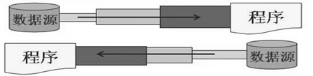

### java.io.File类的使用

#### 概述

- File类及各种流，都定义在java.io包下
- 一个File对象代表硬盘或网络中可能存在的一个文件或文件目录（万事万物皆对象）。
- File能新建、删除、重命名文件和目录，但File不能访问文件内容本身。如果需要访问文件内容本身，则需要使用输入/输出流
  - File对象可以作为参数传递给流的构造器
- 想要在Java程序中表示一个真实存在的文件或目录，那么必须有一个File对象，但是Java程序中的一个File对象，可能没有一个真实存在的文件或目录。

#### 构造器

- `public File(String pathname) ` ：以pathname为路径创建File对象，可以是绝对路径或相对路径，如果pathname是以相对路径，则默认的当前路径在系统属性user.dir中存储。
  - 绝对路径：从盘符开始的路径，是一个完整的路径
  - 相对路径：相对于当前目录的路径
    - IDEA中，main方法中的文件相对路径，是相对于当前工程
    - IDEA中，单元测试方法的中的文件相对路径，是相对于当前module
- `public File(String parent, String child) ` ：以parent为父路径，child为子路径创建File对象
- `public File(File parent, String child)` ：根据一个父File对象和子文件路径创建File对象

```java
public class FileTest {
    public static void main(String[] args) {
        File file = new File("hello.txt");
        System.out.println(file.getName());
        System.out.println(file.getAbsolutePath()); //JavaSE/hello.txt
    }
    @Test
    public void test01(){
        File file = new File("hello.txt");
        System.out.println(file.getName());
        System.out.println(file.getAbsolutePath()); //JavaSE/io/hello.txt
    }
    @Test
    public void test02(){
        File file = new File("/Users/canvs/Desktop/JAVA/JavaSE/io/","hello.txt");
        System.out.println(file.getName()); //hello.txt
    }
    @Test
    public void test03(){
        File file = new File("/Users/canvs/Desktop/JAVA/JavaSE/io/");
        File file2 = new File(file,"hello.txt");
    }
    @Test
    public void test04(){
        File file = new File("/Users/canvs/Desktop/JAVA/JavaSE/io/hello.txt");
        System.out.println("文件目录名称："+file.getName());
        System.out.println("文件目录构造路径："+file.getPath());
        System.out.println("是否是文件："+file.isFile());
        System.out.println("文件目录的父目录："+file.getParent());
    }
    @Test
    public void test05(){
        File file = new File("hello.txt");
        System.out.println("文件目录名称："+file.getName());
        System.out.println("文件目录构造路径："+file.getPath());
        System.out.println("是否是文件："+file.isFile());
        System.out.println("文件目录的父目录："+file.getParent());
        System.out.println("文件目录的父目录："+file.getAbsoluteFile().getParent());
    }
}
```

> 注意：
>
> - 当构造路径是绝对路径时，那么getPath和getAbsolutePath结果一样
>
> - 当构造路径是相对路径时，那么getAbsolutePath的路径 = user.dir的路径+构造路径

#### 常用方法

##### 获取文件和目录基本信息

- public String getName()：获取名称
- public String getPath()：获取路径
- public String getAbsolutePath()：获取绝对路径
- public File getAbsoluteFile()：获取绝对路径的File对象
- public String getParent()：获取上层路径，若无返回null
- public long length()：获取文件的长度（字节数）。不能获取目录的长度
- public long lastModified()：获取最近修改时间，时间戳。

> 如果File对象代表的文件或目录不存在，则File对象实例初始化时，就会用硬盘中对应文件或目录的属性为File对象的属性赋值，否则除了路径和名称，File对象的其他属性将会保留默认值，

```java
public class FileInfoMethodTest {
    @Test
    public void test01(){
        File file = new File("hello.txt");
        System.out.println("文件名："+file.getName());
        System.out.println("文件路父目录："+file.getParent());
        System.out.println("文件路径："+file.getAbsolutePath());
        System.out.println("文件路径："+file.getAbsoluteFile().getAbsolutePath());
        System.out.println("文件长度："+file.length());
        System.out.println("最近修改时间："+ new SimpleDateFormat("yyyy-MM-dd HH:mm:ss").format(new Date(file.lastModified())));
    }
    @Test
    public void test02(){
        File file = new File("src");
        System.out.println("文件名："+file.getName());
        System.out.println("文件路父目录："+file.getParent());
        System.out.println("文件路径："+file.getAbsolutePath());
        System.out.println("文件路径："+file.getAbsoluteFile().getAbsolutePath());
        System.out.println("文件长度："+file.length());
        System.out.println("最近修改时间："+ new SimpleDateFormat("yyyy-MM-dd HH:mm:ss").format(new Date(file.lastModified())));
    }
}
```

##### 列出目录的下一级

- public String[] list()：返回一个String数组，表示该File目录中的所有子文件或目录
- public File[] listFile()：返回一个File数组，表示该File目录中的所有子文件或目录
- java.io.FilenameFilter：实现此接口的类实例可用于过滤器文件名
  - boolean accept(File dir,String name) ：测试指定文件是否应该包含在某一文件列表中
- java.io.FileFilter：用于抽象路径名(File对象)的过滤器
  - boolean accept(File pathname)：测试pathname是否应该包含在当前File目录中 若符合则返回true

```java
public class DirListFilesTest {
    @Test
    public void test01(){
        File file = new File("src/com/canvs/");
        for (File fl : file.listFiles()) System.out.println(fl.getName());
    }
    @Test
    public void test02(){
        File file = new File("src/com/canvs/");
        for (String fs : file.list()) System.out.println(fs);
    }
    @Test
    public void test03(){
        File file = new File("/Users/canvs/Desktop/JAVA/JavaSE/README/imgs/");
        File[] files = file.listFiles(new FileFilter() {
            @Override
            public boolean accept(File pathname) {
                return pathname.getName().endsWith(".jpg");
            }
        });
        for (File fs : files) System.out.println(fs.getName());
    }
    @Test
    public void test04(){
        File file = new File("/Users/canvs/Desktop/JAVA/JavaSE/README/imgs/");
        File[] files = file.listFiles(new FilenameFilter() {
            @Override
            public boolean accept(File dir, String name) {
                return name.endsWith(".jpg");
            }
        });
        for (File fs : files) System.out.println(fs);
    }
}
```

##### File类的重命名

- public boolean renameTo(File dest)：把文件重命名为指定的文件路径

##### 判断功能的方法

- public boolean exists()：判断文件或目录是否实际存在
- public boolean isDirectory()：判断是否为目录
- public boolean isFile()：判断是否为文件
- public boolean canRead()：判断是否可读
- public boolean canWrite()：判断是否可写
- public boolean isHidden()：判断是否隐藏

```java
public class FileIsTest {
    @Test
    public void test01(){
        String src = "hello.txt";
        String desc = "hello_copy.txt";
        File file = new File(src);
        file.renameTo(new File(desc));
    }
    @Test
    public void test02(){
        String desc = "hello_copy.txt";
        File file = new File(desc);
        System.out.println("文件目录是否存在"+file.exists());
        System.out.println("是否为文件："+file.isFile());
        System.out.println("是否为目录："+file.isDirectory());
        System.out.println("是否可读："+file.canRead());
        System.out.println("是否可写："+file.canWrite());
        System.out.println("是否隐藏："+file.isHidden());
    }
    @Test
    public void test03(){
        String desc = "src/com/canvs/";
        File file = new File(desc);
        System.out.println("文件目录是否存在："+file.exists());
        System.out.println("是否为文件："+file.isFile());
        System.out.println("是否为目录："+file.isDirectory());
        System.out.println("是否可读："+file.canRead());
        System.out.println("是否可写："+file.canWrite());
        System.out.println("是否隐藏："+file.isHidden());
    }
}
```

##### 创建、删除功能

- public boolean createNewFile()：创建文件，若文件存在，则不创建，返回false
- public boolean mkdir()：创建文件目录。如果此文件目录存在，则不创建。如果此文件目录的上层目录不存在，也不创建
- public boolean mkdirs()：创建文件目录，如果上层文件目录不存在，一并创建
- public boolean delete()：删除文件或目录，删除一个目录，则该文件目录下不能包含文件或目录才能删除

```java
public class FileCreateDeleteTest {
    @Test
    public void test01() {
        File file = new File("/Users/canvs/Desktop/Test/hello.java");
        try {
            System.out.println(file.createNewFile() ? "创建成功！" : "创建失败！");
        } catch (IOException e) {
            throw new RuntimeException(e);
        }
    }
    @Test
    public void test02() {
        File file = new File("/Users/canvs/Desktop/Test/hello/");
        System.out.println(file.mkdir() ? "创建成功！" : "创建失败！");
    }
    @Test
    public void test03(){
        File file = new File("/Users/canvs/Desktop/Test/hello1/test/");
        System.out.println(file.mkdirs() ? "创建成功！" : "创建失败！");
    }
    @Test
    public void test04(){
        File file = new File("/Users/canvs/Desktop/Test/","hello.java");
        System.out.println(file.delete()? "删除成功":"删除失败");
        File file2 = new File("/Users/canvs/Desktop/Test/","hello1/test/");
        System.out.println(file2.delete() ? "删除成功":"删除失败");
    }
}
```

#### 练习

练习1:遍历指定目录所有文件名称，包括子文件目录中的文件。

- 并计算指定目录占用空间的大小
- 删除指定文件目录及其下的所有文件

```java
public class ListFilesTest {
    public static void main(String[] args) {
        String src = "/Users/canvs/Desktop/test/";
        printSubFile(new File(src));
        System.out.println(getDirectorySize(new File(src)));
        deleteDirctory(new File(src));
    }
    public static void printSubFile(File file) {
        if (file.isFile()) {
            System.out.println(file.getPath());
        } else if (file.isDirectory()) {
            File[] files = file.listFiles();
            if (files != null) for (File fs : files) printSubFile(fs);
        }
    }
    public static Long getDirectorySize(File file) {
        long size = 0;
        if (file.isDirectory()) {
            File[] files = file.listFiles();
            if (files != null) for (File fs : files) size += getDirectorySize(fs);
        }else if (file.isFile()) size += file.length();
        return size;
    }
    public static void deleteDirctory(File file) {
        if (file.isDirectory()) {
            File[] files = file.listFiles();
            if (files != null) for (File fs : files) deleteDirctory(fs);
        }
        file.delete();
    }
}
```

### IO流原理及流的分类

#### Java IO原理

- Java程序中，对于数据的输入/输出操作以`流(Stream)`的方式进行，可以看作是一种数据的流动。

  

- I/O流中的I/O式`Input/Output`的缩写，I/O技术式非常实用的技术，用于处理设备之间的数据传输。如读/写文件，网络通讯等。

  - 输入Input：读取外部数据（磁盘、光盘等存储设备的数据）到程序（内存）中。
  - 输出Output：将程序（内存）数据输出到磁盘、光盘等存储设备中。


#### 流的分类

`java.io`包下提供了各种流类和接口，用于获取不同种类的数据，并通过标准的方法输入或输出数据。

- 按数据的流向不同分为：输入流和输出流

  - 输入流：把数据从其他设备上读取到内存中的流
    - 以InputStream、Reader结尾
  - 输出流：把数据从内存中写出到其他设备上的流
    - 以OutputStream、Writer结尾

- 按操作数据单位的不同分为：字节流（8bit）和字符流（16bit）

  - 字节流：以字节为单位，读写数据的流
    - 以InputStream、OutputStream结尾
  - 字符流：以字符为单位，读写数据的流
    - 以Reader、Writer结尾

- 根据IO流的角色不同分为：节点流和处理流

  - 节点流：直接冲数据源或目的地读写数据

  

  - 处理流：不直接连接到数据源或目的地，而是连接在已存在的流（节点流或处理流）之上，通过对数据的处理为程序提供更为强大的读写功能。

  

#### 流的API

- Java的IO流共涉及40多个类，实际上非常规则，都是如下4个抽象基类派生的

| 抽象基类 |   输入流    |    输出流    |
| :------: | :---------: | :----------: |
|  字节流  | InputStream | OutputStream |
|  字符流  |   Reader    |    Writer    |

- 由这4个派生出来的子类名称都是以其父类名作为子类名后缀

| 分类       | 字节输入流           | 字节输出流            | 字符输入流        | 字符输出流         |
| :--------- | -------------------- | --------------------- | ----------------- | ------------------ |
| 抽象基类   | Inputstream          | Outputstream          | Reader            | Writer             |
| 访问文件   | FilelnputStream      | FileOutputStream      | FileReader        | FileWriter         |
| 访问数组   | ByteArraylnputStream | ByteArrayOutputStream | CharArrayReader   | CharArrayWriter    |
| 访问管道   | PipedlnputStream     | PipedOutputStream     | PipedReader       | PipedWriter        |
| 访问字符串 |                      |                       | StringReader      | StringWriter       |
| 缓冲流     | BufferedlnputStream  | BufferedOuputStream   | BufferedReader    | BufferedWriter     |
| 转换流     |                      |                       | InputstreamReader | OutputStreamWriter |
| 对象流     | ObjectlnputStream    | ObjectOutputStream    |                   |                    |
|            | FilterlnputStream    | FilterOutputStream    | FilterReader      | FilterWriter       |
| 打印流     |                      | Printstream           |                   | PrintWriter        |
| 推回输入流 | PushbacklnputStream  |                       | PushbackReader    |                    |
| 特殊流     | DatalnputStream      | DataOutputStream      |                   |                    |

##### 常用的节点流：

- 文件流：FileInputStream、FileOutputStream、FileReader、FileWriter
- 字节/字符数组流：ByteArrayInputStream、ByteArrayOutputStream、CharArrayReader、CharArrayWriter
  - 对数组进行处理的节点流（对应的不再是文件，而是内存中的一个数组）

##### 常用处理流：

- 缓冲流：BufferedInputStream、BufferedOutputStream、BufferedReader、BufferedWriter
  - 作用：增加缓冲功能，避免频繁读写硬盘，进而提升读写效率
- 转换流：InputStreamReader、OutputStreamReader
  - 作用：实现字节流和字符流之间的转换。
- 对象流：ObjectInputStream、ObjectOutputStream
  - 作用：提供直接读写Java对象功能

### 流节点：FileReader/FileWriter

#### Reader与Writer

Java提供一些字符流，以字符为单位读写数据，专门用于处理文本文件。不能操作图片、视频等非文本文件

> 常见的文本文件有：.txt、.java、.c、.cpp、.py等
>
> 注意：.doc、.xls、.ppt

#### 字符输入流：Reader

`java.io.Reader`抽象类是表示用于读取字符流的所有类的父类，可以读取字符信息到内存中。它定义了字符输入流的基本功性功能方法。

- public int read()：从字符流读取一个字符。虽然读取了一个字符，但是会自动提升为int类型。返回该字符的Unicode编码值。如果已经到达末尾了，则返回-1。
- public int read(char[] cbuf)：从输入流中读取一些字符，并将它们存储到字符数组cbuf中，每次最多读取cbuf.length个字符。返回实际读取的字符个数。如果已经到达流末尾，没有数据可读，则返回-1
- public int read(char[] cbuf, int off, int len)：从输入流中读取一些字符，并将它们存储到字符数组cbuf中，从cbuf[off]开始位置存储。每次最多读取len个字符。返回实际读取的字符个数。如果已经到达流末尾，没有数据可读，则返回-1。
- public void close()：关闭此流并释放此流相关联的任何系统资源。

> 注意：当完成流的操作时，必须调用close()方法，释放系统资源，否则会造成内存泄漏。

#### 字符输出流：Writer

`java.io.Writer`抽象类表示用于写出字符流的所有类的父类，将指定的字符信息写出到目的地。它定义了直接输出流的基本共性功能方法。

- public void writer(int c)：写出单个字符
- public void writer(char[] cbuf)：写出字符数组
- public void writer(char[] cbuf, int off, int len)：写出字符数组从off开始到len结束部分内容；
- public void writer(String str)：写出字符串
- public void writer(String str, int off, int len)：写出字符串从off开始到len结束部分内容；
- public void flush()：刷新该流的缓冲
- public void close()：关闭此流

#### FileReader与FileWriter

#### FileReader

`java.io.FileReader`类用于读取字符文件，构造时使用系统默认的字符编码和默认字符缓冲区。

- FileReader(File file)：创建新的FileReader，给定要读取的File对象。
- FileReader(String fileName)：创建一个新的FileReader，给定要读取的文件的名称。

**举例**：读取hello.txt文件中的字符数据，并输出到控制台

```java
public class FileReaderTest {
    @Test
    public void test01() {
        File file = new File("hello_copy.txt");
        FileReader fr = null;
        try {
            fr = new FileReader(file);
            int data;
            while ((data = fr.read()) != -1) System.out.print((char) data);
        } catch (IOException e) {
            e.printStackTrace();
        } finally {
            try {
                if (fr != null) fr.close();
            } catch (IOException e) {
                e.printStackTrace();
            }
        }
    }
    @Test
    public void test02() {
        File file = new File("hello_copy.txt");
        FileReader fr = null;
        try {
            fr = new FileReader(file);
            char[] cbuf = new char[5];
            int len;
            //错误方式
            //while ((len=fr.read(cbuf)) != -1) System.out.print(new String(cbuf));
            while ((len = fr.read(cbuf)) != -1) System.out.print(new String(cbuf, 0, len));
        } catch (IOException e) {
            e.printStackTrace();
        } finally {
            try {
                if (fr != null) fr.close();
            } catch (IOException e) {
                e.printStackTrace();
            }
        }
    }
    @Test
    public void test03() {
        FileReader fr = null;
        try {
            fr = new FileReader("hello_copy.txt");
            char[] cbuf = new char[5];
            int len;
            //错误方式
            //while ((len=fr.read(cbuf)) != -1) System.out.print(new String(cbuf));
            while ((len = fr.read(cbuf)) != -1) System.out.print(new String(cbuf, 0, len));
        } catch (IOException e) {
            e.printStackTrace();
        } finally {
            try {
                if (fr != null) fr.close();
            } catch (IOException e) {
                e.printStackTrace();
            }
        }
    }
}
```

**不同实现方式的类比：**


#### FileWriter

`java.io.FileWriter`类用于写出字符到文件，构造时使用默认的字符编码和默认字节缓冲区。

- FileWriter(File file)：创建一个新的FileWriter，给定要读取的File对象。
- FileWriter(File file, boolean append)：创建一个新的FileWriter，指明是否在现有文件末尾追加内容。
- FileWriter(String fileName)：创建一个新的FileWriter，给定要读取的文件的名称。

```java
public class FileWriterTest {
    @Test
    public void test04() {
        FileWriter fw = null;
        try {
            fw = new FileWriter("hello1.txt",true);
            fw.write("Hello World!");
            fw.write("你好");
            fw.write(123);
            Thread.sleep(10000);
        } catch (Exception e) {
            e.printStackTrace();
        } finally {
            try {
                if (fw != null) fw.close();
            } catch (IOException e) {
                e.printStackTrace();
            }
        }
    }
    @Test
    public void test05() {
        File src = new File("hello_copy.txt");
        File desc = new File("hello.txt");
        FileReader fr = null;
        FileWriter fw = null;
        try {
            fr = new FileReader(src);
            fw = new FileWriter(desc);
            char[] cbuf = new char[5];
            int len;
            while ((len = fr.read(cbuf)) != -1) fw.write(cbuf, 0, len);
        } catch (IOException e) {
            e.printStackTrace();
        } finally {
            try {
                if (fw != null) fw.close();
                if (fr != null) fr.close();
            } catch (IOException e) {
                e.printStackTrace();
            }
        }
    }
}
```

##### 小结：

- 因为出现流资源的调用，为了避免内存泄漏，需要使用try-catch-finally处理异常
- 对于输入流来说，File类的对象必须在屋里磁盘上存在，否则执行就会报FileNotFoundException。如果传入的是一个目录，则会报IOException异常。
- 对于输出流来说，File类的对象是可以不存在的。
  - 如果File类的对象不存在，则可以在输出的过程中，自动创建File类的对象
  - 如果File类的对象存在
    - 如果调用FileWriter(File file)或者FileWriter(File file, false)，输出时会新建File文件覆盖已有的文件
    - 如果调用FileWriter(File file, true)构造器，则在现有的文件末尾追加写出内容

#### flush(刷新)

因为内置缓冲区的原因，如果FileWriter不关闭输出流，无法写出字符到文件中。但是关闭的流对象，是无法继续写出数据的。如果我们既想写出数据，又想继续使用流，就需要`public void flush()`方法。

- flush()：刷新缓冲区，流对象可以继续使用。
- close()：线刷新缓冲区，然后通知系统释放资源。流对象不可以再被使用了。

> 注意：即便是flush()方法写出了数据，操作的最后还是需要调用close方法，释放系统资源。

```java
public class FileWriterFlushTest {
    @Test
    public void test1() {
        FileWriter fw = null;
        try {
            fw = new FileWriter(new File("a.txt"));
            fw.write("Hello");
            fw.flush();
            fw.write("world");
            fw.flush();
            fw.write("!");
            fw.flush();
        } catch (Exception e) {
            e.printStackTrace();
        } finally {
            try {
                if (fw != null) fw.close();
            } catch (IOException e) {
                throw new RuntimeException(e);
            }
        }
    }
}
```

### 流节点：FileInputStream/FileOutputStream

如果读取或写出的数据是非文本文件，则Reader、Writer就无能为力了，必须使用字节流。

#### 字节输入流：InputStream

`java.io.InputStream`抽象类是表示字节输入流的所有类的超类，可以读取字节信息到内存中。它定义了字节输入流的基本共性功能方法。

- public int read()：从输入流读取一个字节，如果没有数据可读，则返回-1
- public int read(byte[] b)：从输入流中读取一些字节数，并将它们存储到字节数组b中。每次最多读取b.length个字节。返回实际读取字节个数。如果没有数据可读，则返回-1
- public int read(byte[] b, int off, int len)：从输入流中读取一些字节数，并将它们存储到字节数组b中，从b[off]开始存储，每次最多读取len个字节。返回实际读取的字节个数。如果没有数据可读，则返回-1
- public void close()：关闭此输入流并释放与此流相关联的任何系统资源。

#### 字节输出流：OutputStream

`java.io.OutputStream`抽象类是表示字节输出流的所有类的超类，将指定的字节信息写出到目的地。它定义了字节输出流的基本共性功能方法。

- public void writer(int b)：将指定的字节输出流。虽然参数为int类型四个字节，但是只会保留一个字节的信息写出。
- public void writer(byte[] b)：将b.length字节从指定的数组写入此输出流。
- public void writer(byte[] b ,int off, int len)：从指定的字节数组写入len字节，从偏移量off开始输出到此输出流。
- public void flush()：刷新此输出流并强制任何缓冲的输出字节被写出。
- public void close()：关闭此输出流相关联的流和系统资源

#### FileInputStream

`java.io.FileInputStream`类是文件输入流，从文件中读取字节。

- FileInputStream(File file)：通过打开与实际文件的连接来创建一个FileInputStream，该文件由文件系统中的File对象file命名。
- FileInputStream(String name)：通过打开与实际文件的连接来创建一个FileInputStream，该文件由文件系统中的路径名name命名。

```java
public class FileInputStreamTest {
    @Test
    public void test01() {
        File file = new File("hello.txt");
        FileInputStream fis = null;
        try {
            fis = new FileInputStream(file);
            byte[] b = new byte[10];
            int len;
            while ((len = fis.read(b)) != -1) {
                System.out.print(new String(b, 0, len));
            }
        } catch (IOException e) {
            e.printStackTrace();
        } finally {
            try {
                if (fis != null) fis.close();
            } catch (IOException e) {
                throw new RuntimeException(e);
            }
        }
    }
    @Test
    public void test02() {
        FileInputStream fis = null;
        try {
            fis = new FileInputStream("hello.txt");
            int len;
            //读取到中文会乱码，读取中文使用read(byte[] b)
            while ((len = fis.read()) != -1) System.out.print((char) len);
        } catch (IOException e) {
            throw new RuntimeException(e);
        } finally {
            try {
                if (fis != null) fis.close();
            } catch (IOException e) {
                e.printStackTrace();
            }
        }
    }
}
```

#### FileOutputStream

`java.io.FileOutputStream`类是文件输出流，用于将数据写出到文件

- public FileOutputStream(File file)：创建文件输出流，写出由指定的File对象表示的文件
- public FileOutputStream(String  name)：创建文件输出流，指定的名称问写出文件。
- public FileOutputStream(File file, boolean append)：创建文件输出流，指明是否在现有文件末尾追加内容

```java
public class FileOutputStreamTest {
    @Test
    public void test01() throws IOException {
        File file = new File("c.txt");
        FileOutputStream fos = new FileOutputStream(file);
        fos.write(97);
        fos.write(98);
        fos.write(99);
        fos.close();
    }
    @Test
    public void test02() {
        FileOutputStream fos = null;
        try {
            fos = new FileOutputStream("a.txt", true);
            byte[] b = "hello".getBytes();
            fos.write(b, 0, 4);
            fos.write("world".getBytes());
        } catch (IOException e) {
            throw new RuntimeException(e);
        } finally {
            try {
                if (fos != null) fos.close();
            } catch (IOException e) {
                e.printStackTrace();
            }
        }
    }
    @Test
    public void test03() {
        String src = "MyRunnable.java";
        String desc = "MyRunnable_copy.java";
        FileInputStream fis = null;
        FileOutputStream fos = null;
        try {
            fis = new FileInputStream(src);
            fos = new FileOutputStream(desc);
            byte[] b = new byte[1024];
            int len;
            while ((len = fis.read(b)) != -1) {
                fos.write(b, 0, len);
            }
        } catch (IOException e) {
            e.printStackTrace();
        } finally {
            try {
                if (fos != null) fos.close();
            } catch (IOException e) {
               e.printStackTrace();
            }
            try {
                if (fis != null) fis.close();
            } catch (IOException e) {
                e.printStackTrace();
            }
        }
    }
}
```

#### 练习：实现图片加密操作

```java
public class PictureEncryption {
    public static void main(String[] args) throws FileNotFoundException {
//        	encryption(new File("zhouhuiming.jpeg"));
            decryption(new File("encryption_zhouhuiming.jpeg"));
    }
    public static void encryption(File file) {
        FileInputStream fis = null;
        FileOutputStream fos = null;
        try {
            fis = new FileInputStream(file);
            fos = new FileOutputStream("encryption_" + file.getName());
            byte[] buffer = new byte[1024];
            int len;
            while ((len = fis.read(buffer)) != -1) {
              //给每个字节做异或运算
                for (int i = 0; i < buffer.length; i++) buffer[i] ^= 5;
                fos.write(buffer, 0, len);
            }
            System.out.println("加密成功！");
        } catch (IOException e) {
            e.printStackTrace();
        } finally {
            try {
                if (fos != null) fos.close();
            } catch (IOException e) {
                e.printStackTrace();
            }
            try {
                if (fis != null) fis.close();
            } catch (IOException e) {
                e.printStackTrace();
            }
        }
    }
    public static void decryption(File file) {
        FileInputStream fis = null;
        FileOutputStream fos = null;
        try {
            fis = new FileInputStream(file);
            fos = new FileOutputStream("decryption_" + file.getName());
            byte[] buffer = new byte[1024];
            int len;
            while ((len = fis.read(buffer)) != -1) {
                for (int i = 0; i < buffer.length; i++) buffer[i] ^= 5;
                fos.write(buffer,0,len);
            }
            System.out.println("解密成功！");
        } catch (IOException e) {
            e.printStackTrace();
        } finally {
            try {
                if (fos != null) fos.close();
            } catch (IOException e) {
                e.printStackTrace();
            }
            try {
                if (fis != null) fis.close();
            } catch (IOException e) {
                e.printStackTrace();
            }
        }
    }
}
```

