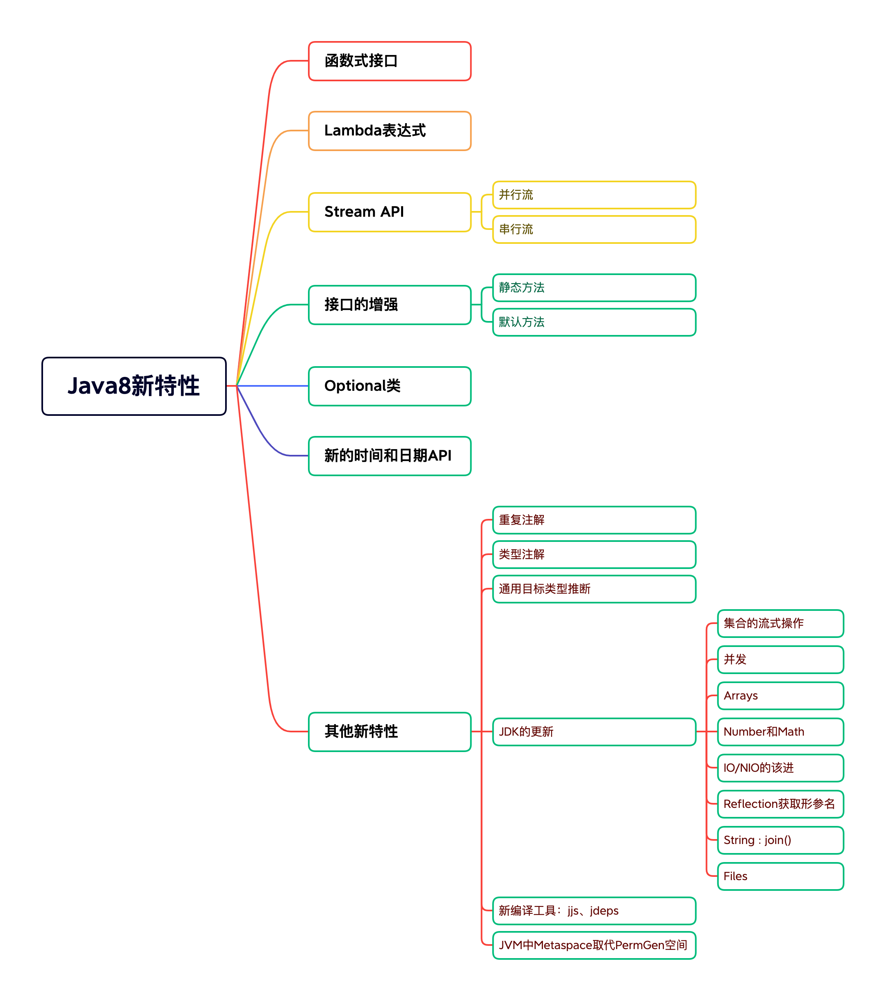
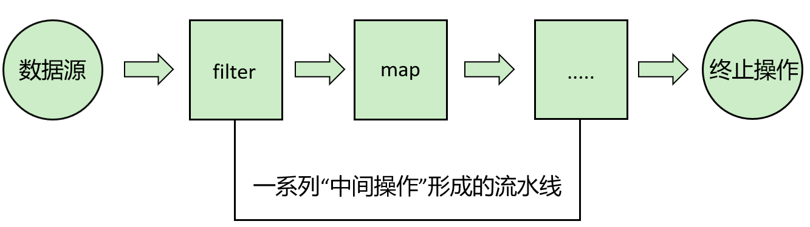

### 名词解释

#### Oracle JDK和Open JDK

|              | Oracle JDK                                                   | Open JDK                  |
| ------------ | ------------------------------------------------------------ | ------------------------- |
| 来源         | Oracle团队维护                                               | Oracle和Open java社区     |
| 授权协议     | Java17及更高版本Oracle Java SE许可证<br>Java16及更低版本甲骨文免费条款和条件（NFTC）许可协议 | GPL v2许可证              |
| 关系         | 有Open JDK构建，增加了少许内容                               |                           |
| 是否收费     | 2021年9月起Java17及更高版本所有用户免费。16及更低版本，个人用户、开发用户免费 | 2017年9月起，所有版本免费 |
| 对语法的支持 | 一致                                                         | 一致                      |

#### JEP

JEP(JDK Enhancement Proposals)：jdk改进提案，每当需要有新的设想的时候，JEP可以提出非正式的规范（specification），被正式认可的JEP正式写进JDK的发展路线图并分配版本号

#### LTS

LTS(Long-term Support)即长期支持。Oracle官网提供了对Oracle JDK个别版本的长期支持，即使发行了新的版本，比如目前最新JDK19，在结束日期前，LTS版本都会被长期支持。（出现了BUG，会被修复，非LTS则不会再有布丁发布），所以，一定要选一个LTS版本，不然除了漏洞没人修复。

| 版本      | 开始日期  | 结束日期  | 延期结束日期 |
| --------- | --------- | --------- | ------------ |
| 7（LTS）  | 2011年7月 | 2019年7月 | 2022年7月    |
| 8（LTS）  | 2014年3月 | 2022年3月 | 2030年12月   |
| 11（LTS） | 2018年9月 | 2023年9月 | 2026年9月    |
| 17（LTS） | 2021年9月 | 2026年9月 | 2029年9月    |
| 21（LTS） | 2023年9月 | 2028年9月 | 2031年9月    |

#### jdk9

Java9提供了超过150项新功能特性，包括备受期待的模块化系统、可交互的REPL工具：jshell，JDK编译工具。Java公共和私有代码，以及安全增强、扩展提升、性能管理改善等。

https://openjdk.java.net/projects/jdk9/

#### jdk10

https://openjdk.java.net/projects/jdk/10/

> 286: [Local-Variable Type Inference](http://openjdk.java.net/jeps/286) 局部变量类型推断
> 296: [Consolidate the JDK Forest into a Single Repository](http://openjdk.java.net/jeps/296) JDK库的合并
> 304: [Garbage-Collector Interface](http://openjdk.java.net/jeps/304) 统一的垃圾回收接口
> 307: [Parallel Full GC for G1](http://openjdk.java.net/jeps/307) 为G1提供并行的Full GC
> 310: [Application Class-Data Sharing](http://openjdk.java.net/jeps/310) 应用程序类数据（AppCDS）共享
> 312: [Thread-Local Handshakes](http://openjdk.java.net/jeps/312) ThreadLocal握手交互
> 313: [Remove the Native-Header Generation Tool (javah)](http://openjdk.java.net/jeps/313) 移除JDK中附带的javah工具
> 314: [Additional Unicode Language-Tag Extensions](http://openjdk.java.net/jeps/314) 使用附加的Unicode语言标记扩展
> 316: [Heap Allocation on Alternative Memory Devices](http://openjdk.java.net/jeps/316) 能将堆内存占用分配给用户指定的备用内存设备
> 317: [Experimental Java-Based JIT Compiler](http://openjdk.java.net/jeps/317) 使用Graal基于Java的编译器
>
> 319: [Root Certificates](http://openjdk.java.net/jeps/319) 根证书
> 322: [Time-Based Release Versioning](http://openjdk.java.net/jeps/322) 基于时间定于的发布版本

#### JDK11

https://openjdk.java.net/projects/jdk/11/

> 181: [Nest-Based Access Control](https://openjdk.java.net/jeps/181)  基于嵌套的访问控制
> 309: [Dynamic Class-File Constants](https://openjdk.java.net/jeps/309) 动态类文件常量
> 315: [Improve Aarch64 Intrinsics](https://openjdk.java.net/jeps/315) 改进 Aarch64 Intrinsics
> 318: [Epsilon: A No-Op Garbage Collector](https://openjdk.java.net/jeps/318) Epsilon — 一个No-Op（无操作）的垃圾收集器
> 320: [Remove the Java EE and CORBA Modules](https://openjdk.java.net/jeps/320) 删除 Java EE 和 CORBA 模块
> 321: [HTTP Client (Standard)](https://openjdk.java.net/jeps/321)  HTTPClient API
> 323: [Local-Variable Syntax for Lambda Parameters](https://openjdk.java.net/jeps/323)  用于 Lambda 参数的局部变量语法
> 324: [Key Agreement with Curve25519 and Curve448](https://openjdk.java.net/jeps/324) Curve25519 和 Curve448 算法的密钥协议
> 327: [Unicode 10](https://openjdk.java.net/jeps/327)
> 328: [Flight Recorder](https://openjdk.java.net/jeps/328) 飞行记录仪
> 329: [ChaCha20 and Poly1305 Cryptographic Algorithms](https://openjdk.java.net/jeps/329) ChaCha20 和 Poly1305 加密算法
> 330: [Launch Single-File Source-Code Programs](https://openjdk.java.net/jeps/330) 启动单一文件的源代码程序
> 331: [Low-Overhead Heap Profiling](https://openjdk.java.net/jeps/331) 低开销的 Heap Profiling
> 332: [Transport Layer Security (TLS) 1.3](https://openjdk.java.net/jeps/332) 支持 TLS 1.3
> 333: [ZGC: A Scalable Low-Latency Garbage Collector
>    (Experimental)](https://openjdk.java.net/jeps/333) 可伸缩低延迟垃圾收集器
> 335: [Deprecate the Nashorn JavaScript Engine](https://openjdk.java.net/jeps/335) 弃用 Nashorn JavaScript 引擎
> 336: [Deprecate the Pack200 Tools and API](https://openjdk.java.net/jeps/336)  弃用 Pack200 工具和 API

#### jdk 12

https://openjdk.java.net/projects/jdk/12/

> 189：[Shenandoah: A Low-Pause-Time Garbage Collector (Experimental)](https://openjdk.java.net/jeps/189) 低暂停时间的GC
> 230: [Microbenchmark Suite](https://openjdk.java.net/jeps/230) 微基准测试套件
> 325: [Switch Expressions (Preview)](https://openjdk.java.net/jeps/325) switch表达式
> 334: [JVM Constants API ](https://openjdk.java.net/jeps/334) JVM常量API
> 340: [One AArch64 Port, Not Two](https://openjdk.java.net/jeps/340) 只保留一个AArch64实现
> 341: [Default CDS Archives](https://openjdk.java.net/jeps/341) 默认类数据共享归档文件
> 344: [Abortable Mixed Collections for G1](https://openjdk.java.net/jeps/344) 可中止的G1 Mixed GC
> 346: [Promptly Return Unused Committed Memory from G1](https://openjdk.java.net/jeps/346) G1及时返回未使用的已分配内存

#### jdk 13

https://openjdk.java.net/projects/jdk/13/

> 350: [Dynamic CDS Archives](https://openjdk.java.net/jeps/350) 动态CDS档案
> 351: [ZGC: Uncommit Unused Memory](https://openjdk.java.net/jeps/351) ZGC:取消使用未使用的内存
> 353: [Reimplement the Legacy Socket API](https://openjdk.java.net/jeps/353) 重新实现旧版套接字API
> 354: [Switch Expressions (Preview)](https://openjdk.java.net/jeps/354) switch表达式（预览）
> 355: [Text Blocks (Preview)](https://openjdk.java.net/jeps/355) 文本块（预览）

#### jdk 14

https://openjdk.java.net/projects/jdk/14/

> 305: [Pattern Matching for instanceof (Preview)](https://openjdk.java.net/jeps/305) instanceof的模式匹配
> 343: [Packaging Tool (Incubator)](https://openjdk.java.net/jeps/343) 打包工具
> 345: [NUMA-Aware Memory Allocation for G1](https://openjdk.java.net/jeps/345) G1的NUMA-Aware内存分配
> 349: [JFR Event Streaming](https://openjdk.java.net/jeps/349) JFR事件流
> 352: [Non-Volatile Mapped Byte Buffers](https://openjdk.java.net/jeps/352) 非易失性映射字节缓冲区
> 358: [Helpful NullPointerExceptions](https://openjdk.java.net/jeps/358) 实用的NullPointerExceptions
> 359: [Records (Preview)](https://openjdk.java.net/jeps/359) 
> 361: [Switch Expressions (Standard)](https://openjdk.java.net/jeps/361) Switch表达式
> 362: [Deprecate the Solaris and SPARC Ports](https://openjdk.java.net/jeps/362) 弃用Solaris和SPARC端口
> 363: [Remove the Concurrent Mark Sweep (CMS) Garbage Collector](https://openjdk.java.net/jeps/363) 删除并发标记扫描（CMS）垃圾回收器
> 364: [ZGC on macOS](https://openjdk.java.net/jeps/364) 
> 365: [ZGC on Windows](https://openjdk.java.net/jeps/365) 
> 366: [Deprecate the ParallelScavenge + SerialOld GC Combination](https://openjdk.java.net/jeps/366) 弃用ParallelScavenge + SerialOld GC组合
> 367: [Remove the Pack200 Tools and API](https://openjdk.java.net/jeps/367) 删除Pack200工具和API
> 368: [Text Blocks (Second Preview)](https://openjdk.java.net/jeps/368) 文本块
> 370: [Foreign-Memory Access API (Incubator)](https://openjdk.java.net/jeps/370) 外部存储器访问API

#### jdk 15

https://openjdk.java.net/projects/jdk/15/

> 339: [Edwards-Curve Digital Signature Algorithm (EdDSA)](https://openjdk.java.net/jeps/339) EdDSA 数字签名算法
> 360: [Sealed Classes (Preview)](https://openjdk.java.net/jeps/360) 密封类（预览）
> 371: [Hidden Classes](https://openjdk.java.net/jeps/371) 隐藏类
> 372: [Remove the Nashorn JavaScript Engine](https://openjdk.java.net/jeps/372) 移除 Nashorn JavaScript 引擎
> 373: [Reimplement the Legacy DatagramSocket API](https://openjdk.java.net/jeps/373) 重新实现 Legacy DatagramSocket API
> 374: [Disable and Deprecate Biased Locking](https://openjdk.java.net/jeps/374) 禁用偏向锁定
> 375: [Pattern Matching for instanceof (Second Preview)](https://openjdk.java.net/jeps/375) instanceof 模式匹配（第二次预览）
> 377: [ZGC: A Scalable Low-Latency Garbage Collector](https://openjdk.java.net/jeps/377) ZGC：一个可扩展的低延迟垃圾收集器
> 378: [Text Blocks](https://openjdk.java.net/jeps/378) 文本块
> 379: [Shenandoah: A Low-Pause-Time Garbage Collector](https://openjdk.java.net/jeps/379) Shenandoah:低暂停时间垃圾收集器
> 381: [Remove the Solaris and SPARC Ports](https://openjdk.java.net/jeps/381) 移除 Solaris 和 SPARC 端口
> 383: [Foreign-Memory Access API (Second Incubator)](https://openjdk.java.net/jeps/383) 外部存储器访问 API（第二次孵化版）
> 384: [Records (Second Preview)](https://openjdk.java.net/jeps/384) Records（第二次预览）
> 385: [Deprecate RMI Activation for Removal](https://openjdk.java.net/jeps/385) 废弃 RMI 激活机制

#### jdk 16

https://openjdk.java.net/projects/jdk/16/

> 338: [Vector API (Incubator)](https://openjdk.java.net/jeps/338) Vector API（孵化器）
> 347: [Enable C++14 Language Features](https://openjdk.java.net/jeps/347) JDK C++的源码中允许使用C++14的语言特性
> 357: [Migrate from Mercurial to Git](https://openjdk.java.net/jeps/357) OpenJDK源码的版本控制从Mercurial (hg) 迁移到git
> 369: [Migrate to GitHub](https://openjdk.java.net/jeps/369) OpenJDK源码的版本控制迁移到github上
> 376: [ZGC: Concurrent Thread-Stack Processing](https://openjdk.java.net/jeps/376) ZGC：并发线程处理
> 380: [Unix-Domain Socket Channels](https://openjdk.java.net/jeps/380) Unix域套接字通道
> 386: [Alpine Linux Port](https://openjdk.java.net/jeps/386) 将glibc的jdk移植到使用musl的alpine linux上
> 387: [Elastic Metaspace](https://openjdk.java.net/jeps/387) 弹性元空间
> 388: [Windows/AArch64 Port](https://openjdk.java.net/jeps/388) 移植JDK到Windows/AArch64
> 389: [Foreign Linker API (Incubator)](https://openjdk.java.net/jeps/389) 提供jdk.incubator.foreign来简化native code的调用
> 390: [Warnings for Value-Based Classes](https://openjdk.java.net/jeps/390) 提供基于值的类的警告
> 392: [Packaging Tool](https://openjdk.java.net/jeps/392) jpackage打包工具转正
> 393: [Foreign-Memory Access API (Third Incubator)](https://openjdk.java.net/jeps/393) 
> 394: [Pattern Matching for instanceof](https://openjdk.java.net/jeps/394) Instanceof的模式匹配转正
> 395: [Records](https://openjdk.java.net/jeps/395) Records转正
> 396: [Strongly Encapsulate JDK Internals by Default](https://openjdk.java.net/jeps/396) 默认情况下，封装了JDK内部构件
> 397: [Sealed Classes (Second Preview)](https://openjdk.java.net/jeps/397) 密封类

#### jdk 17

https://openjdk.java.net/projects/jdk/17/

> 306: [Restore Always-Strict Floating-Point Semantics](https://openjdk.java.net/jeps/306) 恢复始终严格的浮点语义
>
> 356: [Enhanced Pseudo-Random Number Generators](https://openjdk.java.net/jeps/356) 增强型伪随机数生成器
>
> 382: [New macOS Rendering Pipeline](https://openjdk.java.net/jeps/382) 新的macOS渲染管道
>
> 391: [macOS/AArch64 Port](https://openjdk.java.net/jeps/391) macOS/AArch64端口
>
> 398: [Deprecate the Applet API for Removal](https://openjdk.java.net/jeps/398) 弃用Applet API后续将进行删除
>
> 403: [Strongly Encapsulate JDK Internals](https://openjdk.java.net/jeps/403) 强封装JDK的内部API
>
> 406: [Pattern Matching for switch (Preview)](https://openjdk.java.net/jeps/406) switch模式匹配（预览）
>
> 407: [Remove RMI Activation](https://openjdk.java.net/jeps/407) 删除RMI激活机制
>
> 409: [Sealed Classes](https://openjdk.java.net/jeps/409) 密封类转正
>
> 410: [Remove the Experimental AOT and JIT Compiler](https://openjdk.java.net/jeps/410) 删除实验性的AOT和JIT编译器
>
> 411: [Deprecate the Security Manager for Removal](https://openjdk.java.net/jeps/411) 弃用即将删除的安全管理器
>
> 412: [Foreign Function & Memory API (Incubator)](https://openjdk.java.net/jeps/412) 外部函数和内存API（孵化特性）
>
> 414: [Vector API (Second Incubator)](https://openjdk.java.net/jeps/414) Vector API（第二次孵化特性）
>
> 415: [Context-Specific Deserialization Filters](https://openjdk.java.net/jeps/415) 上下文特定的反序列化过滤器

### Java8新特性：Lambda表达式

#### 关于Java8新特性

Java8（又称JDK8和JDK1.8）是Java语言开发的一个主要版本。Java 8时oracle公司于2014年3月发布，可以看成是自Java5以来最具革命性的版本。Java8为Java语言、编译器、类库、开发工具与JVM带来了大量新特性。



- 速度更快
- 代码更少（Lambda表达式）
- 强大的Stream API
- 便于并行
  - 并行流就是把一个内容分成多个数据块，并用不同的线程分别处理每个数据块的流。相比较串行的流，并行的流可以很大程度上提高程序的执行效率。
  - Java 8中讲并行进行了优化，我们可以很容易的对数据进行并行操作。Stream API可以声明性的通过paralle()与sequential()再并行流与顺序流之间进行切换。
- 最大化减少空指针异常：Optional
- Nashorn引擎，允许在JVM上运行JS应用
  - 音标：nass-horn，是德国二战时的一个坦克命名
  - javascript运行在jvm已经不是新鲜事了，Rhino早在jdk6的时候已经存在。现在替代Rhino，官方的解释是Rhino相比其他JavaScript引擎(比如google的V8)实在太慢了，改造Rhino还不如重写。所以Nashorn的性能也是其一个亮点。
  - Nashorn项目在JDK9中得到该进；在JDK11中Deprecated，后续JDK15版本中remove。在JDK11中取以代之的是GraalVM。（GraalVM是一个运行时在平台，它支持Java和其他基于Java字节码的语言，但也支持其他语言，如javaScript、Ruby、Python或LLVM。性能时Nashorn的2倍以上）

#### 冗余的匿名内部类

当需要启动一个线程去完成任务时，通常会通过`java.lang.Runnable`接口来定义任务内容，并使用`java.lang.Thread`类来启动该线程。

```java
public class UseFunctionProgramming {
    public static void main(String[] args) {
        new Thread(new Runnable() {
            @Override
            public void run() {
                System.out.println("helloworld");
            }
        }).run();
    }
}
```

本着“一切皆对象”的思想，这种做法是无可厚非的：首先创建一个`Runnable`接口的匿名内部类对象来指定任务内容，再将其交给一个线程来启动。

**代码分析**：

对于`Runnable`的匿名内部类的用法，可以分析出几点内容：

- `Thread`类需要`Runnable`接口作为参数，其中的抽象`run`方法是用阿里指定线程任务内容的核心；
- 为了指定`run`的方法体，不得不需要实现`Runnable`接口的实现类；
- 为了省去定义一个`Runnable`实现类的麻烦，不得不使用匿名内部类；
- 必须覆盖重写抽象`run`方法，所以方法名称、方法参数、方法的返回值不得不再写一遍，且不能写错；
- 而实际上，似乎只有方法体才是关键所在。

#### Lambda

Lambda是一个匿名函数，我们可以把Lambda表达式理解为是**一段可以传递的代码**（将代码项数据一样进行传递）。使用它可以写出更简洁、更灵活的代码。作为一种更精凑的代码风格，使Java的语言代码能力得到了提升。

#### 语法

Lambda表达式：在Java8语言中引入的一种新的语法元素和操作符。这个操作符为`-->`，该操作符被称为`Lambda`操作符或箭头操作符。它将Lambda分为两个部分：

- 左侧：指定了Lambda表达式需要的参数列表
- 右侧：指定了Lambda体，是抽象方法的实现逻辑，也即Lambda表达式要执行的功能

**语法格式**：无参，无返回值

```java
	public void test01(){
        //不使用Lambda表达式
        Runnable run = new Runnable() {
            @Override
            public void run() {
                System.out.println("hello world");
            }
        };
        run.run();  //hello world
        //使用Lambda表达式
        Runnable run2 = () -> {
						System.out.println("你好 世界");
        };
        run2.run(); //你好 世界
    }
```

**语法格式**：Lambda需要一个参数，但是没有返回值

```java
    public void test02(){
        Consumer<String> con = new Consumer<String>() {
            @Override
            public void accept(String s) {
                System.out.println(s);
            }
        };
        con.accept("hello");
        Consumer<String> con2 = (String s) -> {
            System.out.println(s);
        };
        con2.accept("你好");
    }
```

**语法格式**：数据类型可以省略，因为可由编译器推断得出，称为类型推断

```java
    public void test03(){
        Consumer<String> cons = (s) -> System.out.println(s);
        cons.accept("hello");
    }
```

**语法格式**：Lambda若只需要一个参数时，参数的小括号可以省略

```java
    public void test04(){
        Consumer<String> cons = s -> System.out.println(s);
        cons.accept("canvs");
    }
```

**语法格式**：Lambda需要两个或以上参数，多余执行语句，并且可以有返回值

```java
    public void test05(){
        Comparator<Integer> com = new Comparator<Integer>() {
            @Override
            public int compare(Integer o1, Integer o2) {
                return o1.compareTo(o2);
            }
        };
        System.out.println(com.compare(54, 24));
        Comparator<Integer> com2 = (o1,o2) -> {
            return o1.compareTo(o2);
        };
        System.out.println(com2.compare(5, 24));
    }
```

**语法格式**：当Lambda体只有一条语句时，return与大括号都可以省略

```java
   public void test06(){
        Comparator<Integer> com = (o1,o2) -> o1.compareTo(o2);
        System.out.println(com.compare(16, 21));
    }
```

#### 关于类型推断

在语法格式三Lambda表达式中的参数类型都是由编译器推断得出的。Lambda表达式中无需指定类型，程序依然可以编译，这是因为javac根据程序的上下文，在后台推断出了参数的类型。Lambda表达式的类型依赖于上下文环境，是由编译器推断出来的。这就是所谓的类型推断。

```java
    public void test07(){
        ArrayList<String> list = new ArrayList<>();
        int[] arr = {1,2,3};
    }
```

### Java8新特性：函数式(Functional)接口

#### 什么是函数式接口

- 只包含一个抽象方法（Single Abstract Method）简称SAM的接口，称为函数式接口。当然该接口可以包含其他非抽象方法。
- 可以通过Lambda表达式来创建该接口的对象。（若Lambda表达式抛出一个受检异常（即：非运行时异常），那么该异常需要在目标接口的抽象方法上进行声明）。
- 我们可以在一个接口上使用`@FunctionalInterface`注解，这样做可以检查它是否是一个函数式接口。同时javadoc也会包含一条声明，说明这个接口式一个函数式接口。
- 在`java.util.function`包下定义了Java8的丰富的函数式接口。

#### 如何理解函数式接口

- Java从诞生日起就是一直倡导”一切皆对象“，在Java里面向对象（OOP）编程是一切。但是随着python、scala等语言的兴起和新技术的挑战，Java不得不作出调整以便支持更加广泛的技术要求，即Java不但可以支持OOP还可以支持OOF(面向函数式编程)
  - Java8引入了Lambda表达式之后，Java也开始支持函数式编程。
  - Lambda表达式不是Java最早使用的。目前C++、C#、Python、Scala等均支持Lambda表达式
- 面向对象的思想
  - 做一件事情，找到一个能解决这个事情的对象，调用对象的方法，完成事情。
- 函数式编程思想：
  - 只要能获取到结果，谁去做的，怎么做的都不重要，重视的是结果，不重视过程。
- 在函数式编程语言中，函数被当作一等公民对待。在将函数作为一等公民的编程语言中，Lambda表达式的类型是函数。但是在Java8中，有所不同。在Java8中，Lambda表达式是对象，而不是函数，它们必须依附于一类特别的对象类型函数式接口。
- 简单的说，在Java8中，Lambda表达式就是一个函数式接口的实例。这就是Lambda表达式和函数式接口的关系。也就是说，只要一个对象是函数式接口的实例，那么该对象就可以用Lambda表达式来表示。

```java
@FunctionalInterface
public interface MyFunctionalInterface {
    void method();
}
```

```java
public class MyFunctionalInterfaceTest {
    public static void main(String[] args) {
        MyFunctionalInterface mfi = new MyFunctionalInterface() {
            @Override
            public void method() {
                System.out.println("hello");
            }
        };
        mfi.method();

        MyFunctionalInterface mfi1 = () -> System.out.println("你好");
        mfi1.method();
    }
}
```

> 作为参数传递Lambda表达式：为了将Lambda表达式作为参数传递，接收Lambda表达式的参数类型必须是该Lambda表达式兼容的函数式接口的类型。

#### Java内置函数式接口

- java.lang.Runnable
  - public void run()
- java.lang.Iterable\<T>
  - public Iterator\<T> iterate()
- java.lang.Comparator\<T>
  - public int compare(T t1,T t2);
- java.lang.Comparable\<T>
  - public int compareTo(T t)

##### 核心函数式接口

| 函数式接口    | 称谓       | 参数类型 | 用途                                                         |
| ------------- | ---------- | -------- | ------------------------------------------------------------ |
| Consumer\<T>  | 消费型接口 | T        | 对类型为T的对象应用操作，包含方法：void accept(T t)          |
| Supplier\<T>  | 供给型接口 | void     | 返回类型为T的对象，包含方法：T get()                         |
| Function<T,R> | 函数型接口 | T        | 对类型为T的对象应用操作，并返回结果。结果是R类型的对象。包含方法：R apply(T t) |
| Predicate\<T> | 判断型接口 | T        | 确定类型为T的对象是否满足约束，并返回boolean值。包含方法：boolean test(T t) |

##### **其他接口**

###### 类型1:消费型接口：

消费型接口的抽象方法特点：有形参，但是返回值类型是void

| 接口名                | 抽象方法                       | 描述                       |
| --------------------- | ------------------------------ | -------------------------- |
| BiConsumer<T,U>       | void accept(T t, U u)          | 接收两个对象用于完成功能   |
| DoubleConsumer        | void accept(double value)      | 接收一个double值           |
| IntConsumer           | void accept(int value)         | 接收一个int值              |
| LongConsumer          | void accept(long value)        | 接收一个long值             |
| ObjDoubleConsumer\<T> | void accept(T t, double value) | 接收一个对象和一个double值 |
| ObjIntConsumer\<T>    | void accept(T t , int value)   | 接收一个对象和一个int值    |
| ObjLongConsumer\<T>   | void accept(T t, long value)   | 接收一个对象和一个long值   |

在JDK1.8中Collection集合接口的父接口Iterable接口中增加了一个默认方法：

`public default void forEach(Consumer<? super T> action)`遍历Collection集合的每个元素，执行xxx消费型操作。

在JDK1.8中Map集合接口中增加了一个默认方法：`public default void forEach(BiConsumer<? super K,? super V> action)`遍历Map集合的每对映射关系，执行xxx方法。

- 创建一个Collection系列的集合，添加一些字符串，调用forEach方法遍历查看
- 创建一个Map系列集合，添加一些（key,value）键值对，调用forEach方法遍历查看

```java
public class ConsumerTest {
    @Test
    public void consumerTest() {
        Consumer<String> consumer = new Consumer<String>() {
            @Override
            public void accept(String s) {
                System.out.println(s);
            }
        };
        //lambda表达式
        Consumer<String> cons = (s) -> System.out.println(s);
        cons.accept("hello");
        //方法引用
        Consumer<String> cons1 = System.out::println;
        cons1.accept("你好");
    }
    @Test
    public void test01() {
        List<String> list = new ArrayList<>();
        list.add("canvs");
        list.add("tom");
        list.add("jerry");
        //lambda表达式
        list.forEach((s) -> System.out.println(s));
        //方法引用
        list.forEach(System.out::println);
    }
    @Test
    public void test02() {
        Map<Integer, String> map = new HashMap<>();
        map.put(1001, "Canvs");
        map.put(1002, "Tom");
        map.put(1003, "Jerry");
        map.forEach((id, name) -> System.out.println("ID:" + id + " 姓名:" + name));
    }
    @Test
    public void biConsumerTest() {
        BiPredicate<String, String> biPred = new BiPredicate<String, String>() {
            @Override
            public boolean test(String s, String s2) {
                return s.equals(s2);
            }
        };
        System.out.println(biPred.test("hello", "hello"));
        //lambda表达式
        BiPredicate<Employee, Employee> biPred1 = (e1, e2) -> e1.equals(e2);
        Employee tom = new Employee(1001, "Tom", 12, 7800);
        Employee jerry = new Employee(1002, "Jerry", 7, 8500);
        System.out.println(biPred1.test(tom, jerry));   //false
        //方法引用
        BiPredicate<String, String> bi = String::equals;
        System.out.println(bi.test(tom.getName(), jerry.getName()));
    }
    @Test
    public void objIntConsumerTest() {
        ObjIntConsumer<String> cons = new ObjIntConsumer<String>() {
            @Override
            public void accept(String s, int value) {
                System.out.println(Integer.parseInt(s) + value);
            }
        };
        cons.accept("100", 2);
        ObjIntConsumer<String> cons1 = (s, value) -> System.out.println(Integer.parseInt(s) + value);
        cons1.accept("100", 24);
    }
}
```

###### 类型2:供给型接口

这类接口的抽象方法特点：无参，但是有返回值

| 接口名          | 抽象方法               | 描述              |
| --------------- | ---------------------- | ----------------- |
| BooleanSupplier | boolean getAsBoolean() | 返回一个boolean值 |
| DoubleSupplier  | double getAsDoubl()    | 返回一个double值  |
| IntSupplier     | int getAsInt()         | 返回一个int值     |
| LongSupplier    | long getAsLong()       | 返回一个long值    |

在JDK1.8中增加了StreamAPI，java.util.stream.Stream\<T>：是一个数据流。这个类型有一个静态方法：`public static <T> Stream<T> generate(Supplier<T> s)`：可以创建Stream的对象。而又包含一个forEach方法可以遍历流中的元素：`public void forEach(Consumer<? super T>) action`

```java
public class SupplierTest {
    @Test
    public void supplierTest() {
        Employee employee = new Employee(1002, "canvs", 21, 15000);
        Supplier<Employee> supplier = new Supplier<Employee>() {
            @Override
            public Employee get() {
                return employee;
            }
        };
        System.out.println(supplier.get());
        //lambda表达式
        Supplier<Employee> supplier1 = () -> employee;
        System.out.println(supplier1.get());
    }
    @Test
    public void booleanSupplier() {
        BooleanSupplier bs = () -> 1 > 5;
        System.out.println(bs.getAsBoolean());
    }
    @Test
    public void intSupplier(){
        IntSupplier is = () -> 1;
        System.out.println(is.getAsInt());
    }
    @Test
    public void test01(){
        Stream.generate(()->Math.PI).forEach((d)-> System.out.println(d));
    }
}
```

###### 类型3:函数型接口

这类接口的抽象方法特点：既有参数又有返回值

| 接口名                  | 抽象方法                                        | 描述                                                |
| ----------------------- | ----------------------------------------------- | --------------------------------------------------- |
| UnaryOperator<T>        | T apply(T t)                                    | 接收一个T类型对象，返回一个T类型对象结果            |
| DoubleFunction<R>       | R apply(double value)                           | 接收一个double值，返回一个R类型对象                 |
| IntFunction<R>          | R apply(int value)                              | 接收一个int值，返回一个R类型对象                    |
| LongFunction<R>         | R apply(long value)                             | 接收一个long值，返回一个R类型对象                   |
| ToDoubleFunction<T>     | double applyAsDouble(T value)                   | 接收一个T类型对象，返回一个double                   |
| ToIntFunction<T>        | int applyAsInt(T value)                         | 接收一个T类型对象，返回一个int                      |
| ToLongFunction<T>       | long applyAsLong(T value)                       | 接收一个T类型对象，返回一个long                     |
| DoubleToIntFunction     | int applyAsInt(double value)                    | 接收一个double值，返回一个int结果                   |
| DoubleToLongFunction    | long applyAsLong(double value)                  | 接收一个double值，返回一个long结果                  |
| IntToDoubleFunction     | double applyAsDouble(int value)                 | 接收一个int值，返回一个double结果                   |
| IntToLongFunction       | long applyAsLong(int value)                     | 接收一个int值，返回一个long结果                     |
| LongToDoubleFunction    | double applyAsDouble(long value)                | 接收一个long值，返回一个double结果                  |
| LongToIntFunction       | int applyAsInt(long value)                      | 接收一个long值，返回一个int结果                     |
| DoubleUnaryOperator     | double applyAsDouble(double operand)            | 接收一个double值，返回一个double                    |
| IntUnaryOperator        | int applyAsInt(int operand)                     | 接收一个int值，返回一个int结果                      |
| LongUnaryOperator       | long applyAsLong(long operand)                  | 接收一个long值，返回一个long结果                    |
| BiFunction<T,U,R>       | R apply(T t, U u)                               | 接收一个T类型和一个U类型对象，返回一个R类型对象结果 |
| BinaryOperator<T>       | T apply(T t, T u)                               | 接收两个T类型对象，返回一个T类型对象结果            |
| ToDoubleBiFunction<T,U> | double applyAsDouble(T t, U u)                  | 接收一个T类型和一个U类型对象，返回一个double        |
| ToIntBiFunction<T,U>    | int applyAsInt(T t, U u)                        | 接收一个T类型和一个U类型对象，返回一个int           |
| ToLongBiFunction<T,U>   | long applyAsLong(T t, U u)                      | 接收一个T类型和一个U类型对象，返回一个long          |
| DoubleBinaryOperator    | double applyAsDouble(double left, double right) | 接收两个double值，返回一个double结果                |
| IntBinaryOperator       | int applyAsInt(int left, int right)             | 接收两个int值，返回一个int结果                      |
| LongBinaryOperator      | long applyAsLong(long left, long right)         | 接收两个long值，返回一个long结果                    |

在JDK1.8时Map接口增加了很多方法，如：`public default void replaceAll(biFunction<? super K,? super V,? extends V> function)`按照function指定的操作替换map中的value

```java
public class FunctionTest {
    @Test
    public void functionTest(){
        Function<Double,Long> fun = new Function<Double, Long>() {
            @Override
            public Long apply(Double aDouble) {
                return Math.round(aDouble);
            }
        };
        System.out.println(fun.apply(15.69));   //16
        //lambda表达式
        Function<String,String> fun1 = (s) -> s.toUpperCase();
        System.out.println(fun1.apply("canvs"));
        //方法引用
        Function<String,String> fun2 = String :: toUpperCase;
        System.out.println(fun2.apply("java"));
    }
    @Test
    public void test01(){
        HashMap<Integer,Employee> map = new HashMap<>();
        Employee e1 = new Employee(1, "张三", 8000);
        Employee e2 = new Employee(2, "李四", 9000);
        Employee e3 = new Employee(3, "王五", 10000);
        Employee e4 = new Employee(4, "赵六", 11000);
        Employee e5 = new Employee(5, "钱七", 12000);
        map.put(e1.getId(),e1);
        map.put(e2.getId(),e2);
        map.put(e3.getId(),e3);
        map.put(e4.getId(),e4);
        map.put(e5.getId(),e5);
//        map.forEach((k,v) -> System.out.println(k+":"+v));
        map.replaceAll((k,v)->{
            if (v.getSalary()<10000){
                v.setSalary(20000);
            }
            return v;
        });
        map.forEach((k,v) -> System.out.println(k+":"+v));
    }
}
```

###### 类型4:判断型接口

这类接口的抽象方法特点：有参，但是返回值类型是boolean接口

| 接口名           | 抽象方法                   | 描述             |
| ---------------- | -------------------------- | ---------------- |
| BiPredicate<T,U> | boolean test(T t,U u)      | 接收两个对象     |
| DoublePredicate  | boolean test(double value) | 接收一个double值 |
| IntPredicate     | boolean test(int value)    | 接收一个int值    |
| LongPredicate    | boolean test(long value)   | 接收一个long值   |

JDK1.8时，Collection\<E>接口增加了一个方法，如：

- public default boolean removeIf(Predicate<? super E> filter)：用于删除集合中满足filter指定的条件判断
- public default void forEach(Consumer<? super T> action) ：遍历Collection集合的每个元素，执行“xxx消费型”操作。

```java
public class PredicateTest {
    @Test
    public void predicateTest(){
        List<String> list = Arrays.asList("a", "b", "c", "d");
        Predicate<List> predicate = new Predicate<List>() {
            @Override
            public boolean test(List list) {
                return list.size() >= 4;
            }
        };
        System.out.println(predicate.test(list));   //true

        Predicate<List> predicate1 = (list1) -> list.size()>=5;
        System.out.println(predicate1.test(list));  //false
    }
    public static void main(String[] args) {
        ArrayList<String> list = new ArrayList<>();
        list.add("hello");
        list.add("world");
        list.add("yes");
        list.add("ok");
        list.forEach(System.out::println);
        System.out.println();
        list.removeIf(s -> s.length()<5);
        list.forEach(s-> System.out.println(s));
    }
}
```

### Java8新特性：方法引用和构造器引用

Lambda表达式是可以简化函数式接口的变量或形参。而方法引用和构造器引用是为了简化Lambda表达式的。

#### 方法引用

当要传递给Lambda体的操作，已经有实现的方法了，可以使用方法引用

方法引用可以看作是Lambda表达式深层次的表达式。方法引用就是Lambda表达式，也就是函数式接口的一个实例，通过方法的名字来指定一个方法，可以认为是Lambda表达式的一个语法糖。

> 语法糖(Syntactic sugar)，是由英国计算机科学家彼得·约翰·兰达（Peter J. Landin）发明的一个术语，指计算机语言中添加的某种语法，这种语法`对语言的功能并没有影响，但是更方便程序员使用`。通常来说使用语法糖能够增加程序的可读性，从而减少程序代码出错的机会。

#### 方法引用格式

- 格式：使用方法引用操作符：`::`将类(或对象)与方法名分隔开来
- 两个`:`中间不能有空格，且必须英文符号
- 如下三种主要使用情况：
  - 对象::实例方法名
  - 类::实例方法名
  - 类::静态方法名

#### 方法引用前提

- 要求1:Lambda体只有一句语句，并且是通过调用一个对象的/类现有的方法来完成
  - System.out对象，调用println()方法来完成Lambda体
  - Math类，调用random()静态方法来完成Lambda体
- 要求2
  - 针对情况1:函数式接口中的抽象方法a在被重写时使用了某一个对象的方法b。如果方法a的形参列表、返回值类型与方法b的形参列表、返回值类型都相同，则我们可以使用方法b实现对方法的重写、替换。
  - 针对情况2:函数式接口中的抽象方法a在被重写时使用了某一个类的静态方法b。如果方法a的形参列表、返回值类型与方法b的形参列表、返回值类型都相同，则我们可以使用方法b实现对方法a的重写、替换
  - 针对情况3:函数式接口中的抽象方法a在被重写时使用了某一个对象的方法b。如果方法a的返回值类型与方法b的返回值类型相同，同时方法a的形参列表中有n个参数，方法b的形参列表有n-1个参数，且方法a的第1个参数作为方法b的调用者，且方法a的后n-1参数与方法b的n-1参数匹配（类型相同或满足多态场景也可以)

```java
public class MethodRefTest {
    @Test
    public void consumerTest() {
        Consumer<String> consumer = new Consumer<String>() {
            @Override
            public void accept(String s) {
                System.out.println(s);
            }
        };
        //lambda表达式
        Consumer<String> cons = (s) -> System.out.println(s);
        cons.accept("hello");
        //方法引用
        Consumer<String> cons1 = System.out::println;
        cons1.accept("你好");
    }
    @Test
    public void consumerTest2() {
        List list = Arrays.asList("java", "c", "c++", "python", "c#");
        //lambda表达式
//        list.forEach(s -> System.out.println(s));
        //方法引用
        list.forEach(System.out::println);
    }
    @Test
    public void supplierTest() {
        Employee employee = new Employee(1002, "canvs", 21, 15000);
        Supplier<Employee> supplier = new Supplier<Employee>() {
            @Override
            public Employee get() {
                return employee;
            }
        };
        System.out.println(supplier.get());
        //lambda表达式
        Supplier<Employee> supplier1 = () -> employee;
        System.out.println(supplier1.get());
        //方法引用
        Supplier<String> supplier2 = employee::getName;
        System.out.println(supplier2.get());
    }
    @Test
    public void functionTest(){
        Function<Double,Long> fun = new Function<Double, Long>() {
            @Override
            public Long apply(Double aDouble) {
                return Math.round(aDouble);
            }
        };
        System.out.println(fun.apply(15.69));   //16
        //lambda表达式
        Function<String,String> fun1 = (s) -> s.toUpperCase();
        System.out.println(fun1.apply("canvs"));
        //方法引用
        Function<String,String> fun2 = String :: toUpperCase;
        System.out.println(fun2.apply("java"));
    }
    @Test
    public void predicateTest(){
        List<String> list = Arrays.asList("a", "b", "c", "d");
        Predicate<List> predicate = new Predicate<List>() {
            @Override
            public boolean test(List list) {
                return list.size() >= 4;
            }
        };
        System.out.println(predicate.test(list));   //true

        Predicate<List> predicate1 = (list1) -> list.size()>=5;
        System.out.println(predicate1.test(list));  //false
    }
    @Test
    public void comparatorTest(){
        Comparator<Integer> com = new Comparator<Integer>() {
            @Override
            public int compare(Integer o1, Integer o2) {
                return o1.compareTo(o2);
            }
        };
        //lambda表达式
        Comparator<Integer> com1 = (i1,i2) -> i1.compareTo(i2);
        System.out.println(com1.compare(25, 17));
        //方法引用
        Comparator<Integer> com2 = Integer::compareTo;
        System.out.println(com2.compare(14, 22));
    }
}
```

#### 构造器引用

当Lambda表达式是创建一个对象，并且满足Lambda表达式形参，正好是给创建这个对象的构造器的实参列表，就可以使用构造器引用。

```java
public class ConstructorRefTest {
    @Test
    public void test01() {
        //Supplier中的T get()
        Supplier<Employee> sup = new Supplier<Employee>() {
            @Override
            public Employee get() {
                return new Employee();
            }
        };
        //lambda表达式
        Supplier<Employee> sup1 = () -> new Employee();
        Supplier<Employee> sup2 = Employee::new;
        System.out.println(sup1.get());
        System.out.println(sup2.get());
    }
    @Test
    public void test02() {
        //Function中的R apply(T t)
        Function<Integer, Employee> fun = id -> new Employee(id);
        System.out.println(fun.apply(1002));
        Function<Integer, Employee> fun2 = Employee::new;
        System.out.println(fun2.apply(1003));
    }
    @Test
    public void test03() {
        //BiFunction中的R apply(T t,U u)
        BiFunction<Integer, String, Employee> bf = (id, name) -> new Employee(id, name);
        System.out.println(bf.apply(1001,"Canvs"));
        BiFunction<Integer,String,Employee> bf1= Employee::new;
        System.out.println(bf1.apply(1002,"Jack"));
    }
}
```

#### 数组构造引用

当Lambda表达式是创建一个数组对象，并且满足Lambda表达式形参，正好是给创建这个数组对象的长度，就可以以数组构造器引用。

```java
    @Test
    public void test04() {
        Function<Integer, String[]> fun = length -> new String[length];
        String[] str = fun.apply(6);
        System.out.println(str.length);
        Function<Integer,String[]> fun2 = String[]::new;
        System.out.println(fun2.apply(7).length);
    }
```

### Java8新特性：强大的Stream API

- Java8中有两大最为重要的改变。第一个是Lambda表示；另外一个则是Stream API。
- Stream API(java.util.stream)把真正的编程式风格引入到Java中。这是目前为止对Java类库最好的补充，因为Stream API可以极大提供Java程序员的生产力，让程序员写出高效、干净、简洁的代码。
- Stream是Java8中处理集合的关键抽象概念，它可以指定你希望对集合进行的操作，可以执行非常复杂的查找、过滤和映射数据等操作。**使用Stream API对集合数据进行操作，就类似于使用SQL执行的数据库查询**。也可以使用Stream API来并行执行操作。简而言之，Stream API提供了一种高效且易于使用的处理数据的方式。

#### 为什么要使用Stream API

实际开发中，项目中多数数据源都来自于MySQL、Oracle等。但现在数据源可以更多了，MongDB、Radis等而这些NoSQL的数据就需要Java层面去处理。

#### 为什么是Stream

Stream是数据渠道，用于操作数据源（集合、数组等）所生成的元素序列。

Stream和Collection集合的区别：**Collection是一种静态的内存数据结构，讲的是数据，而Stream是有关计算的，讲的是计算**。前者是主要面向内存，存储在内存中，后者主要是面向CPU，通过CPU实现计算。

**注意**：

- Stream自己不会存储元素
- Stream不会改变源对象。相反，它们会返回一个持有结果的新Stream
- Stream操作是延迟执行的。这意味着它们会等到结果的时候才执行。即一旦执行终止操作，就执行行中间操作链，并产生结果。
- Stream一旦执行了终止操作，就不能在调用其他中间操作或终止操作了。

#### Stream的操作三个步骤

- 创建Stream：一个数据源（集合、数组），获取一个流
- 中间操作：每次处理都会返回一个持有结果的新Stream，即中间操作的方法返回值仍然是Stream类型的对象。因此中间操作可以是个`操作链`，可对数据源的数据进行n次处理，但是在终结操作前，并不会真正执行。
- 终止操作：终止操作的方法返回值类型就不再是Stream了，因此一旦执行终止操作，就结束了整个Stream操作了。一旦执行终止操作，就执行中间操作链，最终产生结果并结束Stream



#### 创建Stream实例

**方式一：通过集合**

Java8中的Collection接口被扩展，提供了两个获取流的方法：

- default Stream\<E> stream()：返回一个顺序流
- default Stream<E> parallelStream()：返回一个并行流

```java
    @Test
    public void test01(){
        List<Integer> list = Arrays.asList(1,2,3,4,5,6,7);
        Stream<Integer> stream = list.stream();
        Stream<Integer> integerStream = list.parallelStream();
    }
```

**方式二：通过数组**

Java8中的Arrays的静态方法stream()可以获取数组流

- static \<T> Stream \<T> stream(T[] array)：返回一个流
- public static IntStream stream(int[] array)
- public static LongStream stream(long[] array)
- public static DoubleStream stream(double[] array)

```java
    @Test
    public void test02(){
        String[] str = {"Tom","Jack","Jerry","Canvs"};
        Stream<String> stream = Arrays.stream(str);
        int[] arr = {1,2,3,4,5,6};
        IntStream stream1 = Arrays.stream(arr);
    }
```

**方式三：通过Stream的of()**

可以调用Stream类静态方法of，通过显示值创建一个流。它可以接收任意数量的参数

- public static\<T> Stream\<T> of(T .... values)：返回一个流

```java
    @Test
    public void test03(){
        Stream<String> stream = Stream.of("canvs", "Tom", "jack", "jerry");
        stream.forEach(System.out::println);
    }
```

**方式四：创建无限流**

可以使用静态方法Stream.inerate()和Stream.generate()；创建无限流

- 迭代：public static \<T> Stream \<T> iterate(final T seed, final UnaryOperator \<T> f)
- 生成：public static \<T> Stream \<T> generate(Supplier \<T> s)

```java
    @Test
    public void test04() {
        Stream<Integer> iterate = Stream.iterate(0, x -> x + 2);
        iterate.limit(10).forEach(System.out::println);
    }
    @Test
    public void test05(){
        Stream<Double> stream = Stream.generate(Math::random);
        stream.limit(10).forEach(System.out::println);
    }
```

#### 中间操作

多个中间操作可以连接起来形成一个流水线，除非流水线上触发终止操作，否则中间操作不会执行任何的处理！而在终止操作时一次性全部处理，称为`惰性求值`。

**筛选与切片**

| 方法                | 描述                                                         |
| ------------------- | ------------------------------------------------------------ |
| filter(Predicatep)  | 接收Lambda，从流中排除某些元素                               |
| distinct()          | 筛选，通过流所生成元素的hashCode()和equals()去除重复元素     |
| limit(long maxSize) | 截断流，使其元素不操过给定数量                               |
| skip(long n)        | 跳过元素，返回一个扔掉了前n个元素的流。<br/>若流中元素不足n个，则返回一个空流。与limit(n)互补 |

**映射**

| 方法                            | 描述                                                         |
| ------------------------------- | ------------------------------------------------------------ |
| map(Function f)                 | 接收一个函数作为参数，该函数会被应用到每个元素上，并将其映射成一个新的元素 |
| mapToDouble(ToDoubleFunction f) | 接收一个函数作为参数，该函数会被应用到每个元素上，产生一个新的DoubleStream。 |
| mapToInt(ToIntFunction f)       | 接收一个函数作为参数，该函数会被应用到每个元素上，产生一个新的IntStream |
| mapToLong(ToLongFunction f)     | 接收一个函数作为参数，该函数会被应用到每个元素上，产生一个新的LongStream |
| flatMap(Function f)             | 接收一个函数作为参数，将流中的每个值都换成另一个流，然后把所有流连接成一个流 |

**排序**

| 方法                   | 描述                               |
| ---------------------- | ---------------------------------- |
| sorted()               | 产生一个新流，其中按自然排序排序   |
| sorted(Comparator com) | 产生一个新流，其中按比较器顺序排序 |

```java
public class StreamMiddleOperate {
    @Test
    public void test01() {
        Stream<Integer> stream = Stream.of(1, 2, 3, 4, 5, 6);
        //过滤出偶数
        Stream<Integer> stream1 = stream.filter(i -> i % 2 == 0);
        //终止操作
        stream1.forEach(System.out::println);
    }
    @Test
    public void test02() {
        ArrayList<Person> list = new ArrayList<>();
        list.add(new Person(17, "canvs"));
        list.add(new Person(17, "canvs"));
        list.add(new Person(19, "tom"));
        Stream<Person> stream = list.stream();
        //过滤处姓名为canvs
        stream.filter(p -> p.getName().equals("canvs")).forEach(System.out::println);
    }
    @Test
    public void test03() {
        Stream<Integer> stream = Stream.of(1, 2, 3, 3, 2, 2, 4, 5, 5, 4, 5, 6);
        //去除重复数据
        stream.distinct().forEach(System.out::println);
    }

    @Test
    public void test04() {
        ArrayList<Person> list = new ArrayList<>();
        list.add(new Person(17, "canvs"));
        list.add(new Person(17, "canvs"));
        list.add(new Person(18, "tom"));
        list.add(new Person(19, "tom"));
        Stream<Person> stream = list.stream();
        stream.distinct().forEach(System.out::println);
        System.out.println();
        //不会修改原有数据
        list.forEach(System.out::println);
    }
    @Test
    public void test05(){
        Stream<Integer> stream = Stream.of(1, 2, 3, 3, 2, 2, 4, 5, 5, 4, 5, 6);
        //第三个截断
        stream.distinct().limit(2).forEach(System.out::println);
    }
    @Test
    public void test06(){
        Stream<Integer> stream = Stream.of(1, 2, 3, 4, 5, 6);
        stream.skip(4).forEach(System.out::println);
    }
    @Test
    public void test07(){
        Stream<Integer> stream = Stream.of(1, 2, 3, 4, 5, 6, 2, 2, 3, 3, 4, 4, 5);
        long count = stream.distinct().peek(System.out::println).count();
        System.out.println("count="+count);
    }
    @Test
    public void test08(){
        //找出前三个最大值，前三名最大的，不重复
        Stream<Integer> stream = Stream.of(11, 2, 39, 4, 54, 6, 2, 22, 3, 3, 4, 54, 54);
        stream.distinct().sorted((t1,t2) ->
                -Integer.compare(t1,t2)).limit(3)
                .forEach(System.out::println);
    }
    @Test
    public void test09(){
        Stream<Integer> stream = Stream.of(1, 2, 3, 4, 5);
        stream.map(t-> t+1).forEach(System.out::println);
    }
    @Test
    public void test10(){
        Stream<String> stream = Stream.of("hello", "world", "tom", "jerry");
        stream.map(String::toUpperCase).forEach(System.out::println);
    }
    @Test
    public void test11(){
        Stream<String> stream = Stream.of("hello", "world", "tom", "jerry");
        stream.flatMap(t->Stream.of(t.split("|"))).forEach(System.out::println);
    }
}
```

#### 终止操作

- 终端操作会从流的流水线生成结果。其结果可以时任何不适是流的值，例如：List、Integer，甚至是void。
- 流进行了终止操作后，不能再次使用

**匹配与查找**

| 方法                   | 描述                                                         |
| ---------------------- | ------------------------------------------------------------ |
| allMatch(Predicate p)  | 检查是否匹配所有元素                                         |
| anyMatch(Predicate p)  | 检查是否只是匹配一个元素                                     |
| noneMatch(Predicate p) | 检查是否没有匹配所有元素                                     |
| findFirst()            | 返回第一个元素                                               |
| findAny()              | 返回当前流中的任意元素                                       |
| count()                | 返回流中元素的总数                                           |
| max(Comparator c)      | 返回流中最大值                                               |
| min(Comparator c)      | 返回流中最小值                                               |
| forEach(Consumer c)    | 内部迭代（使用Collection接口需要用户区做迭代，称为外部迭代。<br>相反，Stream API使用内部迭代） |

**规约**

| 方法                                 | 描述                                                 |
| ------------------------------------ | ---------------------------------------------------- |
| reduce(T identity, BinaryOperator b) | 可以将流中元素反复结合起来，得到一个值。返回T        |
| reduce(BinaryOperator b)             | 可以将流中元素反复结合起来，得到一个值。返回Optional |

> map和reduce的连接通常称为map-reduce模式，因为Google用它来进行网络搜索而出名

**收集**

| 方法                 | 描述                                                         |
| -------------------- | ------------------------------------------------------------ |
| collect(Collector c) | 将流转换为其他形式。接收一个Collector接口的实现，用于给Stream中元素做汇总的方法 |

> Collector接口中方法的实现决定了如何对流执行收集的操作（收集到List、Set、Map）
>
> 另外，Collector实用类提供了很多静态方法，可以方便的创建常见手机器实例，具体方法与实例如下表；

| 方法   | 返回类型                  | 作用                 |
| ------ | ------------------------- | -------------------- |
| toList | Collector<T, ?, List\<T>> | 把流中元素收集到List |

```java
List<Employee> emps = list.stream().collect(Collectors,toList());
```

| 方法  | 返回类型                 | 作用                |
| ----- | ------------------------ | ------------------- |
| toSet | Collector<T, ?, Set\<T>> | 把流中元素收集到Set |

```java
Set<Employee> emps= list.stream().collect(Collectors.toSet());
```

| 方法         | 返回类型           | 作用                       |
| ------------ | ------------------ | -------------------------- |
| toCollection | Collector<T, ?, C> | 把流中元素收集到创建的集合 |

```java
Collection<Employee> emps =list.stream().collect(Collectors.toCollection(ArrayList::new));
```

| 方法     | 返回类型              | 作用               |
| -------- | --------------------- | ------------------ |
| counting | Collector<T, ?, Long> | 计算流中元素的个数 |

```java
long count = list.stream().collect(Collectors.counting());
```

| 方法       | 返回类型                 | 作用                     |
| ---------- | ------------------------ | ------------------------ |
| summingInt | Collector<T, ?, Integer> | 对流中元素的整数属性求和 |

```java
int total=list.stream().collect(Collectors.summingInt(Employee::getSalary));
```

| 方法         | 返回类型                | 作用                            |
| ------------ | ----------------------- | ------------------------------- |
| averagingInt | Collector<T, ?, Double> | 计算流中元素Integer属性的平均值 |

```java
double avg = list.stream().collect(Collectors.averagingInt(Employee::getSalary));
```

| 方法           | 返回类型                              | 作用                                     |
| -------------- | ------------------------------------- | ---------------------------------------- |
| summarizingInt | Collector<T, ?, IntSummaryStatistics> | 收集流中Interger属性的统计值。如：平均值 |

```java
int SummaryStatisticsiss= list.stream().collect(Collectors.summarizingInt(Employee::getSalary));
```

| 方法    | 返回类型                           | 作用               |
| ------- | ---------------------------------- | ------------------ |
| joining | Collector<CharSequence, ?, String> | 连接流中每个字符串 |

```java
String str= list.stream().map(Employee::getName).collect(Collectors.joining());
```

| 方法  | 返回类型                                              | 作用                                         |
| ----- | ----------------------------------------------------- | -------------------------------------------- |
| maxBy | Collector<T, ?, Optional\<T>>Collector<T, ?, Integer> | 根据比较器选择最大值对流中元素的整数属性求和 |

```java
Optional<Emp> min = list.stream().collect(Collectors.minBy(comparingInt(Employee::getSalary)));
```

| **方法** | **返回类型**                  | **作用**                                                     |
| -------- | ----------------------------- | ------------------------------------------------------------ |
| reducing | Collector<T, ?, Optional\<T>> | 从一个作为累加器的初始值开始，利用BinaryOperator与流中元素逐个结合，从而归约成单个值 |

```java
int total=list.stream().collect(Collectors.reducing(0, Employee::getSalar, Integer::sum));
```

| **方法**          | **返回类型**      | **作用**                           |
| ----------------- | ----------------- | ---------------------------------- |
| collectingAndThen | Collector<T,A,RR> | 包裹另一个收集器，对其结果转换函数 |

```java
int how= list.stream().collect(Collectors.collectingAndThen(Collectors.toList(), List::size));
```

| **方法**   | **返回类型**                     | **作用**                               |
| ---------- | -------------------------------- | -------------------------------------- |
| groupingBy | Collector<T, ?, Map<K, List<T>>> | 根据某属性值对流分组，属性为K，结果为V |

```java
Map<Emp.Status, List<Emp>> map= list.stream().collect(Collectors.groupingBy(Employee::getStatus));
```

| **方法**       | **返回类型**                           | **作用**                |
| -------------- | -------------------------------------- | ----------------------- |
| partitioningBy | Collector<T, ?, Map<Boolean, List<T>>> | 根据true或false进行分区 |

```java
Map<Boolean,List<Emp>> vd = list.stream().collect(Collectors.partitioningBy(Employee::getManage));
```

```java
public class StreamEndding {
    @Test
    public void test01() {
        Stream.of(1, 2, 3, 4, 5).forEach(System.out::println);
    }
    @Test
    public void test02() {
        long count = Stream.of(1, 2, 3, 4, 5).count();
        System.out.println(count);
    }
    @Test
    public void test03() {
        boolean result = Stream.of(1, 3, 5, 7, 9, 10).allMatch(t -> t % 2 == 0);
        System.out.println(result); //false
    }
    @Test
    public void test04() {
        boolean result = Stream.of(1, 3, 5, 7, 9, 10).anyMatch(t -> t % 2 == 0);
        System.out.println(result); //true
    }
    @Test
    public void test05() {
        Optional<Integer> first = Stream.of(1, 3, 5, 7, 9, 10).findFirst();
        System.out.println(first);
    }
    @Test
    public void test06() {
        Optional<Integer> any = Stream.of(1, 3, 5, 7, 9, 10).findAny();
        System.out.println(any);
    }
    @Test
    public void test07() {
        Optional<Integer> first = Stream.of(1, 3, 5, 7, 9, 10).filter(t -> t % 3 == 0).findFirst();
        System.out.println(first);
    }
    @Test
    public void test08() {
        Optional<Integer> first = Stream.of(1, 2, 4, 5, 7, 8).filter(t -> t % 3 == 0).findFirst();
        System.out.println(first);  //Optional.empty
    }
    @Test
    public void test09() {
        Optional<Integer> max = Stream.of(1, 2, 4, 5, 7, 8).max(Integer::compare);
        System.out.println(max);    //Optional[8]
    }
    @Test
    public void test10() {
        Integer reduce = Stream.of(1, 2, 4, 5, 7, 8).reduce(0, (t1, t2) -> t1 + t2);
        System.out.println(reduce); //27
    }
    @Test
    public void test11() {
        Optional<Integer> reduce = Stream.of(1, 2, 4, 5, 7, 8).reduce((t1, t2) -> t1 + t2);
        System.out.println(reduce);//Optional[27]
    }
    @Test
    public void test12() {
        List<Integer> collect = Stream.of(1, 2, 4, 5, 7, 8).filter(t -> t % 2 == 0).collect(Collectors.toList());
        System.out.println(collect);
    }
}
```

### Java9新增API

#### Stream实例化方法

- ofNullable()

Java8中Stream不能完全为null，否则回报空指针异常。而Java9中的ofNullable方法允许我们创建一个单元素Stream，可以包含一个非空元素，也可以创建一个空Stream

```java
public class StreamOfNullableTest {
    @Test
    public void test01() {
//        Stream<Object> stream = Stream.of(null);    //NullPointerException
        Stream<String> strem = Stream.of("A", null);    //java9新特性
        strem.forEach(System.out::println);
        List<String> list = new ArrayList<>();
        list.add("a");
        list.add(null);
        System.out.println(list);
        System.out.println(list.stream().count());  //2
    }
    @Test
    public void test02() {
        Stream<Object> stream = Stream.ofNullable(null);
        System.out.println(stream.count());    //0
    }
}
```

- iterator()重载的使用

```java
	 @Test
    public void test03() {
        //原来控制终止的方式
        Stream.iterate(1, i -> i + 1).limit(10).forEach(System.out::println);
        //现在的终止方法
        Stream.iterate(1, i -> i < 100, i -> i + 1).forEach(System.out::println);
    }
```

#### 练习

现在有两个 ArrayList 集合存储队伍当中的多个成员姓名，要求使用传统的for循环（或增强for循环）依次进行以
下若干操作步骤：

- 第一个队伍只要名字为3个字的成员姓名；存储到一个新集合中。
- 第一个队伍筛选之后只要前3个人；存储到一个新集合中。
- 第二个队伍只要姓张的成员姓名；存储到一个新集合中。
- 第二个队伍筛选之后不要前2个人；存储到一个新集合中。
- 将两个队伍合并为一个队伍；存储到一个新集合中。
- 根据姓名创建 Person 对象；存储到一个新集合中。
- 打印整个队伍的Person对象信息。

```java
public class Person {
    private String name;

    public Person() {
    }

    public Person(String name) {
        this.name = name;
    }

    public String getName() {
        return name;
    }

    public void setName(String name) {
        this.name = name;
    }

    @Override
    public String toString() {
        return "Person[name=" + name + "]";
    }
}
```

```java
public class PersonTest {
    public static void main(String[] args) {
        ArrayList<String> one = new ArrayList<>();
        one.add("高尔夫琳");
        one.add("张学友");
        one.add("刘德华");
        one.add("王菲");
        one.add("黎明");
        one.add("张国荣");
        one.add("陈奕迅");
        List<String> list = one.stream().filter(s -> s.length() == 3).limit(3).toList();
        System.out.println(list);
        ArrayList<String> two = new ArrayList<>();
        two.add("胡歌");
        two.add("薛之谦");
        two.add("张三丰");
        two.add("张靓颖");
        two.add("张二狗");
        two.add("张天爱");
        List<String> list1 = two.stream().filter(s -> s.startsWith("张")).skip(2).toList();
        System.out.println(list1);
        Stream.concat(one.stream(),two.stream()).map(Person::new).forEach(System.out::println);
    }
}
```

### 新语法结构

新的语法结构，为我们勾勒出了Java语法进化的一个趋势，将开发者从复杂、繁琐的低层次抽象中逐渐解放出来，以更高层次、更优雅的抽象，即降低代码量，又避免意外编程错误的现象，进而提高代码质量和开发效率

#### 异常处理try-catch资源关闭

在JDK7之前，我们需要这样处理资源的关闭

```java
public class TryCatchTest {
    @Test
    public void test01() {
        OutputStreamWriter osw = null;
        FileOutputStream fos = null;
        try {
            File file = new File("hello.txt");
            fos = new FileOutputStream(file);
            osw = new OutputStreamWriter(fos);
            osw.write("hello");
        } catch (IOException e) {
            e.printStackTrace();
        } finally {
            try {
                if (osw != null) osw.close();
            } catch (IOException e) {
                e.printStackTrace();
            }
            try {
                if (fos != null) fos.close();
            } catch (IOException e) {
                e.printStackTrace();
            }
        }
    }
}
```

**JDK7的新特性**

在try的后面可以增加一个(),在括号中可以声明流对象并初始化。try中的代码执行完毕，会自动把流对象释放，就不用写finally了

- 在try()中声明的资源，无论是否发生异常，无论是否处理异常，都会自动关闭资源对象，不用手动关闭了。
- 这些资源实现类必须实现AutoCloseable或Closeable接口，实现其中的close方法。Closeable是AutoCloseable的子接口。Java7几乎把所有的资源类（包括文件IO的各种类、JDBC编程的Connection、Statement等接口...）都进行了改写，改写后资源类都实现了AutoCloseable或Closeable接口，并实现了close方法。
- 写到try()中的资源类的变量默认是final声明的，不能修改。

```java
 	@Test
    public void test02() {
        try (
                FileWriter fw = new FileWriter("1.txt");
                BufferedWriter bw = new BufferedWriter(fw);
        ) {
            bw.write("hello");
        } catch (IOException e) {
            e.printStackTrace();
        }
    }
    @Test
    public void test03() {
        try (
                FileInputStream fis = new FileInputStream("d:/1.txt");
                InputStreamReader isr = new InputStreamReader(fis, StandardCharsets.UTF_8);
                BufferedReader br = new BufferedReader(isr);

                FileOutputStream fos = new FileOutputStream("1.txt");
                OutputStreamWriter osw = new OutputStreamWriter(fos, "gbk");
                BufferedWriter bw = new BufferedWriter(osw);
        ) {
            String str;
            while ((str = br.readLine()) != null) {
                bw.write(str);
                bw.newLine();
            }
        }  catch (IOException e) {
            e.printStackTrace();
        }
    }
```

**JDK9新特性**

try的前面可以定义流对象，try后面的()中可以直接引用流对象的名称。在try代码执行完毕后，流对象也可以释放掉，也不用写finally了。

```java
	 public void test04() {
        InputStreamReader isr = new InputStreamReader(System.in);
        OutputStreamWriter isw = new OutputStreamWriter(System.out);
        try (isr; isw) {

        } catch (IOException e) {
            e.printStackTrace();
        }
    }
```

#### 局部变量类型推断

**JDK10新特性**

局部变量的显示类型声明，常常被认为是不必须的，给一个好听的名字反而可以很清楚的表达出下面应该这样继续。本新特性允许开发人员省略通常不必要的局部变量声明，以增强Java语言的体验性、可读性

```java
public class VarTest {
    @Test
    public void test01() {
        var list = new ArrayList<>();
        var set = new TreeSet<Integer>();

        for (var v : list) {
            System.out.println(v);
        }
        for (var i = 1; i < 10; i++) System.out.println(i);
        
        var iterator = set.iterator();
        HashMap<Integer,System> map = new HashMap<>();
        var entrySet = map.entrySet();
    }
    @Test
    public void test02(){
        var arr = new int[]{1,2,3,4,5};
//        var arr1 = {1,2,3,4};
    }
}
```

- 不适合场景
  - 声明一个成员变量
  - 声明一个数组变量，并为数组静态初始化（省略new的情况下）
  - 方法的返回值类型
  - 方法的参数类型
  - 没有初始化的方法内的局部变量的声明
  - 作为catch中异常类型
  - Lambda表达式中函数式接口的类型
  - 方法引用中函数式接口的类型

> 注意：
>
> - var不适一个关键字，而是一个类型名，将它作为变量的类型。不能使用var作为类名
> - 这不是javaScript。var并不会改变Java是一门静态类型语言的事实。编译器负责推断出类型，并把结果写入字节码文件，就想好想是开发人员自己敲入类型一样。

#### instanceof的模式匹配

**JDK14中预览特性，在JDK16转正**
instanceof模式匹配通过提供更为简便的语法，来提高生产力。有了该功能，可以减少Java程序中显式强制转换的数量，实现更精确、简洁的类型安全的代码

Java14之前的写法

```java
public class Person {
    private String name;
    @Override
    public boolean equals(Object obj) {
        if (obj instanceof Person){
            Person p = (Person) obj;
            return this.name.equals(p.name);
        }
        return false;
    }
}
```

Java14新特性

```java
public class Person14 {
    private String name;
    @Override
    public boolean equals(Object obj) {
        if (obj instanceof Person14 p){
            return this.name.equals(p.name);
        }
        return false;
    }
}
```

#### switch表达式

传统的switch声明语句的弊端：

- 匹配是自上而下的，如果忘记写break，后面case语句不论匹配与否都会执行；case穿透
- 所有的case语句共用一个块范围，在不同的case语句定义的变量名不能重复
- 不能在一个case里写多个执行结果一致的条件
- 整个switch不能作为表达式返回值

**JDK12中预览特性**

- Java12将会对switch声明语句进行扩展，使用`case L ->`来替代以前的`break`，省去了break语句，比买呢了因少写break而出错
- 同时将多个case合并到一行，显得简洁、清晰，也更加优雅的表达逻辑分支
- 为了保持兼容性，case条件语句中依然可以使用字符`:`，但是同一个switch结构里不能混用`->`和`:`，否则编译错误。

```java
		//JDK12之前
		public void test01() {
        int month = 1;
        switch (month) {
            case 1:
            case 2:
            case 3:
                System.out.println("春天");
                break;
            case 4:
            case 5:
            case 6:
                System.out.println("夏天");
                break;
            case 7:
            case 8:
            case 9:
                System.out.println("秋天");
                break;
            case 10:
            case 11:
            case 12:
                System.out.println("冬天");
                break;
            default:
                throw new RuntimeException("No such season!");
        }
    }
		//JDK12
    public void test02(){
        int month = 8;
        switch (month){
            case 1,2,3 -> System.out.println("春天");
            case 4,5,6 -> System.out.println("夏天");
            case 7,8,9 -> System.out.println("秋天");
            case 10,11,12 -> System.out.println("冬天");
            default -> throw new RuntimeException("No such season!");
        }
    }
    @Test
    public void test03(){
        String season = switch (7){
            case 1,2,3 -> "春天";
            case 4,5,6 -> "夏天";
            case 7,8,9 -> "秋天";
            case 10,11,12 -> "冬天";
            default -> throw new RuntimeException("No such season!");
        };
        System.out.println(season);
    }
```

**JDK13中二次预览特性**

JDK13中引入了yieId语句，用于返回值。这意味着，switch表达式(返回值)应该使用yieId，switch语句(不返回值)应该使用break

yieId和return的区别在于：return会直接跳出当前循环或方法，而yieId只会跳出当前switch块。

```java
		//以前	
		public void test04(){
        String x = "3";
        int i;
        switch (x){
            case "1":
                i = 1;
                break;
            case "2":
                i = 1;
                break;
            default:
                i = x.length();
                break;
        }
        System.out.println(i);
    }
	//JDK13中
    @Test
    public void test05(){
        String x = "3";
        int i = switch (x){
            case "1" -> 1;
            case "2" -> 2;
            default -> {
                yield 3;
            }
        };
        System.out.println(i);
    }
		@Test
    public void test06(){
        String x = "3";
        int i = switch (x) {
            case "1":
                yield 1;
            case "2":
                yield 2;
            default:
                yield 3;
        };
        System.out.println(i);
    }
```

**JDK14中转正特性**

**JDK17的预览特性：switch的模式匹配**

旧的写法

```java
    public static String formatter(Object o) {
        String formatted = "unknown";
        if (o instanceof Integer i) {
            formatted = String.format("int %d", i);
        } else if (o instanceof Long l) {
            formatted = String.format("long %d", l);
        } else if (o instanceof Double d) {
            formatted = String.format("double + %f", d);
        } else if (o instanceof String s) {
            formatted = String.format("String %s", s);
        }
        return formatted;
    }
```

模式匹配写法

```java
public static String formatterPatternSwitch(Object o) {
        return switch (o) {
            case Integer i -> String.format("int %d", i);
            case Long l -> String.format("long %d", l);
            case Double d -> String.format("double %f", d);
            case String s -> String.format("String %s", s);
            default -> o.toString();
        };
    }
```

> 直接在switch上支持Object类型。这就等于同时支持多种类型，使用模式匹配的到具体类型，大大简化了语法量，这个功能很实用。

#### 文本块

现实问题：在Java中，通常需要使用String类型表达HTML、XML、SQL或JSON等格式的字符串，在进行字符串赋值时需要进行转义和连接操作，然后才能编译该代码，这种表达方式难以阅读、维护

**JDK13新特性**

使用`"""`作为文本块的开始符和结束符，在其中就可以放置多行的字符串，不需要进行任何转义。因此，文本块将提高Java程序的可读性和可写性。

```java
public class blockTest {
    @Test
    public void test01() {
        String index = """
                    <html>
                      <body>
                          <p>Hello World!</p>
                      </body>
                    </html>
                """;
        System.out.println(index);
    }
    @Test
    public void test02() {
        String sql = """
                SELECT id,name,email
                FROM id > 4
                ORDER BY email DESC
                """;
        System.out.println(sql);
    }
    @Test
    public void test03() {
        String json = """
                    {
                        "name":"Canvs",
                        "age":22
                    }
                """;
        System.out.println(json);
    }
    @Test
    public void test04(){
        // \:取消换行
        // \s:表示一个空格
        String sql = """
                SELECT id,name,email \
                FROM id > 4 \s\
                ORDER BY email DESC
                """;
        System.out.println(sql);
    }
}
```

#### Record

早在2019年2月份，Java语言架构师Brian Goetz，曾写文抱怨Java太啰嗦或有太多的繁文缛节。他提到：开发人员想要创建纯数据载体类（plain data carriers）通常都必须编写大量低价值、重复的、容易出错的代码。如：构造函数、getter/setter、equals、hashCode及toString等。

以至于很多人选择使用IDE的功能来自动生成这些代码。还有一些开发人员会选择使用一些第三方类库，如Lombok等来生成这些方法。

JDK14中预览特性：神说要用record，于是就有了。实现了一个简单的数据载体类，为了避免编写：构造函数、访器、equals、hashCode、toString等，Java14推出record。

`record`是一种全新的类型，它本质上是一个final类，同时所有的属性都是final修饰，它会自动编译出public get、hashCode、equals、toString、构造器等结构，减少了代码编写量

具体来说：当你用record声明一个类时，该类将自动拥有以下功能：

- 获取成员变量的简单方法。如：name()和partner()
- 一个equals方法的实现，执行比较时会比较该类的所有成员属性
- 重写hashCode方法
- 一个可以打印类所有成员属性的toString方法
- 只有一个构造方法
- 还可以在record声明的类中定义的静态字段、静态方法、构造器、或实例方法
- 不能在record声明的类中定义实例字段；类不能声明为abstract；不能声明显式的父类等

**以前写法**

```java
public class Point {
    private final int x;
    private final int y;
    public Point(int x, int y) {
        this.x = x;
        this.y = y;
    }
    int x(){
        return x;
    }
    int y(){
        return y;
    }
    @Override
    public boolean equals(Object o) {
        if (this == o) return true;
        if (o == null || getClass() != o.getClass()) return false;

        Point point = (Point) o;

        if (x != point.x) return false;
        return y == point.y;
    }
    @Override
    public int hashCode() {
        int result = x;
        result = 31 * result + y;
        return result;
    }
    @Override
    public String toString() {
        return "Point{" +
                "x=" + x +
                ", y=" + y +
                '}';
    }
}
```

**新特性**

```java
public record Dog(String name, Integer age) {
}
class DogTest{
    public static void main(String[] args) {
        Dog dog = new Dog("莽哥",12);
        System.out.println(dog.name()); //莽哥
        Dog dog2 = new Dog("旺财",7);
        System.out.println(dog.equals(dog2));   //false
        System.out.println(dog2);   //Dog[name=旺财, age=7]
    }
}
```

```java
public record Person(String name,int age) {
    public static String nation;
    public static String getNation(){
        return nation;
    }
    public Person(String name){
        this(name,0);
    }
    public String getNameInUpperCase(){
        return name.toUpperCase();
    }
}
```

```java
public class PersonTest {
    public static void main(String[] args) {
        Person p = new Person("Tom");
        System.out.println(p);
        Person p2 = new Person("Jerry",12);
        System.out.println(p2.getNameInUpperCase());
        Person p3 = new Person("Jerry",12);
        HashSet<Person> set = new HashSet<>();
        set.add(p2);
        set.add(p3);
        System.out.println(set);
        p.nation = "美国";
        System.out.println(p.getNation());

    }
}
```

> record的设计目标是提供一种将数据建模为数据的好方法。它也不是javaBeans的直接替代品，因为record的方法不符合JavaBeans的get标准。另外JavaBeans通常是可变的，而记录是不可变的。尽管它们的用途有点像，但记录并不会以某种方式取代JavaBean

#### 密封类

在Java中如果想让一个类不能被继承和修改，这时我们应该使用`final`关键字对类进行修饰。不过这种要么可以继承，要么不能继承的机制不够灵活，有些时候我们可能想让某个类可以被某些类型继承，但是又不能随意继承，是做不到的。Java15尝试解决这个问题，引入了`sealed`类，被sealed修饰的类可以指定子类。这样这个类就只能被指定的类继承

**JDK15的预览特性**

通过密封的类和接口来限制超类的使用，密封的类和接口限制其他可能继承或实现它们的其他类或接口。

具体使用：

- 使用修饰符sealed，可以将一个类声明为密封类。密封的类使用保留关键字permits列出可以直接扩展(即extends)它的类/
- sealed修饰的类的机制具有传递性，它的子类必须使用指定的关键字进行修饰，且只能是final、sealed、non-sealed三者之一。

```java
public sealed class Person permits Student,Teacher,Worker{
}
final class Student extends Person{}
sealed class Teacher extends Person{}
non-sealed class Worker extends Person{}
final class MaleTeacher extends Teacher{}
class ConstructionWorker extends Worker{};
```

> 16二次预览，17转正

### API的变化

#### Optional类

**JDK8的新特性**

到目前为止，臭名昭著的空指针异常是导致Java应用程序失败的最常见原因。以前，为了解决空指针异常，Google在著名Guava项目引入了Optional类，通过检查空值的方法避免空指针异常。受到Google的启发，Optional类已经成为Java8类库的一部分。

Optional\<T>类（java.util.Optional）是一个容器类，它可以保存类型T的值，代表这个值存在。或者仅仅保存null，表示这个值不存在。如果值存在，则isPresent()方法会返回true，调用get()方法会返回该对象。

Optional提供很多有用的方法，这样我们就不用显式进行空值检测。

- 创建Optional类对象的方法：
- static \<T> Optional \<T> empty()：用来创建一个空的Optional实例
  - static \<T> Optional \<T> of(T value)：用来创建一个Optional实例，value必须非空
  - static \<T> Optional \<T> ofNullable(T value)：用来创建一个Optional实例，value可能是空，也可能非空
- 判断Optional容器中是否包含对象：
  - boolean isPresent()：判断Optional容器中的值是否存在
  - void ifPresent(Consumer<? super T> consumer)：判断Optional容器中的值是否存在，如果存在，就对它进行Consumer指定的操作，如果不存在就不做
- 获取Optional容器的对象：
- T get()：如果调用对象包含值，返回该值。否则抛出异常。T get()与of(T value)配合使用
- T orElse(T other)：orElse(T other)与ofNullable(T value)配合使用，如果Optional容器中非空，就返回所包装值，如果为空，就用orElse(T other)other指定的默认值代替
- T orElseGet(Supplier <? extends T> other)：如果Optuonal容器中非空，就返回所包装值，如果为空，就用Supplier接口的Lambda表达式提供的值代替
- T orElseThrow(Supplier <? extends X> exceptionSupplier)：如果Optional容器中非空，就返回所包装值，如果为空，就抛出你指定的异常类型代替原来的NoSuchElementException

```java

```

