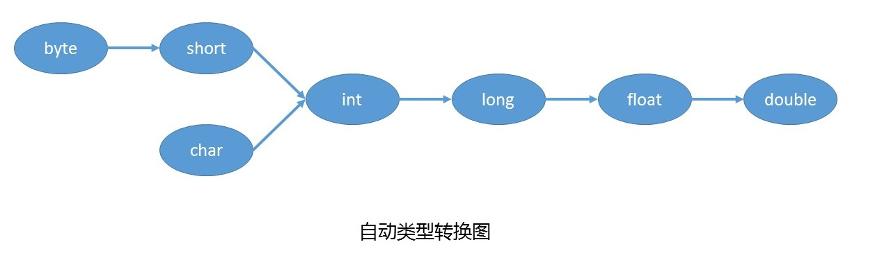
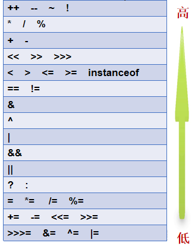

### 注释（annotation）

- 单行注释

```java
// 注释内容
```

- 多行注释

```Java
/**
	注释内容
*/
```

### 常见注释

- @author 标明开发该类模块的作者，多个作者之间使用`,`分割
- @version 标明该类模块的版本
- @see 参考转向，也就是相关主题
- @since 从哪个版本开始增加的
- @param 对方法中某参数的说明，如果没有参数就不能写
  - 格式要求：@param 形参名 形参类型  形参说明
- @return 对方法返回值的说明，如果方法的返回值类型是void就不能写
  - 格式要求：@return 返回值类型 返回值说明
- @throws/@exception 对方法可能抛出的异常进行说明，如果方法没有用throws显示抛出异常就不能写
  - 格式要求：@exception 异常类型 异常说明

**使用javadoc工具可以基于文档注释生成API文档**

```cmd
用法: javadoc [options] [packagenames] [sourcefiles] [@files]
例如：javadoc -author -d doc Comments.java
```

### 关键字（keyword）

**关键字是指在程序中，Java已经定义号的单词，具有特殊含义。**

关键字的特点：全部都是`小写字母`


### 标识符（identifier）

**凡事程序员自己命名的部分都可以称为标识符。**

- 标识符命令规则
  - Java的标识符只能使用26个英文字母大小写，0-9的数字，下划线_,美元符号$
  - 不能使用Java的关键字和特殊值
  - 数字不能开头
  - 不能包含空格
  - 严格区分大小写
- 标识符的命令规范
  - 类名、接口名等：每个单词的首字母大写；例如：BookName
  - 变量、方法名等：从第二个单词开始首字母大写，其余小写；例如：bookName
  - 包名等：每一个单词都小写，单词之间使用`.`分割；例如：java.lang
  - 常量名等：每一个单词都大写，单词之间使用下划线`_`分割；例如：MAX_VALUE

### 数据类型（data type）

#### Java的数据类型分为两大类

- 基本数据类型：包括`整数` `浮点数` `字符` `布尔`
  - 整型
    - 字节类型：byte
    - 短整型：short
    - 整型：int
    - 长整型：long
  - 浮点型
    - 单精度浮点型：float
    - 双精度浮点型：double
  - 字符型
    - 字符型：char
    - 布尔型：boolean
- 引用数据类型：包括`数组` `类` `接口 ` `枚举` `注解`
  - 类：class
  - 接口：interface
  - 枚举：enum
  - 注解：@interface
  - 数组：[ ]

**Java的基本数据类型的存储范围**

<table>
	<tr>
		<th>数据类型</th>
		<th>关键字</th>
		<th>内存占用(字节)</th>
		<th>取值范围</th>
	</tr>
	<tr>
		<td rowspan="4">整数</td>
		<td> byte</td>
		<td> 1 </td>
		<td> -2的7次方到2的7次方-1(-128~127)</td>
	</tr>
	<tr>
		<td>short</td>
		<td> 2 </td>
		<td> -2的15次方到2的15次方-1( -32768~32767 ) </td>
	</tr>	
	<tr>
		<td>int(默认)</td>
		<td> 4 </td>
		<td> -2的31次方到2的31次方-1 ( -2147483648~2147483647 ) </td>
	</tr>	
	<tr>
		<td> long </td>
		<td> 8 </td>
		<td> -2的63次方到2的63次方-1 ( -92233720368547 75808~9223372036854775807 )</td>
	</tr>
	<tr>
		<td rowspan="2">
			浮点数
		</td>
		<td>float</td>
		<td> 4 </td>
		<td>整数: 0.0 正数: 1.401298E-45到3.402823E38</td>
	</tr>	
	<tr>
		<td>double(默认)</td>
		<td> 8 </td>
		<td>负数: -1.797693E308到-4.940656E-324 整数: 0.0</td>
	</tr>
	<tr>
		<td>
			字符
		</td>
		<td>char</td>
		<td> 2 </td>
		<td> 0-65535 </td>
	</tr>
	<tr>
		<td>布尔</td>
		<td>boolean</td>
		<td>1</td>
		<td>true,false</td>
	</tr>
</table>

float：单精度浮点型，占内存：4个字节，精度：科学计数法小数点后6-7位

double：双精度浮点型，占内存：8个字节，精度：科学计数法小数点后15-16位

### 常量值（constant）

**常量值指在程序执行的过程中，其值不可以发生改变**

- 常量值类型

| 类型         | 举例           |
| ------------ | -------------- |
| 整数常量     | 1，-1，2141211 |
| 浮点常量     | 12.21F, 12.22  |
| 字符常量     | 'h','1','男'   |
| 布尔常量     | true，false    |
| 字符串常量值 | "'HelloWorld"  |

- 整数常量值，超过int范围的必须家`L` 或`l`（小写L）
- 小数常量值，无论多少，不加F，就是double类型。表示float类型，必须家`F`或`f`
- char常量值，必须使用单引号
- Sting字符串常量值，必须使用双引号

```java
public class com.canvs.basic.syntax.ConstantDemo {
    public static void main(String[] args) {
        System.out.println(12);
        System.out.println(-22);
        System.out.println("Hello world");
        System.out.println(12.34F);
        System.out.println(true);
        System.out.println(false);
        System.out.println('a');
    }
}
```

### 变量（variable）

**变量：在程序执行的过程中，其值可以发生改变的量**

变量的作用：用来存储数据，代表内存的一块存储区域，这块内存中的值是可以改变的。

#### 变量的声明 

- 数据类型 变量名

```java
int age;
double weight;
char gender;
boolean marry;
String name;
int a,b,c;
```

> 变量的数据类型可以是基本数据类型，也可以是引用数据类型

#### 变量的赋值

- 变量名 = 值

```java
 int age = 23;
 double weight = 19.2;
 char gender = '男';
 boolean marry = true;
 String name = "Canvs";
```

#### 变量的三要素

- 数据类型
  - 变量的数据类型决定了在内存中开辟多大空间
  - 变量的数据类型决定了该变量可以存什么值
- 变量名：
  - 见名知意
- 值
  - 基本数据类型的变量：存储数据值
  - 引用数据类型的变量：存储地址值，即对象的首地址。例如：String类型的变量存储的是字符串对象的首地址

#### 最终变量/常量（final）

最终变量习惯也称为常量，因为它是通过在声明变量的数据类型前面加final的方式实现的，所以叫最终变量。加final修饰后，这个变量的值就不能修改了，一开始赋值多少就是多少，所以此时的变量通常称为常量名。常量名通常所有字母都大写，每一个单词之间使用下划线分割，从命名上和变量名区分开来。

```java
public class com.canvs.basic.syntax.FinalVariableDemo {
    public static void main(String [] args){
        final int FULL_MARK = 100;
        System.out.println("满分：" + FULL_MARK);
        int passMark = FULL_MARK - 40;
        System.out.println("及格：" + passMark);
    }
}
```

### 基本数据类型转换（Conversion）

在Java程序中，不同的基本数据类型的值经常需要进行互相转换。Java语言所提供的**七种数据类型**之间可以相互转换，基本数据类型转换有两种方式：自动类型转换和强制类型转换。boolean类型不参与。

#### 自动类型转换（隐式类型转换）

- 将**取值范围小的类型**自动提升为**取值范围大的类型**



```java 
int i = 'A';
double d = 10;
byte b = 127;
long num = 1234567;
long bigNum = 12345678912L;
int a = 1;
int c = 2;
//自动升级为double
double sum = a+c;
char c1 = 'A';
char c2 = '2';
```

#### 强制类型转换（显示类型转换）

- 将**取值范围大的类型**强制转换成**取值小的类型**

- 数据类型 变量名 = (数据类型) 被强制转换数据值;

```java
int t = (int)3.14;  //强制转换，损失精度
System.out.println(t);
int y = 200;
byte sb =  (byte) y;    //溢出
System.out.println(sb);
int t1 = 10;
int t2 = 3;
double tSum = (double)t1/t2;
System.out.println(tSum);
```

#### 基本数据类型与字符串数据类型的转换

- 任意数据类型的数据与String类型进行`+`运算时，结果一定是String类型

```java
System.out.println("及格：" + 1 + 3);
```

### 运算符（Operator）

运算符的分类：

- 按照功能分类：算数运算符、赋值运算符、比较运算符、逻辑运算、条件运算、Lambda运算符

|        分类         |                        运算符                        |
| :-----------------: | :--------------------------------------------------: |
|  算术运算符（7个）  |                +、-、*、/、%、++、--                 |
| 赋值运算符（12个）  | =、+=、-=、*=、/=、%=、>>=、<<=、>>>=、&=、\|=、^=等 |
|  关系运算符（6个）  |                 >、>=、<、<=、==、!=                 |
|  逻辑运算符（6个）  |                &、\|、^、!、&&、\|\|                 |
|  条件运算符（2个）  |               (条件表达式)?结果1:结果2               |
|   位运算符（7个）   |               &、\|、^、~、<<、>>、>>>               |
| Lambda运算符（1个） |                          ->                          |

* 按照操作数个数分：一元运算符（单目运算符）、二元运算符（双目运算符）、三元运算符（三目运算符）

|           分类            |                  运算符                  |
| :-----------------------: | :--------------------------------------: |
| 一元运算符（单目运算符）  |    正号（+）、负号（-）、++、--、!、~    |
| 二元运算符（双目运算符）  | 除了一元和三元运算符剩下的都是二元运算符 |
| 三元运算符 （三目运算符） |         (条件表达式)?结果1:结果2         |

### 算术运算符

|    算术运算符    |            符号解释             |
| :--------------: | :-----------------------------: |
|       `+`        | 加法运算，字符串连接运算，正号  |
|       `-`        |         减法运算，负号          |
|       `*`        |            乘法运算             |
|       `/`        | 除法运算，整数/整数结果还是整数 |
|       `%`        | 求余运算，余数的符号只看被除数  |
| `++` 、  `-` `-` |          自增自减运算           |

```java
public class com.canvs.basic.syntax.OperatorDemo {
    public static void main(String [] args){
        int a = 3;
        int b = 4;
        System.out.println(a + b);
        System.out.println(b / a);
        System.out.println(a - b);
        System.out.println(b % a);
        System.out.println(a * b);
        System.out.println(++ a);
        System.out.println(-- b);
    }
}
```

#### 自加自减运算

`++`运算，变量自己的值加1。反之，`-` `-` 运算，变量自己的值减少1。

- a ++：先使用，后自加
- ++ a：先自加，后使用

### 关系运算符/比较运算符

| 关系运算符 |                           符号解释                           |
| :--------: | :----------------------------------------------------------: |
|    `<`     |  比较符号左边的数据是否小于右边的数据，如果小于结果是true。  |
|    `>`     |  比较符号左边的数据是否大于右边的数据，如果大于结果是true。  |
|    `<=`    | 比较符号左边的数据是否小于或者等于右边的数据，如果大于结果是false。 |
|    `>=`    | 比较符号左边的数据是否大于或者等于右边的数据，如果小于结果是false。 |
|    `==`    |          比较符号两边数据是否相等，相等结果是true。          |
|   `！=`    |     不等于符号 ，如果符号两边的数据不相等，结果是true。      |

- 比较运算符，是两个整数之间进行比较的运算，运算结果一定是boolean值true或者false
- 其中>,<,>=,<=,不支持boolean，String类型， ==和!=支持boolean和String

```java
public class com.canvs.basic.syntax.OperatorDemo2 {
    public static void main(String [] args){
        int a = 3;
        int b = 4;
        System.out.println(a > b);
        System.out.println(a == b);
        System.out.println(a != b);
        System.out.println(a >= b);
    }
}
```

### 逻辑运算符

- 逻辑运算符，是用来连接两个布尔类型值的运算符，运算结果也是boolean值

| 逻辑运算符 |   符号解释   |               符号特点               |
| :--------: | :----------: | :----------------------------------: |
|    `&`     |    与，且    |          有`false`则`false`          |
|     \|     |      或      |           有`true`则`true`           |
|    `^`     |     异或     |     相同为`false`，不同为`true`      |
|    `!`     |      非      | 非`false`则`true`，非`true`则`false` |
|    `&&`    | 双与，短路与 |      左边为false，则右边就不看       |
|    \|\|    | 双或，短路或 |       左边为true，则右边就不看       |

```java
public class com.canvs.basic.syntax.OperatorDemo3 {
    public static void main(String [] args){
        int a = 3;
        int b = 4;
        System.out.println(a>1 & a<5);  //true
        System.out.println(a>b | b>a);  //true
        System.out.println(a>2 ^ b>a);  //false
        System.out.println(!(a<5));     //false
        System.out.println(a<4 && b>a); //true
        System.out.println(a>5 || b>a); //true
    }
}
```

### 条件运算符

- 条件运算符格式：条件表达式？ 结果1: 结果2
- 条件运算符计算方式：
  - 条件判断的结果是true，条件运算符整体结果为结果1，赋值给变量。
  - 条件判断的结果是false，条件运算符整体结果为结果2，赋值给变量

```java 
public class com.canvs.basic.syntax.OperatorDemo4 {
    public static void main(String[] args) {
        int i = (1==2 ? 100 : 200);
        System.out.println(i);  //200
    }
}
```

### 位运算符

| 位运算符 |                    符号解释                    |
| :------: | :--------------------------------------------: |
|   `&`    |        按位与，当两位相同时为1时才返回1        |
|    \|    |         按位或，只要有一位为1即可返回1         |
|   `~`    | 按位非，将操作数的每个位（包括符号位）全部取反 |
|   `^`    |    按位异或。当两位相同时返回0，不同时返回1    |
|   `<<`   |                   左移运算符                   |
|   `>>`   |                   右移运算符                   |
|  `>>>`   |                无符号右移运算符                |

- 位运算符的运算过程是基于补码运算，但是看结果，我们得换成原码，在换成十进制看结果
- 从二进制到十进制都是基于原码
- 正数的原码反码补码都一样，负数原码反码补码不一样
- Byte,short,char在计算时按照int类型处理

### 赋值运算符

| 运算符 |                           符号解释                           |
| :----: | :----------------------------------------------------------: |
|   =    |      将右边的常量值/变量值/表达式的值，赋值给左边的变量      |
|   +=   | 将左边变量的值和右边的常量值/变量值/表达式的值进行相加，最后将结果赋值给左边的变量 |
|   -=   | 将左边变量的值和右边的常量值/变量值/表达式的值进行相减，最后将结果赋值给左边的变量 |
|   *=   | 将左边变量的值和右边的常量值/变量值/表达式的值进行相乘，最后将结果赋值给左边的变量 |
|   /=   | 将左边变量的值和右边的常量值/变量值/表达式的值进行相除，最后将结果赋值给左边的变量 |
|   %=   | 将左边变量的值和右边的常量值/变量值/表达式的值进行相模，最后将结果赋值给左边的变量 |
|  <<=   | 将左边变量的值左移右边常量/变量值/表达式的值的相应位，最后将结果赋值给左边的变量 |
|  >>=   | 将左边变量的值右移右边常量/变量值/表达式的值的相应位，最后将结果赋值给左边的变量 |
|  >>>=  | 将左边变量的值无符号右移右边常量/变量值/表达式的值的相应位，最后将结果赋值给左边的变量 |
|   &=   | 将左边变量的值和右边的常量值/变量值/表达式的值进行按位与，最后将结果赋值给左边的变量 |
|  \|=   | 将左边变量的值和右边的常量值/变量值/表达式的值进行按位或，最后将结果赋值给左边的变量 |
|   ^=   | 将左边变量的值和右边的常量值/变量值/表达式的值进行按位异或，最后将结果赋值给左边的变量 |

```java
public class com.canvs.basic.syntax.OperatorDemo5 {
    public static void main(String[] args) {
        int a = 3;
        int b = 4;
        int c = a + b;
        b += a;
        System.out.println(b);
        b -= a;
        System.out.println(b);
        int m = 1;
        m <<= 2;
        System.out.println(m);
    }
}
```

### 运算符优先级


**口诀：**

单目运算排第一；

乘除余二加减三；

移位四，关系五；

等和不等排第六；

位与、异或和位或；

短路与和短路或；

依次从七到十一；

条件排在第十二；

赋值一定是最后；
