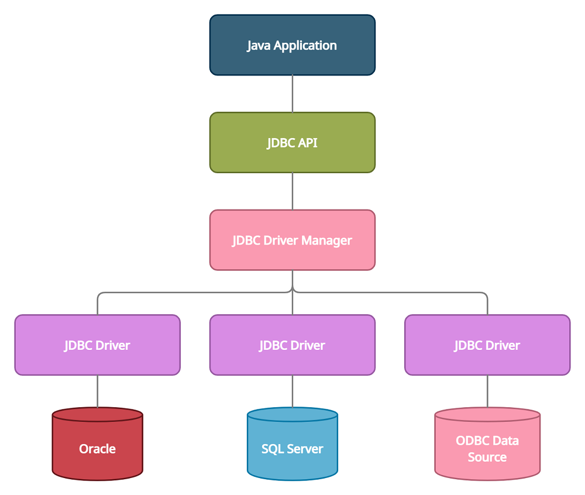

### JDBC概述

JDBC：Java Database Connectivity，它是代表一组独立于任何数据库管理系统（DBMS）的API，声明在java.sql与javax.sql包中，是SUN(现在Oracle)提供给的一组接口规范。由各个数据库厂商来提供实现类，这些实现类的集合构成了数据库驱动jar。



即JDBC技术包含两个部分：

- java.sql包和javax.sql包中的API

> 因为为了项目代码的可移植性，可维护性，SUN公司从最初就制定了Java程序连接各种数据库的统一接口规范。这样的话，不管是连接哪一种DBMS软件，Java代码可以保持一致性

- 各个数据库厂商提供的jar

> 因为各个数据库厂商的DBMS软件各有不同，那么内部如何通过sql实现增、删、改、查等管理数据库，只有这个数据厂商自己更清楚，因此把接口规范的实现交给各个数据厂商自己实现

#### Java代码连接MySQL数据库

- 1.模块中添加mysql依赖驱动相关库

- 2.在内存中加载驱动类(可选)

  - 较早版本：org.gjt.mm.mysql.Driver
  - 5.0版本：com.mysql.jdbc.Driver
  - 8.0版本：com.mysql.cj.jdbc.Driver

  > 新版本的mysql驱动jar可以省略，旧版mysql驱动必须加一这步骤。因为新版mysql驱动jar包下有一个META-INF/services/java.sql.Driver文件里面有填写mysql驱动类的全名称，DriverManager会自动读取这个文件，并加载对应的驱动类后期使用数据库连接池，或者MyBatis等框架时，在配置文件中加这个驱动类的配置即可

- 3.连接数据库：通过DriverManager工具类的静态方法获取数据库连接Connection对象

  - mysql服务器ip地址
  - 端口号
  - 用户名
  - 密码

  > MySQL8使用时，url需要加参数：serverTimezone=UTC，否则会报错

- 4.操作数据库

  - 通过Connection对象获取Statement或PreparedStatement对象
  - 通过Statement或PreparedStatement对象执行sql
    - 执行增、删、改：int executeUpdate()
    - 执行查询：ResultSet executeQuery()
    - 执行DDL语句：boolean execute()：可以用来执行DDL语句
  - 如果服务器有查询结果返回，需要用ResultSet接收
    - 遍历结果集的方法：
      - boolean next()：判断是否还有下一行
      - getString(字段名或序号)
      - getInt(字段名或序号)
      - getObject(字段名或序号)

- 4.断开连接：close方法

```java
    @Test
    public void test01() throws ClassNotFoundException, SQLException {
        Class<?> clazz = Class.forName("com.mysql.cj.jdbc.Driver");
        Connection connection = DriverManager.getConnection(url, "root", "Lbwnb123");
        System.out.println(connection);
        connection.close();
    }
```

**通过读取配置文件创建连接**

```java
   @Test
    public void test02() throws Exception{
        Properties p = new Properties();
        p.load(new FileInputStream("jdbc.properties"));
        String className = p.getProperty("className");
        String url = p.getProperty("url");
        String username = p.getProperty("username");
        String password = p.getProperty("password");
        Class<?> clazz = Class.forName(p.getProperty("className"));
        Connection conn = DriverManager.getConnection(url, username, password);
        String sql = "SELECT * FROM emps;";
        PreparedStatement pst = conn.prepareStatement(sql);
        ResultSet resultSet = pst.executeQuery();
        while(resultSet.next()){
            for (int i = 1; i <= 5 ; i++) {
                System.out.print(resultSet.getObject(i)+"\t");
            }
            System.out.println();
        }
        pst.close();
        conn.close();
    }
```

```java
className=com.mysql.cj.jdbc.Driver
url=jdbc:mysql://bj-cynosdbmysql-grp-an5acmhk.sql.tencentcdb.com:28067/demo?serverTimezone=UTC
username=root
password=Lbwnb123
```

#### 实现增删改查

```java
public class JdbcTest {
    String url = "127.0.0.1:3306/demo?serverTimezone=UTC";
    @Test
    public void insert() throws Exception {
        //把驱动类加载到内存中
        Class<?> clazz = Class.forName("com.mysql.cj.jdbc.Driver");
        //获取数据库连接对象
        Connection connection = DriverManager.getConnection(url, "root", "Lbwnb123");
        String sql = "INSERT INTO user(uid,user_name,password) VALUES(1006,'Rose','123456')";
        //获取PreparedStatement IO流 网络编程的socket.getOuputStream()发送数据用的
        PreparedStatement statement = connection.prepareStatement(sql);
        //返回sql影响的记录数
        int len = statement.executeUpdate();
        System.out.println(len > 0 ? "插入成功" : "插入失败");
        statement.close();
        connection.close();
    }

    @Test
    public void update() throws Exception {
        Class<?> clazz = Class.forName("com.mysql.cj.jdbc.Driver");
        Connection conn = DriverManager.getConnection(url, "root", "Lbwnb123");
        String sql = "UPDATE user SET password = '123456' WHERE uid = 1001";
        PreparedStatement pst = conn.prepareStatement(sql);
        int len = pst.executeUpdate();
        System.out.println(len > 0?"修改成功！":"修改失败！");
        pst.close();
        conn.close();
    }
    @Test
    public void delete() throws Exception{
        Class<?> clazz = Class.forName("com.mysql.cj.jdbc.Driver");
        Connection conn = DriverManager.getConnection(url, "root", "Lbwnb123");
        String sql = "DELETE from user WHERE uid = 1002";
        PreparedStatement pst = conn.prepareStatement(sql);
        int len = pst.executeUpdate();
        System.out.println(len>0?"删除成功":"删除失败");
        pst.close();
        conn.close();
    }
    @Test
    public void select() throws Exception{
        Class<?> clazz = Class.forName("com.mysql.cj.jdbc.Driver");
        Connection conn = DriverManager.getConnection(url, "root", "Lbwnb123");
        String sql = "SELECT uid,user_name,password FROM user";
        PreparedStatement pst = conn.prepareStatement(sql);
        ResultSet resultSet = pst.executeQuery();
        while(resultSet.next()){
            System.out.print(resultSet.getInt("uid")+"\t");
            System.out.print(resultSet.getString("user_name")+"\t");
            System.out.print(resultSet.getString("password")+"\t");
            System.out.println();
        }
        resultSet.close();
        pst.close();
        conn.close();
    }
}
```

#### 避免sql拼接问题

- PreparedStatement接口是Statement接口的子接口
- Statement接口是不支持？通配符形式的sql，只能拼接sql

```java
	public void test() throws Exception {
        Class<?> clazz = Class.forName("com.mysql.cj.jdbc.Driver");
        Connection conn = DriverManager.getConnection(url, "root", "Lbwnb123");
        int eid = 1002;
        String ename = "Canvs";
        String city = "HONGKONG";
        char gender = '男';
        String email = "canvs@gmail.com";
        String sql = "INSERT INTO emps(eid,ename,city,gender,email)VALUES(" +
                eid + "," +
                "'" + ename +  "'" +"," +
                "'" + city +  "'" +"," +
                "'" + gender + "'" + "," +
                "'" + email + "'" + ")";
        System.out.println(sql);
        PreparedStatement pst = conn.prepareStatement(sql);
        int len = pst.executeUpdate();
        System.out.println(len > 0 ? "插入成功" : "插入失败");
        pst.close();
        conn.close();
    }
```

```java
	public void test02() throws Exception{
        Class<?> clazz = Class.forName("com.mysql.cj.jdbc.Driver");
        Connection conn = DriverManager.getConnection(url, "root", "Lbwnb123");
        int eid = 1003;
        String ename = "Lisa";
        String city = "NewYork";
        char gender = '女';
        String email = "lisa@gmail.com";
        String sql = "INSERT INTO emps(eid,ename,city,gender,email) 					VALUES(?,?,?,?,?)";
        PreparedStatement pst = conn.prepareStatement(sql);
        pst.setObject(1,eid);
        pst.setObject(2,ename);
        pst.setObject(3,city);
        pst.setString(4,String.valueOf(gender));
        pst.setObject(5,email);
        int len = pst.executeUpdate();
        System.out.println(len > 0 ? "添加成功" : "添加失败");
        pst.close();
        conn.close();
    }
```

#### 避免sql注入问题

```java
public class SQLInject {
    String url = "jdbc:mysql://bj-cynosdbmysql-grp-an5acmhk.sql.tencentcdb.com:28067/canvs?serverTimezone=UTC";
    @Test
    public void test01() throws Exception {
        Class<?> clazz = Class.forName("com.mysql.cj.jdbc.Driver");
        Connection conn = DriverManager.getConnection(url, "root", "Lbwnb123");
        String id = 1002 + " OR 1 = 1";
        String sql = "SELECT * FROM employees WHERE employee_id = " + id;
        PreparedStatement pst = conn.prepareStatement(sql);
        ResultSet resultSet = pst.executeQuery();
        while (resultSet.next()) {
            for (int i = 1; i <= 11; i++) {
                System.out.print(resultSet.getObject(i) + "\t\t");
            }
            System.out.println();
        }
        resultSet.close();
        pst.close();
        conn.close();
    }
    @Test
    public void test02() throws Exception{
        Class<?> clazz = Class.forName("com.mysql.cj.jdbc.Driver");
        Connection conn = DriverManager.getConnection(url, "root", "Lbwnb123");
        String id = 1002 + " OR 1 = 1";
        String sql = "SELECT * FROM employees WHERE employee_id = ?";
        PreparedStatement pst = conn.prepareStatement(sql);
        //会把id=1002 + " OR 1 = 1"整体赋值给id
        pst.setObject(1,id);
        ResultSet resultSet = pst.executeQuery();
        while(resultSet.next()){
            for (int i = 1; i <= 11; i++) {
                System.out.print(resultSet.getObject(i)+"\t");
            }
        }
        resultSet.close();
        pst.close();
        conn.close();
    }
}
```

#### 使用字节IO流读取图片等给blob等二进制类型数据赋值

```java
public class SQLBlob {
    public static void main(String[] args) throws Exception{
        String url = "jdbc:mysql://bj-cynosdbmysql-grp-an5acmhk.sql.tencentcdb.com:28067/demo?serverTimezone=UTC";
        int id = 1001;
        String username = "Canvs";
        String password = "123456";
        String path = "photo.jpg";
        Class<?> clazz = Class.forName("com.mysql.cj.jdbc.Driver");
        Connection conn = DriverManager.getConnection(url, "root", "Lbwnb123");
        String sql = "INSERT INTO t_user(id,username,password,photo) VALUES(?,?,?,?)";
        PreparedStatement pst = conn.prepareStatement(sql);
        pst.setObject(1, id);
        pst.setObject(2, username);
        pst.setObject(3, password);
        //因为path是一个路径，需要转换为字节io流表示
        pst.setObject(4, new FileInputStream(path));
        int len = pst.executeUpdate();
        System.out.println(len > 0 ? "添加成功" : "添加失败");
        pst.close();
        conn.close();
    }
}
```

当存储的图片特别大时：

- com.mysql.cj.jdbc.exceptions.PacketTooBigException: Packet for query is too large (6,638,795 > 4,194,304).You can change this value on the server by setting the 'max_allowed_packet' variable.
  - 解决方案：修改my.ini配置文件max_allowed_packet变量的值，先停止服务，然后修改my.ini文件，再重启服务
- com.mysql.cj.jdbc.exceptions.MysqlDataTruncation: Data truncation: Data too long for column 'photo' at row 1
  - 问题：blob类型的数据，存不下这么大的图片
  - 解决方案：修改字段的数据类型
  - alter table t_user modify photo mediumblob;

#### 获取自增长键值

MySQL中有很多表都是有自增长字段，特别是id；当我们添加了一个员工信息后，需要立刻返回该员工的自增长的id

- 在用Connection数据库连接对象获取PreparedStatement对象时，要加一个参数PreparedStatement pst = conn.prepareStatement(sql, Statement.RETURN_GENERATED_KEYS)；这里RETURN_GENERATED_KEYS表示执行sql后，返回自增长键值
- 执行完成之后，需要从PreparedStatement对象中获取自增长键值ResultSet rs = pst.getGeneratedKeys();

```Java
public class SQLGenerateKey {
    public static void main(String[] args) throws Exception{
        String url = "jdbc:mysql://bj-cynosdbmysql-grp-an5acmhk.sql.tencentcdb.com:28067/demo?serverTimezone=UTC";
        Class<?> clazz = Class.forName("com.mysql.cj.jdbc.Driver");
        Connection conn = DriverManager.getConnection(url, "root", "Lbwnb123");
        String sql = "INSERT INTO user(user_name,password) VALUES('canvs','123456')";
        PreparedStatement pst = conn.prepareStatement(sql,PreparedStatement.RETURN_GENERATED_KEYS);
        int len = pst.executeUpdate();
        System.out.println(len>0?"添加成功":"添加失败");
        ResultSet generatedKeys = pst.getGeneratedKeys();
        while(generatedKeys.next()){
            Object object = generatedKeys.getObject(1);
            System.out.println(object); //1007
        }
        generatedKeys.close();
        pst.close();
        conn.close();
    }
}
```

#### 批处理

给部门表批量添加1000条部门测试数据

- MySQL服务器端，默认批处理功能没有开启。需要通过参数告知MySQL服务器，开启批处理功能。在url后面再加一个参数 rewriteBatchedStatements=true
  - url格式：jdbc:mysql://localhost:3306/demo？serverTimezone=UTC&rewriteBatchedStatements=true
- PreparedStatement对象调用
  - addBatch()
  - executeBatch()

```java
public class SQLBatch {
    @Test
    public void test01() throws Exception{
        long start = System.currentTimeMillis();
        String url = "jdbc:mysql://bj-cynosdbmysql-grp-an5acmhk.sql.tencentcdb.com:28067/demo?serverTimezone=UTC";
        Class<?> clazz = Class.forName("com.mysql.cj.jdbc.Driver");
        Connection conn = DriverManager.getConnection(url, "root", "Lbwnb123");
        String sql = "INSERT INTO dept(dname,`desc`) VALUES(?,?)";
        PreparedStatement pst = conn.prepareStatement(sql);
        for (int i = 1; i <= 1000; i++) {
            pst.setObject(1,"部门 "+i);
            pst.setObject(2,"部门说明 "+i);
            int len = pst.executeUpdate();  //意味着需要IO流与文件通信1000次
            System.out.println("第"+i+"条 "+(len > 0 ? "添加成功" : "添加失败"));
        }
        pst.close();
        conn.close();
        long end = System.currentTimeMillis();
        System.out.println("一共耗时："+(end-start)+"ms");
    }
    @Test
    public void test02() throws Exception{
        long start = System.currentTimeMillis();
        String url = "jdbc:mysql://bj-cynosdbmysql-grp-an5acmhk.sql.tencentcdb.com:28067/demo?serverTimezone=UTC&rewriteBatchedStatements=true";
        Class<?> clazz = Class.forName("com.mysql.cj.jdbc.Driver");
        Connection conn = DriverManager.getConnection(url, "root", "Lbwnb123");
        String sql = "INSERT INTO dept(dname,`desc`) VALUES(?,?)";
        PreparedStatement pst = conn.prepareStatement(sql);
        for (int i = 1; i <=1000 ; i++) {
            pst.setObject(1,"部门 "+i);
            pst.setObject(2,"部门说明 "+i);
            //不需要设置一次执行一次；设置完成，会重新编译sql，生成一条完整的sql
            pst.addBatch();
        }
        //一次性执行完
        pst.executeBatch();
        pst.close();
        conn.close();
        long end = System.currentTimeMillis();
        System.out.println("一共耗时："+(end-start)+"ms");
    }
}
```

#### JDBCUtils

```java
public class JDBCUtils {
    public static Connection getConnection() throws Exception {
        InputStream is = ClassLoader.getSystemClassLoader().getResourceAsStream("jdbc.properties");
        Properties ps = new Properties();
        ps.load(is);
        String className = ps.getProperty("className");
        String username = ps.getProperty("username");
        String url = ps.getProperty("url");
        String password = ps.getProperty("password");
        Class<?> clazz = Class.forName(className);
        return DriverManager.getConnection(url, username, password);
    }
    public static void closeResource(Connection conn, Statement ps) {
        try {
            if (conn != null) conn.close();
        } catch (SQLException e) {
            e.printStackTrace();
        }
        try {
            if (ps != null) ps.close();
        } catch (SQLException e) {
            e.printStackTrace();
        }
    }
    public static void closeResource(Connection conn, Statement ps, ResultSet rs) {
        try {
            if (conn != null) conn.close();
        } catch (SQLException e) {
            e.printStackTrace();
        }
        try {
            if (ps != null) ps.close();
        } catch (SQLException e) {
            e.printStackTrace();
        }
        try {
            if (rs != null) rs.close();
        } catch (SQLException e) {
            e.printStackTrace();
        }
    }
}
```

#### 事务处理

如果多条SQL要组成一个事务，要么一起成功，要么一起失败

例如：订单

- 修改商品表的商品库存和销量
- 订单表新建订单数据
- 订单明细表新建订单明细记录（多条）

这些SQL要么一起成功，要么都还原到最初

**jdbc处理事务**

- mysql默认是自动提交事务，每执行一条语句成功后，自动提交。需要开启手动提交模式
  - Connection连接对象.setAutoCommit(false); //取消自动提交模式，开始手动提交模式
- sql执行成功，需要提交事务
  - Connection连接对象.commit()
- sql执行失败，回滚事务
  - Connection连接对象.rollback()

```java
public class SQLTransaction {
    public static void main(String[] args) throws ClassNotFoundException, SQLException {
        String url = "jdbc:mysql://bj-cynosdbmysql-grp-an5acmhk.sql.tencentcdb.com:28067/demo?serverTimezone=UTC";
        Class<?> clazz = Class.forName("com.mysql.cj.jdbc.Driver");
        Connection conn = DriverManager.getConnection(url, "root", "Lbwnb123");
        String sql1 = "UPDATE dept SET dname = 'IT部' WHERE did = 2002";
        String sql2 = "UPDATE dept SET dname = '运维部' WHERE did = 2003";
        conn.setAutoCommit(false);
        try (
                PreparedStatement pst1 = conn.prepareStatement(sql1);
                PreparedStatement pst2 = conn.prepareStatement(sql2);
        ) {
            pst1.executeUpdate();
            pst2.executeUpdate();
            System.out.println("update 2 row");
            conn.commit();
        }catch (SQLException e){
            e.printStackTrace();
            System.out.println("update error");
            conn.rollback();    //回滚事务
        }finally {
            conn.close();
        }
    }
    @Test
    public void test() throws Exception{
        String url = "jdbc:mysql://bj-cynosdbmysql-grp-an5acmhk.sql.tencentcdb.com:28067/demo?serverTimezone=UTC";
        Class<?> clazz = Class.forName("com.mysql.cj.jdbc.Driver");
        Connection conn = DriverManager.getConnection(url, "root", "Lbwnb123");
        String sql1 = "UPDATE dept SET dname = 'IT部' WHERE did = 2002";
        String sql2 = "UPDATE dept SET dname = '运维部' WHERE eid = 5000";
        conn.setAutoCommit(false);
        try (
                PreparedStatement pst1 = conn.prepareStatement(sql1);
                PreparedStatement pst2 = conn.prepareStatement(sql2);
        ) {
            pst1.executeUpdate();
            pst2.executeUpdate();
            System.out.println("update 2 row");
            conn.commit();
        }catch (SQLException e){
            e.printStackTrace();
            System.out.println("update error");
            conn.rollback();    //回滚事务
        }finally {
            conn.close();
        }
    }
}
```

```java
public class TransactionTest {
    public void update(Connection conn, String sql, Object... args) {
        PreparedStatement pst = null;
        try {
            pst = conn.prepareStatement(sql);
            for (int i = 0; i < args.length; i++) {
                pst.setObject(i + 1, args[i]);
            }
            int len = pst.executeUpdate();
        } catch (SQLException e) {
            e.printStackTrace();
        } finally {
            JDBCUtils.closeResource(null, pst);
        }
    }
    @Test
    public void testUpdate() {
        Connection conn = null;
        try {
            conn = JDBCUtils.getConnection();
            conn.setAutoCommit(false);
            String sql = "UPDATE user SET salary = salary-100 WHERE id = ?";
            update(conn, sql, 1001);
            //模拟网络异常
//            System.out.println(2 / 0);
            String sql2 = "UPDATE user SET salary = salary+100 WHERE id =?";
            update(conn, sql2, 1002);
            conn.commit();
        } catch (Exception e) {
            e.printStackTrace();
            try {
                conn.rollback();
            } catch (SQLException ex) {
                ex.printStackTrace();
            }
        } finally {
            JDBCUtils.closeResource(conn, null);
        }
    }
}
```

### DAO及相关实现类

- DAO：Data Access Object访问数据信息的类和接口，包括了对数据的CRUD，而不包含任何业务相关的信息。也称BaseDAO
- 作用：为了实现功能的模块化，更有利于代码的维护和升级

#### BaseDAO

```java
public abstract class BaseDAO <T>{
    private Class<T> clazz = null;
    {
        Type superclass = this.getClass().getGenericSuperclass();
        ParameterizedType type = (ParameterizedType) superclass;
        Type[] arguments = type.getActualTypeArguments();
        clazz = (Class<T>) arguments[0];
    }
    public int update(Connection conn, String sql, Object...args){
        PreparedStatement ps = null;
        try {
            ps = conn.prepareStatement(sql);
            for (int i = 0; i < args.length; i++) {
                ps.setObject(i+1,args[i]);
            }
            int len = ps.executeUpdate();
            return len;
        } catch (SQLException e) {
            e.printStackTrace();
        } finally {
            JDBCUtils.closeResource(null,ps);
        }
        return 0;
    }
    // 通用的查询操作，用于返回数据表中的一条记录
    public T getInstance(Connection conn,String sql,Object...args){
        PreparedStatement ps = null;
        ResultSet rs = null;
        try {
            ps = conn.prepareStatement(sql);
            for (int i = 0; i < args.length; i++) {
                ps.setObject(i+1,args[i]);
            }
            rs = ps.executeQuery();
            //获取结果集元数据
            ResultSetMetaData rsmd = rs.getMetaData();
            //获取结果集中的列数
            int columnCount = rsmd.getColumnCount();
            if (rs.next()){
                T t = clazz.newInstance();
                //处理结果姐一行数据中的每一个列
                for (int i = 0; i < columnCount; i++) {
                    //获取列值
                    Object columnValue = rs.getObject(i + 1);
                    //获取每一个列的列名
                    String columnLabel = rsmd.getColumnLabel(i + 1);
                    //通过反射给t对象指定的columnName熟悉赋值为columValue
                    Field field = clazz.getDeclaredField(columnLabel);
                    field.setAccessible(true);
                    field.set(t,columnValue);
                }
                return t;
            }
        } catch (Exception e) {
          e.printStackTrace();
        } finally {
            JDBCUtils.closeResource(null,ps,rs);
        }
        return null;
    }
    //通用的查询操作，用于返回数据表中的多条记录构成的集合
    public List<T> getForList(Connection conn,String sql,Object...args){
        PreparedStatement ps = null;
        ResultSet rs = null;
        try {
            ps = conn.prepareStatement(sql);
            for (int i = 0; i < args.length; i++) {
                ps.setObject(i+1,args[i]);
            }
            rs = ps.executeQuery();
            //获取结果集元数据
            ResultSetMetaData rsmd = rs.getMetaData();
            //获取结果集中的列数
            int columnCount = rsmd.getColumnCount();
            ArrayList<T> list = new ArrayList<>();
            while (rs.next()){
                T t = clazz.newInstance();
                //处理结果姐一行数据中的每一个列
                for (int i = 0; i < columnCount; i++) {
                    //获取列值
                    Object columnValue = rs.getObject(i + 1);
                    //获取每一个列的列名
                    String columnLabel = rsmd.getColumnLabel(i + 1);
                    //通过反射给t对象指定的columnName熟悉赋值为columValue
                    Field field = clazz.getDeclaredField(columnLabel);
                    field.setAccessible(true);
                    field.set(t,columnValue);
                }
                list.add(t);
            }
            return list;
        } catch (Exception e) {
            e.printStackTrace();
        } finally {
            JDBCUtils.closeResource(null,ps,rs);
        }
        return null;
    }
    //用于查询特殊值的通用的方法
    public <E> E getValue(Connection conn,String sql,Object...args){
        PreparedStatement ps = null;
        ResultSet rs = null;
        try {
            ps = conn.prepareStatement(sql);
            for (int i = 0; i < args.length; i++) {
                ps.setObject(i+1,args[i]);
            }
            rs = ps.executeQuery();
            if (rs.next()){
                return (E) rs.getObject(1);
            }
        } catch (SQLException e) {
            e.printStackTrace();
        } finally {
            JDBCUtils.closeResource(null,ps,rs);
        }
        return null;
    }
```

#### Java bean

```java
public class Customer {
    private int id;
    private String name;
    private String email;
    private Date birth;
    public Customer() {
    }
    public int getId() {
        return id;
    }
    public void setId(int id) {
        this.id = id;
    }
    public String getName() {
        return name;
    }
    public void setName(String name) {
        this.name = name;
    }
    public String getEmail() {
        return email;
    }
    public void setEmail(String email) {
        this.email = email;
    }
    public Date getBirth() {
        return birth;
    }
    public void setBirth(Date birth) {
        this.birth = birth;
    }
    public Customer(int id, String name, String email, Date birth) {
        this.id = id;
        this.name = name;
        this.email = email;
        this.birth = birth;
    }
    @Override
    public String toString() {
        return "Customer [id=" + id + ", name=" + name + ", email=" + email + ", birth=" + birth + "]";
    }
}
```

#### CustomerDAO

```java
public interface CustomerDAO {
    void insert(Connection conn,Customer cust);
    void deleteById(Connection conn,int id);
    void update(Connection conn, Customer cust);
    Customer getCustomerById(Connection conn,int id);
    List<Customer> getAll(Connection conn);
    Long getCount(Connection conn);
    Date getMaxBirth(Connection conn);
}
```

#### CustomerDAOImpl

```java
public class CustomerDAOImpl extends BaseDAO<Customer> implements CustomerDAO {
    @Override
    public void insert(Connection conn, Customer cust) {
        String sql = "INSERT INTO customer(id,name,email,birth) VALUES (?,?,?,?)";
        update(conn, sql, cust.getId(), cust.getName(), cust.getEmail(), cust.getBirth());
    }
    @Override
    public void deleteById(Connection conn, int id) {
        String sql = "DELETE FROM customer WHERE id = ?";
        update(conn, sql, id);
    }
    @Override
    public void update(Connection conn, Customer cust) {
        String sql = "UPDATE customer SET name = ?,email=?,birth = ? WHERE id = ?";
        update(conn,sql,cust.getName(),cust.getEmail(),cust.getBirth(),cust.getId());
    }
    @Override
    public Customer getCustomerById(Connection conn, int id) {
        String sql = "SELECT * FROM customer WHERE id = ?";
        return getInstance(conn,sql,id);
    }
    @Override
    public List<Customer> getAll(Connection conn) {
        String sql = "SELECT * FROM customer";
        return getForList(conn,sql);
    }
    @Override
    public Long getCount(Connection conn) {
        String sql = "SELECT COUNT(*) FROM customer";
        return getValue(conn,sql);
    }
    @Override
    public Date getMaxBirth(Connection conn) {
        String sql = "SELECT MAX(birth) FROM customer";
        return getValue(conn,sql);
    }
}
```

#### CustomerDAOImplTest

```java
public class CustomerDAOImplTest {
    private CustomerDAOImpl dao = new CustomerDAOImpl();
    @Test
    public void insert() {
        Connection conn = null;
        try {
            conn = JDBCUtils.getConnection();
            Customer cust = new Customer(1005, "jack", "jack@qq.com", new Date(17639379373L));
            dao.insert(conn, cust);
        } catch (Exception e) {
            e.printStackTrace();
        } finally {
            JDBCUtils.closeResource(conn, null);
        }
    }
    @Test
    public void deleteById() {
        Connection conn = null;
        try {
            conn = JDBCUtils.getConnection();
            dao.deleteById(conn, 1003);
        } catch (Exception e) {
            e.printStackTrace();
        } finally {
            JDBCUtils.closeResource(conn, null);
        }
    }
    @Test
    public void update() {
        Connection conn = null;
        try {
            conn = JDBCUtils.getConnection();
            Customer cust = new Customer(1005, "jack2", "jack2@qq.com", new Date(163838737889L));
            dao.update(conn, cust);
        } catch (Exception e) {
            e.printStackTrace();
        } finally {
            JDBCUtils.closeResource(conn, null);
        }
    }
    @Test
    public void getCustomerById() {
        Connection conn = null;
        try {
            conn = JDBCUtils.getConnection();
            Customer cust = dao.getCustomerById(conn, 1002);
            System.out.println(cust);
        } catch (Exception e) {
            e.printStackTrace();
        } finally {
            JDBCUtils.closeResource(conn, null);
        }
    }
    @Test
    public void getAll() {
        Connection conn = null;
        try {
            conn = JDBCUtils.getConnection();
            List<Customer> all = dao.getAll(conn);
            all.forEach(System.out::println);
        } catch (Exception e) {
            e.printStackTrace();
        } finally {
            JDBCUtils.closeResource(conn,null);
        }
    }
    @Test
    public void getCount() {
        Connection conn = null;
        try {
            conn = JDBCUtils.getConnection();
            Long count = dao.getCount(conn);
            System.out.println(count);
        } catch (Exception e) {
            e.printStackTrace();
        } finally {
            JDBCUtils.closeResource(conn,null);
        }
    }
    @Test
    public void getMaxBirth() {
        Connection conn = null;
        try {
            conn = JDBCUtils.getConnection();
            java.util.Date maxBirth = dao.getMaxBirth(conn);
            System.out.println(maxBirth);
        } catch (Exception e) {
            e.printStackTrace();
        } finally {
            JDBCUtils.closeResource(conn,null);
        }
    }
}
```

### 数据库连接池

连接对象的缓冲区。复制申请，分配管理，释放连接的操作。

#### 为什么要使用数据库连接池

- 不使用数据库连接池，每次都通过DriverManager获取新连接，用完直接抛弃断开，连接的利用率太低，太浪费。
- 对于数据库服务器来说，压力太大了。数据库服务器和Java程序队连接数也无法控制，很容易导致数据库服务器崩溃

#### 连接池的好处

- 可以建立一个连接池，这个池中可以容纳一定数量的连接对象，一开始，我们可以先替用户先创建号一些连接对象，等用户要拿连接对象时，就直接从池中拿，不用新建了，这样也可以节约时间。然后用户用完后，放回去，别人可以接着使用。
- 可以提高连接的使用率。当池中的现有的连接都用完了，那么连接池可以向服务器申请新的连接放到池中。
- 知道池中的连接达到了最大连接数，就不能再申请新的连接了，如果没有拿到连接的用户只能等待。

#### 市面上的数据库连接池技术

- JDBC的数据库连接池使用`javax.sql.DataSource`来表示，DataSource只是一个接口（通常被称为数据源），该接口通常由服务器（Weblogic、WebSphere、Tomcat）提供实现，也有一些开源组件提供实现：
  - DBCP是Apache提供的数据库连接池，速度相对c3p0较快，但因自身存在BUG，Hibernate3已不再提供支持
  - C3P0是一个开源组织提供的一个数据库连接池，速度相对较慢，稳定性还可以
  - Proxool是sourceforge下的一个开源项目数据库连接池，有监控连接池状态的功能，稳定性较c3p0差一点
  - BoneCP是一个开源组织提供的数据库连接池，速度快
  - Druid是阿里提供的数据库连接池，据说是集DBCP、C3P0、Proxool优点与一身的数据库连接池

### 使用德鲁伊数据库连接池

#### 操作步骤

- 引入jar包
- 编写配置文件
  - src下创建druid.properties文件
- 创建数据库连接池对象
- 获取连接

#### druid.properties文件

```java
#key=value
driverClassName=com.mysql.cj.jdbc.Driver
url=jdbc:mysql://localhost:3306/demo?serverTimezone=UTC&rewriteBatchedStatements=true
username=root
password=123456
initialSize=5
maxActive=10
maxWait=1000
```

| 配置                          | **缺省** | **说明**                                                     |
| ----------------------------- | -------- | ------------------------------------------------------------ |
| name                          |          | 配置这个属性的意义在于，如果存在多个数据源，监控的时候可以通过名字来区分开来。 如果没有配置，将会生成一个名字，格式是：”DataSource-” + System.identityHashCode(this) |
| jdbcUrl                       |          | 连接数据库的url，不同数据库不一样。例如：mysql : jdbc:mysql://10.20.153.104:3306/druid2 oracle : jdbc:oracle:thin:@10.20.149.85:1521:ocnauto |
| username                      |          | 连接数据库的用户名                                           |
| password                      |          | 连接数据库的密码。如果你不希望密码直接写在配置文件中，可以使用ConfigFilter。详细看这里：<https://github.com/alibaba/druid/wiki/%E4%BD%BF%E7%94%A8ConfigFilter> |
| driverClassName               |          | 根据url自动识别 这一项可配可不配，如果不配置druid会根据url自动识别dbType，然后选择相应的driverClassName(建议配置下) |
| initialSize                   | 0        | 初始化时建立物理连接的个数。初始化发生在显示调用init方法，或者第一次getConnection时 |
| maxActive                     | 8        | 最大连接池数量                                               |
| maxIdle                       | 8        | 已经不再使用，配置了也没效果                                 |
| minIdle                       |          | 最小连接池数量                                               |
| maxWait                       |          | 获取连接时最大等待时间，单位毫秒。配置了maxWait之后，缺省启用公平锁，并发效率会有所下降，如果需要可以通过配置useUnfairLock属性为true使用非公平锁。 |
| poolPreparedStatements        | false    | 是否缓存preparedStatement，也就是PSCache。PSCache对支持游标的数据库性能提升巨大，比如说oracle。在mysql下建议关闭。 |
| maxOpenPreparedStatements     | -1       | 要启用PSCache，必须配置大于0，当大于0时，poolPreparedStatements自动触发修改为true。在Druid中，不会存在Oracle下PSCache占用内存过多的问题，可以把这个数值配置大一些，比如说100 |
| validationQuery               |          | 用来检测连接是否有效的sql，要求是一个查询语句。如果validationQuery为null，testOnBorrow、testOnReturn、testWhileIdle都不会其作用。 |
| testOnBorrow                  | true     | 申请连接时执行validationQuery检测连接是否有效，做了这个配置会降低性能。 |
| testOnReturn                  | false    | 归还连接时执行validationQuery检测连接是否有效，做了这个配置会降低性能 |
| testWhileIdle                 | false    | 建议配置为true，不影响性能，并且保证安全性。申请连接的时候检测，如果空闲时间大于timeBetweenEvictionRunsMillis，执行validationQuery检测连接是否有效。 |
| timeBetweenEvictionRunsMillis |          | 有两个含义： 1)Destroy线程会检测连接的间隔时间2)testWhileIdle的判断依据，详细看testWhileIdle属性的说明 |
| numTestsPerEvictionRun        |          | 不再使用，一个DruidDataSource只支持一个EvictionRun           |
| minEvictableIdleTimeMillis    |          |                                                              |
| connectionInitSqls            |          | 物理连接初始化的时候执行的sql                                |
| exceptionSorter               |          | 根据dbType自动识别 当数据库抛出一些不可恢复的异常时，抛弃连接 |
| filters                       |          | 属性类型是字符串，通过别名的方式配置扩展插件，常用的插件有： 监控统计用的filter:stat日志用的filter:log4j防御sql注入的filter:wall |
| proxyFilters                  |          | 类型是List，如果同时配置了filters和proxyFilters，是组合关系，并非替换关系 |

```java
public class DruidTest {
    public static void main(String[] args) throws Exception{
        Properties p = new Properties();
        p.load(DruidTest.class.getClassLoader().getResourceAsStream("druid.properties"));
        DataSource dataSource = DruidDataSourceFactory.createDataSource(p);
        Connection conn = dataSource.getConnection();
        System.out.println(conn);
        conn.close();
    }
    @Test
    public void test(){
        try {
            Connection conn = JDBCUtils.getConnection();
            System.out.println(conn);
        } catch (SQLException e) {
            e.printStackTrace();
        }
    }
}
```

```java
public class JDBCUtils {
    private static DataSource source;
    static {
        try {
            Properties pros = new Properties();
            InputStream is = ClassLoader.getSystemClassLoader().getSystemResourceAsStream("druid.properties");
            pros.load(is);
            source = DruidDataSourceFactory.createDataSource(pros);
        } catch (Exception e) {
            e.printStackTrace();
        }
    }
    public static Connection getConnection() throws SQLException {
        Connection conn = source.getConnection();
        return conn;
    }
}
```

### Apache-DBUtils

- commons-dbutils是Apache组织提供的一个开源JDBC工具类库，它是对JDBC的简单封装，并且使用dbutils能极大简化jdbc编码的工作量，同时也不会影响程序的性能

- API介绍

  - org.apache.commons.dbutils.QueryRunner

  - org.apache.commons.dbutils.ResultSetHandler
  - 工具类：org.apache.commons.dbutils.DbUtils   

#### 主要的API的使用

##### DBUtils

- DBUtils：提供如关闭连接、装载JDBC驱动程序等常规工作的工具类，里面的所有方法都是静态方法
  - **public static void close(…) throws java.sql.SQLException**：　DbUtils类提供了三个重载的关闭方法。这些方法检查所提供的参数是不是NULL，如果不是的话，它们就关闭Connection、Statement和ResultSet。
  - public static void closeQuietly(…): 这一类方法不仅能在Connection、Statement和ResultSet为NULL情况下避免关闭，还能隐藏一些在程序中抛出的SQLEeception。
  - public static void commitAndClose(Connection conn)throws SQLException： 用来提交连接的事务，然后关闭连接
  - public static void commitAndCloseQuietly(Connection conn)： 用来提交连接，然后关闭连接，并且在关闭连接时不抛出SQL异常。 
  - public static void rollback(Connection conn)throws SQLException：允许conn为null，因为方法内部做了判断
  - public static void rollbackAndClose(Connection conn)throws SQLException
  - rollbackAndCloseQuietly(Connection)
  - public static boolean loadDriver(java.lang.String driverClassName)：这一方装载并注册JDBC驱动程序，如果成功就返回true。使用该方法，你不需要捕捉这个异常ClassNotFoundException。

##### QueryRunner类

- **该类简单化了SQL查询，它与ResultSetHandler组合在一起使用可以完成大部分的数据库操作，能够大大减少编码量。**
- QueryRunner类提供了两个构造器：
  - 默认的构造器
  - 需要一个 javax.sql.DataSource 来作参数的构造器
- QueryRunner类的主要方法：
  - **更新**
    - public int update(Connection conn, String sql, Object... params) throws SQLException:用来执行一个更新（插入、更新或删除）操作。
    - ......
  - **插入**
    - public <T> T insert(Connection conn,String sql,ResultSetHandler<T> rsh, Object... params) throws SQLException：只支持INSERT语句，其中 rsh - The handler used to create the result object from the ResultSet of auto-generated keys.  返回值: An object generated by the handler.即自动生成的键值
    - ....
  - **批处理**
    - public int[] batch(Connection conn,String sql,Object[][] params)throws SQLException： INSERT, UPDATE, or DELETE语句
    - public <T> T insertBatch(Connection conn,String sql,ResultSetHandler<T> rsh,Object[][] params)throws SQLException：只支持INSERT语句
    - .....
  - **查询**
    - public Object query(Connection conn, String sql, ResultSetHandler rsh,Object... params) throws SQLException：执行一个查询操作，在这个查询中，对象数组中的每个元素值被用来作为查询语句的置换参数。该方法会自行处理 PreparedStatement 和 ResultSet 的创建和关闭。
    - ...... 

```java
public class QueryRunnerTest {
    @Test
    public void testInsert() throws SQLException {
        QueryRunner runner = new QueryRunner();
        Connection conn = JDBCUtils.getConnection();
        String sql = "INSERT INTO customer VALUE(?,?,?,?)";
        int count = runner.update(conn, sql, 1003, "ros", "ros@qq.com", "2001-9-16");
        System.out.println("添加了 "+count+" 条记录");
      	DbUtils.close(conn);
    }
    @Test
    public void testDelete() throws SQLException {
        QueryRunner runner = new QueryRunner();
        Connection conn = JDBCUtils.getConnection();
        String sql = "DELETE FROM customer WHERE id = ?";
        int count = runner.update(conn,sql, 1005);
        System.out.println(count);
      	DbUtils.close(conn);
    }
}
```

#### ResultSetHandler接口及实现类

- 该接口用于处理 java.sql.ResultSet，将数据按要求转换为另一种形式。
- ResultSetHandler 接口提供了一个单独的方法：Object handle (java.sql.ResultSet .rs)。
- 接口的主要实现类：

  - ArrayHandler：把结果集中的第一行数据转成对象数组。
  - ArrayListHandler：把结果集中的每一行数据都转成一个数组，再存放到List中。
  - **BeanHandler：**将结果集中的第一行数据封装到一个对应的JavaBean实例中。
  - **BeanListHandler：**将结果集中的每一行数据都封装到一个对应的JavaBean实例中，存放到List里。
  - ColumnListHandler：将结果集中某一列的数据存放到List中。
  - KeyedHandler(name)：将结果集中的每一行数据都封装到一个Map里，再把这些map再存到一个map里，其key为指定的key。
  - **MapHandler：**将结果集中的第一行数据封装到一个Map里，key是列名，value就是对应的值。
  - **MapListHandler：**将结果集中的每一行数据都封装到一个Map里，然后再存放到List
  - **ScalarHandler：**查询单个值对象

```java
 @Test
    public void testQueryInstance() throws SQLException {
        QueryRunner runner = new QueryRunner();
        Connection conn = JDBCUtils.getConnection();
        String sql = "SELECT * FROM customer WHERE id = ?";
        BeanHandler<Customer> handler = new BeanHandler<>(Customer.class);
        Customer customer = runner.query(conn,sql, handler,1002);
        System.out.println(customer);
      	DbUtils.close(conn);
    }
    @Test
    public void testQueryList() throws SQLException {
        QueryRunner runner = new QueryRunner();
        Connection conn = JDBCUtils.getConnection();
        String sql = "SELECT * FROM customer";
        BeanListHandler<Customer> handler = new BeanListHandler<>(Customer.class);
        List<Customer> cust = runner.query(conn, sql, handler);
        cust.forEach(System.out::println);
      	DbUtils.close(conn);
    }
    //自定义ResultSetHandler的实现类
    @Test
    public void testQueryInstance1() throws SQLException {
        QueryRunner runner = new QueryRunner();
        Connection conn = JDBCUtils.getConnection();
        String sql = "SELECT * FROM customer WHERE id = ?";
        ResultSetHandler<Customer> handler = new ResultSetHandler<Customer>() {
            @Override
            public Customer handle(ResultSet resultSet) throws SQLException {
                if (resultSet.next()){
                    int id = resultSet.getInt("id");
                    String name = resultSet.getString("name");
                    String email = resultSet.getString("email");
                    Date birth = resultSet.getDate("birth");
                    return new Customer(id,name,email,birth);
                }
                return null;
            }
        };
        Customer customer = runner.query(conn, sql, handler,1001);
        System.out.println(customer);
      	DbUtils.close(conn);
    }
    @Test
    public void testQueryValue() throws SQLException {
        QueryRunner runner = new QueryRunner();
        Connection conn = JDBCUtils.getConnection();
        String sql = "SELECT MAX(birth) FROM customer";
        Date birth = (Date) runner.query(conn, sql, new ScalarHandler());
        System.out.println(birth);
      	DbUtils.close(conn);
    }
```

