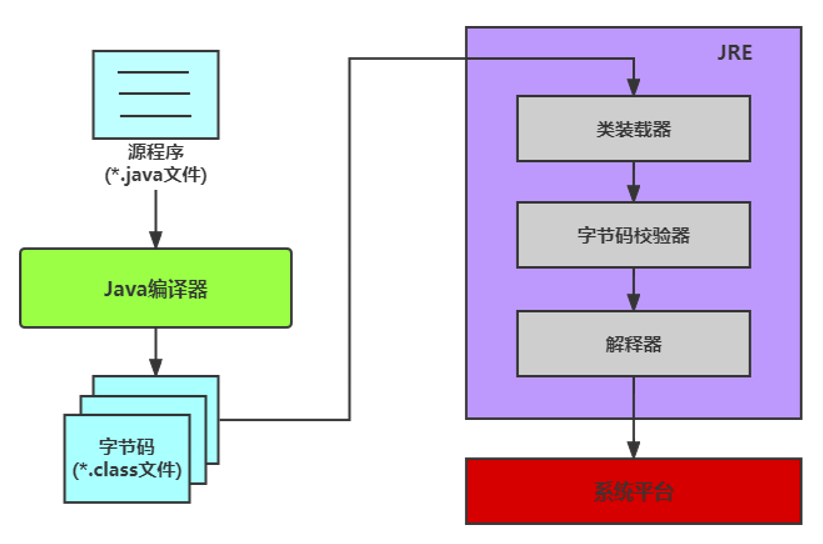
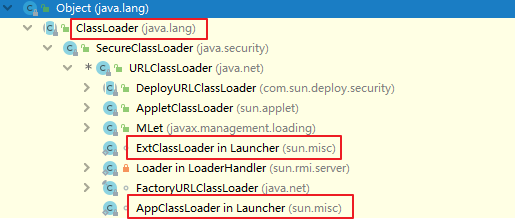

### 反射(Reflection)

#### 反射概念

Reflection(反射)是被视为**动态语言**的关键，反射机制允许程序在运行期间借助于Reflection API取得任何类的内部信息，并能直接操作任意对象的内部属性及方法。

加载完类之后，在堆内存的方法区中就产生了一个Class类型的对象（一个类只有一个Class对象），这个对象就包含了完整的类的结构信息。我们可以通过这个对象看到类的结构。这个对象就像一面镜子，透过这个镜子看到类的结构，所以，我们形象称为反射。

#### Java反射机制理解及应用

- 在运行时判断任意一个对象所属的类
- 在运行时构造任意一个类的对象
- 在运行时判断任意一个类所具有的成员变量和方法
- 在运行时获取泛型信息
- 在运行时调用任意一个对象的成员变量和方法
- 在运行时处理注解
- 生成动态代理

#### 反射相关的主要API

- java.lang.Class：代表一个类
- java.lang.reflect.Method：代表类的方法
- java.lang.reflect.Field：代表类的成员变量
- java.lang.reflect.Constructor：代表类的构造器

#### 反射的优缺点

**优点**：

- 提高了Java程序的灵活性和扩展性，降低了耦合性，提高了自适应能力
- 运行程序创建和控制任何类的对象，无需提前硬编码目标类

**缺点**：

- 反射的性能较低
  - 反射机制主要应用在对灵活性和扩展性要求和高的系统框架上
- 反射回模糊程序内部逻辑，可读性较差

#### 理解Class类并获取Class实例

想要解剖一个类，必须要先获取到该类的Class对象。而剖析一个类或用反射解决具体的问题就是使用相关的API

- java.lang.Class
- java.lang.reflect.*

所以，Class对象时反射的根源。

#### 理解Class

在Object类中定义了getClass方法，此方法被所有子类继承

```java
public final Class getClass()
```

以上的方法返回值的类型就是一个Class类，此类是Java反射的源头，实际上所谓反射从程序的运行结束结果来看也很好理解，即：可以通过对象反射求出类的名称。


对象照镜子后可以得到的信息：某个类的属性、方法和构造器、某个类到底实现了哪些结构。对于每个类而言，JRE都为其保留了一个不变的Class类型的对象。一个Class对象包含了特定某个结构

- Class本身也是一个类
- Class对象只能由系统建立对象
- 一个加载的类在JVM中只会有一个Class实例
- 一个Class对象对应的是一个加载到JVM中的一个`.class`文件
- 每个类的实例都会记得自己是由哪个Class实例所生成
- 通过Class可以完整地得到一个类中的所有被加载的结构
- Class类是Reflection的根源，针对任何你想动态加载、运行的类，唯有先获得相应的Class对象

**内存结构**


> 说明：上图中字符串常量池在JDK6中存储在方法区；JDK7及以后，存储在堆空间。

#### 获取Class类的实例

方式1:要求编译器间已知类型

前提：若已知具体的类，通过类的class属性获取，该方法最为安全可靠，程序性能最高

```java
Class stringClass = String.Class;
```

方式2:获取对象的运行时类型

前提：已知某个类的实例，调用该实例的getClass方法来获取Class对象

```java
Class stringClass = "hello world".getClass();
```

方式3:可以获取编译器间未知的类型

前提：已知一个类的全类名，且该类在类路径下，可通过Class类的静态方法forName()获取，可能抛出ClassNotFoundException

```java
Class personClass = Class.forName("com.canvs.test.Person");
```

方式4:其他方式

前提：可以用系统类加载对象或自定义加载器对象加载指定路径下的类型

```java
ClassLoader cl = this.getClass().getClassLoader()
Class personClass = cl.loadClass("com.canvs.test.Person")
```

**代码**：

```java
public class ReflectionTest {
    @Test
    public void test01() throws ClassNotFoundException {
        Class stringClass = String.class;
        System.out.println(stringClass);
        stringClass = "hello world".getClass();
        System.out.println(stringClass);
        Class personClass = Class.forName("com.canvs.example.Person");
        System.out.println(personClass);
        ClassLoader cl = this.getClass().getClassLoader();
        Class person = cl.loadClass("com.canvs.example.Person");
        System.out.println(person);
    }
    @Test
    public void test02() throws ClassNotFoundException {
        Class c1 = Person.class;
        Class c2 = new Person().getClass();
        Class c3 = Class.forName("com.canvs.example.Person");
        Class c4 = ClassLoader.getSystemClassLoader().loadClass("com.canvs.example.Person");
        System.out.println(c1 == c2);   //true
        System.out.println(c1 == c3);   //true
        System.out.println(c1 == c4);   //true
        System.out.println(this.getClass());
    }
}
```

#### 哪些类型可以有Class对象

- class：外部类，成员（成员内部类，静态内部类）0，局部内部类，匿名内部类
- interface：接口
- []：数组
- enum：枚举
- annotation：注解@interface
- primitive type：基本数据类型
- void

```java
    public void test03(){
        System.out.println(Object.class);
        System.out.println(Comparable.class);
        System.out.println(String.class);
        System.out.println(int.class);
        System.out.println(ElementType.class);
        System.out.println(Override.class);
        System.out.println(int[][].class);
        System.out.println(void.class);
        System.out.println(Class.class);
        int[] a = new int[10];
        int[] b = new int[100];
        System.out.println(a.getClass()==b.getClass()); //true
    }
```

#### Class类的常用方法

| 方法名                                            | 功能说明                                                     |
| ------------------------------------------------- | ------------------------------------------------------------ |
| static Class forName(String name)                 | 返回指定类名name的Class对象                                  |
| Object newInstance()                              | 调用缺省构造函数，返回该Class对象的一个实例                  |
| getName()                                         | 返回此Class对象所表示的实体（类、接口、数组类、基本类型、void）名称 |
| Class [] getInterfaces()                          | 获取当前Class对象的接口                                      |
| ClassLoader getClassLoader()                      | 返回该类的类加载器                                           |
| Class getSuperclass()                             | 返回当前Class对象的父类的Class对象                           |
| Constructor[] getConstructors()                   | 返回一个包含某些Constructor对象的数组                        |
| Field[] getDeclaredFields()                       | 返回Field对象的一个数组                                      |
| Method getMethod(String name, Class...paramTypes) | 返回一个Method对象，此对象的形参类型为paramType              |

**代码**：

```java
public class Person implements Biology, Serializable {
    public String name;
    public int age;
    private char gender;
    private static int score = 100;
    public static String occupation = "律师";
    public Person() {
        System.out.println("Person...");
    }
    private Person(char gender) {
        this.gender = gender;
    }
    public Person(String name, int age) {
        this.name = name;
        this.age = age;
        System.out.println("Person(String name,int age)");
    }
    @Override
    public String toString() {
        return "Person{" +
                "name='" + name + '\'' +
                ", age=" + age +
                ", gender=" + gender +
                '}';
    }
    public static void info(String gender) {
        System.out.println("gender:" + gender);
    }
    private static void show(String name,int age){
        System.out.println("show method...");
    }
}
```

```java
	public class ReflectionTest1 {
    @Test
    public void test01() throws Exception {
        Class aClass = Class.forName("com.canvs.example.Person");
        Person tom = (Person)aClass.newInstance();
        System.out.println(tom);
        System.out.println(aClass.getName());
        System.out.println(aClass.getSuperclass());
        Class[] interfaces = aClass.getInterfaces();
        for (Class c : interfaces) System.out.println(c.getName());
        ClassLoader classLoader = aClass.getClassLoader();
        System.out.println(classLoader);
        Constructor constructor = aClass.getConstructor();
        System.out.println(constructor);
        Constructor[] constructors = aClass.getConstructors();
        System.out.println(Arrays.toString(constructors));
    }
    @Test
    public void test02() throws Exception {
        Class<Person> personClass = Person.class;
        Constructor<Person> constructor = personClass.getConstructor();
        Field[] fields = personClass.getFields();
        System.out.println(Arrays.toString(fields));
        Field field = personClass.getField("name");
        Person person = constructor.newInstance(null);
        field.set(person,"Canvs");
        System.out.println(field.get(person));
        Field occupation = personClass.getField("occupation");
        System.out.println(occupation.get(null));
        Field score = personClass.getDeclaredField("score");
        score.setAccessible(true);
        System.out.println(score.get(null));
        Field gender = personClass.getDeclaredField("gender");
        gender.setAccessible(true);
        gender.set(person,'男');
        System.out.println(gender.get(person));
    }
    @Test
    public void test03() throws Exception {
        Class aClass = Class.forName("com.canvs.example.Person");
        Person tom = (Person) aClass.newInstance();
        Method info = aClass.getMethod("info", String.class);
        info.invoke(null,"男");
        Method toString = aClass.getMethod("toString");
        String value = (String) toString.invoke(tom);
        System.out.println(value);
        Constructor constructor = aClass.getDeclaredConstructor(char.class);
        constructor.setAccessible(true);
        Person p1 = (Person) constructor.newInstance('女');
        System.out.println(p1);
        Method show = aClass.getDeclaredMethod("show", String.class, int.class);
        show.setAccessible(true);
        show.invoke(null,"tom",22);
    }
}
```

### 类加载与ClassLoader的理解

#### 类的生命周期

类在内存中完整的生命周期：加载 --> 使用 --> 卸载。其中加载过程又分为：装载、链接、初始化三个阶段


#### 类的加载过程

当程序主动使用某个类时，如果该类还未被加载到内存中，系统会通过加载、链接、初始化三个步骤来对该类进行初始化。如果没有意外，JVM将会连续完成这三个步骤，所以有时也会把这三个步骤统称为类加载。


**类的加载又分为三个阶段**：

- 装载(Loading)：将类的class文件读入内存，并为之创建一个java.lang.Class对象。此过程由类加载器完成
- 链接(Linking):
  - 验证(Verify)：确保加载的类信息符合JVM规范，例如：以cafebabe开头，没有安全方面的问题
  - 准备(Prepare)：正式为类变量(static)分配内存并设置类变量默认初始化值的阶段，这些内存都将在方法区中进行分配。
  - 解析(Resolve)：虚拟机常量池内的符号引用(常量名)替换为直接引用(地址)的过程/
- 初始化(Initialization)
  - 执行类构造器`<clinit>()`方法的过程。类构造器`<clinit>()`方法是由编译期自动收集类中所有类变量的赋值动作和静态代码块中的语句合并产生的。类构造器时构造器类信息的，不是构造该类对象的构造器
  - 当初始化一个类的时候，如果发现其父类还没有进行初始化，则需要先触发其父类的初始化。
  - 虚拟机会保证一个类的`<clinit>()`方法在多线程环境中正确加锁和同步。

### 类加载器(classloader)



#### 类加载器的作用

将class文件字节码内容加载到内存中，并将这些静态数据转换成方法区的运行时数据结构，然后在堆中生成一个代表这个类的java.lang.Class对象，作为方法区中类数据的访问入口。

类缓存：标准的JavaSE类加载器可以按要求查找类，但是一旦某个类被加载到类加载器中，它将维持加载（缓存）一段时间。不过JVM垃圾回收机制可以回收这些Class对象。


#### 类加载器的分类(JDK8为例)

JVM支持两种类型的类加载器，分别为引导类加载器(Bootstrap ClassLoader)和自定义类加载器(User-Defined ClassLoader)。

从概念上来讲，自定义类加载器一般指的是程序中由开发人员自定义的一类类加载器，但是Java虚拟机规范却没有这么定义，而是将所有派生与抽象类ClassLoader的类加载器都划分为自定义类加载器。无论类加载器的类型如何划分，在程序中我们最常见的类加载器结构主要是如下情况：


- **启动类加载器（引导类加载器，Bootstrap ClassLoader）**

  - 这个类加载使用`C/C++`语言实现的，嵌套在JVM内部。获取它的对象时往往返回null
  - 它用来加载Java的核心库(JAVA_HOME/jre/lib/rt.jar或sun.boot.class.path路径下内容)。用于提供JVM自需要的类
  - 并不继承自java.lang.ClassLoader，没有父类加载器。
  - 处于安全考虑，Bootstrap启动类加载器只加载包名为java、Javax、sun等开头的类
  - 加载扩展类和应用程序类加载器，并指定为他们的父类加载器

- **扩展类加载器（Extension ClassLoader）**

  - Java语言编写，由sun.misc.Launcher$ExtClassLoader实现。
  - 继承于ClassLoader类
  - 父类加载器为启动类加载器
  - 从java.ext.dirs系统属性所指定的目录中加载类库，或从JDK的安全目录的jre/lib/ext子目录下加载类库。如果用户创建的JAR放在此目录下，也会自动由扩展类加载器加载。

  

- **用户自定义类加载器**
  - 在Java的日常应用程序开发中，类的加载几乎是由上述3种类加载器互相配合执行的。在必要时，我们还可以自定义类加载器，来定制类的加载方式。
  - 体现Java语言强大生命力和巨大魅力的关键因素之一便是，Java开发中可以自定义类加载器来实现类库的动态加载，加载源可以是本地的JAR包，也可以是网络上的远程资源。
  - 同时，自定义加载器能够实现`应用隔离`，例如Tomcat、Spring等中间件和组建框架都在内部实现了自定义的加载器，并通过自定义加载器隔离不同的组建模块。这种机制比C/C++程序要好太多，想不修改C/C++程序就能为其新增功能，几乎是不可能的，仅仅一个兼容性便能阻挡住所有美好的设想。
  - 自定义类加载器通常需要继承于ClassLoader

#### 查看某个类的类加载器对象

- 获取默认的系统类加载器

```java
ClassLoader classloader = ClassLoder.getSystemClassLoader();
```

- 查看某个类是哪个类加载器加载的

```java
ClassLoader classloader = Class.forName("com.canvs.example.Person").getClassLoader();
//如果是根加载器加载的类，则会得到null
ClassLoader classloader1 = Class.forName("java.lang.Object").getClassLoader();
```

- 获取某个类加载器的父加载器

```java
ClassLoader parentClassloader = classloader.getParent();
```

**代码**：

```java
public class ClassLoaderTest {
    @Test
    public void test01() throws ClassNotFoundException {
        ClassLoader systemClassLoader = ClassLoader.getSystemClassLoader();
        System.out.println("系统默认类加载器：" + systemClassLoader);
        ClassLoader parent = systemClassLoader.getParent();
        System.out.println(parent);
        ClassLoader parent1 = parent.getParent();
        System.out.println(parent1);
        ClassLoader classLoader1 = Class.forName("java.lang.Object").getClassLoader();
        System.out.println("Object类加载器：" + classLoader1);
    }
    @Test
    public void test02() throws ClassNotFoundException {
        Class aClass = Class.forName("com.canvs._class.User");
        ClassLoader classLoader = aClass.getClassLoader();
        System.out.println("User类加载器：" + classLoader);
        ClassLoader parent = classLoader.getParent();
        System.out.println("User父类加载器:"+parent);
        System.out.println(parent.getParent()); //null
        ClassLoader classLoader1 = String.class.getClassLoader();
        System.out.println("String类的类加载器："+classLoader1);
        ClassLoader classLoader2 = Class.forName("sun.util.resources.cldr.zh.TimeZoneNames_zh").getClassLoader();
        System.out.println(classLoader2);
    }
}
```

#### 使用ClassLoader获取流

关于类加载器的一个主要方法：getResourceAsStream(String str)：获取类路径下的指定文件的输入流

```java
public class PropertiesReflectionTest {
    @Test
    public void test01() throws IOException {
        Properties properties = new Properties();
        InputStream in = ClassLoader.getSystemClassLoader().
          getResourceAsStream("jdbc.properties");
        properties.load(in);
        String user = (String) properties.get("user");
        String password = (String) properties.get("password");
        System.out.println(user+" "+password);
    }
}
```

### 反射的基本应用

#### 创建运行时类的对象

这是反射机制应用最多的地方。创建运行时类的对象有两种方式：

- 直接调用Class对象的newInstance()

  - 类必须有一个无参数的构造器
  - 类的构造器的访问权限需要足够

- 通过获取构造器对象来进行实例化

  - 方式一：

    - 获取该类型的Class对象
    - 调用Class对象的newInstance()方法创建对象

  - 方式二：

    - 通过Class类的getDeclaredConstructor(Class ... parameterTypes)取得本类的指定形参类型的构造器
    - 向构造器的型参中传递一个对象数组进去，里面包含了构造器中所需的各个参数
    - 通过Constructor实例化对象

    > 如果构造器的权限修饰符修饰的范围不可见，也可以调用setAccessible(true)

**代码**：

```java
public class CreateObjectTest {
    @Test
    public void test01() throws Exception {
        Class aClass = Class.forName("com.canvs.reflectapply.apply1.Person");
        Constructor<?> cons = aClass.getDeclaredConstructor();
        cons.setAccessible(true);
        Person person = (Person) cons.newInstance();
        System.out.println(person);
    }
    @Test
    public void test02() throws Exception {
        Class aClass = Class.forName("com.canvs.reflectapply.apply1.Person");
        Constructor<?> cons = aClass.getDeclaredConstructor(int.class, String.class);
        cons.setAccessible(true);
        Person person = (Person) cons.newInstance(10, "Jerry");
        System.out.println(person);
    }
}
```

#### 获取运行时类的完整结构

可以获取：包、修饰符、类型名、父类（包括泛型父类）、父接口（包括泛型父接口）、成员（属性、构造器、方法）、注解（类上的、方法上的、属性上的）

**相关API**

```java
//1.实现的全部接口
public Class<?>[] getInterfaces()   
//确定此对象所表示的类或接口实现的接口。 

//2.所继承的父类
public Class<? Super T> getSuperclass()
//返回表示此 Class 所表示的实体（类、接口、基本类型）的父类的 Class。

//3.全部的构造器
public Constructor<T>[] getConstructors()
//返回此 Class 对象所表示的类的所有public构造方法。
public Constructor<T>[] getDeclaredConstructors()
//返回此 Class 对象表示的类声明的所有构造方法。

//Constructor类中：
//取得修饰符: 
权限修饰符					0x是十六进制
PUBLIC           = 0x00000001;  1    1
PRIVATE          = 0x00000002;  2	10
PROTECTED        = 0x00000004;  4	100
STATIC           = 0x00000008;  8	1000
FINAL            = 0x00000010;  16	10000
public int getModifiers();
//取得方法名称: 
public String getName();
//取得参数的类型：
public Class<?>[] getParameterTypes();

//4.全部的方法
public Method[] getDeclaredMethods()
//返回此Class对象所表示的类或接口的全部方法
public Method[] getMethods()  
//返回此Class对象所表示的类或接口的public的方法

//Method类中：
public Class<?> getReturnType()
//取得全部的返回值
public Class<?>[] getParameterTypes()
//取得全部的参数
public int getModifiers()
//取得修饰符
public Class<?>[] getExceptionTypes()
//取得异常信息

//5.全部的Field
public Field[] getFields() 
//返回此Class对象所表示的类或接口的public的Field。
public Field[] getDeclaredFields() 
//返回此Class对象所表示的类或接口的全部Field。

//Field方法中：
public int getModifiers()
//以整数形式返回此Field的修饰符
public Class<?> getType()  
//得到Field的属性类型
public String getName()  
//返回Field的名称。

//6. Annotation相关
get Annotation(Class<T> annotationClass) 
getDeclaredAnnotations() 

//7.泛型相关
//获取父类泛型类型：
Type getGenericSuperclass()
//泛型类型：ParameterizedType
//获取实际的泛型类型参数数组：
getActualTypeArguments()

//8.类所在的包
Package getPackage() 
```

**获取所有的属性及相关细节**

```java
public class FieldsTest {
    @Test
    public void test01() throws Exception {
        Class aClass = Class.forName("com.canvs.reflectapply.data.Person");
        //获取到运行时类本身及其所有父类中声明为public修饰的属性
        Field[] fields1 = aClass.getFields();
        for (Field f : fields1) System.out.println(f.getName());
        System.out.println();
        //获取当前运行时类中声明的所有属性包括私有
        Field[] fields = aClass.getDeclaredFields();
        for (Field f : fields) System.out.println(f.getName());
    }

    @Test
    public void test02() {
        Class aClass = Person.class;
        Field[] fields = aClass.getDeclaredFields();
        for (Field f : fields) {
            //获取权限修饰符
            int modifier = f.getModifiers();
            System.out.print(modifier + ":" + Modifier.toString(modifier) + "\t");
            //数据类型
            Class<?> type = f.getType();
            System.out.print(type.getName()+"\t");
            //获取变量名
            String name = f.getName();
            System.out.print(name);
            System.out.println();
        }
    }
}
```

**获取所有的方法及相关细节**

```java
public class MethodsTest {
    @Test
    public void test01() throws Exception {
        Class<?> aClass = Class.forName("com.canvs.reflectapply.data.Person");
        //获取到运行时类本身及其所有的父类中声明为public权限的方法
        Method[] methods1 = aClass.getMethods();
        System.out.println(Arrays.toString(methods1));
        System.out.println();
        //获取当前运行时类中声明的所有方法
        Method[] methods = aClass.getDeclaredMethods();
        for (Method m : methods) {
            System.out.println(m);
        }
    }
    @Test
    public void test02() {
        Class clazz = Person.class;
        Method[] declaredMethods = clazz.getDeclaredMethods();
        for (Method m : declaredMethods) {
            // 获取方法声明的注解
            Annotation[] annos = m.getAnnotations();
            for (Annotation a : annos) {
                System.out.print(a +" ");
            }
            //权限修饰符
            System.out.print(Modifier.toString(m.getModifiers()) + "\t");
            //返回值类型
            System.out.print(m.getReturnType().getName() + "\t");
            //方法名
            System.out.print(m.getName());
            System.out.print(" (");
            //形参列表
            Class<?>[] parameterTypes = m.getParameterTypes();
            if (parameterTypes != null && parameterTypes.length != 0) {
                for (int i = 0; i < parameterTypes.length; i++) {
                    if (i == parameterTypes.length - 1) {
                        System.out.print(parameterTypes[i].getName() + "args_" + i);
                        break;
                    }
                    System.out.print(parameterTypes[i].getName() + "args_" + i + ", ");
                }
            }
            System.out.print(" )");
            //抛出的异常
            Class<?>[] exceptionTypes = m.getExceptionTypes();
            if (exceptionTypes.length > 0){
                System.out.print("throws ");
                for (int i = 0; i < exceptionTypes.length; i++) {
                    if (i == exceptionTypes.length - 1) {
                        System.out.print(exceptionTypes[i].getName());
                        break;
                    }
                    System.out.print(exceptionTypes[i].getName() + ",");
                }
            }
            System.out.println();
        }
    }
}
```

**获取其他结构(构造器、父类、接口、包、注解等)**

```java
public class OtherTest {
    @Test
    public void test01() throws Exception {
        Class<?> clazz = Class.forName("com.canvs.reflectapply.data.Person");
        //获取运行时的父类
        Class<?> superclass = clazz.getSuperclass();
        System.out.println(superclass.getName());
    }

    @Test
    public void test02() {
        Class<Person> personClass = Person.class;
        //获取运行时类实现的接口
        Class<?>[] interfaces = personClass.getInterfaces();
        for (Class c : interfaces) System.out.println(c.getName());
    }

    @Test
    public void test03() {
        Class<Person> personClass = Person.class;
        //获取运行时类所在的包
        Package aPackage = personClass.getPackage();
        System.out.println(aPackage.getName());
    }

    @Test
    public void test04() throws ClassNotFoundException {
        //获取运行时类的带泛型的父类
        Class<?> clazz = Class.forName("com.canvs.reflectapply.data.Person");
        Type genericSuperclass = clazz.getGenericSuperclass();
        System.out.println(genericSuperclass);
    }

    @Test
    public void test05() {
        Class<Person> clazz = Person.class;
        //获取带泛型的父类（Type是一个接口，Class实现了此接口
        Type genericSuperclass = clazz.getGenericSuperclass();
        //如果父类是带泛型的，则可以强转为ParameterizedType
        ParameterizedType genericSuperclass1 = (ParameterizedType) genericSuperclass;
        //调用getActualTypeArguments()获取泛型的参数，结果是一个数组，因为可能有多个泛型参数。
        Type[] actualTypeArguments = genericSuperclass1.getActualTypeArguments();
        System.out.println(((Class) actualTypeArguments[0]).getName());
    }
}
```

**获取泛型父类信息**

```java
public class GenericTest {
    public static void main(String[] args) throws ClassNotFoundException {
        Class<?> clazz = Class.forName("com.canvs.reflectapply.apply2.Son");
        Type type = clazz.getGenericSuperclass();
        ParameterizedType pt = (ParameterizedType) type;
        Type[] arguments = pt.getActualTypeArguments();
        System.out.println(Arrays.toString(arguments));
    }
}
class Father<T,U>{}
class Son extends Father<String,Integer>{}
```

**获取内部类或外部类信息**

- public Class<?>[] getClasses()：返回所有公共内部类和内部接口。包括从超类继承的公共类和接口成员以及该类声明的公共类和接口成员。

- public Class<?>[] getDeclaredClasses()：返回Class对象的一个数组，这些对象反映声明了为此Class对象所表示的类的成员的所有类和接口。包括该类所声明的公共、保护、默认(包)访问及私有类和接口，但不包括继承的类和接口。

- public Class<?> getDeclaringClass()：如果此Class对象所表示的类或接口是一个内部类或内部接口，则返回它的外部类或外部接口，否则返回null
- Class<?> getEnclosingClass()：返回某个内部类的外部类

```java
    public void test06(){
        Class<?> clazz = Map.class;
        Class<?>[] declaredClasses = clazz.getDeclaredClasses();
        for (Class c: declaredClasses) System.out.println(c.getName());
        Class<Map.Entry> entryClass = Map.Entry.class;
        Class<?>declaredClass1 = entryClass.getDeclaringClass();
        System.out.println(declaredClass1);
    }
```

