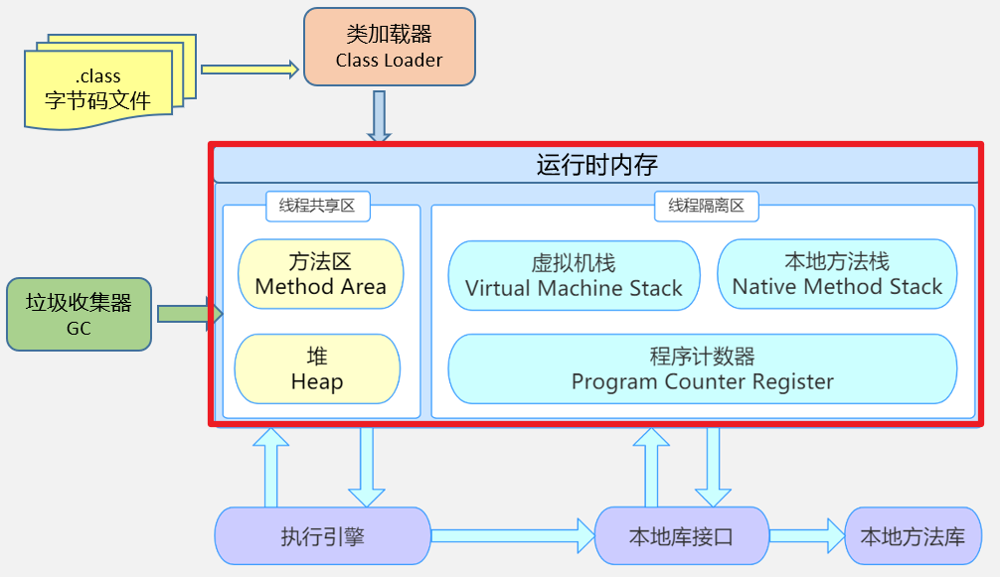

### 多线程

#### 程序、进程与线程

- 程序（program）：为完成特定任务，用某种语言编写的一组指令的集合。即指一段静态的代码，静态对象。
- 进程（process）：程序的一次执行过程，或是正在内存中运行的应用程序。如：运行的QQ，运行的网易云音乐。
  - 每个进程都一个独立的内存空间，系统运行一个程序即是一个进程从创建、运行到消亡的过程（生命周期）。
  - 程序是静态的，进程是动态的
  - 进程作为操作系统调度和分配资源的最小单位，系统在运行时会为每个进程分配不同的内存区域。
  - 现代操作系统，大部分支持多进程，支持同时运行多个程序。
- 线程（thread）：进程可进一步细化为线程，是程序内部的一条执行路径。一个进程中至少有一个线程。
  - 一个进程同一时间并行执行多个线程，就是支持多线程。
  - 线程作为CPU调度和执行的最小单位
  - 一个进程中的多个线程共享相同的内存单元，它们从一个堆中分配对象，可以访问相同的变量和对象。这就使得线程间通讯更简便、高效。但多个线程操作共享的系统资源可能会带来安全的隐患。



> 注意：
>
> 不同的进程之间是不共享内存的
>
> 进程之间的数据交换和通信的成本很高

#### 线程调度

- 分时调度：所有线程轮流使用CPU的使用权，并且平均分配每个线程占用CPU的时间
- 抢占式调度：让优先级高的线程以较大的概率优先使用CPU。如果线程的优先级相同，那么会随机选择一个（线程随机性）Java使用的为抢占式调度。

#### 多线程程序优点

**背景**：以单核CPU为例，只使用耽搁线程先后完成多个任务（调用多个方法），肯定比用多个线程来完成用的时间更短。

- 提高应用程序的响应。对图形化界面更有意义，可增强用户体验。
- 提高就计算机系统CPU的利用率
- 改善程序结构。将即长又复杂的进程分为多个线程，独立运行，利于理解和修改

#### 并行与并发

- 并行（parallel）：指两个或多个事物在同一时刻发生（同时发生）。指在同一时刻，有多条指令在多个CPU上同时执行。如：多个人同时作不同的事。
- 并发（concurrency）：指两个或多个事件在同一个时间段内发生。即在一段时间内，有多条指令在单个CPU上快速轮换、交替执行，使得在宏观上具有多个进程同时执行的效果。

### 创建和启动线程

- Java语言的JVM允许程序运行多个线程，使用`java.lang.Thread`类代表线程，所有的线程对象都必须是Thread类或子类的实例
- Thread类的特性
  - 每个线程都是通过某个特定Thread对象的run()方法来完成操作的，因此把run()方法称为线程执行体。
  - 通过该Thread对象的start()方法来启动这个线程，而非直接调用run()
  - 要实现多线程，必须在主线程中创建新的线程对象

#### 继承Thread类

```java
public class MyThread extends Thread{
    public MyThread(String name){
        super(name);
    }
    @Override
    public void run() {
        for (int i = 1;i <= 100; i++) {
            System.out.println(Thread.currentThread().getName()+":"+i);
        }
    }
}
class TestMyThread{
    public static void main(String[] args) {
        MyThread t1 = new MyThread("线程1");
        t1.start();
        MyThread t2 = new MyThread("线程2");
        t2.start();
    }
}
```

**匿名内部类对象来实现线程的创建和启动**

```java
public class ThreadTest {
    public static void main(String[] args) {
        new Thread(){
            @Override
            public void run() {
                for (int i = 1; i < 101; i++) {
                    System.out.println(Thread.currentThread().getName() + ":" + i);
                }
            }
        }.start();
    }
}
```

> 注意：
>
> - 如果自己手动调用run()方法，那么就只是普通方法，没有启动多线程模式。
> - run()方法有JVM调用，声明时候调用，执行的过程控制都有操作系统的CPU调度决定。
> - 想要启动多线程，必须调用start方法
> - 一个线程对象只能掉用一次start()方法启动，如重复调用，则抛出`IllegalThreadStateException`异常

#### 实现Runnable接口

Java有单继承的限制，当我们无法继承Thread类时，Java核心类库中提供了Runnable接口，可以通过实现Runnable接口，重写run()方法，再通过Thread类的对象代理启动和执行我们的线程体run()方法

- 定义Runnable接口的实现类，并重写该接口的run()方法，该run方法体同样是该线程的执行体。
- 创建Runnable实现类的实例，以此实例作为Thread的target参数来创建Thread对象，该Thread对象才是真正的线程对象，
- 调用线程对象的start()方法，启动线程，调用Runnable接口实现类的run方法

```java
public class MyRunnable implements Runnable{
    @Override
    public void run() {
        for (int i = 1; i < 101; i++) {
            System.out.println(Thread.currentThread().getName() + ":" + i);
        }
    }
}
class TestMyRunnable{
    public static void main(String[] args) {
        MyRunnable r1 = new MyRunnable();
        Thread t1 = new Thread(r1);
        t1.setName("线程1");
        Thread t2 = new Thread(r1,"线程2");
        t1.start();
        t2.start();
    }
}
```

**匿名内部类对象来实现线程的创建和启动**

```java
public class RunnableTest {
    public static void main(String[] args) {
        new Thread(new Runnable() {
            @Override
            public void run() {
                for (int i = 1; i < 101; i++) {
                    System.out.println(Thread.currentThread().getName()+":"+i);
                }
            }
        }).start();
    }
}
```

#### 对比Thread和Runnable两种方式

**联系**

Thread类实际上也是实现Runnable接口的类

```java
public class Thread extends Object implements Runnable
```

**区别**

- 继承Thread：线程代码存放在Thread子类的run方法中
- 实现Runnable：线程代码存在接口的子类的run方法中

**实现Runnable接口对别继承Thread类所具有的优势**

- 避免了单继承的局限性
- 多个线程可以共享同一个接口实现类对象，非常适合多个相同线程来处理同一份资源
- 增强程序健壮性，实现解藕操作，代码可以被多个线程共享，代码和线程独立。

#### 练习：

创建两个分线程，让其中一个线程输出1-100之间的偶数，另一个线程输出1-100之间的奇数。

```java
public class NumberTest {
    public static void main(String[] args) {
        new Thread(){
            @Override
            public void run() {
                for (int i = 1; i <=100 ; i++) {
                    if (i %2 != 0){
                        System.out.println(getName()+":"+i);
                    }
                }
            }
        }.start();
        new Thread() {
            @Override
            public void run() {
                for (int i = 1; i < 101; i++) {
                    if (i % 2 == 0) {
                        System.out.println(getName()+":"+i);
                    }
                }
            }
        }.start();
    }
}
```

### Thread类的常用结构

#### 构造器

- public Thread() :分配一个新的线程对象。
- public Thread(String name) :分配一个指定名字的新的线程对象。
- public Thread(Runnable target) :指定创建线程的目标对象，它实现了Runnable接口中的run方法
- public Thread(Runnable target,String name) :分配一个带有指定目标新的线程对象并指定名字。

#### 常用方法1

* public void run() :此线程要执行的任务在此处定义代码。
* public void start() :导致此线程开始执行; Java虚拟机调用此线程的run方法。
* public String getName() :获取当前线程名称。
* public void setName(String name)：设置该线程名称。
* public static Thread currentThread() :返回对当前正在执行的线程对象的引用。在Thread子类中就是this，通常用于主线程和Runnable实现类
* public static void sleep(long millis) :使当前正在执行的线程以指定的毫秒数暂停（暂时停止执行）。
* public static void yield()：yield只是让当前线程暂停一下，让系统的线程调度器重新调度一次，希望优先级与当前线程相同或更高的其他线程能够获得执行机会，但是这个不能保证，完全有可能的情况是，当某个线程调用了yield方法暂停之后，线程调度器又将其调度出来重新执行。

#### 常用方法2

* public final boolean isAlive()：测试线程是否处于活动状态。如果线程已经启动且尚未终止，则为活动状态。 

* void join() ：等待该线程终止。 

  void join(long millis) ：等待该线程终止的时间最长为 millis 毫秒。如果millis时间到，将不再等待。 

  void join(long millis, int nanos) ：等待该线程终止的时间最长为 millis 毫秒 + nanos 纳秒。 

* public final void stop()：`已过时`，不建议使用。强行结束一个线程的执行，直接进入死亡状态。run()即刻停止，可能会导致一些清理性的工作得不到完成，如文件，数据库等的关闭。同时，会立即释放该线程所持有的所有的锁，导致数据得不到同步的处理，出现数据不一致的问题。

* void suspend() / void resume() : 这两个操作就好比播放器的暂停和恢复。二者必须成对出现，否则非常容易发生死锁。suspend()调用会导致线程暂停，但不会释放任何锁资源，导致其它线程都无法访问被它占用的锁，直到调用resume()。`已过时`，不建议使用。

#### 常用方法3

每个线程都有一定的优先级，同优先级线程组成先进先出队列（先到先服务），使用分时调度策略。优先级高的线程采用抢占式策略，获得较多的执行机会。每个线程默认的优先级都与创建它的父线程具有相同的优先级。

- Thread类的三个优先级常量：
  - MAX_PRIORITY（10）：最高优先级 
  - MIN _PRIORITY （1）：最低优先级
  - NORM_PRIORITY （5）：普通优先级，默认情况下main线程具有普通优先级。

* public final int getPriority() ：返回线程优先级 
* public final void setPriority(int newPriority) ：改变线程的优先级，范围在[1,10]之间。

#### 练习1

获取main线程对象的名称和优先级。声明一个匿名内部类继承Thread类，重写run方法，在run方法中获取线程名称和优先级。设置该线程优先级为最高优先级并启动该线程。

```java
public class TestThread {
    public static void main(String[] args) {
        Thread t = new Thread(){
            @Override
            public void run() {
                System.out.println(getName()+" 优先级："+getPriority()); //Thread-0 优先级：10
            }
        };
        t.setPriority(Thread.MAX_PRIORITY);
        t.start();
        System.out.println(Thread.currentThread().getName()+
                " 优先级："+Thread.currentThread().getPriority());  //main 优先级：5
    }
}
```

#### 练习2:

- 声明一个匿名内部类继承Thread类，重写run方法，实现打印[1,100]之间的偶数，要求每隔1秒打印1个偶数。

- 声明一个匿名内部类继承Thread类，重写run方法，实现打印[1,100]之间的奇数，
  - 当打印到5时，让奇数线程停下来，让偶数线程执行完再打印。

```java
public class TestThreadStateChange {
    public static void main(String[] args) {
        Thread t = new Thread("线程1") {
            @Override
            public void run() {
                try {
                    for (int i = 1; i <= 100; i++) {
                        if (i % 2 == 0) {
                            System.out.println(getName() + ":" + i);
                        }
                        Thread.sleep(100);
                    }
                } catch (InterruptedException e) {
                    throw new RuntimeException(e);
                }
            }
        };
        t.start();
        new Thread("线程2") {
            @Override
            public void run() {
                int i = 1;
                while (i<101){
                    if (i%2 != 0){
                        System.out.println(getName() + ":" + i);
                    }
                    if (i==5){
                        try {
                           t.join();
                        } catch (InterruptedException e) {
                            throw new RuntimeException(e);
                        }
                    }
                    i++;
                }
            }
        }.start();
    }
}
```

#### 守护线程

有一种线程，它是在后台运行的，它的任务是为其他线程提供服务的，这种线程被称为**守护线程**。JVM的垃圾回收线程就是典型的守护线程。

守护线程有个特点，就是如果所有非守护线程都死亡，那么守护线程自动死亡，

掉用setDaemon(true)方法可以将指定线程设置为守护线程，必须在线程启动之前设置。否则会报IllegalThreadStateException异常。

```java
public class TestThread1 {
    public static void main(String[] args) {
        MyDaemo md = new MyDaemo();
        md.setDaemon(true);
        md.start();
        for (int i = 1; i < 101; i++) {
            System.out.println(Thread.currentThread().getName()+":"+i);
        }
    }
}
class MyDaemo extends Thread{
    @Override
    public void run() {
        while (true){
            System.out.println("守护线程");
            try {
                Thread.sleep(1);
            } catch (InterruptedException e) {
                e.printStackTrace();
            }
        }
    }
}
```

### 多线程的生命周期

Java语言使用Thread类及子类的对象来表示线程，在它的一个完整的生命周期中通常经历如下几个状态

#### JDK1.5前：5种状态

线程的生命周期有五种状态：新建（New）、就绪（Runnable）、运行（Running）、阻塞（Blocked）、死亡（Dead）。cpu需要在多条线程之间切换，于是线程状态会多次在运行、阻塞、就绪之间切换。


**1.新建**

当一个Thread类或其子类的对象被声明并创建时，新生的线程对象处于新建状态。此时它和其他Java对象一样仅仅由JVM为其分配了内存，并初始化了实例变量的值。此时的线程对象并没有任何线程的动态特征，程序也不会执行它的线程体run()。

**2.就绪**

但是当线程对象调用了start()方法之后，就不一样了，线程就从新建状态转为就绪状态。JVM会为其创建方法调用栈和程序计数器，当然，处于这个状态中的线程并没有开始运行，只是表示已具备了运行的条件，随时可以被调度。至于生命时候调度，取决于JVM里线程调度器的调度。

**3.运行**

如果处于就绪状态的线程获得了CPU资源时，开始执行run()方法的线程体代码，则该线程处于运行状态。如果计算机只有一个CPU核心，在任何时刻只有一个线程处于运行状态，如果计算机有多个核心，将会有多个线程并行（Parallel）执行。

对于抢占式策略的系统而言，系统会给每个可执行的线程一个小段时间来处理任务，当该时间用完，系统会剥夺该线程所占用的资源，让其回到就绪状态等待下一次被调度。此时其他线程将获得执行机会，而在选择下一个线程时，系统会适当考虑线程的优先级。

**4.阻塞**

当在运行过程中的线程遇到如下情况，会让CPU并临时终止自己的执行，进入阻塞状态：

- 线程调用sleep()方法，主动放弃所占用的CPU资源
- 线程试图获取一个同步监视器，但该同步监视器正被其他线程持有
- 线程执行过程中，同步监视器调用了wait()，让它等待某个通知（notify）
- 线程执行过程中，同步监视器调用了wait(time)
- 线程执行过程中，遇到了其他线程对象的加塞(join)
- 线程被调用suspend方法被挂起（已过时，因为容易发生死锁）

当正在执行的线程被阻塞后，其他线程就有机会执行，针对如上情况，当发生如下情况会解除阻塞，让该线程重新进入就绪状态，等待线程调度器再次调度它：

- 线程sleep()时间到
- 线程成功获得了同步监视器
- 线程等到了通知（notify）
- 线程wait的时间到了
- 加塞的线程结束了
- 被挂起的线程又被调用了resume恢复方法（已过时，因为容易发生死锁）

**5.死亡**

线程会以下三种方式之一结束，结束后的线程就处于死亡状态：

- run()方法执行完成，线程正常结束
- 线程执行过程中抛出了一个未捕获的异常或错误
- 直接调用该线程的stop()来结束该线程（已过时）

#### JDK1.5及以后：6种状态

在java.lang.Thread.State的枚举类中定义：

```java
public enum State {
	NEW,
	RUNNABLE,
	BLOCKED,
	WAITING,
	TIMED_WAITING,
	TERMINATED;
}
```

- NEW（新建）：线程刚被创建，但是未启动。还没有调用start方法
- RUNNABLE（可运行）：这里没有区分就绪和运行状态。因为对于Java对象来说，只能标记为可以运行的，至于什么时候运行，不是JVM来控制的，是OS来进行调度的，而且时间非常短暂，因此对于Java对象的状态来说，无法区分。
- TERMINATED（被终止的）：表明此线程已经结束什么周期，终止运行。
- 阻塞状态：
  - BLOCKED（锁阻塞）：一个正在阻塞、等待一个监视器锁（锁对象）的线程处于这一状态。只有获得锁对象的线程才能有执行机会。
    - 线程A与线程B代码中使用同一锁，如果线程A获取到锁，线程A进入到Runnable状态，那么线程B就进入到Blocked阻塞状态，
  - TIMED_WAITING（计时等待）：一个正在限时等待另一个线程执行一个（唤醒）动作的线程处于这一状态。
    - 当前线程执行过程中遇到Thread类和sleep或join，Object类的`wait`，LockSupport类的`park`方法，并且在调用这些方法时，`设置了时间`，那么当前线程会进入TIMED_WAITING，直到时间到，或被中断。
  - WAITING（无限等待）：一个正在无限期等待另一个线程执行一个特别的（唤醒）动作的线程处于这一状态。
    - 当前线程执行过程中遇到遇到Object类的`wait`，Thread类的`join`，LockSupport类的`park`方法，并且在调用这些方法时，`没有指定时间`，那么当前线程会进入WAITING状态，直到被唤醒。
    - 通过Object类的wait进入WAITING状态的要有Object的notify/notifyAll唤醒；
    - 通过Condition的await进入WAITING状态的要有Condition的signal方法唤醒；
    - 通过LockSupport类的park方法进入WAITING状态的要有LockSupport类的unpark方法唤醒
    - 通过Thread类的join进入WAITING状态，只有调用join方法的线程对象结束才能让当前线程恢复；

> 说明：当从WAITING或TIMED_WAITING恢复到Runnable状态时，如果发现当前线程没有得到监视器锁，那么会立刻转入BLOCKED状态。


### 线程安全问题及解决

当我们使用多个线程访问同一资源（可以是同一个变量、同一个文件、同一条记录）的时候，若多个线程只有读操作，那么不会发生线程安全问题。但是如果多个线程中对资源有读和写的操作，就容易出现线程安全问题。

#### 同步机制解决线程安全问题

要解决线程并发访问一个资源的安全性问题：也就是解决重复票与不存在票问题，Java中提供了同步机制（synchronized）来解决。

为了保证每个线程都能正常执行原子操作，Java引入了线程同步机制。注意：在任何时候，最多允许一个线程拥有同步锁，谁拿到锁就进入代码块，其他的线程只能在外等着（BLOCKED）。

#### 同步机制解决线程安全问题的原理

同步机制的原理，其实就相当于给某段代码加锁，任何线程想要执行这段代码，都要先获得锁，我们称它为同步锁。因为Java对象在堆中的数据分为对象、实例变量、空白的填充。而对象头中包含：

- Mark Word：记录了和当前对象有关的GC、锁标记等信息。
- 指向类的指针：每一个对象需要记录它是由哪个类创建出来的。
- 数组长度（只有数组对象才有）

那个线程获得了同步锁对象之后，同步锁对象就会记录这个线程的ID，这样其他线程就只能等待了，除非这个线程释放了锁对象，其他线程才能重新获得/占用同步锁对象。

#### 同步代码块和同步方法

**同步代码块**：synchronized关键字可以用于某个区块前面，表示只对这个区块的资源实现互斥访问

```java
synchronized(同步锁){
     需要同步操作的代码
}
```

**同步方法**：synchronized关键字直接修饰方法，表示同一时刻只有一个线程能进入这个方法，其他线程在外面等。

```java
public synchronized void method(){
    可能会产生线程安全问题的代码
}
```

#### 同步锁机制

在《Thinking in Java》中，是这么说的：对于并发工作，你需要某中方式来防止两个任务相同的资源（其实就是共享资源竞争）。防止这种冲突的方法就是当资源被一个任务使用时，在其加上锁。第一个访问某项资源的任务必须锁定这项资源，使其他任务在其被解锁钱，就无法访问它了，而在其被解锁之时，另一个任务就可以锁定并使用它了。

#### synchronized的锁是什么

同步锁对象可以是任意类型，但是必须保证竞争同一个共享资源的多个线程必须使用同一个同步锁对象。

对于同步代码块来说，同步锁对象是由程序员手动指定的（很多时候也是指定为this或类名.class），但是对于同步方法来说，同步锁对象只能是默认的：

- 静态方法：当前类的Class对象（类名.class）
- 非静态方法：this

**静态方法加锁**

```java
public class TicketSaleThread extends Thread{
    private static int ticket = 100;
    public TicketSaleThread(String name){
        super(name);
    }
    @Override
    public void run() {
        while (ticket>0){
            try {
                salOneTicket();
            } catch (InterruptedException e) {
               e.printStackTrace();
            }
        }
    }
    public synchronized static void salOneTicket() throws InterruptedException {
        if (ticket>0){
            System.out.println(Thread.currentThread().getName()+": "+ticket);
            ticket--;
        }
    }
}
class SaleTicketDemo1{
    public static void main(String[] args) {
        new TicketSaleThread("窗口1").start();
        new TicketSaleThread("窗口2").start();
        new TicketSaleThread("窗口3").start();
    }
}
```

**非静态方法加锁**

```java
public class SaleTicketDemo2 {
    public static void main(String[] args) {
        TicketSaleRunnable2 t2 = new TicketSaleRunnable2();
        new Thread(t2,"窗口1").start();
        new Thread(t2,"窗口2").start();
        new Thread(t2,"窗口3").start();
    }
}
class TicketSaleRunnable2 implements Runnable{
    private int ticket = 100;
    @Override
    public void run() {
        while (ticket>0){
            saleOneTicket();
        }
    }
    public synchronized void saleOneTicket(){
        if (ticket>0){
            System.out.println(Thread.currentThread().getName()+": "+ticket);
            ticket--;
        }
    }
}
```

**同步代码块**

```java
public class SaleTicketDemo3 {
    public static void main(String[] args) {
        Ticket t = new Ticket();
        new Thread("窗口1"){
            @Override
            public void run() {
                while (true){
                    synchronized (t) {
                        t.sale();
                    }
                }
            }
        }.start();
        new Thread("窗口2"){
            @Override
            public void run() {
                while (true){
                    synchronized (t){
                        t.sale();
                    }
                }
            }
        }.start();
        new Thread(new Runnable() {
            @Override
            public void run() {
                while (true){
                    synchronized (t){
                        t.sale();
                    }
                }
            }
        },"窗口3").start();
    }
}
class Ticket{
    private int ticket = 100;
    public void sale(){
        if (ticket>0){
            System.out.println(Thread.currentThread().getName()+":"+ticket);
            ticket--;
        }else {
            throw new RuntimeException("没票了");
        }
    }
}
```


