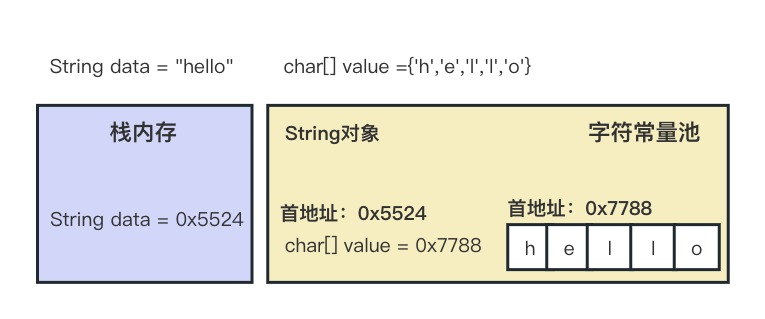
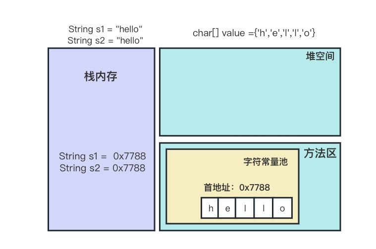
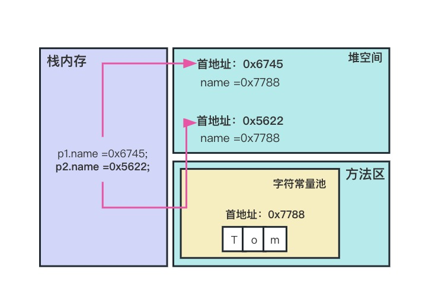
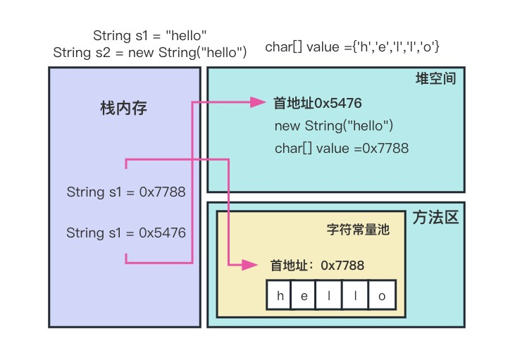

### 字符串相关类之不可变字符序列：String

#### String的特性

- `java.lang.String`类代表字符串。Java程序中所有的字符串文字都可以看作是实现此类的实例。
- 字符串是常量，用双引号引起来表示。它们的值在创建之后不能更改。
- 字符串String类型本身是final声明的，意味我们不能继承String
- String对象的字符内容是存储在一个字符数组value[]中的。`"hello"`等效于`char [] data = {'h','e','l','l','o'}`



```java
//JDK8.0中String源码
public final class String
    implements java.io.Serializable, Comparable<String>, CharSequence {
    /** The value is used for character storage. */
    private final char value[];	//String 对象的字符内容是存储在此数组中
```

- private意味着外面无法直接获取字符数组，而且String没有提供value的get和set方法
- final意味字符数组的引用不可改变，而且String也没有提供方法来修改value数组某个元素
- 因此字符串的字符数组内容也是不可改变的，即String代表着不可变的字符序列。即，一旦对字符串进行修改，就会产生新的对象。
- JDK9.0之后，底层使用byte[]数组

```java
//JDK9.0中String源码
public final class String
    implements java.io.Serializable, Comparable<String>, CharSequence,
               Constable, ConstantDesc {
    /**
     * The value is used for character storage.
     *
     * @implNote This field is trusted by the VM, and is a subject to
     * constant folding if String instance is constant. Overwriting this
     * field after construction will cause problems.
     *
     * Additionally, it is marked with {@link Stable} to trust the contents
     * of the array. No other facility in JDK provides this functionality (yet).
     * {@link Stable} is safe here, because value is never null.
     */
    @Stable
    private final byte[] value;
```

> Java语言提供堆字符串串联符号`+`以及将其它对象转为字符串的特殊支持（toString方法）。

### String的内存结构

因为字符串对象设计为不可变，那么所以字符串有 常量池来保存很对常量对象。JDK6中，字符串常量池在方法区。JDK7开始，就移到堆空间中。

#### 使用字面量赋值



```java
    public void test(){
        String s1 = "hello";
        String s2 = "hello";
        System.out.println(s1 == s2);   //true
    }
```



```java
public class StringDemo {
    public static void main(String[] args) {
        Person p1 = new Person();
        Person p2 = new Person();
        p1.name = "Tom";
        p2.name = "Tom";
        System.out.println(p1==p2); //false
    }
}
class Person{
    String name;
}
```

#### 使用new构造器赋值



```java
    public void test2() {
      	String s1 = "hello";
        String s2 = new String("hello");
        System.out.println(s1 == s2);   //false
    }
```

> s2首先指向堆中的一个字符串对象，然后堆中字符串对象的value数组指向常量池中常量对象的value数组
>
> - 字符串常量存储在字符串常量池，目的是共享
> - 字符串非常量对象存储在堆中

**练习：String s2 = new String("hello")；在内存中创建了几个对象？**

```txt
2个
```

#### intern()

```java
   public void test4() {
        String s1 = "hello";
        String s2 = "world";
        String s3 = "hello" + "world";
        String s4 = s1 + "world";
        String s5 = s1 + s2;
        String s6 = (s1 + s2).intern();
        System.out.println(s3 == s4);   //false
        System.out.println(s3 == s5);   //false
        System.out.println(s4 == s5);   //false
        System.out.println(s3 == s6);   //true
    }
```

> 结论：
>
> - 常量+常量：结果是常量池。且常量池中不会存在相同内容的常量。
> - 变量与常量或变量与变量：结果在堆中
> - 拼接后调用intern()方法：返回值在常量池中