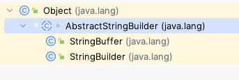

### 字符串相关类之不可变字符序列：String

#### String的特性

- `java.lang.String`类代表字符串。Java程序中所有的字符串文字都可以看作是实现此类的实例。
- 字符串是常量，用双引号引起来表示。它们的值在创建之后不能更改。
- 字符串String类型本身是final声明的，意味我们不能继承String
- String对象的字符内容是存储在一个字符数组value[]中的。`"hello"`等效于`char [] data = {'h','e','l','l','o'}`


```java
//JDK8.0中String源码
public final class String
    implements java.io.Serializable, Comparable<String>, CharSequence {
    /** The value is used for character storage. */
    private final char value[];	//String 对象的字符内容是存储在此数组中
```

- private意味着外面无法直接获取字符数组，而且String没有提供value的get和set方法
- final意味字符数组的引用不可改变，而且String也没有提供方法来修改value数组某个元素
- 因此字符串的字符数组内容也是不可改变的，即String代表着不可变的字符序列。即，一旦对字符串进行修改，就会产生新的对象。
- JDK9.0之后，底层使用byte[]数组

```java
//JDK9.0中String源码
public final class String
    implements java.io.Serializable, Comparable<String>, CharSequence,
               Constable, ConstantDesc {
    /**
     * The value is used for character storage.
     *
     * @implNote This field is trusted by the VM, and is a subject to
     * constant folding if String instance is constant. Overwriting this
     * field after construction will cause problems.
     *
     * Additionally, it is marked with {@link Stable} to trust the contents
     * of the array. No other facility in JDK provides this functionality (yet).
     * {@link Stable} is safe here, because value is never null.
     */
    @Stable
    private final byte[] value;
```

> Java语言提供堆字符串串联符号`+`以及将其它对象转为字符串的特殊支持（toString方法）。

### String的内存结构

因为字符串对象设计为不可变，那么所以字符串有 常量池来保存很对常量对象。JDK6中，字符串常量池在方法区。JDK7开始，就移到堆空间中。

#### 使用字面量赋值


```java
    public void test(){
        String s1 = "hello";
        String s2 = "hello";
        System.out.println(s1 == s2);   //true
    }
```


```java
public class StringDemo {
    public static void main(String[] args) {
        Person p1 = new Person();
        Person p2 = new Person();
        p1.name = "Tom";
        p2.name = "Tom";
        System.out.println(p1==p2); //false
    }
}
class Person{
    String name;
}
```

#### 使用new构造器赋值


```java
    public void test2() {
      	String s1 = "hello";
        String s2 = new String("hello");
        System.out.println(s1 == s2);   //false
    }
```

> s2首先指向堆中的一个字符串对象，然后堆中字符串对象的value数组指向常量池中常量对象的value数组
>
> - 字符串常量存储在字符串常量池，目的是共享
> - 字符串非常量对象存储在堆中

**练习：String s2 = new String("hello")；在内存中创建了几个对象？**

```txt
2个
```

#### intern()

```java
   public void test4() {
        String s1 = "hello";
        String s2 = "world";
        String s3 = "hello" + "world";
        String s4 = s1 + "world";
        String s5 = s1 + s2;
        String s6 = (s1 + s2).intern();
        System.out.println(s3 == s4);   //false
        System.out.println(s3 == s5);   //false
        System.out.println(s4 == s5);   //false
        System.out.println(s3 == s6);   //true
    }
```

> 结论：
>
> - 常量+常量：结果是常量池。且常量池中不会存在相同内容的常量。
> - 变量与常量或变量与变量：结果在堆中
> - 拼接后调用intern()方法：返回值在常量池中

```java
	public void test2() {
        String s1 = new String("hello");
        String s2 = "hello";
        System.out.println(s1 == s2);   //false
    }
    @Test
    public void test3() {
        String s1 = "hello";
        String s2 = "hello";
        System.out.println(s1 == s2); //true
        s2 += "world";
        s1 = "helloworld";
        System.out.println(s1 == s2); //false
    }
    @Test
    public void test4() {
        String s1 = "hello";
        String s2 = "world";
        String s3 = "hello" + "world";
        String s4 = s1 + "world";
        String s5 = s1 + s2;
        String s6 = (s1 + s2).intern();
        System.out.println(s3 == s4);   //false
        System.out.println(s3 == s5);   //false
        System.out.println(s4 == s5);   //false
        System.out.println(s3 == s6);   //true
    }
    @Test
    public void test5() {
        String s1 = "hello";
        String s2 = "world";
        String s3 = "helloworld";
        String s4 = s1 + "world";
        String s5 = s1 + s2;
        String s6 = "hello" + "world";
        System.out.println(s3 == s4);   //false
        System.out.println(s3 == s5);   //false
        System.out.println(s3 == s6);   //true
    }
    @Test
    public void test06(){
        final String s1 = "hello";
        final String s2 = "world";
        String s3 = "helloworld";
        String s4 = s1 + "world";
        String s5 = s1 + s2;
        String s6 = "hello" + "world";
        System.out.println(s3 == s4);//true
        System.out.println(s3 == s5);//true
        System.out.println(s3 == s6);//true
    }
    @Test
    public void test07(){
        String s1 = "hello";
        String s2 = "world";
        String s3 = "helloworld";
        String s4 = (s1 + "world").intern();//把拼接的结果放到常量池中
        String s5 = (s1 + s2).intern();
        System.out.println(s3 == s4);//true
        System.out.println(s3 == s5);//true
    }
    @Test
    public void test08(){
        String str = "hello";
        String str2 = "world";
        String str3 ="helloworld";
        String str4 = "hello".concat("world");  //返回值是new的在堆中
        String str5 = "hello"+"world";
        System.out.println(str3 == str4);//false
        System.out.println(str3 == str5);//true
    }
```

**练习：下列程序运行结果**

```java
public class StringTest1 {
    String str = new String("good");
    char[] ch = {'g','o','o','d'};
    public void change(String str,char[] ch){
        str = "hello";
        ch[0] ='G';
    }
    public static void main(String[] args) {
        StringTest1 t = new StringTest1();
        t.change(t.str,t.ch);
        System.out.println(t.str);  //good
        for (int i = 0; i < t.ch.length; i++) { //Good
            System.out.print(t.ch[i]+"\t");
        }
    }
}
```

### String的常用API

#### 构造器

- `public String() ` ：初始化新创建的 String对象，以使其表示空字符序列。
- ` String(String original)`： 初始化一个新创建的 `String` 对象，使其表示一个与参数相同的字符序列；换句话说，新创建的字符串是该参数字符串的副本。
- `public String(char[] value) ` ：通过当前参数中的字符数组来构造新的String。
- `public String(char[] value,int offset, int count) ` ：通过字符数组的一部分来构造新的String。
- `public String(byte[] bytes) ` ：通过使用平台的**默认字符集**解码当前参数中的字节数组来构造新的String。
- `public String(byte[] bytes,String charsetName) ` ：通过使用指定的字符集解码当前参数中的字节数组来构造新的String。

```java
   public void test01() throws Exception{
        String s1 = new String("hello");
        String s2 = new String(s1);
        System.out.println(s2==s1); //false
        char[] s3 = {'h','e','l','l','o'};
        String s4 = new String(s3);
        System.out.println(s4); //hello
        byte[] b = {65,66,67};
        System.out.println(new String(b));  //ABC
        String s5 = new String(b,"utf-8");
    }
```

#### String与其他结构间的转换

**字符串 --> 基本数据类型、包装类：**

- Integer包装类的public static int parseInt(String s)：可以将由“数字”字符组成的字符串转换为整型。
- 类似的，使用java.lang包中的Byte、Short、Long、Float、Double类调相应的类方法可以将由“数字”字符组成的字符串，转化为相应的基本数据类型。

**基本数据类型、包装类 --> 字符串：**

- 调用String类的public String valueOf(int n)可将int型转换为字符串
- 相应的valueOf(byte b)、valueOf(long l)、valueOf(float f)、valueOf(double d)、valueOf(boolean b)可由参数的相应类型到字符串的转换。

 **字符数组 -->  字符串：**

- String 类的构造器：String(char[]) 和 String(char[]，int offset，int length) 分别用字符数组中的全部字符和部分字符创建字符串对象。 

 **字符串 -->  字符数组：**

- public char[] toCharArray()：将字符串中的全部字符存放在一个字符数组中的方法。

- public void getChars(int srcBegin, int srcEnd, char[] dst, int dstBegin)：提供了将指定索引范围内的字符串存放到数组中的方法。

**字符串 --> 字节数组：（编码）**

- public byte[] getBytes() ：使用平台的默认字符集将此 String 编码为 byte 序列，并将结果存储到一个新的 byte 数组中。
- public byte[] getBytes(String charsetName) ：使用指定的字符集将此 String 编码到 byte 序列，并将结果存储到新的 byte 数组。

 **字节数组 --> 字符串：（解码）**

- String(byte[])：通过使用平台的默认字符集解码指定的 byte 数组，构造一个新的 String。
- String(byte[]，int offset，int length) ：用指定的字节数组的一部分，即从数组起始位置offset开始取length个字节构造一个字符串对象。
- String(byte[], String charsetName ) 或 new String(byte[], int, int,String charsetName )：解码，按照指定的编码方式进行解码。

```java
    public void test02(){
        String s1 = "helloworld";
        char[] ch = s1.toCharArray();
        String s2 = "ABC";
        byte[] b = s2.getBytes();
        String s3 = "456";
        int i = Integer.parseInt(s3);
        double d =45.3;
        String s4 = String.valueOf(d);
    }
```

### String常用API-2

`String`类包括的方法可用于检查序列的单个字符、比较字符串、搜索字符串、提取字符串、创建字符串副本并将所有字符全部转换为大写或小写。

#### 常用方法：

- boolean isEmpty()：字符串是否为空
- int length()：返回字符串的长度
- String concat(xx)：拼接
- boolean equals(Object obj)：比较字符串是否相等，区分大小写
- boolean equalsIgnoreCase(Object obj)：比较字符串是否相等，不区分大小写
- int compareTo(String other)：比较字符串大小，区分大小写，按照Unicode编码值比较大小;
- int compareToIgnoreCase(String other)：比较字符串大小，不区分大小写
- String toLowerCase()：将字符串中大写字母转为小写
- String toUpperCase()：将字符串中小写字母转为大写
- String trim()：去掉字符串前后空白符
- public String intern()：结果在常量池中共享

```java
		public void test03(){
        String s1 = "helloworld";
        System.out.println(s1.isEmpty());   //false
        System.out.println("".isEmpty());   //true
        System.out.println(s1.length());   //10
        String s2 = s1.concat("!!!");
        System.out.println(s2); //helloworld!!!
        String s3 = "HELLOWORLD";
        System.out.println(s1.equals(s3));  //false
        System.out.println(s1.equalsIgnoreCase(s3)); //true
        System.out.println("A".compareTo("a")); //-32
        System.out.println("A".compareToIgnoreCase("a")); //0
        System.out.println("abcd".toUpperCase());   //ABCD
        System.out.println("EFG".toLowerCase());    //efg
        System.out.println("    a b    ".trim());
        String str = "你好";
        String str1 = str.intern();
        System.out.println(str == str1);    //true
    }
```

#### 查找方法：

- boolean contains(xx)：是否包含xx
- int indexOf(xx)：从前往后找当前字符串中xx，即如果有返回第一次出现的下标，要是没有返回-1
- int indexOf(String str, int fromIndex)：返回指定子字符串在此字符串中第一次出现处的索引，从指定的索引开始
- int lastIndexOf(xx)：从后往前找当前字符串中xx，即如果有返回最后一次出现的下标，要是没有返回-1
- int lastIndexOf(String str, int fromIndex)：返回指定子字符串在此字符串中最后一次出现处的索引，从指定的索引开始反向搜索。

```java
   public void test04(){
        String s1 = "helloworldhello";
        System.out.println(s1.contains("wor")); //true
        System.out.println(s1.indexOf("ll"));    //2
        System.out.println(s1.indexOf("ll",7)); //12
        System.out.println(s1.lastIndexOf("ld"));   //8
        System.out.println(s1.lastIndexOf("ll",10)); //2
    }
```

#### 字符串截取

- String substring(int beginIndex) ：返回一个新的字符串，它是此字符串的从beginIndex开始截取到最后的一个子字符串。 
- String substring(int beginIndex, int endIndex) ：返回一个新字符串，它是此字符串从beginIndex开始截取到endIndex(不包含)的一个子字符串。 
- public String[] split(String regex)：根据regex作为分隔符分割字符串返回一个数组

```java
	public void test05(){
       String s1 = "helloworld";
        System.out.println(s1.substring(7));    //rld
        System.out.println(s1.substring(3,6));  //low
        String s2 = "hello.java";
        System.out.println("文件后缀名："+s2.substring(s2.lastIndexOf("."))); //.java
        System.out.println("文件名："+s2.substring(0,s2.lastIndexOf("."))); //hello
        String s3 = "hello world 你好 世界";
        String[] s = s3.split(" ");	//以空格分割符分割字符串
        System.out.println(Arrays.toString(s)); //[hello, world, 你好, 世界]
        System.out.println(s[0]);
	}
```

#### 字符/字符数组

- char charAt(index)：返回[index]位置的字符
- char[] toCharArray()： 将此字符串转换为一个新的字符数组返回
- static String valueOf(char[] data)  ：返回指定数组中表示该字符序列的 String
- static String valueOf(char[] data, int offset, int count) ： 返回指定数组中表示该字符序列的 String
- static String copyValueOf(char[] data)： 返回指定数组中表示该字符序列的 String
- static String copyValueOf(char[] data, int offset, int count)：返回指定数组中表示该字符序列的 String

```java
    public void test06(){
        String s1 = "helloworld";
        System.out.println(s1.charAt(2));   //l
        char[] ch = s1.toCharArray();
        char[] ch2 = {'l','o','w'};
        String s2 = String.valueOf(ch2);
        String s3 = String.copyValueOf(ch);
    }
```

#### 开头与结尾

- boolean startsWith(xx)：测试此字符串是否以指定的前缀开始 
- boolean startsWith(String prefix, int toffset)：测试此字符串从指定索引开始的子字符串是否以指定前缀开始
- boolean endsWith(xx)：测试此字符串是否以指定的后缀结束 

```java
    public void test07(){
        String s1 = "helloworld";
        System.out.println(s1.startsWith("h")); //true
        System.out.println(s1.endsWith("d"));   //true
        System.out.println(s1.startsWith("w",5));   //true
    }
```

#### 替换

- String replace(char oldChar, char newChar)：返回一个新的字符串，它是通过用 newChar 替换此字符串中出现的所有 oldChar 得到的。 不支持正则。
- String replace(CharSequence target, CharSequence replacement)：使用指定的字面值替换序列替换此字符串所有匹配字面值目标序列的子字符串。
- String replaceAll(String regex, String replacement)：使用给定的 replacement 替换此字符串所有匹配给定的正则表达式的子字符串。 
- String replaceFirst(String regex, String replacement)：使用给定的 replacement 替换此字符串匹配给定的正则表达式的第一个子字符串。 

```java
	public void test08(){
        String s1 = "helloworld";
        String s2 = s1.replace("world","世界");
        System.out.println(s2); //hello世界
        String str1 = "hello244world.java;887";
        //把其中的非字母去掉
        str1 = str1.replaceAll("[^a-zA-Z]", "");
        System.out.println(str1);
        String str2 = "12hello34world5java7891mysql456";
        //把字符串中的数字替换成,，如果结果中开头和结尾有，的话去掉
        String string = str2.replaceAll("\\d+", ",").replaceAll("^,|,$", "");
        System.out.println(string);
    }
```

#### 常见算法题

```java
public class StringUtil {
    //取消字符串所有空格
    public static String trimOfAll(String str){
        String s = "";
        if (str != null){
            for (int i = 0; i < str.length(); i++) {
                if (str.substring(i,i+1).equals(" ")){
                    continue;
                }else {
                    s += str.substring(i,i+1);
                }
            }
        }
        return s;
    }
    //去掉字符串两端空格
    public static String trim(String str){
        int start = 0;
        int end =0;
        if (str != null){
            for (int i = 0; i < str.length(); i++) {
                if (str.charAt(i) == ' '){
                    continue;
                }else {
                    start = i;
                    break;
                }
            }
            for (int i = str.length()-1; i >= 0; i--) {
                if (str.charAt(i) == ' '){
                    continue;
                }else {
                    end = i;
                    break;
                }
            }
        }
        return str.substring(start,end+1);
    }
    public static String trim2(String str){
        if (str != null){
            int start = 0;
            int end = str.length()-1;
            while (start < end && str.charAt(start) == ' '){
                start++;
            }
            while (end > start && str.charAt(end) == ' '){
                end--;
            }
            return str.substring(start,end+1);
        }
        return null;
    }
    //指定范围字符串的反转
    public static String reversel(String str,int start,int end){
        if (str != null){
            char[] charArray = str.toCharArray();
            for (int i = start,j=end; i < j; i++,j--) {
                char temp = charArray[i];
                charArray[i] = charArray[j];
                charArray[j] = temp;
            }
            return new String(charArray);
        }
        return null;
    }
    public static String reversel2(String str,int start,int end){
        if (str!=null){
            String newStr = str.substring(0,start);
            for (int i = end; i >= start; i--) {
                newStr += str.charAt(i);
            }
            return new String(newStr+str.substring(end+1));
        }
        return null;
    }
    public static String reversel3(String str,int start,int end){
        if (str!=null){
            StringBuffer sb = new StringBuffer(str.length());
            sb.append(str.substring(0,start));
            for (int i = end; i >= start; i--) {
                sb.append(str.charAt(i));
            }
            return sb.append(str.substring(end+1)).toString();
        }
        return null;
    }
    //获取一个字符串在另一个字符串中出现的次数
    public static int getCount(String str,String subStr){
        if (str.equals(subStr)){
            return 0;
        }
        int count = 0;
        if (str.length()>=subStr.length()){
            int index = 0;
            for (int i = index; i < str.length(); i++) {
                if (str.indexOf(subStr,index) != -1){
                    index = str.indexOf(subStr,index)+subStr.length();
                    count++;
                }else {
                    break;
                }
            }
        }
        return count;
    }
    //对字符串进行自然顺序排序
    public static String stringSort(String str){
        char[] ch = str.toCharArray();
        Arrays.sort(ch);
        return new String(ch);
    }
    public static void main(String[] args) {
        System.out.println(StringUtil.trimOfAll("   shjansa  sa   "));
//        System.out.println(StringUtil.trim("   sh  hb  ")+"**");
        System.out.println(StringUtil.trim2("   sh  hb  ")+"**");
        System.out.println(StringUtil.reversel3("helloworld",2,6));  //heowollrld
        System.out.println(StringUtil.getCount( "abkkcadkabkebfkabkskab","ab"));
        System.out.println(StringUtil.stringSort("DCBA"));  //ABCD
    }
}
```

### 字符串相关类之可变字符序列：StringBuffer、StringBuilder

因为String对象是不可变对象，虽然可以共享常量对象，但是对于频繁字符串的修改和拼接操作，效率极低，空间消耗也比较高。因此，JDK又在java.lang包提供了可变字符串序列StringBuffer和StringBuilder类型。

#### StringBuffer与StringBuilder概述

java.lang.StringBuffer代表可变字符序列，JDK1.0中声明，可以对字符串内容进行增删，此时不会产生新的对象。

```java
public class StringBufferTest {
    public static void main(String[] args) {
        StringBuffer sb = new StringBuffer("我喜欢学习");
        sb.append(" JAVA");
        System.out.println(sb); //我喜欢学习 JAVA
    }
}
```

#### 继承结构



#### StringBuffer与StringBuilder区别

StringBuilder和StringBuffer非常相似，均代表可变字符序列，而且提供相关功能的方法也一样。

- String、StringBuffer、StringBuilder区别：
  - String：不可变字符序列；底层使用char[]数组存储(JDK8.0中)
  - StringBuffer：可变的字符序列；线程安全（方法有synchronized修饰），效率低；底层使用char[]数组存储（JDK8.0中）
  - StringBuilder：可变的字符序列；JDK1.5引入，线程不安全的，效率高；底层使用char[]数组存储（JDK8.0中）

> 当append和insert时，如果原来value数组长度不够，可扩容。
>
> ```java
> //JDK1.8源码   
> @Override    
> synchronized StringBuffer append(String str) {        
> toStringCache = null;        
> super.append(str);      
> return this;   
> }
> ```

### StringBuilder、StringBuffer的API

StringBuilder、StringBuffer的API是完全一致的，并且很多方法与String相同。

#### 常用API

- StringBuffer append(xx)：提供了很多的append()方法，用于进行字符串追加的方式拼接
- StringBuffer delete(int start, int end)：删除[start,end)之间字符
- StringBuffer deleteCharAt(int index)：删除[index]位置字符
- StringBuffer replace(int start, int end, String str)：替换[start,end)范围的字符序列为str
- void setCharAt(int index, char c)：替换[index]位置字符
- char charAt(int index)：查找指定index位置上的字符
- StringBuffer insert(int index, xx)：在[index]位置插入xx
- int length()：返回存储的字符数据的长度
- StringBuffer reverse()：反转

#### 其他API

- int indexOf(String str)：在当前字符序列中查询str的第一次出现下标
- int indexOf(String str, int fromIndex)：在当前字符序列[fromIndex,最后]中查询str的第一次出现下标
- int lastIndexOf(String str)：在当前字符序列中查询str的最后一次出现下标
- int lastIndexOf(String str, int fromIndex)：在当前字符序列[fromIndex,最后]中查询str的最后一次出现下标
- String substring(int start)：截取当前字符序列[start,最后]
- String substring(int start, int end)：截取当前字符序列[start,end)
- String toString()：返回此序列中数据的字符串表示形式
- void setLength(int newLength) ：设置当前字符序列长度为newLength

```java
public class StringBuilderTest {
    @Test
    public void test01(){
        StringBuilder sb = new StringBuilder();
        sb.append("hello").append(true).append('a').append(123);
        System.out.println(sb); //hellotruea123
        System.out.println(sb.length());    //13
    }
    @Test
    public void test02(){
        StringBuilder sb = new StringBuilder("helloworld");
        sb.insert(5,"java");
        System.out.println(sb); //hellojavaworld
    }
    @Test
    public void test03(){
        StringBuilder sb = new StringBuilder("helloworld");
        sb.deleteCharAt(2);
        sb.delete(5,10);
        System.out.println(sb); //helow
    }
    @Test
    public void test04(){
        StringBuilder sb = new StringBuilder("helloworld");
        sb.reverse();
        System.out.println(sb); //dlrowolleh
    }
    @Test
    public void test05(){
        StringBuilder sb = new StringBuilder("helloworld");
        sb.setCharAt(2,'A');
        System.out.println(sb); //heAloworld
    }
    @Test
    public void test06(){
        StringBuilder sb = new StringBuilder("helloworld");
        sb.setLength(15);
        System.out.println(sb); //helloworld
        System.out.println(sb.length());    //15
    }
}
```

#### String、StringBuffer、StringBuilder效率对比

```java
public class EfficiencyTest {
    public static void main(String[] args) {
        //初始设置
        long startTime = 0L;
        long endTime = 0L;
        String text = "";
        StringBuffer buffer = new StringBuffer("");
        StringBuilder builder = new StringBuilder("");

				//开始对比
        startTime = System.currentTimeMillis();
        for (int i = 0; i < 20000; i++) {
            buffer.append(String.valueOf(i));
        }
        endTime = System.currentTimeMillis();
        System.out.println("StringBuffer的执行时间：" + 
                           (endTime - startTime));  //StringBuffer的执行时间：4 						
        startTime = System.currentTimeMillis();
        for (int i = 0; i < 20000; i++) {
            builder.append(String.valueOf(i));
        }
        endTime = System.currentTimeMillis();
        System.out.println("StringBuilder的执行时间：" + 
                           (endTime - startTime));  //StringBuilder的执行时间：3
        startTime = System.currentTimeMillis();
        for (int i = 0; i < 20000; i++) {
            text = text + i;
        }
        endTime = System.currentTimeMillis();
        System.out.println("String的执行时间：" + 
                           (endTime - startTime));  //String的执行时间：995
    }
}
```

#### 面试题

```java
public class InterviewQuestion {
    public static void main(String[] args) {
        String str = null;
        StringBuilder sb = new StringBuilder();
        sb.append(str);
        System.out.println(sb); //null
        System.out.println(sb.length());    //4
        StringBuilder sb2 = new StringBuilder(str); //NullPointerException
        System.out.println(sb2);
    }
}
```

### JDK8之前：日期时间API

#### java.lang.System类方法

- System类提供的`public static native long currentTimeMillis();`：用于返回当前时间与1970年1月1日0时0分0秒之间以毫秒为单位的时间戳

- 计算世界时间的主要标准：

  - UTC(Coordinated Universal Time)
  - GMT(Greenwich Mean Time)
  - CST(Central Standard Time)

  > 在国际无线电通信场合，为统一起见，使用一个统一的时间，称为通用协调时（UTC, Universal Time Coordinated）。UTC与格林尼治平均时(GMT, Greenwich Mean Time)一样，都与英国伦敦的本地时相同。这里，UTC与GMT含义完全相同。 

```java
  public void test02(){
        long timemillis = System.currentTimeMillis();   //获取当前时间戳ms
        System.out.println(timemillis);
    }
```

#### java.util.Date

表示特定的瞬间，精确到毫秒

- 构造器：
  - Date()：使用无参构造器创建的对象可以获取本地当前时间
  - Date(long 时间戳)：把该时间戳值换算成日期时间对象
- 常用方法
  - getTime()： 返回自 1970 年 1 月 1 日 00:00:00 GMT 以来此 Date 对象表示的毫秒数。
  - toString()：把此 Date 对象转换为以下形式的 String： dow mon dd hh:mm:ss zzz yyyy 其中： dow 是一周中的某一天 (Sun, Mon, Tue, Wed, Thu, Fri, Sat)，zzz是时间标准。

```java
    public void test01(){
        Date now = new Date();
        System.out.println(now);    //Sat Jul 01 15:27:41 CST 2023
        System.out.println(now.getTime()); //获取当前时间戳
        Date dateTime = new Date(1358196487047L);
        System.out.println(dateTime); //Tue Jan 15 04:48:07 CST 2013
    }
```

#### java.text.SimpleDateFormat

- java.text.SimpleDateFormat类是一个不与语言环境有关的方式来格式化和解析日期的具体类
- 可以进行格式化：日期 -->文本
- 可以解析：文本-->日期
- 构造器：
  - SimpleDateFormat()：默认的模式和语言环境创建对象
  - SimpleDateFormat(String pattern)：可以用参数pattern指定的格式创建一个对象
- 格式化：
  - public String format(Date date)：方法格式化时间对象date
- 解析：
  - public Date parse(String source)：从给定字符串的开始解析文本，以生成一个日期。

```java
 public void test03() throws ParseException {
        Date date = new Date();
        SimpleDateFormat sdf = new SimpleDateFormat("yyyy-MM-dd HH:mm:ss");
        String strDate = sdf.format(date);
        System.out.println(strDate);    //2023-07-01 15:33:49
        Date date1 = sdf.parse("2020-12-11 10:05:33");	//解析文本日期
        System.out.println(date1);  //Fri Dec 11 10:05:33 CST 2020
    }
```

#### java.util.Calendar（日历）

- Date类的API大部分被废弃，替换Calendar
- `Calendar`类是一个抽象类，主要用于完成日期字段之间相互操作的功能
- 获取Calendar实例的方法
  - Calendar.getInstance()方法
  - 调用它的子类GregorianCalendar的构造器
- 一个Calendar的实例是系统时间的抽象表示，可以修改或获取YEAR、MONTH、DAY_OF_WEEK、HOUR_OF_DAY、MINUTE、SECOND等日历字段对应的时间值。
  - public int get(int field)：返回给定日历字段的值
  - public void set(int field, int value)：将给定的日历字段设置为指定的值
  - public void add(int field, int amount)：根据日历的规则，为给定的日历字段添加或减去指定的时间量
  - public final Date getTime()：将Calendar转成Date对象
  - public final void setTime(Date date)：使用指定的Date对象重置Calendar的时间
- 常用字段

| 字段值       | 含义                      |
| ------------ | ------------------------- |
| YEAR         | 年                        |
| MONTH        | 月（从0开始，可以+1使用） |
| DAY_OF_MONTH | 月中的天（几号）          |
| HOUR         | 时（12小时制）            |
| HOUR_OF_DAY  | 时（24小时制度）          |
| MINUTE       | 分                        |
| SECOND       | 秒                        |
| DAY_OF_WEEK  | 周中的天（周日为1）       |

- 注意：
  - 获取月份时：一月是0，二月是1
  - 获取星期时：周日是1，周二是2

```java
public class CalendarTest {
    @Test
    public void test01(){
        Calendar calendar = Calendar.getInstance();
        System.out.println(calendar.get(Calendar.YEAR)+"-"+
                calendar.get(Calendar.MONTH)+"-"+calendar.get(Calendar.DATE)+
                " "+calendar.get(Calendar.HOUR)+":"+calendar.get(Calendar.MINUTE)+
                ":"+calendar.get(Calendar.SECOND)); //2023-6-1 3:52:34;月份从0-11
    }
    @Test
    public void test02(){
        TimeZone tz = TimeZone.getTimeZone("America/Los_Angeles");  //设置时区
//        Calendar calendar = Calendar.getInstance(tz);
        Calendar calendar = new GregorianCalendar(tz);
        System.out.println(calendar.get(Calendar.YEAR)+"-"+
                calendar.get(Calendar.MONTH)+"-"+calendar.get(Calendar.DATE)+
                " "+calendar.get(Calendar.HOUR)+":"+calendar.get(Calendar.MINUTE)+
                ":"+calendar.get(Calendar.SECOND)); //2023-6-1 0:49:14
    }
    @Test
    public void test03(){
        Calendar calendar = Calendar.getInstance();
        Date date = calendar.getTime();
        System.out.println(date); //Sat Jul 01 15:54:41 CST 2023
        calendar.setTime(new Date(1358196487047L));
        System.out.println(calendar.getTime()); //Tue Jan 15 04:48:07 CST 2013
        calendar.set(Calendar.DAY_OF_MONTH,8);
        System.out.println(calendar.getTime()); //Tue Jan 08 04:48:07 CST 2013
        calendar.add(Calendar.HOUR,10);
        System.out.println(calendar.getTime()); //Tue Jan 08 14:48:07 CST 2013
        calendar.add(Calendar.HOUR,-2);
        System.out.println(calendar.getTime()); //Tue Jan 08 12:48:07 CST 2013
    }
}
```

### JKD8:新的日期时间API

- 可变性：像日期和时间这样的类应该是不可变的
- 偏移性：Date中的年份是从1990年开始的，而月份是从0开始的
- 格式化：格式化只对Date有用，Calendar则不行。
- 此外，它们也不是线程安全的；不能处理闰秒等。

> 闰秒，是指为保持协调世界时接近于世界时时刻，由国际计量局统一规定在年底或年中（也可能在季末）对协调世界时增加或减少1秒的调整。由于地球自转的不均匀性和长期变慢性（主要由潮汐摩擦引起的），会使世界时（民用时）和原子时之间相差超过到±0.9秒时，就把协调世界时向前拨1秒（负闰秒，最后一分钟为59秒）或向后拨1秒（正闰秒，最后一分钟为61秒）； 闰秒一般加在公历年末或公历六月末。
>
> 目前，全球已经进行了27次闰秒，均为正闰秒。

#### Java 8中引入java.time API 

- `java.time` – 包含值对象的基础包
- `java.time.chrono` – 提供对不同的日历系统的访问。
- `java.time.format` – 格式化和解析时间和日期
- `java.time.temporal` – 包括底层框架和扩展特性
- `java.time.zone` – 包含时区支持的类

>说明：新的 java.time 中包含了所有关于时钟（Clock），本地日期（LocalDate）、本地时间（LocalTime）、本地日期时间（LocalDateTime）、时区（ZonedDateTime）和持续时间（Duration）的类。

#### 本地日期时间：LocalDate、LocalTime、LocalDateTime

| 方法                                                         | **描述**                                                     |
| ------------------------------------------------------------ | ------------------------------------------------------------ |
| `now() `/ now(ZoneId zone)                                   | 静态方法，根据当前时间创建对象/指定时区的对象                |
| `of(xx,xx,xx,xx,xx,xxx)`                                     | 静态方法，根据指定日期/时间创建对象                          |
| getDayOfMonth()/getDayOfYear()                               | 获得月份天数(1-31) /获得年份天数(1-366)                      |
| getDayOfWeek()                                               | 获得星期几(返回一个 DayOfWeek 枚举值)                        |
| getMonth()                                                   | 获得月份, 返回一个 Month 枚举值                              |
| getMonthValue() / getYear()                                  | 获得月份(1-12) /获得年份                                     |
| getHours()/getMinute()/getSecond()                           | 获得当前对象对应的小时、分钟、秒                             |
| withDayOfMonth()/withDayOfYear()/withMonth()/withYear()      | 将月份天数、年份天数、月份、年份修改为指定的值并返回新的对象 |
| with(TemporalAdjuster  t)                                    | 将当前日期时间设置为校对器指定的日期时间                     |
| plusDays(), plusWeeks(), plusMonths(), plusYears(),plusHours() | 向当前对象添加几天、几周、几个月、几年、几小时               |
| minusMonths() / minusWeeks()/minusDays()/minusYears()/minusHours() | 从当前对象减去几月、几周、几天、几年、几小时                 |
| plus(TemporalAmount t)/minus(TemporalAmount t)               | 添加或减少一个 Duration 或 Period                            |
| isBefore()/isAfter()                                         | 比较两个 LocalDate                                           |
| isLeapYear()                                                 | 判断是否是闰年（在LocalDate类中声明）                        |
| format(DateTimeFormatter  t)                                 | 格式化本地日期、时间，返回一个字符串                         |
| parse(Charsequence text)                                     | 将指定格式的字符串解析为日期、时间                           |

```java
public class LocalDateTimeTest {
    @Test
    public void test01(){
        LocalDate date = LocalDate.now();
        System.out.println(date);   //2023-07-01
        date = LocalDate.of(2022,12,1);
        System.out.println(date);   //2022-12-01
    }
    @Test
    public void test02(){
        LocalTime time = LocalTime.now();
        System.out.println(time);   //16:26:28.343
        time = LocalTime.of(00,20,34);
        System.out.println(time);   //00:20:34
    }
    @Test
    public void test03(){
        LocalDateTime dateTime = LocalDateTime.now();
        System.out.println(dateTime); //2023-07-01T16:27:14.465
        dateTime = LocalDateTime.of(2012,12,20,12,20,34);
        System.out.println(dateTime);   //2012-12-20T12:20:34
      	System.out.println(dateTime.getYear()+"/"
                         +dateTime.getMonthValue()+"/"+dateTime.getDayOfMonth());
        dateTime = dateTime.plusDays(10);
        System.out.println(dateTime);   //2012-12-30T12:20:34
    }
}
```

#### 瞬时：Instant

- Instant：时间线上的一个瞬间点。可能被用来记录应用程序中的事件时间戳。
- `java.time.Instant`表示时间线上的一点，而不需要任何上下文信息，例如，时区。概念上讲，`它只是简单的表示自1970年1月1日0时0分0秒（UTC）开始的秒数。`

| **方法**                        | **描述**                                                     |
| ------------------------------- | ------------------------------------------------------------ |
| `now()`                         | 静态方法，返回默认UTC时区的Instant类的对象                   |
| `ofEpochMilli(long epochMilli)` | 静态方法，返回在1970-01-01 00:00:00基础上加上指定毫秒数之后的Instant类的对象 |
| atOffset(ZoneOffset offset)     | 结合即时的偏移来创建一个 OffsetDateTime                      |
| `toEpochMilli()`                | 返回1970-01-01 00:00:00到当前时间的毫秒数，即为时间戳        |

#### 日期时间格式化：DateTimeFormatter

该类提供了三种格式化方法：

- 预定义的标准格式：如：ISO_LOCAL_DATE_TIME、ISO_LOCAL_DATE、ISO_LOCAL_TIME
- 本地化相关的格式：如：ofLocalizedDate(FormatStyle.LONG)
- 自定义的格式：ofPattern(“yyyy-MM-dd hh:mm:ss”)

| **方**   **法**                    | **描**   **述**                                     |
| ---------------------------------- | --------------------------------------------------- |
| **ofPattern(String**  **pattern)** | 静态方法，返回一个指定字符串格式的DateTimeFormatter |
| **format(TemporalAccessor** **t)** | 格式化一个日期、时间，返回字符串                    |
| **parse(CharSequence**  **text)**  | 将指定格式的字符序列解析为一个日期、时间            |

```java
public class DateTimeFormatterTest {
    @Test
    public void test01(){
        LocalDateTime dateTime = LocalDateTime.now();
        DateTimeFormatter formatter = DateTimeFormatter.ISO_LOCAL_DATE_TIME;
        //日期转为字符串
        String str = dateTime.format(formatter);
        System.out.println(str);   //2023-07-01T16:43:02.455
        //字符串转为日期
        TemporalAccessor parse = formatter.parse(str);
        LocalDateTime dateTime1 = LocalDateTime.from(parse);
        System.out.println(dateTime1);  //2023-07-01T16:49:10.529
    }
    @Test
    public void test02(){
        LocalDateTime dateTime = LocalDateTime.now();
        DateTimeFormatter formatter = DateTimeFormatter.ofPattern("yyyy/MM/dd HH:mm:ss");
        //格式化
        String date = dateTime.format(formatter);
        System.out.println(date); //2023/07/01 16:53:36
        //解析
        TemporalAccessor parse = formatter.parse(date);
        dateTime = LocalDateTime.from(parse);
        System.out.println(dateTime);
    }
}
```

### Java比较器

基本数据类型的数据（除boolean类型外）需要比较大小的话，之间使用比较运算符即可，但是引用数据类型是不能直接使用比较运算符来比较大小的。

Java实现对象排序的方式：

- 自然排序：java.lang.Comparable
- 定制排序：java.util.Comparator

#### 自然排序：java.lang.Comparable

- Comparable接口强行对实现它的每个类的对象进行整体排序。这种排序被称为类的自然排序。
- 实现Comparable的类必须实现`compareTo(Object obj)`方法，两个对象即通过compareTo(Object obj)方法的返回值来比较大小。如果当前对象this大于形参列表对象obj，则返回正整数，如果当前对象this小于形参对象obj，则返回负整数，如果当前对象this等于形参对象obj，则返回0；

```java
package java.lang;
public interface Comparable{
    int compareTo(Object obj);
}
```

- 实现Comparable接口的对象列表（和数组）可以通过Collections.sort或Arrays.sort进行自然排序。实现此接口的对象可以用作有序映射中的键或有序集合中的元素，无需指定比较器。
- 对于类C的每一个e1和e2来说，当且仅当e1.compareTo(e2)==0与e1.equals(e2)具有相同的boolean值时，类C的自然排序才叫做与equals一致。建议最好使自然排序与equals一致。
- Comparable的典型实现：
  - String：按照字符串中字符的Unicode值进行比较
  - Character：按照字符的Unicode值来进行比较
  - 数值类型对应的包装类以及BigInteger、BigDecimal：按照它们对应的数值大小进行比较
  - Boolean：true 对应的包装类实例大于 false 对应的包装类实例
  - Date、Time等：后面的日期时间比前面的日期时间大

```java
public class Student implements Comparable {
    String name;
    int age;
    public Student(String name, int age) {
        this.name = name;
        this.age = age;
    }
    @Override
    public int compareTo(Object o) {
        if (this == o) return 0;
        if (o instanceof Student){
            return this.age - ((Student) o).age;
        }
        throw new RuntimeException("类型有误！");
    }
    @Override
    public boolean equals(Object o) {
        if (this == o) return true;
        if (o instanceof Student){
            Student stu = (Student) o;
            return stu.age==age&&stu.name.equals(name);
        }
        return false;
    }
    @Override
    public String toString() {
        return "Student{" +
                "name='" + name + '\'' +
                ", age=" + age +
                '}';
    }
    public static void main(String[] args) {
        Student[] students = new Student[5];
        students[0] = new Student("jack",25);
        students[1] = new Student("Tom",12);
        students[2] = new Student("jerry",17);
        students[3] = new Student("lisa",30);
        students[4] = new Student("canvs",15);
        Arrays.sort(students);	//按照年龄排序
        for (int i = 0; i < students.length; i++) {
            System.out.println(students[i]);
        }
    }
}
```

#### 定制排序：java.util.Comparator

- 重写compare(Object o1,Object o2)方法，比较o1和o2的大小：如果方法返回正整数，则表示o1大于o2；如果返回0，则相等；返回负数，表示o1小于o2.
- 可以将Comparator传递给sort方法（如Collections.sort或者Arrays.sort），从而允许在排序顺序上实现精确控制。

```java
package java.util;

public interface Comparator{
    int compare(Object o1,Object o2);
}
```

```java
public class Product implements Comparable{
    String name;
    double price;
    public Product(String name, double price) {
        this.name = name;
        this.price = price;
    }
    @Override
    public String toString() {
        return "Product{" +
                "Name='" + name + '\'' +
                ", price=" + price +
                '}';
    }
    @Override
    public int compareTo(Object o) {
        if (o==this) return 0;
        if (o instanceof Product){
            if (this.price>((Product) o).price) return 1;
            if (this.price<((Product) o).price) return -1;
            return this.name.compareTo(((Product) o).name);
        }
        throw new RuntimeException("类型有误！");
    }
    public static void main(String[] args) {
        Product[] products = new Product[4];
        products[0] = new Product("iphon14pro",5999);
        products[1] = new Product("xiaomi",3999);
        products[2] = new Product("huawei",3999);
        products[3] = new Product("redmi",1999);
        Arrays.sort(products, new Comparator<Product>() {
            @Override
            public int compare(Product o1, Product o2) {
                if (o1==o2) return 0;
                if (o1 != null && o2 != null){
                    if (o1.price > o2.price) return 1;
                    if (o1.price < o2.price) return -1;
                    return o1.name.compareTo(o2.name);
                }
                throw new RuntimeException("类型有误！");
            }
        });
        for (int i = 0; i < products.length; i++) {
            System.out.println(products[i]);
        }
    }
}
```

### 系统相关类

#### java.lang.System类

- System类代表系统，系统级的很多属性和控制方法都放置在该类的内部。该类位于`java.lang包`。
- 由于该类的构造器是private的，所以无法创建该类的对象。其内部的成员变量和成员方法都是`static的`，所以也可以很方便的进行调用。

- 成员变量   Scanner scan = new Scanner(System.in);

  - System类内部包含`in`、`out`和`err`三个成员变量，分别代表标准输入流(键盘输入)，标准输出流(显示器)和标准错误输出流(显示器)。

- 成员方法

  - `native long currentTimeMillis()`：
    该方法的作用是返回当前的计算机时间，时间的表达格式为当前计算机时间和GMT时间(格林威治时间)1970年1月1号0时0分0秒所差的毫秒数。

  - `void exit(int status)`：
    该方法的作用是退出程序。其中status的值为0代表正常退出，非零代表异常退出。使用该方法可以在图形界面编程中实现程序的退出功能等。

  - `void gc()`：
    该方法的作用是请求系统进行垃圾回收。至于系统是否立刻回收，则取决于系统中垃圾回收算法的实现以及系统执行时的情况。

  - `String getProperty(String key)`：
    该方法的作用是获得系统中属性名为key的属性对应的值。系统中常见的属性名以及属性的作用如下表所示：

| 属性名       | 属性说明           |
| ------------ | ------------------ |
| java.version | Java运行时环境版本 |
| java.home    | Java安装目录       |
| os.name      | 操作系统的名称     |
| os.version   | 操作系统的版本     |
| user.name    | 用户的账户名称     |
| user.home    | 用户的主目录       |
| user.dir     | 用户的当前工作目录 |

```java
public class SystemTest {
    public static void main(String[] args) throws InterruptedException {
        System.out.println("Java运行版本：" + System.getProperty("java.version"));
        System.out.println("Java安装目录：" + System.getProperty("java.home"));
        System.out.println("操作系统的名称："+ System.getProperty("os.name"));
        System.out.println("操作系统的版本："+ System.getProperty("os.version"));
        System.out.println("用户的账户名称："+System.getProperty("user.name"));
        System.out.println("用户的主目录："+System.getProperty("user.home"));
        System.out.println("用户的当前工作目录："+System.getProperty("user.dir"));
        System.gc();
        test();
        System.out.println("over!");    //不会执行
    }
    public static void test() throws InterruptedException {
        for (int i = 0; i < 10 ; i++) {
            SystemTest test = new SystemTest();
        }
        System.gc();
        Thread.sleep(5000);
    }
    @Override
    protected void finalize() throws Throwable {
        System.out.println(this + "：被GC回收了!");
    }
}
```

#### java.lang.Runtime类

每个Java应用程序都有一个`Runtime`类实例，使应用能够与其他运行的环境相连接。

- `public static Runtime getRuntime()`：返回与当前Java应用程序相关的运行时对象。应用程序不能创建自己的Runtime类实例。
- `public long totalMemory()`：返回Java虚拟机中初始化时的内存总量。此方法返回的值可能随时间的推移而变化，取决于主机环境。默认为物理电脑内存的1/64。
- `public long maxMemory()`：返回Java虚拟机中最大程度能使用的内存总量。默认为物理电脑内存的1/4。
- `public long freeMemory()`：返回Java虚拟机中的空闲内存量。调用gc方法可能导致freeMemory返回值的增加

```java
public class RuntimeTest {
    public static void main(String[] args) {
        Runtime runtime = Runtime.getRuntime();
        System.out.println(runtime.totalMemory() / 1024 / 1024 + "MB");
        System.out.println(runtime.maxMemory()/1024/1024+"MB");
        String s = "";
        for (int i = 0; i < 10000; i++) {
            s += i;
        }
        System.out.println(runtime.freeMemory() / 1024 / 1024 + "MB");
    }
}
```

- `static void arraycopy(Object src, int srcPos, Object dest, int destPos, int length)`： 

  从指定源数组中复制一个数组，复制从指定的位置开始，到目标数组的指定位置结束。常用于数组的插入和删除
  
  | 参数        | 参数说明           |
  | ----------- | ------------------ |
  | Object src  | 源对象             |
  | int srcPos  | 原数组起始位置     |
  | Object dest | 目标对象数组       |
  | int destPos | 目标数组起始位置   |
  | int length  | 要拷贝数组元素数量 |

```java
public class ArrayCopyTest {
    @Test
    public void test1(){
        int[] i = {1,2,3,4,5,6,7,8,9};
        int[] j;
        j = Arrays.copyOf(i,i.length);  //使用Arrays.copyOf拷贝数组
        for (int value : j) {
            System.out.println(value);
        }
    }
    @Test
    public void test02(){
        int[] i = {1,2,3,4,5,6,7,8,9};
        int[] j = new int[i.length];
        System.arraycopy(i,0,j,0,i.length); 
        for (int value : j) {
            System.out.println(value);
        }
    }
    @Test
    public void test03(){
        int[] i = {1,2,3,4,5,6,7,8,9};
        int[] y = new int[5];
        System.arraycopy(i,3,y,0,y.length); //指定位置到指定范围的拷贝
        for (int k = 0; k < y.length; k++) {
            System.out.println(y[k]);
        }
    }
    @Test
    public void test04(){
        int[] i = {1,2,3,4,5,6,7,8,9};
        System.arraycopy(i,2,i,1,5);    //删除第二个元素
        for (int j = 0; j < i.length; j++) {
            System.out.println(i[j]);
        }
    }
}
```

### 和数学相关的类

#### java.lang.Math

`java.lang.Math` 类包含用于执行基本数学运算的方法，如初等指数、对数、平方根和三角函数。类似这样的工具类，其所有方法均为静态方法，并且不会创建对象，调用起来非常简单。

* `public static double abs(double a) ` ：返回 double 值的绝对值。 

```java
	public void test01(){
        double d1 = Math.abs(-5);
        System.out.println(d1); //5.0
        System.out.println(Math.abs(5));    //5
    }
```

* `public static double ceil(double a)` ：返回大于等于参数的最小的整数。

```java
	public void test02(){
        System.out.println(Math.ceil(3.3)); //4.0
        System.out.println(Math.ceil(-3.3)); //-3.0
        System.out.println(Math.ceil(5.1)); //6.0
    }
```

* `public static double floor(double a) ` ：返回小于等于参数最大的整数。

```java
    public  void test03(){
        System.out.println(Math.floor(3.3));    //3.0
        System.out.println(Math.floor(-3.3));   //-4.0
        System.out.println(Math.floor(5.1));    //5.0
    }
```

* `public static long round(double a)` ：返回最接近参数的 long。(相当于四舍五入方法)  

```java
    public void test04(){
        System.out.println(Math.round(5.5));    //6
        System.out.println(Math.round(5.4));    //5
        System.out.println(Math.round(-3.3));   //-3
        System.out.println(Math.round(-3.8));   // -4
    }
```

* public static double pow(double a,double b)：返回a的b幂次方法
* public static double sqrt(double a)：返回a的平方根
* `public static double random()`：返回[0,1)的随机值
* public static final double PI：返回圆周率
* public static double max(double x, double y)：返回x,y中的最大值
* public static double min(double x, double y)：返回x,y中的最小值
* 其它：acos,asin,atan,cos,sin,tan 三角函数

```java
    public void test05(){
        System.out.println(Math.pow(2,31)); //2.147483648E9
        System.out.println(Math.sqrt(256)); //16.0
        System.out.println(Math.random());
        System.out.println(Math.PI);
    }
```

#### java.util.Random

用于产生随机数

* `boolean nextBoolean()`:返回下一个伪随机数，它是取自此随机数生成器序列的均匀分布的 boolean 值。 

* `void nextBytes(byte[] bytes)`:生成随机字节并将其置于用户提供的 byte 数组中。 

* `double nextDouble()`:返回下一个伪随机数，它是取自此随机数生成器序列的、在 0.0 和 1.0 之间均匀分布的 double 值。 

* `float nextFloat()`:返回下一个伪随机数，它是取自此随机数生成器序列的、在 0.0 和 1.0 之间均匀分布的 float 值。 

* `double nextGaussian()`:返回下一个伪随机数，它是取自此随机数生成器序列的、呈高斯（“正态”）分布的 double 值，其平均值是 0.0，标准差是 1.0。 

* `int nextInt()`:返回下一个伪随机数，它是此随机数生成器的序列中均匀分布的 int 值。 

* `int nextInt(int n)`:返回一个伪随机数，它是取自此随机数生成器序列的、在 0（包括）和指定值（不包括）之间均匀分布的 int 值。 

* `long nextLong()`:返回下一个伪随机数，它是取自此随机数生成器序列的均匀分布的 long 值。 

```java
public class RandomTest {
    public static void main(String[] args) {
        Random random = new Random();
        System.out.println(random.nextInt(11)); //0-11的随机数
    }
}
```

