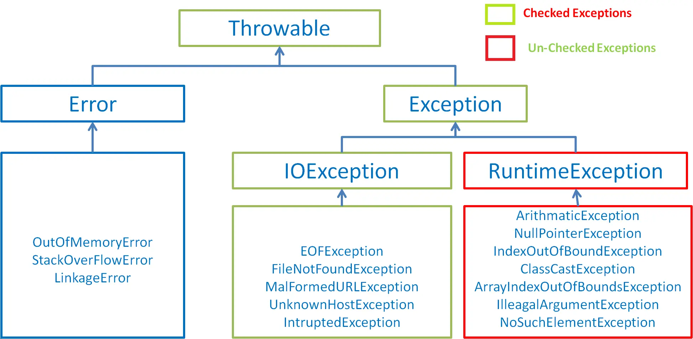
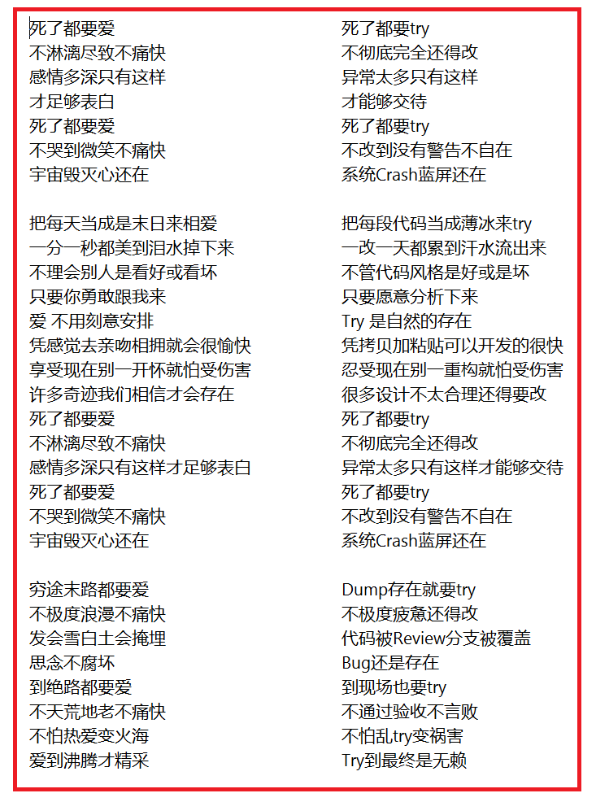

### 异常处理

在使用计算机编程语言开发项目过程中，即使程序员把代码写得尽善尽美，在系统的运行过程中仍然会遇到一些问题，因为很多问题不是靠代码能够比main的，比如：客户输入数据的格式问题，读取文件是否存在，网络是否始终保持通畅等。

异常：指的是程序执行过程中，出现的非正常情况，如果不处理最终会导致JVM的非正常停止。

> 异常指的并不是语法错误和逻辑错误。语法错误了，编译不通过，不会产生字节码文件，根本不能运行。代码逻辑错误，只是没有得到想要的结果。

#### 异常的抛出机制

Java中不同的异常用不同的类表示，一旦发生某种异常，就创建该异常类型的对象，并抛出（throw）。然后程序员可以捕获（catch）到这个异常对象，并处理；如果没有捕获（catch）这个异常对象，那么这个异常对象将会导致程序终止。

```java
public class ArrayTools {
    public static int getElement(int [] arr,int index){
        return arr[index];
    }
    public static void main(String[] args) {
        //ArrayIndexOutOfBoundsException异常
        ArrayTools.getElement(new int[]{1,2,3,4},4);
    }
}
```

对于程序出现的异常，一般有两种解决方法：一是遇到错误就终止程序的运行。另一种方法是在编写程序时，就充分考虑到各种可能发生的异常和错误，极力预防和避免。是在无法避免的，要编写相应的代码进行异常的检测、以及异常的处理，保证代码的健壮性。

### Java异常体系

#### Throwable

`java.lang.Throwable` 类是Java程序执行过程中发生的异常事件对应类的根父类。

**Throwable中的常用方法：**

- `public void printStackTrace()` ：打印异常的详细信息。包含了异常类型、异常原因、异常出现的位置、在开发和调试阶段都使用printStackTrace。

- `public String getMessage() ` ：获取方式异常的原因

#### Error和Exception

Throwable可分为两类：Error和Exception。分别对应`java.lang.Error`与`java.lang.Exception`两个类。

- **Error：**Java虚拟机无法解决的严重问题。如：JVM系统内部错误、资源耗尽等严重情况。一般不编写针对性的代码处理。例如：
  - StackOverflowError（栈内存溢出）
  - OutOfMemoryError（堆内存溢出，简称OOM）
- **Exception：**其他因编程错误或偶然的外在因素导致的一般性问题，需要使用针对性的代码进行处理，使程序继续运行。否则一旦发生异常，程序也会停止。
  - 空指针异常(NullPointerException)
  - 读取不存在的文件(FileNotFoundException)
  - 网络连接中断(ConnectException)
  - 数组角标越界(ArrayIndexOutOfBoundsException)

#### 编译时异常和运行时异常

Java程序的执行分为编译时过程和运行时过程。有的错误只有在运行时才会发生。比如：数组下标越界，空指针异常等。

- **编译时期异常**（即checked异常、受检异常）：在代码编译阶段，编译器就能明确警示当前代码可能发生（不是一定发生）的异常，并明确督促开发人员提前编写处理它的代码。如果开发人员没有编写对应的异常处理代码，则编译器就会直接判定编译失败，从而不能生成字节码文件。通常，这类异常的发生不是由开发人员的代码引起的，或者不是靠加简单的判断就可以避免的，例如：FileNotFoundException。
- **运行时异常**（即runtime异常、unchecked异常、非受检异常）：在代码编译阶段，编译器完全不做任何检查，无论该异常是否会发生，编译器都不给出任何提示。只有等代码运行起来并确定发生了某某异常，它才能被发现。通常，这类异常是由开发人员的代码编写不当引起的，只要稍加判断，或者细心检查就可以避免。
- **java.lang.RuntimeException**类及它的子类都是运行时异常。比如：ArrayIndexOutOfBoundsException数组下标越界异常，ClassCastException类型转换异常。



### 常见的错误和异常

**Error**

```java
public class StackOverflowErrorTest {
    @Test
    public void test01(){
        //StackOverflowError
        test01();
    }
}
```

```java
public class OutOfMemoryErrorTest {
    @Test
    public void test(){
        //OutOfMemoryError
        int [] i = new int[Integer.MAX_VALUE];
    }
    @Test
    public void test1(){
        //OutOfMemoryError
        StringBuffer sb  = new StringBuffer();
        while(true){
            sb.append("hello");
        }
    }
}
```

**运行时异常**

```java
public class RuntimeExceptionTest {
    @Test
    public void test1(){
        //ArrayIndexOutOfBoundsException
        int[] i = new int[]{1,2,3,4};
        System.out.println(i[4]);
    }
    @Test
    public void test2(){
        //ClassCastException
        Object obj = 15;
        String str = (String) obj;
        System.out.println(str);
    }
    @Test
    public void test3(){
        //NullPointerException
        int[][] i = new int[3][];
        System.out.println(i[2][1]);
    }
    @Test
    public void test4(){
        //InputMismatchException
        Scanner input = new Scanner(System.in);
        System.out.print("请输入一个数：");   //输入字符串
        int i = input.nextInt();
        input.close();
    }
    @Test
    public void test5(){
        //ArithmeticException：
        int a = 10;
        System.out.println(a/0);
    }
}
```

**编译时异常**

```java
public class CheckedExceptionTest {
    @Test
    public void test() throws InterruptedException {
        //InterruptedException
        Thread.sleep(1000);
    }
    @Test
    public void test2() throws ClassNotFoundException {
        //ClassNotFoundException
        Class c = Class.forName("java.lang.String");
    }
    public void test3() throws SQLException {
        //SQLException
        Connection conn = DriverManager.getConnection("127.0.0.1");
    }

    @Test
    public void test4() throws IOException {
        File file = new File("hello.txt");
        //FileNotFoundException
        FileInputStream fis = new FileInputStream(file);
        //IOException
        int b = fis.read();
        while (b!=-1){
            System.out.print((char) b);
            b = fis.read();
        }
        fis.close();
    }
}
```

### 异常的处理

Java采用的异常处理机制，是将异常处理的程序代码集中在一起，与正常的程序代码分开，使得程序简洁、优雅、不易于维护。

#### Java异常处理的方式

- try-catch-finally
- throws + 异常类型

#### 捕获异常（try-catch-finally）

Java提供了异常处理的抓抛模型。

- 前面提到，Java程序的执行过程中如出现异常，会生成一个异常类对象，该异常对象将被提交给Java运行时系统，这个过程称为`抛出throw异常`。
- 如果一个方法内抛出异常，该异常对象会被抛给调用者方法中处理。如果异常没有在调用者方法中处理，它会继续抛给这个调用方法的上层方法。这个过程将一直继续下去，直到异常被处理。这一过程称为`捕获catch异常`。
- 如果一个异常回到main()方法，并且main()也不处理，则程序运行终止。

**捕获异常格式：**

```java
try{
	......	//可能产生异常的代码
}
catch( 异常类型1 e ){
	......	//当产生异常类型1型异常时的处置措施
}
catch( 异常类型2 e ){
	...... 	//当产生异常类型2型异常时的处置措施
}  
finally{
	...... //无论是否发生异常，都无条件执行的语句
} 
```

**整体执行过程：**

当某段代码可能发生异常，不管这个异常是编译时异常（受检异常）还是运行时异常（非受检异常），我们都可以使用try块将括起来，并在try块下面编写catch分支尝试捕获对应异常对象。

- 如果在程序运行时，try块的代码没有发生异常，那么catch所有的分支都不执行。
- 如果在程序运行时，try块的代码发生了异常，根据异常对象类型，将从上到下选择第一个匹配的catch分支执行。此时try中发生异常的语句下面的代码将不执行，而整个try...catch之后的代码可以继续运行。
- 如果在程序运行时，try块中的代码发生了异常，但所有catch分支都无法匹配（捕获）这个异常，那么JVM将会终止当前方法的执行，并把异常对象抛给调用者。如果调用者不处理，程序就终止。

#### try

- 捕获异常的第一步使用`try{...}`语句块选定捕获异常的范围，将可能出现异常的业务的逻辑代码放在try语句块中。

#### catch(Exceptiontype e)

- catch分支，分为两个部分，catch()中编写异常类型和异常参数名，{}中编写如果发生了这个异常，要做什么处理的代码。
- 如果明确知道产生的时何种异常，可以用该异常类作为catch的参数；也可以用其父类作为catch参数。比如：可以用ArithmeticException类作为参数的地方，就可以用RuntimeException类作为参数，或者用所有异常的父类Exception类作为参数。但不能是与ArithmeticException类无关的异常，如NullPointerException(catch中的语句将不会执行)。
- 每个try语句块可以伴随一个或多个catch语句，用于处理可能产生的不同类型的异常对象。
- 如果有多个catch分支，并且多个异常类型有子父类关系，必须保证小的字异常类型在上，大的父异常类型在下。否则报错。
- catch中常用的异常处理方式
  - `public String getMessage()`：获取异常的描述信息，返回字符串
  - `public void printStackTrace()`：打印异常的跟踪栈信息并输出到控制台。包含了异常的类型、异常的原因、还包括异常出现的位置，在开发和调试阶段，都得使用printStackTrace()。


**ArrayIndexOutOfBoundsException：数组下标越界**

```java
public class IndexOutExp {
    public static void main(String[] args) {
        int[] i = new int[]{1,2,3,4};
        try {
            for (int j = 0; j <=4 ; j++) {
                System.out.println(i[j]);
            }
        }catch (ArrayIndexOutOfBoundsException e){
            System.out.println("数组下标越界了");
        }
        System.out.println("执行完成");
    }
}
```

**ArithmeticException：分母为0**

```java
public class divideZero {
    public static void main(String[] args) {
        int i = 20;
        try {
            int a = 20/0;
            System.out.println("hello");    //不会执行
        }catch (ArithmeticException e){
            e.printStackTrace();
        }
        System.out.println("执行完成");
    }
}
```

**NullPointerException：空指针异常**

```java
public class NullPointerExpTest {
    public static void main(String[] args) {
        Person p = new Person();
        p = null;
        try{
            System.out.println(p.name);
        }catch(NullPointerException e){
            System.out.println(e.getMessage());
        }

    }
}
class Person{
    public String name;
}
```

**InputMismatchException：输入类型不匹配异常**

```java
public class InputMismatchExpTest {
    public static void main(String[] args) {
        Scanner input = new Scanner(System.in);
        System.out.print("请输入数字：");
        try {
            int i = input.nextInt();
        }catch (InputMismatchException e){
            e.printStackTrace();
        }catch (NullPointerException e){
            System.out.println(e.getMessage());
        }
        input.close();
    }
}
```

#### finally使用


- 因为异常会引发程序跳转，从而会导致有些语句执行不到。而程序中有一些特定的代码无论异常是否发生，都需要执行。例如：数据库连接、输入输出流、Socket连接、Lock锁的关闭等，这样的代码通常都会方法finally块中。所以，我们通常将一定要被执行代码声明在finally中。
- 唯一的例外，使用System.exit(0)来终止当前正在运行的Java虚拟机
- 不论在try代码块中是否发生了异常事件，catch语句是否执行，catch语句是否有异常，catch语句中是否有return，finally块中的语句都会被执行。
- finally语句和catch语句都是可选的，但finally不能单独使用。

**确保资源的关闭**

```java
public class FinallyTest {
    public static void main(String[] args) {
        Scanner input = new Scanner(System.in);
        System.out.print("请输入一个整数：");
        try {
            int i = input.nextInt();
            int c = i / 0;
        } catch (InputMismatchException e) {
            e.printStackTrace();
        } catch (ArithmeticException e) {
            System.out.println("分母不能为0");
        } finally {
            System.out.println("input.close()");
            input.close();
        }
    }
    @Test
    public void fileWrite() {
        FileInputStream input = null;
        try {
            File file = new File("hello.txt");
            input = new FileInputStream(file);
            int b = input.read();
            while (b != -1) {
                System.out.println((char)b);
                b = input.read();
            }
        } catch (FileNotFoundException e) {
            e.printStackTrace();
        } catch (IOException e){
            System.out.println(e.getMessage());
        }finally {
            try {
                if(input != null) input.close();
                System.out.println("执行完毕，释放资源");
            } catch (IOException e) {
                e.printStackTrace();
            }
        }
    }
}
```

**从try return**

```java
public class FinallyTest1 {
    public static void main(String[] args) {
        int result = test("123");
        System.out.println(result); //1
    }
    public static int test(String str){
        try {
            Integer.parseInt(str);
            return 1;
        }catch (NumberFormatException e){
            return -1;
        }finally {
            System.out.println("this is finally!");
        }
    }
}
```

**从catch return**

```java
public class FinallyTest2 {
    public static void main(String[] args) {
        int result = test("a");
        System.out.println(result); //-1
    }
    public static int test(String str){
        try {
            Integer.parseInt(str);
            return 1;
        }catch (NumberFormatException e){
            return -1;
        }finally {
            System.out.println("this is finally!");
        }
    }
}
```

**从finally return**

```java
public class FinallyTest3 {
    public static void main(String[] args) {
        int result = test("a");
        System.out.println(result); //0
    }
    public static int test(String str){
        try {
            Integer.parseInt(str);
            return 1;
        }catch (NumberFormatException e){
            return -1;
        }finally {
            return 0;
        }
    }
}
```

#### 面试题

```java
public class InterviewQuestion {
    public static void main(String[] args) {
        int result = test();
        System.out.println(result); //100
    }
    public static int test(){
        int i = 100;
        try {
            return i;
        }finally {
            i++;
        }
    }
}
```

#### 异常处理小结

- 前面使用的异常都是`RuntimeException`类或是它的子类，这些类的异常的特点是：即使没有try...catch捕获，Java自己也能捕获，并且编译通过（但运行时会发生异常使得程序运行终止）。所以，对于这些异常，可以不作处理，因为这类异常很普遍，若全处理可能会对程序的可读性和运行效率产生影响。
- 如果抛出的异常是`IOException`等类型的非运行时异常，则必须捕获，否则编译错误。也就是说，我们必须处理编译时异常，将异常继续捕捉，转化为运行时异常。

### 声明抛出异常（throws）

- 如果在编写方法体代码时，某段代码可能发生某个编译时异常，不处理编译不通过，但是在当前方法体可能不适合处理或无法给出合理的处理方式，则此方法应显示的声明抛出异常，表明该方法将不对这些异常进行处理，而由该方法的调用者负责处理。
- 具体方式：在方法声明中用throws语句可以声明抛出异常的列表，throws后面的异常类型可以是方法中产生的异常类型，也可以是它的父类。

**throws格式**

```java
修饰符 返回值类型 方法名(参数) throws 异常类名1,异常类名2…{   }	
```

#### 针对编译时异常抛出

```java
public void test4() throws IOException {
        File file = new File("/hello.txt");
        //FileNotFoundException
        FileInputStream fis = new FileInputStream(file);
        //IOException
        int b = fis.read();
        while (b!=-1){
            System.out.print((char) b);
            b = fis.read();
        }
        fis.close();
    }
```

```java
public class ThrowsCheckedExceptionTest {
    public static void main(String[] args) {
        try {
            getSleep();
        }catch (InterruptedException e){
            e.printStackTrace();
        }
        System.out.println("执行完毕！");
    }
    public static void getSleep() throws InterruptedException {
        for (int i = 0; i < 10; i++) {
            Thread.sleep(1000);
            System.out.println("getSleep");
        }
    }
}
```

#### 针对运行时异常：

```java
public class ThrowsRuntimeExceptionTest {
    public static void main(String[] args) {
        try {
            Test(10);
        }catch (ArithmeticException e){
            System.out.println("分母为0"); //分母为0
        }finally {
            System.out.println("执行完毕！"); //执行完毕！
        }
    }
    public static int Test(int i) throws ArithmeticException{
        return i/0;
    }
}
```

#### 方法重写中throws要求

- 如果父类被重写方法的签名后面没有`throws`编译时异常类型，那么重写方法时，方法签名后面也不能出现`throws`编译时异常类型。
- 如果父类被重写方法的签名后面有`throws`编译时异常类型，那么重写方法时，throws的编译时异常类型必须大于等于被重写方法`throws`的编译时异常类型，或者不`throws`编译时异常。
- 方法重写，对于`throws`运行时异常类型没有要求

```java
public class Fater {
    public void method() throws Exception {
        System.out.println("Fater.method");
    }
}
class Son extends Fater{
    @Override
    public void method() throws IOException {
        System.out.println("Son.method");
    }
}
```

#### 两种异常处理方式的选择

对于异常，使用相应的处理方式。此时的异常，主要指的是编译时异常。

- 如果代码中，涉及到资源的调用（流、数据库连接、网络连接等），则必须考虑使用try...catch...finally来处理，包装不出现内存泄漏。
- 如果父类被重写的方法没有throws异常类型，则子类重写的方法中如果出现异常，只能考虑使用try...catch...finally进行处理，不能throws。
- 开发中，方法a中依次调用了方法b、c、d等方法，方法b、c、d之间是递进关系。此时，如果方法b、c、d中有异常，我们通常选择throws，而方法a中通常选择使用try...catch...finally处理。

#### 手动抛出异常对象：throw

Java中异常对象的生成有两种方式：

- 有虚拟机**自动生成**：程序运行过程中，虚拟机检查到程序发生了问题，那么针对当前代码，就会在后台创建一个对应异常类的实例对象抛出。
- 由于开发人员**手动创建**：new 异常类型([实参列表])；如果创建好的异常对象不抛出对程序没有任何影响，和创建一个普通对象一样，但是一旦throw抛出，就会对程序运行产生影响。

**使用格式：**

```java
throw new 异常类名(参数);
```

throw语句抛出的异常对象，和JVM自动创建和抛出的异常对象一样。

- 如果是编译时异常类型的对象，同样需要使用throws或者try...catch处理，否则编译不通过。
- 如果是运行时异常类型的对象，编译器不提示；
- 可以抛出的异常必须是Throwable或其子类的实例

```java
throw new String("want to throw");
```

**注意：**

无论是编译时异常类型的对象，还是运行时异常类型的对象，如果没有被try...catch合理处理，都会导致程序崩溃。

throw语句会导致程序执行流程被改变，throw语句是明确抛出的一个异常对象，因此它下面的代码将不会执行。

如果当前方法没有try...catch处理这个异常对象，throw语句就会代替return语句提前终止当前方法的执行，并返回异常异常对象给调用者。

```java
public class ThrowTest {
    public static void main(String[] args) {
        try {
            System.out.println(max(7, 5, 2, 4, 9, 7));
            System.out.println(max());
        }catch (IllegalArgumentException e){
            System.out.println(e.getMessage());
        }
    }
    public static int max(int...nums){
        if(nums == null || nums.length == 0){
            throw new IllegalArgumentException("没有传入任何整数！");
        }
        int max = 0;
        for (int i = 0; i < nums.length; i++) {
            if (max < nums[i]){
                max = nums[i];
            }
        }
        return max;
    }
}
```

### 自定义异常

**为什么需要自定义异常类**

在Java中不同的异常类，分别表示者某一种具体的异常情况。那么在开发中总是有些异常情况是核心类库中没有定义好的。此时我们需要根据自己业务的异常情况来定义异常类如成绩负数问题等。

#### 如何自定义异常类

- 需要继承一个异常类型
  - 编译时异常类型：需要继承`java.lang.Exception`
  - 运行时异常类型：需要继承`java.lang.RuntimeException`
- 建议至少提供两个构造器
  - 无参构造器
  - (String message)构造器
- 自定义异常需要提供`serialVersionUID`

**注意：**

- 自定义的异常只能通过throw抛出
- 自定义异常最重要的是异常类的名字和message属性。当异常出现时，可以根据名字判断异常类型。比如：`TeamException("成员已满，无法添加"); `、 `TeamException("该员工已是某团队成员");`
- 自定义异常对象只能手抛出。抛出后由try...catch处理，也可以throws给调用者处理。

```java
public class MyException extends Exception{
    static final long serialVersionUID = -3387516323124229948L;
    public MyException(){}
    public MyException(String message){
        super(message);
    }
}
```

```java
public class MyExceptionTest {
    public static void main(String[] args) {
        MyExceptionTest test = new MyExceptionTest();
//        System.out.println(test.division(10, 0));
        System.out.println(test.division(10, 5));
    }
    public void judge(int num)throws MyException{
        if(num == 0){
            throw new MyException("分母不能为0");
        }
    }
    public int division(int i,int j){
        try {
            judge(j);
        }catch (MyException e){
            e.printStackTrace();
        }
        return i/j;
    }
}
```

#### 练习1：

```java
public class NotTriangleException extends RuntimeException{
    static final long serialVersionUID = -7034892240745766939L;
    public NotTriangleException(){};
    public NotTriangleException(String message){
        super(message);
    }
}
```

```java
public class Triangle {
    private double a;
    private double b;
    private double c;
    public Triangle(double a,double b,double c){
        if (a<=0||b<=0||c<=0){
            throw new NotTriangleException("三角形的变不能为小于0");
        }
        if(a+b<=c || a+c<=b || c+b<=a){
            throw new NotTriangleException("不构成三角形，三角形任意两边和大于第三边");
        }
        this.a = a;
        this.b = b;
        this.c = c;
    }
    @Override
    public String toString() {
        return "Triangle{" +
                "a=" + a +
                ", b=" + b +
                ", c=" + c +
                '}';
    }
}
```

```java
public class TriangleTest {
    public static void main(String[] args) {
        try {
//            Triangle t = new Triangle(7,3,2);
            Triangle t = new Triangle(7,3,-2);
            System.out.println(t);
        }catch (NotTriangleException e){
            System.out.println(e.getMessage());
        }
    }
}
```

#### 练习2：

```java
public class ReturnExceptionTest {
    public static void main(String[] args) {
        try {
            methodA();
        }catch (RuntimeException e){
            System.out.println(e.getMessage());
        }
        methodB();
    }
    static void methodA()throws RuntimeException{
        try {
            System.out.println("进入方法A");
            throw new RuntimeException("制造异常");
        }finally {
            System.out.println("A的finally");
        }
    }
    static void methodB(){
        try {
            System.out.println("进入方法B");
            return;
        }finally {
            System.out.println("B方法finally");
        }
    }
}
//进入方法A
//A的finally
//制造异常
//进入方法B
//B方法finally
```

#### 小结：异常处理5个关键字


> 类比：上游排污，下游治污

#### 哲理：

世界上最遥远的`距离`，是我在`if`里你在`else`里，似乎一直相伴又永远分离；

世界上最痴心的`等待`，是我当`case`你是`switch`，或许永远都选不上自己；

世界上最真情的`相依`，是你在`try`我在`catch`。无论你发神马脾气，我都默默承受，静静处理。到那时，再来期待我们的`finally`。


