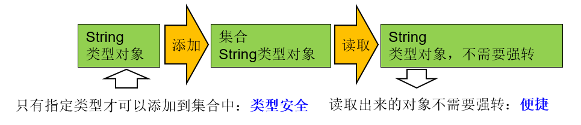

### 泛型(Generic)

#### 泛型概述

泛型在Java中有很重要的地位，在面向对象编程及各种设计模式中有非常广泛的应用。

Java泛型是JDK5中引入了一个新特性，泛型提供了编译时类型安全检测机制，该机制允许开发人员在编译时检测到非法的类型。泛型即位类型参数，这个类型参数在声明它的类、接口或方法中，代表未知的某种类型。泛型的本质是参数化类型，也就是所有操作的数据类型被指定为一个参数。

#### 泛型引入

在Java中，我们在声明方法时，当在完成方法功能时如果有未知的数据需要参与，这些未知的数据需要在调用方法时才能确定，那么我们把这样的数据通过行参表示。在方法体中，用这个行参来代表那个未知的数据，而调用者在调用时，对应的传入实参就可以了。

```java
 	//JDK8 ArrayList源码
	public E set(int index, E element) {
        rangeCheck(index);

        E oldValue = elementData(index);
        elementData[index] = element;
        return oldValue;
    }
```

- 集合类在设计阶段/声明阶段不能确定这个容器具体存了什么类型的对象，所有在JDK5.0之前只能把元素类型设计为Object，在JDK5.0时Java引入了参数化类型(Parameterized type)的概念，允许我们在创建集合时指定集合元素的类型。比如：`List <String>`，表明这个List只能保存字符串类型的对象。

- `java.lang.Comparable`接口和`java.lang.Comparator`接口，是用于比较对象大小的接口。这两个接口只是限定了两个对象的比较返回值，但是并不确定是什么类型的对象比较大小。JDK5.0之前只能用Object类型表示，使用时既麻烦又不安全，因此JDK5.0给它们增加了泛型

```java
//JDK8源码
public interface Comparable<T> {
    public int compareTo(T o);
}
public interface Comparator<T> {
    int compare(T o1, T o2);
}
```

> <T>就是泛型参数，即泛型。
>
> 所谓泛型，就是允许在定义类、接口时通过一个标识表示类中某个属性的类型或者是某个方法的返回值或者参数的类型。这个类型参数将在使用时确定。

#### 集合中使用泛型

**集合中没有使用泛型**


**集合中使用泛型时**



> Java泛型可以保证如果程序在编译时没有发出警告，运行时就不会产生ClassCastException异常。即，把不安全的因素在编译期间就排除了，而不是运行期；既然通过了编译，那么类型一定是符合要求的，就避免了类型转换。同时代码更加简洁、健壮。把一个集合中的内容限制为一个特定的数据类型，这就是generic背后的核心思想。

```java
public class CollectionMapGenericTest {
    @Test
    public void test01() {
        ArrayList list = new ArrayList();
        list.add(1);
        list.add(2);
        list.add(3);
        list.add(4);
        list.add("五");
        int i = (int) list.get(4);  //ClassCastException
        System.out.println(i);
    }
    @Test
    public void test02() {
        ArrayList<Integer> list = new ArrayList<Integer>();
        list.add(1);
        list.add(2);
        list.add(3);
        list.add(4);
        //list.add("五"); //编译不通过。
        Iterator<Integer> iterator = list.iterator();
        while (iterator.hasNext()) System.out.println(iterator.next());
    }
    @Test
    public void test03(){
        HashMap<Integer,String> map = new HashMap<Integer,String>();
        map.put(1001,"Tom");
        map.put(1002,"Jack");
        map.put(1003,"Jerry");
//        map.put("1004","Canvs");  //编译不通过
//        map.put(1005,'A');    //编译不通过
        Collection<String> coll = map.values();
        for (String s : coll) System.out.println(s);
    }
    @Test
    public void test04(){
        HashMap<Integer,String> map = new HashMap<>();
        map.put(1001,"Tom");
        map.put(1002,"Jack");
        map.put(1003,"Jerry");
        Set<Integer> keySet = map.keySet();
        for (Integer i : keySet) System.out.println(i);
    }
    @Test
    public void test05(){
        HashMap<Integer,String> map = new HashMap<>();
        map.put(1001,"Tom");
        map.put(1002,"Jack");
        map.put(1003,"Jerry");
        //遍历entry集
        Set<Map.Entry<Integer,String>> entrySet = map.entrySet();
        Iterator<Map.Entry<Integer,String>> iterator = entrySet.iterator();
        while (iterator.hasNext()) System.out.println(iterator.next());
    }
}
```

**练习1**:

- 创建创建一个ArrayList集合对象，并指定泛型为\<Integer>
- 添加5个[0,100)以内的整数到集合中
- 使用foreach遍历输出5个整数
- 使用集合的removeIf方法删除偶数，为Predicate接口指定泛型\<Ineteger>
- 再使用Iterator迭代器输出剩下的元素，为Iterator接口指定泛型\<Integer>

```java
public class NumberTest {
    public static void main(String[] args) {
        ArrayList<Integer> list = new ArrayList<Integer>();
        Random random = new Random();
        for (int i = 0; i < 5; i++) {
            list.add(random.nextInt(100));
        }
        for (Integer i : list) System.out.println(i);
//        使用迭代器删除
//        Iterator<Integer> it = list.iterator();
//        while (it.hasNext()){
//            Integer next = it.next();
//            if (next%2==0){
//                it.remove();
//            }
//        }
        list.removeIf(new Predicate<Integer>() {
            @Override
            public boolean test(Integer integer) {
                return integer % 2 == 0;
            }
        });
        System.out.println();
        Iterator<Integer> iterator = list.iterator();
        while (iterator.hasNext()) System.out.println(iterator.next());
    }
}
```

#### 比较器中使用泛型

**练习**：

- 定义一个Employee类。该类包含：private成员变量name,age,birthday，其中 birthday 为 MyDate 类的对象；并为每一个属性定义 getter, setter 方法；并重写 toString 方法输出 name, age, birthday

- MyDate类包含:private成员变量year,month,day；并为每一个属性定义 getter, setter 方法；

- 创建该类的 5 个对象，并把这些对象放入 TreeSet 集合中（TreeSet 需使用泛型来定义）

- 分别按以下两种方式对集合中的元素进行排序，并遍历输出：
  - 使Employee 实现 Comparable 接口，并按 name 排序
  - 创建 TreeSet 时传入 Comparator对象，按生日日期的先后排序。

```java
public class Employee implements Comparable<Employee>{
    private String name;
    private int age;
    private MyDate birthday;
    @Override
    public String toString() {
        return "Employee{" +
                "name='" + name + '\'' +
                ", age=" + age +
                ", birthday=" + birthday +
                '}';
    }
    public Employee(String name, int age, MyDate birthday) {
        this.name = name;
        this.age = age;
        this.birthday = birthday;
    }
    @Override
    public int compareTo(Employee o) {
        return this.name.compareTo(o.name);
    }
    public String getName() {
        return name;
    }
    public int getAge() {
        return age;
    }
    public MyDate getBirthday() {
        return birthday;
    }
}
```

```java
public class MyDate implements Comparable<MyDate> {
    private int year;
    private int month;
    private int day;
    public MyDate(int year, int month, int day) {
        this.year = year;
        this.month = month;
        this.day = day;
    }
    @Override
    public String toString() {
        return year + "年" + month + "月" + day + "日";
    }
    @Override
    public int compareTo(MyDate o) {
        int year = this.year - o.year;
        if (year == 0) {
            int month = this.month - o.month;
            if (month == 0) {
                return this.day - o.day;
            }
            return month;
        }
        return year;
    }
}
```

```java
public class EmployeeTest {
    @Test
    public void test01() {
        TreeSet<Employee> set = new TreeSet<Employee>();
        set.add(new Employee("Tom", 22, new MyDate(2000, 7, 25)));
        set.add(new Employee("Jack", 18, new MyDate(1997, 8, 26)));
        set.add(new Employee("Lisa", 19, new MyDate(1998, 5, 5)));
        set.add(new Employee("Jerry", 22, new MyDate(1997, 7, 16)));
        set.add(new Employee("Canvs", 18, new MyDate(2000, 8, 5)));
        Iterator<Employee> iterator = set.iterator();
        while (iterator.hasNext()) System.out.println(iterator.next());
    }
    @Test
    public void test02() {
        //通过年龄排序
        TreeSet<Employee> set = new TreeSet<>(new Comparator<Employee>() {
            @Override
            public int compare(Employee o1, Employee o2) {
                return o1.getBirthday().compareTo(o2.getBirthday());
            }
        });
        set.add(new Employee("Tom", 22, new MyDate(2000, 7, 25)));
        set.add(new Employee("Jack", 18, new MyDate(1997, 8, 26)));
        set.add(new Employee("Lisa", 19, new MyDate(1998, 5, 5)));
        set.add(new Employee("Jerry", 22, new MyDate(1997, 7, 16)));
        set.add(new Employee("Canvs", 18, new MyDate(2000, 8, 5)));
        for (Employee e : set) System.out.println(e);
    }
}
```

#### 相关使用说明

- 在创建集合对象的时候，可以指明泛型的类型
- 集合声明时，声明泛型参数。在使用集合时，可以具体指明泛型的类型。一旦指明，类或接口内部，凡是使用泛型参数的位置，都指定为具体的参数类型。如果没有指明，看作是Object类型。

### 自定义泛型结构

#### 泛型的基础说明

**<类型>这种语法形式就叫泛型**

- <类型>的形式我们称为类型参数，这里的类型习惯上使用T表示，是Type的缩写。即\<T>
- \<T>：代表未知的数据类型，我们可以称为\<String>、\<Interger>、\<Employee>等
  - 类比方法的参数的概念，把\<T>,称为类型形参，将\<Employee>称为类型实参。
- \<T>这里的T可以替换任意字母

**在哪里可以声明类型变量\<T>**

- 声明类或接口时，在类名或接口名后面声明泛型类型，我们把这样的类或接口称为`泛型类`或`接口类`

```java
修饰符】 class 类名<类型变量列表> 【extends 父类】 【implements 接口们】{   
}
【修饰符】 interface 接口名<类型变量列表> 【implements 接口们】{   
}

//例如：
public class ArrayList<E>    
public interface Map<K,V>{
    ....
}    
```

- 声明方法时，在【修饰符】与返回值类型之间声明类型变量，我们把声明了类型变量的方法，称为泛型方法

```java
[修饰符] <类型变量列表> 返回值类型 方法名([形参列表])[throws 异常列表]{
    //...
}
//例如：java.util.Arrays类中的
public static <T> List<T> asList(T... a){
    ....
}
```

#### 自定义泛型类或泛型接口

当我们在类或接口中定义某个成员时，该成员的相关类型是不确定的，而这个类型需要在使用这个类或接口时才可以确定，那么我们可以使用泛型类、泛型接口

**说明**：

- 我们在声明完自定义泛型类以后，可以在类的内部（比如：属性、方法、构造器中）使用类的泛型。
- 我们创建自定义泛型类的对象时，可以指明泛型参数类型。一旦指明，内部凡是使用类的泛型参数的位置，都具体化为指定的类的泛型类型。
- 如果在创建自定义泛型类的对象时，没有指明泛型参数类型，那么泛型将被擦除，泛型对应的类型均按照Object处理，但不等价于Object。
- 泛型的指定中必须是引用数据类型。不能使用基本数据类型，此刻只能使用包装类替换
- 除创建泛型类对象外，子类继承泛型类时、实现类实现泛型接口时，也可以确定泛型结构中的泛型参数。如果我们在给泛型类提供子类时，子类也不确定泛型的类型，则可以继续使用泛型参数。我们还可以在现有的父类的泛型参数基础上，新增泛型参数。

**注意**：

- 泛型类可能有多个参数，此时应将多个参数一起放到尖括号内。如：\<E1,E2,E3>
- 在JDK7.0开始，泛型的简化操作： TreeSet\<Employee> set = new TreeSet\<>();
- 如果泛型结构是一个接口或抽象类，则不可创建泛型类的对象
- 不能使用new E[]。但是可以：E[] elements = (E[])new Object[capacity];参考ArrayList源码中声明：Object[] elementData，而非泛型参数类型数组。
- 在类/接口上声明的泛型，在本类或本接口中即代表某种类型，但不可以在静态方法中使用类的泛型。
- 异常类不能是带泛型的。

```java
public class Person <T>{
    T info;
    public Person(T info) {
        this.info = info;
    }
    public T getInfo() {
        return info;
    }
    public void setInfo(T info) {
        this.info = info;
    }
//    静态方法中不能声明泛型
//    public static void test(T t){
//    }
//    不能try...catch中定义泛型
//    public void test(){
//        try {
//
//        }catch (Exception<T> e){
//
//        }
//    }
}
```

```java
public class Father <T1,T2>{
}
//子类不保留父类泛型
//没有类型 擦除
class Son1 extends Father{
}
class Son2<A,B> extends Father{
}
//具体类型
class Son3 extends Father<Integer,String>{
}
class Son4<A,B> extends Father<Integer,String>{
}
//子类保留父类的泛型
//部分保留
class Son5<T2> extends Father<Integer,T2>{
}
class Son6<A,B,T2> extends Father<Integer,T2>{
}
//全部保留
class Son7<T1,T2> extends Father<T1,T2>{
}
class Son8<A,B,T1,T2> extends Father<T1,T2>{
}
```

#### 练习

**练习1**:声明一个学生类，该学生包含姓名、成绩，而此时学生的成绩类型不确定，为什么呢，因为，语文老师希望成绩是“优秀”、“良好”、“及格”、“不及格”，数学老师希望成绩是89.5, 65.0，英语老师希望成绩是'A','B','C','D','E'。那么我们在设计这个学生类时，就可以使用泛型。

```java
public class Student<T> {
    private String name;
    private T score;
    public Student(String name, T score) {
        this.name = name;
        this.score = score;
    }
    @Override
    public String toString() {
        return "Student{" +
                "name='" + name + '\'' +
                ", score=" + score +
                '}';
    }
}
```

```java
public class StudentTest {
    public static void main(String[] args) {
        ArrayList<Student> list = new ArrayList<>();
        list.add(new Student<Double>("Tom",95.2));
        list.add(new Student<Double>("Jack",95.2));
        list.add(new Student<Character>("Canvs",'A'));
        list.add(new Student<String>("Jerry","优秀"));
        Iterator<Student> iterator = list.iterator();
        while (iterator.hasNext()) System.out.println(iterator.next());
    }
}
```

**练习2**

定义个泛型类 DAO\<T>，在其中定义一个Map 成员变量，Map 的键为 String 类型，值为 T 类型。

分别创建以下方法：

- public void save(String id,T entity)： 保存 T 类型的对象到 Map 成员变量中
- public T get(String id)：从 map 中获取 id 对应的对象
- public void update(String id,T entity)：替换 map 中key为id的内容,改为 entity 对象
- public List\<T> list()：返回 map 中存放的所有 T 对象
- public void delete(String id)：删除指定 id 对象

定义一个 User 类：
该类包含：private成员变量（int类型） id，age；（String 类型）name。

定义一个测试类：
创建 DAO 类的对象， 分别调用其 save、get、update、list、delete 方法来操作 User 对象，
使用 Junit 单元测试类进行测试。

```java
public class DAO<T> {
    private HashMap<String,T> map;
    {
        map = new HashMap<String,T>();
    }
    public void save(String id,T entity){
        if (!map.containsKey(id)){
            map.put(id,entity);
        }
    }
    public T get(String id){
        return map.get(id);
    }
    public void update(String id,T entity){
        if(map.containsKey(id)){
            map.put(id,entity);
        }
    }
    public List<T> list(){
        return new ArrayList<T>(map.values());
    }
    public void delete(String id){
        map.remove(id);
    }
}
```

```java
public class User {
    private int id;
    private int age;
    private String name;
    public User(int id, int age, String name) {
        this.id = id;
        this.age = age;
        this.name = name;
    }
    @Override
    public String toString() {
        return "User{" +
                "id=" + id +
                ", age=" + age +
                ", name='" + name + '\'' +
                '}';
    }
}
```

```java
public class UserTest {
    @Test
    public void test01(){
        DAO<User> dao = new DAO<>();
        User u1 = new User(1,22,"Tom");
        User u2 = new User(2,18,"Jack");
        User u3 = new User(3,25,"Jerry");
        dao.save("1001",u1);
        dao.save("1002",u2);
        dao.save("1003",u3);
        List list = dao.list();
        System.out.println(list);
        Object o = dao.get("1002");
        System.out.println(o);
        System.out.println();
        dao.update("1001",new User(4,25,"Canvs"));
//        dao.delete("1003");
        Iterator iterator = dao.list().iterator();
        while (iterator.hasNext()) System.out.println(iterator.next());
    }
}
```

### 自定义泛型方法

如果定义类、接口时没有使用<泛型参数>，但某个方法形参类型不确定，这个方法可以单独定义<泛型参数>。

#### 说明

- 泛型方法的格式：

```java
[访问权限]  <泛型>  返回值类型  方法名([泛型标识 参数名称])  [抛出的异常]{  
}
```

- 方法，也可以被泛型化，与其所在的类是否是泛型类没有关系
- 泛型方法中的泛型参数在方法被调用时确定
- 泛型方法可以根据需要，声明为static的。

```java
public class GenericMethodTest {
    public static  <T>  void test01(T t){
    }
    public static <T> T test02(){
        return null;
    }
    public <T> T test03(T t){
        return null;
    }
}
```

```java
public class GenericMethodTest1 {
    public static <T> void arrayToCollection(T[] arr, Collection<T> c) {
        for (T a : arr) c.add(a);
    }
    public static void main(String[] args) {
        ArrayList list = new ArrayList();
        String[] str = {"A","B","C","D"};
        GenericMethodTest1.arrayToCollection(str,list);
        Iterator iterator = list.iterator();
        while (iterator.hasNext()) System.out.println(iterator.next());
    }
}
```

```java
public class MyArrays {
    public static <T> void sort(T[] arr){
        for (int i = 0; i < arr.length-1; i++) {
            boolean isFlag = true;
            for (int j = 0; j < arr.length-1-i; j++) {
                if (((Comparable<T>)arr[j]).compareTo(arr[j+1])>0){
                    T temp = arr[j];
                    arr[j] = arr[j+1];
                    arr[j+1] = temp;
                    isFlag = false;
                }
            }
            if (isFlag) break;
        }
    }
    public static void main(String[] args) {
        String[] str = {"D","A","C","B"};
        sort(str);
        System.out.println(Arrays.toString(str));
    }
}
```

#### 练习

练习1:泛型方法

编写一个泛型方法，实现任意引用类型数组指定位置元素交换。

```java
    public static <E> void method1(E[] arr,int i,int j){
        E temp = arr[i];
        arr[i] = arr[j];
        arr[j] = temp;
    }
```

练习2:泛型方法

编写一个泛型方法，接收一个任意引用类型的数组，并反转数组中的所有元素

```java
public class GenericMethodExer {
    public static <E> void method2(E[] arr){
        for (int i = 0,j = arr.length-1; i<j ; i++,j--) {
            E temp = arr[i];
            arr[i] = arr[j];
            arr[j] = temp;
        }
    }
    public static void main(String[] args) {
        Integer[] arr = {1,2,3,4,5,6,7};
        method2(arr);
        System.out.println(Arrays.toString(arr));
        method1(arr,3,6);
        System.out.println(Arrays.toString(arr));
    }
}
```

### 泛型在继承上的体现

如果B是A的一个子类型（子类或子接口），而G是具有泛型声明的类或接口，G\<B>并不是G\<A>的子类型；如：String是Object的子类，但是List\<String>并不是List\<Object>的子类。

```java
public class GenericAndClassTest {
    public static void main(String[] args) {
        Person[] persons = null;
        Man[] mans = null;
        Person p = mans[0];

        List<Person> personList = null;
        List<Man> manList = null;
//        personList = manList; //报错
    }
}
```

### 通配符的使用

当我们声明一个变量/形参时，这个变量/行参的类型是一个泛型或泛型接口，例如：Comparator\<T>类型，但是我们仍然无法确定这个泛型类或泛型接口的类型变量\<T>的具体类型，此时可以考虑类型通配符`?`。

#### 通配符的理解

`List<?>`,`Map<?>`

`List<?>`是List\<String>、List\<Object>等各种泛型List的父类

#### 通配符的读与写

**写操作**：将任意元素加入到其中不是类型安全的

```java
    @Test
    public void test01() {
        Collection<?> coll = new ArrayList<String>();
//        coll.add(new Object())    //报错
        coll.add(null);
    }
```

> 因为我们不知道coll元素类型，我们不能向其中添加对象。add方法有类型参数E作为集合的元素类型。我们传给add的任何参数都必须是一个未知类型的子类。因为我们不知道那是什么类型，所以我们无法传递任何东西进去。唯一可以插入的元素是null，因为它是所有引用类型的默认值。

**读操作**：另一方面，读取List\<?>的对象List中的元素时，永远是安全的，因为不管List的真实类型是什么，它包含的都是Object

```java
		@Test
    public void test02(){
        ArrayList<String> list = new ArrayList<>(Arrays.asList("Tom","Jack","Canvs"));
        show(list);
    }
    public static void show(Collection<?> coll){
        for (Object o : coll) System.out.println(o);
    }
    @Test
    public void test03(){
        List<?> list = null;
        list = new ArrayList<Integer>(Arrays.asList(1,2,3,4,5));
//        list.add(5); //编译不通过
        list.add(null);
        Iterator<?> iterator = list.iterator();
        while (iterator.hasNext()) System.out.println(iterator.next());
    }
    @Test
    public void test04(){
        List<String> l1 = new ArrayList<String>();
        List<Integer> l2 = new ArrayList<>();
        l1.add("Tom");
        l1.add("Jack");
        l2.add(100);
        show1(l1);
        show1(l2);
    }
    public static void show1(List<?> list){
        for (Object o: list) System.out.println(o);
    }
```

