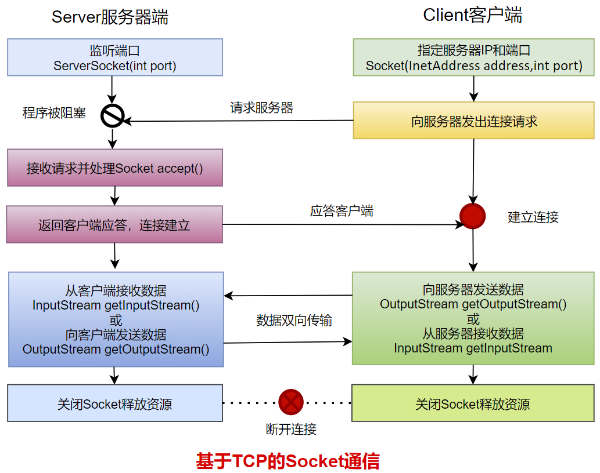

### 网络编程概述

Java是Internet上的语言，它从语言级上提供了对网络应用程序的支持， 程序员能够过很容易开发常见的网络应用程序。

Java提供的网络类库，可以实现无痛的网络连接，联网的底层细节被隐藏在Java的本季安装系统里，由JVM进行控制。并且Java实现了一个跨平台的网络库，开发人员面对的是一个统一的网络编程环境。

#### 软件架构

- C/S架构：全称Client/Server结构，是指客户端和服务器结构。常见程序有QQ、微信等软件

- B/S架构：全称Browser/Server结构，是指浏览器和服务器结构。常见的浏览器有IE、谷歌、火狐等。

两种架构各有优势，但是无论哪种架构，都离不开网络的支持。网络编程，就是在一定的协议下，实现两台计算机的通讯的程序。

### 网络基础

#### IP地址

IP地址：是指互联网协议地址（Internet Protocol Address），俗称IP。IP地址用来给网络中的一台计算机设备做唯一的编号。

- IPv4：采用点分十进制来表示，长度是32bit，由4个字节组成。
- IPv6：采用128位地址长度，共16个字节，写成8个无符号整数，每个整数用四个十六进制位表示，数之间用冒号（：）分开。

#### 域名

- 域名（hostName）：www.baidu.com
- IP地址（hostAddress）：10.1.1.1

域名解析：由于IP地址数字不便于记忆，因此出现了域名。域名容易记忆，当在连接网络时输入的一个主机的域名后，域名服务器（DNS，Domain Name System）域名系统负责将域名转化成IP地址，这样才能和主机建立连接。

#### 端口

网络的通信，本质上是两个应用程序（进程）的通信。每台计算机有很多进程，那么在网络通信时，通过端口号来区分进程。

- 端口号：用两个字节表示的整数，取值范围是0-65535
  - 公认端口：0-1023，被预先定义的服务通信端口，如：HTTP(80)、FTP(21)、Telnet(23)
  - 注册端口：1024-49151。分配给用户进程或应用程序。如：Tomcat(8080)，MySQL(3306)
  - 动态/私有端口：49152-65535

### 网络通信协议

在计算机网络中，这些连接和通信的规则被称为网络通信协议，它对数据传输格式、传输速率、传输步骤、出错控制等做了统一规定，通信双方必须同时遵守才能完成数据交换。

#### OSI、TCP/IP参考模型


- TCP/IP协议：传输控制协议/因特网互联协议（Transmission Control Protocol/Internet Protocol），TCP/IP以其两个主要协议：传输控制协议（TCP）和网络互联协议（IP）而得名，实际上是一组协议，包括多个具有不同功能且互为关联的协议。是Internet最基本、最广泛的协议。

#### TCP/IP协议中的四层

- 应用层：应用层决定了向用户提供应用服务时通信的活动。主要协议有：HTTP、FTP、SNMP、SMTP和POP3(Post Offcie Protocol 3)等。
- 传输层：主要使网络程序进行通信，在进行网络通信时，可以采用TCP协议，也可以采用UDP协议。TCP协议，即传输控制协议，是一种面向连接的、可靠的、基于字节流的传输层通信协议。UDP(User Datagram Protocol)用户数据报协议：是一种无连接的传输层协议、提供面向事务的简单不可靠的信息传送服务。
- 网络层：网络层是整个TCP/IP协议的核心，支持网络间互联的数据通信。它主要用于将传输的数据进行分组，将分组数据发送到目标计算机或者网络。而IP协议是一种非常重要的协议。IP(Internet Protocol)又称互联网协议。IP的人物就是把数据从源发送到目的地。它在源地址和目的地址之间传输一种称为数据包的东西，它还提供对数据大小的重新组装功能，以适应不同网络对包大小的要求。
- 物理/数据链路层：链路层是用于定义物理传输通道，通常是对某些网络连接设备的驱动协议，如：光纤、网线提供的驱动。

### 传输层协议：TCP/UDP

通信的协议还是比较复杂的，`java.net`包中的类和接口，它们提供底层的通信细节。我们可以直接使用这些类和接口，来专注于网络程序开发，而不用考虑通信的细节。

`java.net`包中提供了两种常见的网络协议的支持：

- TCP：传输控制协议(Transmission Control Protocol)
- UDP：用户数据报协议(User Datagram Protocol)

#### TCP协议

- TCP协议进行通信的两个应用进程：客户端、服务端
- 使用TCP协议前，须建立TCP连接，形成基于字节流的传输数据通道
- 传输前，采用**三次握手**方式，点对点通信，**是可靠的**
  - TCP协议使用**重发机制**，当一个通信实体发送一个消息给另一个通信实体后，需要收到一个通信实体确认信息，如果没有收到另一个通信实体确认信息，则会再次重复刚才发送的消息。
- 在连接中可以进行大数据量的传输
- 传输完毕，需释放已建立的连接，效率低；**四次挥手**

#### UDP协议

- UDP协议是进行通信的两个应用进程：发送端、接收端
- 将数据、源、目的封装成数据包(传输的基本单位)，不需要建立连接
- 发送不管对方是否准备好，接收放收到也不确认，不能保证数据的完整性，故是**不可靠**的
- 每个数据报的大小限制在64K内
- 发送数据结束时无需释放资源，开销小，通信效率高
- 使用场景：音频、视频和普通数据的传输。如：视频会议

> TCP生活应用：打电话
>
> UDP生活应用：发短信、发电报

#### 三次握手

TCP协议中，在发送数据的准备阶段，客户端与服务器之间的三次交互，以保证连接的可靠性。

- 第一次握手：客户端向服务器端发起TCP连接的请求
- 第二次握手：服务器端发送针对客户端TCP连接请求的确认
- 第三次握手：客户端发送确认的确认


> - 客户端会随机一个初始序列号seq=x，设置SYN=1，表示这是SYN握手报文。然后就可以把这个SYN报文发送给服务端了，表示向服务端发起连接，之后客户端处于同步已发送状态。
> - 服务端收到客户端SYN报文后，也随机一个初始序列号（seq=y），设置ack=x+1，表示收到了客户端的x之前的数据，希望客户端下次发送的数据从x+1开始。设置SYN=1和ACK=1。表示这是一个SYN握手和ACK确认应答报文。最后把该报文发送给客户端，该报文也不包含应用层数据，之后服务端处于同步已接收状态。
> - 客户端收到服务端报文后，还要向服务端回应最后一个应答报文，将ACK置为1，表示这是一个应答报文ack=y+1，表示收到了服务器的y之前的数据，希望服务器下次发送的数据从y+1开始。最后把报文发送给服务端，这次报文可以携带数据，之后客户端处于连接已建立状态。服务器收到客户端的应答报文后，也进入连接已建立状态。

完成三次握手，连接建立后，客户端和服务器就可以开始进行数据传输了。由于这种面相连接的特性，TCP协议可以保证传输数据的完全，所以应用十分广泛，例如：下载文件、浏览网页等。

#### 四次挥手

TCP协议中，在发送数据结束后，释放连接需要经过四次挥手

- 第一次挥手：客户端向服务器端提出结束连接，让服务器做最后的准备工作。此时，客户端处于半关闭状态，即表示不再向服务器发送数据了，但是还可以接收数据。
- 第二次挥手：服务器接收到客户端释放连接的请求后，会将最后的数据发送给客户端。并告知上层的应用进程不再接收数据。
- 第三次挥手：服务器发送完数据后，会给客户端发送一个释放连接的报文。那么客户端接收后就知道可以正式释放连接了。
- 第四次挥手：客户端接收到服务器最后的释放连接报文后，要回复一个彻底断开的报文。这样服务器收到后才会彻底释放连接。这里客户端，发送完最后的报文后，会等待2MSL，因为有可能服务器没有收到最后的报文，那么服务器迟迟没收到，就会再次给客户端发送释放连接的报文，此时客户端在等待时间范围内接收到，会重新发送最后的报文，并重新计时。如果等待2MSL后，没有收到，那么彻底断开。


> - 客户端打算断开连接，向服务器发送FIN报文（FIN标记位被设置为1，1表示FIN，0表示不是），FIN报文中会指定一个序列号，之后客户端进入FIN_WAIT_1状态。也就是客户端发送连接释放报文段（FIN报文），指定序列号seq=u，主动关闭TCP连接，等待服务器的确认。
> - 服务器收到连接释放报文段（FIN报文）后，就向客户端发送ACK应答报文，以客户端的FIN报文的序列号seq+1作为ACK应答报文段的确认序列号ack=seq+1=u+1。接着服务器进入CLOSE_WAIT（等待关闭）状态，此时的TCP处于半关闭状态，客户端到服务器的连接释放。客户端收到来自服务器的ACK应答报文段后，进入FIN_WAIT_2状态。
> - 服务器也打算断开连接，向客户端发送连接释放(FIN)报文段，之后服务器进入LASK_ACK(最后确认)状态，等待客户端的确认。服务器的连接释放(FIN)报文段的FIN=1，ACK=1，序列号seq=m，确认序列号ack=u+1。
> - 客户端收到来自服务器的连接释放(FIN)报文段后，会向服务器发送一个ACK应答报文段，以连接释放(FIN)报文段的确认序号ack作为ACK应答报文段的序列号seq，以连接释放(FIN)报文段的序列号seq+1作为确认序号ack。之后客户端进入TIME_WAIT(时间等待)状态，服务器收到ACK应答报文段后，服务器就进入CLOSE(关闭)状态，到此服务器的连接已经完全关闭。客户端处于TIME_WAIT状态时，此时的TCP还未释放掉，需要等待2MSL后，客户端才进入CLOSE状态。

### 网络编程API

#### InetAddress类

InetAddress类主要表示IP地址，两个子类：Inet4Address、Inet6Address

InetAddress类没有提供公共的构造器，而是提供了如下几个静态方法来获取InetAddress实例

- public static InetAddress getLocalHost()
- public static InetAddress getByName(String host)
- public static InetAddress getByAddress(byte[] addr)

InetAddress提供了如下几个常用的方法

- public String getHostAddress()：返回IP地址字符串
- public String getHostName()：获取此IP地址的主机名
- public boolean isReachable(int timeout)：测试是否可以达到该地址

```java
public class InetAddressTest {
    @Test
    public void test01(){
        InetAddress ia = null;
        try {
            ia = InetAddress.getLocalHost();
            System.out.println(ia);
            System.out.println(ia.getHostName());
            System.out.println(ia.getHostAddress());
            System.out.println(ia.isReachable(5));
        } catch (IOException e) {
            e.printStackTrace();
        }
    }
    @Test
    public void test02(){
        try {
            InetAddress ia = InetAddress.getByName("www.baidu.com");
            System.out.println(ia);
            System.out.println("IP地址："+ia.getHostAddress());
            System.out.println("域名："+ia.getHostName());
        } catch (IOException e) {
            e.printStackTrace();
        }
    }
    @Test
    public void test03(){
        try {
            byte[] addr = {112,54,108,98};
            InetAddress ia = InetAddress.getByAddress(addr);
            System.out.println(ia);
            System.out.println(ia.getHostAddress());
        } catch (IOException e) {
            e.printStackTrace();
        }
    }
}
```

#### Socket类

- 网络上具有唯一标识的IP地址和端口号组合在一起构成了唯一能识别的标识符套接字（Socket）
- 利用套接字（Socket）开发网络应用程序已被广泛的采用，以至于成为事实上的标准。网络通信其实就是Socket间的通信。
- 通信的两端都要有Socket，是两台机器间通信的端点。
- Socket允许程序把网络连接当成一个流，数据在两个Socket间通过IO传输。
- 一般主动发起通信的应用程序属于客户端，等待通信请求的为服务端。
- Socket分类：
  - 流套接字（stream socket）：使用TCP提供可依赖的字节流服务
    - ServerSocket：此类实现TCP服务器套接字。服务器套接字等待请求通过网络传入
    - Socket：此类实现客户端套接字。套接字是两台机器间通信的端点
  - 数据报套接字（datagram socket）：使用UDP提供尽力而为的数据服务
    - DatagramSocket：此类表示用来发送和接收UDP数据报的套接字

#### ServerSocket相关API

ServerSocket类的构造方法：

- ServerSocket(int port)：创建绑定到特定端口的服务器套接字

ServerSocket类的常用方法：

- Socket accept()：侦听并接收到此套接字的连接

#### Socket相关API

Socket类的构造方法：

- public Socket(InetAddress address, int port)：创建一个流套接字并将连接到指定IP地址的指定端口号
- public Socket(String host, int port)：创建一个流套接字并将其连接到指定主机上的指定端口号

Socket类的常用方法：

- public InputStream getInputStream()：返回此套接的输入流，可用于接收消息
- public OutputStream getOutputStream()：返回此套接字的输出流，可用于发送消息
- public InetAddress getInetAddress()：返回此套接字连接到远程IP地址；如果此套接字是未连接，则返回null
- public InetAddress getLocalAddress()：获取套接字绑定的本机地址
- public int getPort()：此套接字连接到远程端口号；如果尚未连接套接字，则返回0
- public int getLocalPort()：返回此套接字绑定到本地端口。如尚未绑定套接字，则返回-1
- public void close()：关闭此套接字。套接字被关闭后，便不可在以后的网络连接中使用（即无法重新连接或重新绑定）。需要创建新的套接字对象。关闭此套接字也将会关闭该套接字的InputStream和OutputStream
- public void shutdownInput()：如果在套接字上调用shutdownInput后从套接字输入流读取内容，则流将返回EOF(文件结束符)。即不能在从此套接字的输入流中接收任何数据。
- public void shutdownOutput()：禁用此套接字的输出流。对于TCP套接字，任何以前写入的数据都将被发送，并且后跟TCP的正常连接终止序列。如果在套接字上调用shutdownOutput后写入套接字输出流，则该流将抛出IOException。即benign通过此套接字的输出流发送任何数据。

> 注意：先后调用Sokcet的shutdownInput和shutdownOutput方法，仅仅关闭了输入流和输出流，并不等于调用Socket.close方法。在通信结束后，仍然要调用Socket的close方法。因为只有该方法才会释放Socket占用的资源，比如占用的本地端口号等。

#### DatagramSocket类

DatagramSocket类的常用方法：

- public DatagramSocket(int port)：创建数据报套接字并将其绑定到本地主机上的指定端口。套接字将 被绑定到通配符地址，IP地址由内核来选择。
- public DatagramSocket(int port, InetAddress Iaddr)：创建数据报套接字，将其绑定到指定的本地地址。本地端口必须在0-65535。如果IP地址为0.0.0.0，套接字将被绑定到通配符地址，IP地址由内核选择。
- public void close()：关闭此数据报套接字。
- public void send(DatagramPacket p)：从套接字发送数据报。DatagramPacket包含的信息指示：将要发送的数据、其长度、远程主机的IP地址和远程主机的端口号。
- public void receive(DatagramPacket p)：从此套接字发送数据报。当此方法返回时，DatagramPacket的缓冲区填充了接收的数据。数据报也包含发送方的IP地址和发送方主机上的端口号。此方法在接收到数据报前一直阻塞。数据报对象的length字段包含所接收信息的长度。如果信息比包的长度长，该信息将被截短。
- public InetAddress getLocalAddress()：获取套接字绑定的本地地址
- public int getLocalPort()：返回此套接字绑定的本地主机的端口号
- public InetAddress getInetAddress()：返回此套接字连接的地址。如果套接字未连接，则返回null
- public int getPort()：返回此套接字的端口。如果套接字未连接，则返回-1

#### DatagramPacket类

datagramPacket类的常用方法：

- public DatagramPacket(byte[] buf,int length)：用来接收长度为length的数据包，length参数必须小于等于buf.length
- public DatagramPacket(byte[] buf, int length, InetAddress address, int port)：构造数据报，用来将长度为length的包发送到指定主机上的指定端口号。length参数必须小于等于but.length
- public InetAddress getAddress()：返回某台机器的IP地址，此数据报将要发往该主机或者是从该主机接收到的。
- public int getPort()：返回某台远程主机的端口号，此数据报将要发往该主机或者是该主机接收到的
- public byte[] getData()：返回数据缓冲区。接收到的或将要发送的数据从缓冲区中的偏移量offset处开始，持续length长度
- public int getLength()：返回将要发送或接收到的数据的长度

### TCP网络编程

#### 通信模型

Java语言给予套接字TCP编程分为服务端编程和客户端编程



#### 开发步骤

客户端程序包含以下四个基本步骤：

- 创建Socket：根据指定服务端的IP地址或端口号构造Socket类对象。若服务器端响应，则简历客户端到服务器的通信线路。若连接失败，则出现异常
- 打开链接到Socket的输入/输出流：使用getInputStream方法获得输入流，使用getOutputStream方法获得输出流，进行数据传输
- 按照一定的协议对Socket进行读/写操作：通过输入流读取服务器放入线路的信息（但不能读取自己放入线路的信息），通过输出流将信息写入线路。
- 关闭Socket：断开客户端到服务器的连接，释放线路

服务器端程序包含以下四个基本的步骤：

- 调用ServerSocket(int port)：创建一个服务器端套接字，并绑定到指定端口上。用于监听客户端的请求。
- 调用accept()：监听连接请求，如果客户端请求连接，则接受连接，返回通信套接字对象
- 调用该Socket类对象的getOutputStream和getInputStream：获取输出流和输入流，开始网络数据的发送和接受。
- 关闭Socket对象：客户端访问结束，关闭通信套接字。

#### 练习

例题1：客户端发送内容给服务端，服务端将内容打印到控制台上。

```java
public class Server {
    public static void main(String[] args) {
        ServerSocket socket = null;
        InputStream inputStream = null;
        try {
            //创建ServerSocket对象，并绑定端口为9999
            socket = new ServerSocket(9999);
            System.out.println("等待客户端连接...");
            //进入阻塞状态，在9999端口监听客户端的连接
            Socket accept = socket.accept();
            InetAddress inetAddress = accept.getInetAddress();
            System.out.println(inetAddress.getHostAddress()+" 客户端连接成功");
            //获取输入流，用来接受客户端发送给服务器的数据
            inputStream = accept.getInputStream();
            byte[] buff = new byte[1024];
            int len;
            while ((len = inputStream.read(buff)) != -1) {
                String data = new String(buff, 0, len);
                System.out.println(data);
            }
        } catch (IOException e) {
            e.printStackTrace();
        } finally {
            try {
                //关闭输入流资源
                if (inputStream != null) inputStream.close();
                //关闭socket资源
                if (socket != null) socket.close();
            } catch (IOException e) {
                e.printStackTrace();
            }
        }
    }
}
```

```java
public class Client {
    public static void main(String[] args) {
        Socket socket = null;
        OutputStream os = null;
        try {
            //准备Socket，连接服务器需要指定服务器的IP地址和端口号
            socket = new Socket("127.0.0.1",9999);
            //获取输出流，用来发送数据给服务器
            os = socket.getOutputStream();
            //发送数据
            os.write("hello world!".getBytes());
        } catch (IOException e) {
            e.printStackTrace();
        } finally {
            try {
                //关闭输出流
                if (os != null) os.close();
            } catch (IOException e) {
                e.printStackTrace();
            }
            try {
                //关闭socket
                if (socket != null) socket.close();
            } catch (IOException e) {
                e.printStackTrace();
            }
        }
    }
}
```

例题2：客户端发送文件给服务端，服务端将文件保存在本地。

```java
public class Server {
    public static void main(String[] args) {
        ServerSocket server = null;
        InputStream is = null;
        FileOutputStream fos = null;
        try {
            server = new ServerSocket(9999);
            System.out.println("等待客户端连接...");
            Socket accept = server.accept();
            InetAddress inetAddress = accept.getInetAddress();
            System.out.println(inetAddress.getHostAddress() + " 客户端连接成功");
            is = accept.getInputStream();
            fos = new FileOutputStream("周慧敏_copy.jpeg");
            byte[] buff = new byte[1024];
            int len;
            while ((len = is.read(buff)) != -1) {
                fos.write(buff, 0, len);
            }
        } catch (IOException e) {
            e.printStackTrace();
        } finally {
            try {
                if (fos != null) fos.close();
            } catch (IOException e) {
                e.printStackTrace();
            }
            try {
                if (is != null) is.close();
            } catch (IOException e) {
                e.printStackTrace();
            }
            try {
                if (server != null) server.close();
            } catch (IOException e) {
                e.printStackTrace();
            }
        }
    }
}
```

```java
public class Client {
    public static void main(String[] args) {
        Socket socket = null;
        FileInputStream fis = null;
        OutputStream os = null;
        try {
            socket = new Socket("127.0.0.1", 9999);
            fis = new FileInputStream(new File("/Users/canvs/Desktop/周慧敏.jpeg"));
            os = socket.getOutputStream();
            byte[] buff = new byte[1024];
            int len;
            while ((len = fis.read(buff)) != -1) {
                os.write(buff, 0, len);
            }
            System.out.println("发送完毕！");
        } catch (IOException e) {
            e.printStackTrace();
        } finally {
            try {
                if (os != null) os.close();
            } catch (IOException e) {
                e.printStackTrace();
            }
            try {
                if (fis != null) fis.close();
            } catch (IOException e) {
                e.printStackTrace();
            }
            try {
                if (socket != null) socket.close();
            } catch (IOException e) {
                e.printStackTrace();
            }
        }
    }
}
```

例题3：从客户端发送文件给服务端，服务端输出到控制台。并返回“发送成功”给客户端。并关闭相应的连接。

```java
public class Server {
    public static void main(String[] args) {
        ServerSocket server = null;
        InputStream is = null;
        OutputStream os = null;
        try {
            server = new ServerSocket(8888);
            System.out.println("等待客户端连接...");
            Socket accept = server.accept();
            InetAddress inetAddress = accept.getInetAddress();
            System.out.println(inetAddress.getHostAddress() + " 连接成功！");
            is = accept.getInputStream();

            byte[] buff = new byte[1024];
            int len;
            StringBuilder sb = new StringBuilder();
            while ((len = is.read(buff)) != -1) {
                sb.append(new String(buff, 0, len));
            }
            System.out.println(sb);
            os = accept.getOutputStream();
            os.write("【服务端】: 文件接收完毕！".getBytes());
        } catch (IOException e) {
            e.printStackTrace();
        } finally {
            try {
                if (os != null) os.close();
            } catch (IOException e) {
                e.printStackTrace();
            }
            try {
                if (is != null) is.close();
            } catch (IOException e) {
                e.printStackTrace();
            }
            try {
                if (server != null) server.close();
            } catch (IOException e) {
                e.printStackTrace();
            }
        }
    }
}
```

```java
public class Client {
    public static void main(String[] args) {
        Socket socket = null;
        OutputStream os = null;
        FileInputStream fis = null;
        ByteArrayOutputStream bao = null;
        try {
            socket = new Socket("127.0.0.1", 8888);
            InputStream is = socket.getInputStream();
            os = socket.getOutputStream();
            os.write("【客户端】: 我要开始发送文件了\n".getBytes());
            fis = new FileInputStream("Client.java");
            byte[] buff = new byte[1024];
            int len;
            while ((len = fis.read(buff)) != -1) {
                os.write(buff, 0, len);
            }
            os.write("\n【客户端】: 发送完成".getBytes());
            socket.shutdownOutput();
            System.out.println("【客户端】: 发送完毕！");
            bao = new ByteArrayOutputStream();
            while ((len = is.read(buff)) != -1) {
                bao.write(buff, 0, len);
            }
            System.out.println(bao);
        } catch (IOException e) {
            e.printStackTrace();
        } finally {
            try {
                if (bao != null) bao.close();
            } catch (IOException e) {
                e.printStackTrace();
            }
            try {
                if (os != null) os.close();
            } catch (IOException e) {
                e.printStackTrace();
            }
            try {
                if (fis != null) fis.close();
            } catch (IOException e) {
                e.printStackTrace();
            }
            try {
                if (socket != null) socket.close();
            } catch (IOException e) {
                e.printStackTrace();
            }
        }
    }
}
```

案例需求：多个客户端连接服务器，并进行多次通信

- 每一个客户端连接成功后，从键盘输入一句话，并发送给服务器
- 服务器收到客户端的消息后，把词语“反转”后返回给客户端
- 客户端接收服务器返回的“词语”，打印显示
- 当客户端输入“bye”时断开与服务器的连接
- 多个客户端可以同时给服务器发送，服务器可以同时给处理多个客户端的请求

```java
public class Server {
    public static void main(String[] args) {
        ServerSocket server = null;
        int count = 1;
        try {
            server = new ServerSocket(9999);
            System.out.println("等待连接中...");
            while (true) {
                Socket socket = server.accept();
                ClientHandlerThread thread = new ClientHandlerThread("客户端" + count++, socket);
                thread.start();
            }
        } catch (IOException e) {
            e.printStackTrace();
        } finally {
            try {
                if (server != null) server.close();
            } catch (IOException e) {
                e.printStackTrace();
            }
        }
    }
    static class ClientHandlerThread extends Thread {
        private Socket socket;

        public ClientHandlerThread(String name, Socket socket) {
            super(name);
            this.socket = socket;
        }

        @Override
        public void run() {
            PrintStream ps = null;
            try {
                System.out.println(Thread.currentThread().getName() + "连接成功！");
                InputStream is = socket.getInputStream();
                InputStreamReader isr = new InputStreamReader(is, StandardCharsets.UTF_8);
                BufferedReader br = new BufferedReader(isr);
                OutputStream os = socket.getOutputStream();
                ps = new PrintStream(os);
                String data;
                while ((data = br.readLine()) != null) {
                    StringBuilder sb = new StringBuilder(data);
                    sb.reverse();
                    ps.println("【服务端】：" + sb);
                }
            } catch (IOException e) {
                throw new RuntimeException(e);
            } finally {
                if (ps != null) ps.close();
            }
        }
    }
}
```

```java
public class Client {
    public static void main(String[] args) {
        Socket socket = null;
        BufferedReader input = null;
        try {
            socket = new Socket("127.0.0.1", 9999);
            OutputStream os = socket.getOutputStream();
            PrintStream ps = new PrintStream(os);
            InputStreamReader isr = new InputStreamReader(System.in, StandardCharsets.UTF_8);
            input = new BufferedReader(isr);
            BufferedReader br = new BufferedReader(new InputStreamReader(socket.getInputStream()));
            String message;
            while (true) {
                System.out.print("请输入：");
                message = input.readLine();
                if (message.equals("bye")) break;
                ps.println(message);
                ps.flush();
                System.out.println(br.readLine());
            }
        } catch (IOException e) {
            e.printStackTrace();
        } finally {
            try {
                if (input != null) input.close();
            } catch (IOException e) {
                e.printStackTrace();
            }
            try {
                if (socket != null) socket.close();
            } catch (IOException e) {
                e.printStackTrace();
            }
        }
    }
}
```

案列：聊天室

```java
public class ChatServer {
    static ArrayList<Socket> online = new ArrayList<>();

    public static void main(String[] args) {
        ServerSocket server = null;
        try {
            server = new ServerSocket(9999);
            int count = 1;
            while (true) {
                Socket accept = server.accept();
                online.add(accept);
                MessageHandler mh = new MessageHandler(accept, "客户端" + count++);
                mh.start();
            }
        } catch (IOException e) {
            e.printStackTrace();
        } finally {
            try {
                if (server != null) server.close();
            } catch (IOException e) {
                e.printStackTrace();
            }
        }
    }

    static class MessageHandler extends Thread {
        private Socket socket;
        private String ip;
        public MessageHandler(Socket socket, String name) {
            super(name);
            this.socket = socket;
        }
        @Override
        public void run() {
            try {
                ip = socket.getInetAddress().getHostAddress();
                sendToOther(ip + " 上线了");
                InputStream is = socket.getInputStream();
                BufferedReader br = new BufferedReader(new InputStreamReader(is));
                String message;
                while ((message = br.readLine()) != null) {
                    sendToOther(ip + ":" + message);
                }
                sendToOther(ip + "下线了");
            } catch (IOException e) {
                try {
                    sendToOther(ip + "掉线了");
                } catch (IOException ex) {
                    e.printStackTrace();
                }
            } finally {
                online.remove(socket);
            }
        }
    }
    public static void sendToOther(String message) throws IOException {
        for (Socket on : online) {
            PrintStream ps = new PrintStream(on.getOutputStream());
            ps.println(message);
        }
    }
}
```

```java
public class ChatClent {
    public static void main(String[] args) {
        Socket socket = null;
        try {
            socket = new Socket("127.0.0.1", 9999);
            Receive receive = new Receive(socket, "接收端：");
            receive.start();
            Send send = new Send(socket, "发送端：");
            send.start();
            send.join();    //等我发送线程结束了，才结束程序
        } catch (IOException | InterruptedException e) {
            e.printStackTrace();
        } finally {
            try {
                if (socket != null) socket.close();
            } catch (IOException e) {
                e.printStackTrace();
            }
        }
    }
}
class Send extends Thread {
    private Socket socket;

    public Send(Socket socket, String name) {
        super(name);
        this.socket = socket;
    }
    @Override
    public void run() {
        BufferedReader input = null;
        PrintStream ps = null;
        try {
            input = new BufferedReader(new InputStreamReader(System.in));
            ps = new PrintStream(socket.getOutputStream());
            String message;
            while (true) {
                System.out.print("自己的话：");
                message = input.readLine();
                if ("bye".equals(message)) break;
                ps.println(message);
            }
        } catch (IOException e) {
            e.printStackTrace();
        } finally {
            if (ps != null) ps.close();
            try {
                if (input != null) input.close();
            } catch (IOException e) {
                e.printStackTrace();
            }
        }
    }
}
class Receive extends Thread {
    private Socket socket;
    public Receive(Socket socket, String name) {
        super(name);
        this.socket = socket;
    }
    @Override
    public void run() {
        Scanner input = null;
        try {
            InputStream is = socket.getInputStream();
            input = new Scanner(is);
            while (input.hasNextLine()) {
                System.out.println(input.nextLine());
            }
        } catch (IOException e) {
            e.printStackTrace();
        } finally {
            if (input != null) input.close();
        }
    }
}
```

> 类 Socket 和 ServerSocket 实现了基于TCP协议的客户端－服务器程序。Socket是客户端和服务器之间的一个连接，连接创建的细节被隐藏了。这个连接提供了一个安全的数据传输通道，这是因为 TCP 协议可以解决数据在传送过程中的丢失、损坏、重复、乱序以及网络拥挤等问题，它保证数据可靠的传送。

### UDP网络编程

UDP(User Datagram Protocol)用户数据报协议：是一个无连接的传输层协议、提供面向事务的简单不可靠的信息传送服务，类似于短信。

#### 通信模型

UDP协议是一种面向非连接的协议，面向非连接指的是在正式通信前不必与对方先建立连接，不管对方状态就直接发送，至于对方是否可以接收到这些数据内容，UDP协议无法控制，因此说，UDP协议是一种不可靠的协议。无连接的好处就是快，省内存空间和流量，因为维护连接需要创建大量的数据结构。UDP会尽最大努力交付数据，但不保证可靠交付，没有TCP的确认机制、重传机制，如果因为网络原因没有传送到对端，UDP也不会给应用层返回错误信息。

UDP协议是面向数据报文的信息传送服务。UDP在发送端没有缓冲区，对于应用层交付下来的报文在添加了首部之后就直接交付与IP层，不会进行合并，也不会进行拆分，而是一次交付一个完整的报文。比如我们要发送100个字节的报文，我们调用一次send方法就会发送100字节，接收方也需要用receive方法一次性接收100字节，不能使用循环每次获取10个字节，获取10次这样的做法。

UDP协议没有用色控制，所以当网络出现的拥塞不会导致主机发送数据的速率降低。虽然UDP的接收端有缓冲区，但是这个缓冲区只负责接收，并不会保证UDP报文的到达顺序是否和发送的顺序一致。因为网络传输的时候，由于网络拥塞的存在是很大的可能导致先发的报文比后发的报文晚到达。如果此时缓冲区满了，后面到达的报文将直接被丢弃。这个对实际应用来说很重要，比如：视频通话、直播等应用。

因此UDP使用于一次传送少量数据、对可靠性要求不高的应用环境，数据报大小限制在64K以下。

类DatagramSocket和DatagramPacket实现了基于UDP协议网络程序

UDP数据报通过数据报套接字DatagramSocket发送和接收，系统不保证UDP数据报一定能够安全送到目的地，也不能确定什么时候可以抵达。

DatagramPacket对象封装了UDP数据报，在数据报中包含了发送端的IP地址和端口号以及接收端IP地址和端口号。

UDP协议中每个数据都给出了完整的地址信息，因此无需简历发送方和接收方的连接。如同发快递包裹一样。

#### 开发步骤

发送端程序包含以下四个基本的步骤：

- 创建DatagramSocket：默认使用系统随机分配端口号
- 创建DatagramPacket：将要发送的数据用字节数组表示，并制定要发送的数据长度，接收方的IP地址和端口号。
- 调用该DatagramSocket类对象的send方法：发送数据报DatagramPacket对象
- 关闭DatagramSocket对象：发送端程序结束，关闭通信套接字

接收端程序包含以下四个基本的步骤：

- 创建DatagramSocket：指定监听的端口号
- 创建DatagramPacket：指定接收数据用的字节数组，起到临时数据缓冲区的效果，并指定最大可以接收的数据长度。
- 调用该DatagramSocket类对象的receive方法：接收数据报DatagramPacket对象
- 关闭DatagramSocket：接收端程序结束，关闭通信套接字

基于UDP协议的网络编程仍然需要在通信实例的两端各建立一个Socket，但这两个Socket之间并没有虚拟链路，这两个Socket只是发送、接收数据报的对象，Java提供了DatagramSocket对象作为基于UDP协议的Socket，使用DatagramPacket代表DatagramSocket发送、接收的数据报。

#### 举例

案例1:

```java
public class UDPTest {
    @Test
    public void test01() {
        DatagramSocket ds = null;
        try {
            ds = new DatagramSocket();
            byte[] buff = "hello world!".getBytes();
            DatagramPacket dp = new DatagramPacket(buff, 0, buff.length,
                    InetAddress.getByName("127.0.0.1"), 9000);
            ds.send(dp);
        } catch (IOException e) {
            e.printStackTrace();
        } finally {
            if (ds != null) ds.close();
        }
    }
    @Test
    public void test02() {
        DatagramSocket ds = null;
        try {
            ds = new DatagramSocket(9000);
            byte[] buff = new byte[1024 * 64];
            DatagramPacket dp = new DatagramPacket(buff, buff.length);
            ds.receive(dp);
            String message = new String(dp.getData(), 0, dp.getLength());
            System.out.println(dp.getAddress().getHostAddress()+":"+message);//hello world!
        } catch (IOException e) {
            e.printStackTrace();
        } finally {
            if (ds != null) ds.close();
        }
    }
}
```

案列2：

```java
public class UDPReceive {
    public static void main(String[] args) {
        try {
            DatagramSocket ds = new DatagramSocket(9999);
            System.out.println("正在接收数据...");
            while (true){
                byte[] buff = new byte[1024*64];
                DatagramPacket dp = new DatagramPacket(buff,buff.length);
                ds.receive(dp);
                String data = new String(dp.getData(),0,dp.getLength());
                System.out.println(data);
            }
        } catch (IOException e) {
            e.printStackTrace();
        }
    }
}
```

```java
public class UDPSend {
    public static void main(String[] args) {
        DatagramSocket ds = null;
        try {
            ds = new DatagramSocket();
            Scanner input = new Scanner(System.in);
            String data;
            while (true) {
                System.out.print("输入发送的数据：");
                data = input.nextLine();
                if ("bye".equals(data)) break;
                byte[] buff = data.getBytes();
                DatagramPacket dp = new DatagramPacket(buff, 0, buff.length, InetAddress.getByName("127.0.0.1"), 9999);
                ds.send(dp);
            }
        } catch (IOException e) {
            e.printStackTrace();
        } finally {
            if (ds != null) ds.close();
        }
    }
}
```

### URL编程

#### URL类

- URL(Uniform Resource Locator)：统一资源定位符，它表示Internet上某一资源的地址。
- 通过URL可以访问Internet上的各种网络资源，比如：www、ftp。浏览器通过解析给定的URL可以在网络上查找相应的文件或其他资源
- URL的基本结构

```http
<传输协议>://<主机名>:<端口号>/<文件名>#片段名?参数列表
```

- 为了表示URL，java.net中实现了URL。我们可以通过下面的构造器来初始化一个URL对象

  - public URL(String spec)：通过一个表示URL地址的字符串可以构造一个URL对象

  ```http
  URL url = new URL("http://www.baidu.com/"); 
  ```

  - public URL(URL context, String spec)：通过基于URL和相对URL构造一个URL对象

  ```http
  URL downloadUrl = new URL(url, “download.html")
  ```

  - public URL(String protocol,String host,String file)：

  ```http
  URL url = new URL("http", "www.baidu.com", “download. html");
  ```

  - public URL(String protocol, String host, int port,String file)

  ```http
  URL gamelan = new URL("http", "www.baidu.com", 80, “download.html");
  ```

- URL类的构造器都声明抛出非运行时异常，必须要对这一异常进行处理，通常使用try-catch语句就行捕获。

#### URL类常用方法

一个URL对象生成后，其属性是不可能被改变的，但是可以通过它给定的方法来获取这些属性：

- public String getProtocol()：获取该URL的协议名
- public String getHost()：获取该URL的主机名
- public String getPort()：获取该URL的端口号
- public String getPath()：获取该URL的文件路径
- public String getFile()：获取该URL的文件名
- public String getQuery()：获取该URL的查询名

```java
public class URLTest {
    public static void main(String[] args) {
        String str = "https://www.baidu.com/img/PCtm_d9c8750bed0b3c7d089fa7d55720d6cf.png?name=tom";
        URL url = null;
        try {
            url = new URL(str);
            System.out.println("协议："+url.getProtocol());
            System.out.println("主机名："+url.getHost());
            System.out.println("端口号："+url.getPort());
            System.out.println("文件路径："+url.getPath());
            System.out.println("文件名："+url.getFile());
            System.out.println("查询名："+url.getQuery());
        } catch (MalformedURLException e) {
            e.printStackTrace();
        }
    }
}
```

#### 针对HTTP协议的URLConnection类

- URL的方法open Stream()：能从网络上读取数据
- 若希望输出数据，例如想服务器的CGI(公共网关接口Common Gateway Interface)用户浏览器和服务器端的应用程序进行连接的接口，程序发送一些数据，则必须先与URL建立连接，然后才能对其进行读写，此时需要使用URLConnection
  - URL netchinaren = new URL("http://www.atguigu.com/index.shtml");
  - URLConnection u  = netchinaren.openConnection();
- 通过URLConnection对象获取的输入流和输出流，即可以与现有的CGI程序进行交互
  - public Object getContent() throw IOException
  - public int getContentLength()
  - public String getContentType()
  - public long getDate()
  - public long getLastModified()
  - public InputStream getInputStream() throw IOException
  - public OutputStream getOutputStream() throw IOException

```java
public class URLTest01 {
    @Test
    public void test01() {
        InputStream is = null;
        FileOutputStream fos = null;
        HttpURLConnection urlConnection = null;
        try {
            URL url = new URL("https://www.baidu.com/img/PCtm_d9c8750bed0b3c7d089fa7d55720d6cf.png");
            urlConnection = (HttpURLConnection) url.openConnection();
            is = urlConnection.getInputStream();
            fos = new FileOutputStream("dest.jpg");
            byte[] buff = new byte[1024];
            int len;
            while ((len = is.read(buff)) != -1) {
                fos.write(buff, 0, len);
            }
            System.out.println("文件下载完成");
        } catch (IOException e) {
            e.printStackTrace();
        } finally {
            try {
                if (fos != null) fos.close();
            } catch (IOException e) {
                e.printStackTrace();
            }
            try {
                if (is != null) is.close();
            } catch (IOException e) {
                e.printStackTrace();
            }
            if (urlConnection != null) urlConnection.disconnect();
        }
    }
}
```

> 类 URL 和 URLConnection 提供了最高级网络应用。URL 的网络资源的位置来同一表示 Internet 上各种网络资源。通过URL对象可以创建当前应用程序和 URL 表示的网络资源之间的连接，这样当前程序就可以读取网络资源数据，或者把自己的数据传送到网络上去。
