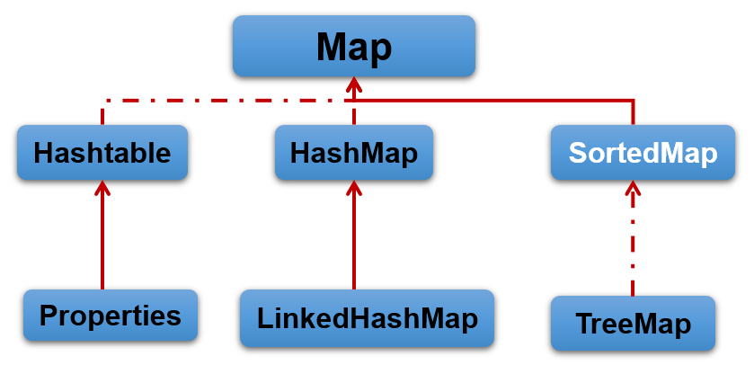
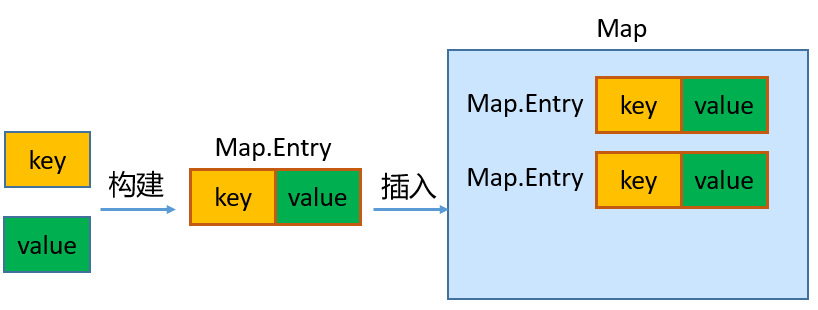

### 集合框架概述

#### 数组的特点与缺点

- 面向对象语言对事物的体现都是以对象的形式，为了方便对多个对象的操作，就需要对对象进行存储
- 使用数组存储对象方面具有一些弊端，而Java集合就像一种容器，可以**动态的**把多个对象的引用存入容器中。
- 数组在内存存储方面的特点：
  - 数组初始化以后，其长度就确定了
  - 数组中的添加的元素类型是依次紧密排列的，有序的，可以重复的
  - 数组声明的类型，就觉定了进行元素初始化时的类型。不是以此类型的变量，不能添加。
  - 可以存储基本数据类型值，也可以存储引用数据类型的变量。
- 数组在存储数据方面的缺点：
  - 数组初始化以后，长度就不可变，不便于扩展
  - 数组中提供的属性和方法较少，不便于进行添加、删除、插入、获取元素个数等操作，且效率不高。
  - 数组存储数据的特点单一，只能存储有序的、可以重复的数据
- Java集合框架中的类可以用于存储多个**对象**，还可以存储具有**映射关系**的关联数组

#### Java集合框架体系

Java集合可分为Collection和Map两大体系：

- Collection接口：用于存储一个一个的数据，也称**单列数据集合**
  - List子接口：用于存储有序的、可以重复的数据（主要用来替换数组，**动态数组**）
    - 实现类：ArrayList（主要实现类）、LinkedList、Vector
- Set子接口：用来存储无序的、不可重复的数据
  - 实现类：HashSet（主要实现类）、LinkedHashSet、TreeSet
- Map接口：用于存储具有映射关系（**Key-Value**）键值对的集合，也称**双列数据集合**
  - HashMap（主要实现类）、LinkedHashMap、TreeMap、Hashtable、Properties
- JDK提供的集合API位于`java.util`包内
- 集合框架全图


- Collection接口继承树


- Map接口继承树

  

### Collection接口及方法

- JDK不提供此接口的任何直接实现，而是提供更具体的子接口(如：Set和List)实现。
- Collection接口是List和Set接口的父接口，该接口里定义的方法即可用于操作Set集合，也可用于操作List集合

#### 添加

- 1、add(E obj)：添加元素对象岛当前集合中
- addAll(Collection other)：添加other集合中的所有元素对象到当前集合中

```java
public class CollectionTest {
    @Test
    public void test01(){	//使用数组存储不同类型的元素
        Object[] obj = new Object[10];
        obj[0] = 123;
        obj[1] = "Java";
        obj[2] = Double.valueOf(4.5);
        System.out.println(Arrays.toString(obj));
    }
    @Test
    public void testAdd(){
        Collection coll = new ArrayList();
        coll.add(123);
        coll.add(Integer.valueOf(200));
        coll.add("java");
        coll.add(new Person("Tom",22));
        System.out.println(coll.size());
        System.out.println(coll);
    }
    @Test
    public void testAddAll(){
        Collection coll = new ArrayList();
        coll.add("java");
        coll.add("python");
        coll.add("c");
        coll.add("c++");
        System.out.println(coll);
        Collection list = new ArrayList();
        list.add("rust");
        list.add("golang");
        coll.addAll(list);
        System.out.println(coll);
        System.out.println(coll.size());
    }
}
```

#### 判断

- int size()：获取当前集合中实际存储的元素个数
- boolean isEmpty()：判断当前集合是否为空集合
- boolean contains(Object obj)：判断当前集合中是否存在一个与obj对象equals返回true的元素
- boolean containsAll(Collection coll)：判断coll集合中的元素是否在当前集合中都存在；即coll集合是否是当前集合的子集。
- boolean equals(Object obj)：判断当前集合与obj是否相等

```java
public void test02(){
        Collection coll = new ArrayList();
        coll.add("java");
        coll.add("python");
        coll.add("c");
        coll.add(new Person("Tom",22));
        System.out.println(coll.isEmpty()); //false
        System.out.println(coll.size());    //4
        System.out.println(coll.contains("python"));    //true
        System.out.println(coll.contains(new Person("Tom",22)));    //true
        Collection coll1 = new ArrayList();
        coll1.add("python");
        coll1.add(new Person("Tom",22));
        System.out.println(coll.containsAll(coll1));    //true
        System.out.println(coll.equals(coll1)); //false
        Collection coll2 = new ArrayList();
        coll2.add("python");
        coll2.add(new Person("Tom",22));
        System.out.println(coll1.equals(coll2));    //true
    }
```

#### 删除

- Void clear()：清空集合元素
- boolean remove(Object obj)：从当前集合中删除第一个找到的与obj对象equals返回true的元素。
- boolean removeAll(Collection coll)：从当前集合中删除所有与coll集合中相同的元素。
- Boolean retainAll(Collection coll)：从当前集合中删除两个集合中不同的元素，使得当前集合仅保留了coll集合中的元素相同的元素。即当前集合中仅保留两个集合的交集。

```java
	public void testRemove(){
        Collection coll = new ArrayList();
        coll.add("on java");
        coll.add("java编程思想");
        coll.add("深入理解java虚拟机");
        coll.add("on java");
        coll.add("effective java");
        System.out.println(coll);
        coll.remove("on java");
        System.out.println(coll);
        System.out.println(coll.size());
    }
    public void testRemoveAll(){
        Collection coll = new ArrayList();
        coll.add("java编程思想");
        coll.add("深入理解java虚拟机");
        coll.add("深入理解java虚拟机");
        coll.add("on java");
        coll.add("effective java");
        coll.add("on java");
        System.out.println(coll);
        Collection coll1 = new ArrayList();
        coll1.add("effective java");
        coll1.add("深入理解java虚拟机");
        coll.removeAll(coll1);  //会删除重复所有元素
        System.out.println(coll);   //[java编程思想, on java, on java]
    }
    public void testReatainAll(){
        Collection coll = new ArrayList();
        coll.add("java编程思想");
        coll.add("深入理解java虚拟机");
        coll.add("深入理解java虚拟机");
        coll.add("on java");
        coll.add("effective java");
        coll.add("on java");
        System.out.println(coll);
        Collection coll1 = new ArrayList();
        coll1.add("effective java");
        coll1.add("深入理解java虚拟机");
        coll.retainAll(coll1);
        System.out.println(coll); //[深入理解java虚拟机, 深入理解java虚拟机, effective java]
        coll.clear();
        System.out.println(coll);   //[]
        System.out.println(coll.size());    //0
    }
```

#### 其他

- Object[] toArray()：返回包含当前集合中所有元素的数组
- hashCode()：获取集合对象的哈希值
- iterator()：返回迭代器对象，用于集合遍历
- removeIf()：根据条件删除

```java
    public void testToArry(){
        Collection coll = new ArrayList();
        coll.add("java编程思想");
        coll.add("深入理解java虚拟机");
        coll.add("深入理解java虚拟机");
        coll.add("on java");
        coll.add("effective java");
        coll.add(new Person("Tom",23));
      	//将集合转为数组
        Object[] arr = coll.toArray();
        System.out.println(Arrays.toString(arr));
        String[] str = {"Tom","Jack","Canvs"};
      	//将数组转为List集合
        Collection coll1 = Arrays.asList(str);
        System.out.println(coll1);
    }
    public void testIterator(){
        Collection coll = new ArrayList();
        coll.add("java编程思想");
        coll.add("深入理解java虚拟机");
        coll.add("深入理解java虚拟机");
        coll.add("on java");
        coll.add("effective java");
        coll.add(new Person("Tom",23));
        Iterator iterator = coll.iterator();    //获取迭代器对象
        //推荐写法
        while (iterator.hasNext()){
            System.out.println(iterator.next());
        }
    }
    public void testOther(){
        Collection coll = new ArrayList();
        coll.add("java编程思想");
        coll.add("深入理解java虚拟机");
        coll.add("深入理解java虚拟机");
        coll.add("on java");
        coll.add("effective java");
        System.out.println(coll.hashCode());    //-1761129567
    }
    public void testRemoveIf(){
        Collection coll = new ArrayList();
        coll.add(new Person("Tom",22));
        coll.add(new Person("jack",25));
        coll.add(new Person("lisa",22));
        coll.add(new Person("canvs",24));
        System.out.println(coll);
        coll.removeIf(new Predicate() {	//删除指定条件元素
            @Override
            public boolean test(Object o) {
                Person p = (Person) o;
                return p.age==22;
            }
        });
        System.out.println(coll);
    }
}
```

### Iterator(迭代器)接口

- 在程序开发中，经常需要遍历集合中的所有元素。正对这种需求，JDK专门提供了一个接口`java.util.Iterator`。`Iterator`接口也是Java集合中的一员，但它与`Collection`、`Map`接口有所不同
  - Collection接口与Map接口主要用于存储元素
  - Iterator被称为迭代器接口，本身并不提供存储对象的能力，主要用于遍历Collection中的元素
- Collection接口继承了java.lang.Iterable接口，该接口有一个iterator()方法，那么所有实现了Collection接口的集合类都一个iterator()方法，用于返回一个实现了Iterator接口的对象。
  - `public Iterator iterator()`：获取集合对应的迭代器，用来遍历集合中的元素。
  - 集合对象每次调用iterator()方法都得到一个全新的迭代器对象，默认游标都在集合的第一个元素之前。
- Iterator接口的常用方法：
  - `public E next()`：返回迭代下一个元素。
  - `public boolean hasNext()`：如果仍有元素可以迭代，则返回true注意;
- 在调用`iterator.next()`方法之前必须调用`iterator.hasNext()`方法进行检测。若不调用，且没有下一条记录，直接调用，则抛出`NoSuchElementException`异常。

```java
 	public void testIterator(){
        Collection coll = new ArrayList();
        coll.add("java编程思想");
        coll.add("深入理解java虚拟机");
        coll.add("深入理解java虚拟机");
        coll.add("on java");
        coll.add("effective java");
        coll.add(new Person("Tom",23));
        Iterator iterator = coll.iterator();    //获取迭代器对象
        //推荐写法
        while (iterator.hasNext()){
            System.out.println(iterator.next());
        }
//        for (int i = 0; i < coll.size(); i++) {   //不推荐写法
//            System.out.println(iterator.next());
//        }
    }
```

#### 迭代器原理

Iterator迭代器对象在遍历集合时，内部采用指针的方法来跟踪集合中的元素。


**注意：**

- Iterator可以删除集合的元素，但是遍历过程中通过迭代器对象的remove方法，不是集合对象的remove方法
- 如果还未调用next()或在上一次调用next()方法之后已经调用了remove()方法，再调用remove()都会报IllegalStateException。
- Collection已经有remove(xx)方法了，为什么Iterator迭代器还要提供删除方法呢？因为迭代器的remove()可以按指定的条件进行删除。

例如：删除集合中的所有偶数

```java
    public void testRemove(){
        Collection coll = new ArrayList();
        coll.add(1);
        coll.add(2);
        coll.add(3);
        coll.add(4);
        coll.add(5);
        coll.add(6);
        Iterator iterator = coll.iterator();
        while (iterator.hasNext()){
            //删除coll中的偶数
            if (0 == (((int) iterator.next()) % 2)) iterator.remove();
        }
        System.out.println(coll);
    }
```

#### foreach循环

- foreach循环(增强for循环)是JDK5.0中定义的一个高级for循环，专门用来遍历数组和集合的。
- foreach循环的语法格式：

```java
for(元素的数据类型 局部变量 : Collection集合或数组){ 
  	//操作局部变量的输出操作
}
```

```java
public class ForeachTest {
    @Test
    public void test01(){
        Collection coll = new ArrayList();
        coll.add(1);
        coll.add(2);
        coll.add(3);
        coll.add(4);
        coll.add(5);
        coll.add(6);
        for (Object obj:coll) System.out.println(obj);
    }
    @Test
    public void test02(){
        Collection coll = new ArrayList();
        coll.add("java编程思想");
        coll.add("深入理解java虚拟机");
        coll.add("深入理解java虚拟机");
        coll.add("on java");
        coll.add("effective java");
        for (Object obj:coll) System.out.println(obj);
    }
}
```

- 对于集合的遍历，foreach的内部原理其实就Iterator迭代器。


- 它用于遍历Collection和数组。通常只进行遍历元素，不要在遍历的过程中对集合元素进行增删操作。

**面试题：**

```java
public class ForeachInterviewQuestion {
    public static void main(String[] args) {
        String[] str = new String[5];
        for (String s : str){
            s = "hello";
            System.out.println(s);  //hello
        }
        for (String s : str) System.out.println(s); //null
    }
}
```

### Collection子接口：List

#### List接口特点

- 鉴于Java中数组用来存储数据的局限性，我们通常使用`java.util.List`替代数组
- List集合类中元素**有序、且可重复**，集合中的每个元素都有其对应的顺序索引
- JDK API中List接口的实现类常用的有：`ArrayList` `LinkedList` `Vector`

#### List接口方法

List除了从Collection集合继承的方法外，List集合里添加了一些**根据索引**来操作集合元素的方法。

- 插入元素
  - `void add(int index, Object ele)`：在index位置插入ele元素
  - `boolean addAll(int index, Collection eles)`：从index位置开始将eles中的所有元素添加进来
- 获取元素
  - `Object get(int index)`：获取指定index位置的元素
  - `boolean subList(int fromIndex, int toIndex)`：返回fromIndex到toIndex位置的子集
- 获取元素索引
  - `int indexOf(Object obj)`：返回obj在集合中首次出现的位置
  - `int lastIndexOf(Object obj)`：返回obj在当前集合中末次出现的位置
- 删除和替换元素
  - `Object remove(int index)`：删除指定index位置的元素，并返回此元素
  - `Object set(int index, Object ele)`：设置指定index位置的元素为ele

```java
public class ListTest {
    @Test
    public void testAdd(){
        List list = new ArrayList();
        list.add("java编程思想");
        list.add("深入理解java虚拟机");
        list.add("effective java");
        list.add("on java");
        list.add(new Person("Tom",25));
        System.out.println(list);
    }
    @Test
    public void testAddAll(){
        List list = new ArrayList();
        list.add("java编程思想");
        list.add("深入理解java虚拟机");
        list.add("effective java");
        list.add("on java");
        System.out.println(list);
        List list2 = new ArrayList();
        list2.add("鸟哥Linux私房菜");
        list2.add("鸟哥Linux私房菜");
        list2.add("JavaScript");
        list.addAll(list2);
        System.out.println(list);
    }
    @Test
    public void testGet(){
        List list = new ArrayList();
        list.add("java编程思想");
        list.add("深入理解java虚拟机");
        list.add("effective java");
        list.add("on java");
        list.add(new Person("canvs",23));
        System.out.println(list.get(2));
        for (int i = 0; i < list.size(); i++) {
            System.out.println(list.get(i));
        }
    }
    @Test
    public void testSubList(){
        List list = new ArrayList();
        list.add("java编程思想");
        list.add("深入理解java虚拟机");
        list.add("effective java");
        list.add("on java");
        list.add(new Person("canvs",23));
        List list1 = list.subList(2,4); //[effective java, on java]
        System.out.println(list1);
    }
    @Test
    public void testIndexOf(){
        List list = new ArrayList();
        list.add("java编程思想");
        list.add("深入理解java虚拟机");
        list.add("effective java");
        list.add("on java");
        list.add(new Person("canvs",23));
        System.out.println(list.indexOf("on java"));    //3
        System.out.println(list.indexOf(new Person("canvs",23)));//4
    }
    @Test
    public void testRemove(){
        List list = new ArrayList();
        list.add("java编程思想");
        list.add("深入理解java虚拟机");
        list.add("effective java");
        list.add("on java");
        list.add(new Person("canvs",23));
        list.remove(2);
        list.remove("on java");
        System.out.println(list);
    }
    @Test
    public void testSet(){
        List list = new ArrayList();
        list.add("java编程思想");
        list.add("深入理解java虚拟机");
        list.add("effective java");
        list.add("on java");
        System.out.println(list);
        list.set(2,"鸟哥Linux私房菜");
        System.out.println(list);
    }
}
```

##### 面试题：

判断输出结果？

```java
public class Test {
    public static void main(String[] args) {
        List list = new ArrayList();
        list.add("helo");
        list.add(2);
        list.add(3);
        list.add("java");
        list.add("python");
        list.remove(2);
        System.out.println(list);
//        list.remove(Integer.valueOf(2));
//        System.out.println(list);
    }
}
```

#### List接口主要实现类：ArrayList

- ArrayList是List接口的主要实现类
- 本质上，ArrayList是对象引用的一个变长数组
- Arrays.asList(...)方法返回的List集合，既不是ArrayList实例，也不是Vector实例。Arrays.asList(...)返回值是一个固定长度的List集合

#### List的实现类：LinkedList

- 对于频繁的插入或删除元素的操作，建议使用LinkedList类，效率较高。这是由底层采用链表（双向链表）结构存储数据决定的。
- 特有方法：
  - void addFirst(Object obj)：在集合首部插入元素
  - void addLast(Object obj)：在集合尾部插入元素
  - Object getFirst()：获取集合第一个元素
  - Object getLast()：获取集合末尾元素
  - Object removeFirst()：删除集合第一个元素
  - Object removeLast()：删除集合最后一个元素

```java
public class LinkedListTest {
    @Test
    public void test01(){
        LinkedList list = new LinkedList();
        list.add("java编程思想");
        list.add("深入理解java虚拟机");
        list.add("深入理解java虚拟机");
        list.add("on java");
        list.add("effective java");
        System.out.println(list);
        list.addFirst("鸟哥Linux私房菜");
        list.addLast("Linux就该这么学");
        System.out.println(list);
    }
    @Test
    public void test02(){
        LinkedList list = new LinkedList();
        list.add("java编程思想");
        list.add("深入理解java虚拟机");
        list.add("深入理解java虚拟机");
        list.add("on java");
        list.add("effective java");
        System.out.println(list.getFirst());
        System.out.println(list.getLast());
        list.removeFirst();
        list.removeLast();
        System.out.println(list);
    }
}
```

#### List的实现类：Vector

- Vector是一个古老的集合，JDK1.0就有了。大多数操作与ArrayList相同，区别在于Vector**是线程安全的**
- 在各种List中，最好把ArrayList作为默认选择。当插入、删除频繁时，使用LinkedList；Vector总是比ArrayList慢，所以尽量避慢使用。
- 特有方法：
  - void addElement(Object obj)：添加元素
  - void insertElementAt(Object obj, int index)：在指定位置插入元素
  - void setElementAt(Object obj, int index)：修改指定位置元素
  - void removeElement(Object obj)：删除指定元素
  - void removeAllElements()：清空集合

```java
public class VectorTest {
    public static void main(String[] args) {
        Vector v = new Vector();
        v.addElement(Integer.valueOf(1));
        v.addElement(Integer.valueOf(2));
        v.addElement(Integer.valueOf(3));
        v.addElement("hello");
        System.out.println(v);
        v.insertElementAt("java", 1);
        v.setElementAt("world", 4);
        System.out.println(v);
        v.removeElement("java");
        System.out.println(v);
        v.removeAllElements();
        System.out.println(v);
    }
}
```

#### 练习

**面试题：**

打印结果

```java
public class InterviewQuestion {
    public static void main(String[] args) {
        List list = new ArrayList();
        list.add(1);
        list.add(2);
        list.add(3);
        updateList(list);
        System.out.println(list);
    }
    public static void updateList(List list){
        list.remove(2);
    }
}
```

**练习1：**

- 定义学生类，属性为姓名、年龄，提供必要的getter、setter方法，构造器，toString()，equals()方法。
- 使用ArrayList集合，保存录入的多个学生对象。
- 循环录入的方式，1：继续录入，0：结束录入。
- 录入结束后，遍历集合。

```java
public class Student {
    private String name;
    private int age;
    public Student(String name, int age) {
        this.name = name;
        this.age = age;
    }
    public String getName() {
        return name;
    }
    public void setName(String name) {
        this.name = name;
    }
    public int getAge() {
        return age;
    }
    public void setAge(int age) {
        this.age = age;
    }
    @Override
    public String toString() {
        return "Student{" +
                "name='" + name + '\'' +
                ", age=" + age +
                '}';
    }
}
```

```java
public class StudentTest {
    public static void main(String[] args) {
        Scanner scan = new Scanner(System.in);
        List list = new ArrayList();
        while (true){
            System.out.print("选择（1.录入; 0.退出）：");
            int num = scan.nextInt();
            System.out.println();
            if (num == 1){
                System.out.print("姓名:");
                String name = scan.next();
                System.out.println();
                System.out.print("年龄:");
                int age = scan.nextInt();
                list.add(new Student(name,age));
            }else if (num == 0){
                break;
            }else{
                System.out.println("输入有误！");
            }
        }
        Iterator iterator = list.iterator();
        while (iterator.hasNext()){
            System.out.println(iterator.next());
        }
        scan.close();
    }
}
```

**练习2：**

- 请定义方法public static int listTest(Collection list,String s)统计集合中指定元素出现的次数
- 创建集合，集合存放随机生成的30个小写字母
- 用listTest统计，a、b、c、x元素的出现次数

```java
public class Test {
    public static void main(String[] args) {
        Random random = new Random();
        List list = new ArrayList();
        for (int i = 0; i < 30; i++) {
            list.add((char)(random.nextInt(26)+97));
        }
        System.out.println(list);
        System.out.println("a:"+countList(list,"a"));
        System.out.println("b:"+countList(list,"b"));
        System.out.println("c:"+countList(list,"c"));
        System.out.println("d:"+countList(list,"d"));
    }
    public static int countList(List list,String str){
        int count=0;
        for (Object obj : list) {
            if (str.equals(String.valueOf(obj))){
                count++;
            }
        }
        return count;
    }
}
```

**练习3:ktv点个系统**

```java
public class KTVByLinkedList {
    static List list = new LinkedList();
    static Scanner scan = new Scanner(System.in);
    public static void main(String[] args) {
        addMusic(list);
        l:while (true){
            System.out.println(list);
            System.out.println("-------------欢迎来到点歌系统------------");
            System.out.println("1.添加歌曲至列表");
            System.out.println("2.将歌曲置顶");
            System.out.println("3.将歌曲前移一位");
            System.out.println("4.退出");

            System.out.print("请选择：");
            int num = scan.nextInt();
            switch (num){
                case 1:
                    addMusic();
                    break;
                case 2:
                    topMusic();
                    break;
                case 3:
                    setBefore();
                    break;
                case 4:
                    System.out.println("----------------退出---------------");
                    System.out.println("您已退出系统");
                    break l;
                default:
                    System.out.println("----------------------------------");
                    System.out.println("选择错误！");
                    break;
            }
        }
        scan.close();
    }
    public static void addMusic(){
        System.out.println("请输入歌曲:");
        String musicName = scan.next();
        list.add(musicName);
        System.out.println(musicName +" 添加成功");
    }
    public static void topMusic(){
        System.out.println("输入置顶歌曲:");
        String musicName = scan.next();
        int index = list.indexOf(musicName);
        if (index==0){
            System.out.println(musicName+" 已置顶");
        }else if (index < 0) {
            System.out.println("歌曲不存在");
        }else{
            list.remove(musicName);
            list.add(0,musicName);
            System.out.println(musicName+" 已添加置顶");
        }
    }
    public static void setBefore(){
        System.out.println("请输入歌曲:");
        String musicName = scan.next();
        int index = list.indexOf(musicName);
        if (index < 0){
            System.out.println("当前列表没有次歌曲");
        }else if(index == 0){
            System.out.println("歌曲已经置顶");
        }else {
            list.remove(musicName);
            list.add(index-1,musicName);
            System.out.println(musicName+"向前移一位");
        }
    }
    public static void addMusic(List list){
        list.add("一千个伤心的理由");
        list.add("遥远的她");
        list.add("只想一生跟你走");
        list.add("你瞒我瞒");
    }
}
```

### Collection子接口：Set

#### Set接口概述

- Set接口是Collection的子接口，Set接口相较于Collection接口没有提供额外的方法
- Set集合不允许包含相同的元素，如果把两个相同打的元素加入到同一个Set集合中，则添加失败
- Set集合支持的遍历方式和Collection集合一样：foreach和Iterator
- Set的常用实现类：HashSet、TreeSet、LinkedHashSet

#### Set主要实现类：HashSet

- HashSet是Set接口的主要实现类，大多数使用Set集合时都是用这个实现类
- HashSet按Hash算法来存储集合中的元素，因此具有很好的存储、查找、删除性能
- HashSet具有以下特点：
  - 不能保证元素的排列顺序
  - HashSet不是线程安全的
  - 集合元素可以是null
- HashSet集合判断两个元素相等的标准：两个对象通过hashCode()方法得到哈希值相等，并且两个对象的equals()方法返回值为true
- 对于存放在Set容器中的对象，对应的类一定要重写hashcode()和equals(Object obj)方法，以实现对象相等的规则。即：相等的对象必须具有相等的散列码
- HashSet集合中元素的无序性，不等同于随机性。这里的无序性与元素的添加位置有关。具体来说：我们添加每一个元素到数组时，具体的存储位置是有元素的hashCode()方法调用后返回的hash值决定的。导致在数组中每个元素不是依次紧密存放的，表现出一定的无序性。

#### HashSet中添加元素的过程

- 第一步：当向HashSet集合中存放一个元素时，HashSet会调用该对象的hashCode()方法得到该对象的hashCode值，然后根据hashCode值，通过某个散列函数决定该对象在HashSet底层数组中存储位置。
- 第二步：如果要在数组中存储的位置上没有元素，则直接添加成功
- 第三步：如果在数组中存储的位置上有元素，则继续比较
  - 如果两个元素的hashCode值不相等，则添加成功
  - 如果两个元素的hashCode值相等，则会继续调用equals方法
    - 如果equals方法结果为false，则添加成功
    - 如果equals方法结果为true，则添加失败。

> 第二步添加成功，元素会保存在底层数组中
>
> 第三步两个中添加成功的操作，由于底层数组位置已经有元素了，则会通过**链表**的方法继续链接存储。

```java
public class Book {
    private String name;
    private double price;
    public Book(String name, double price) {
        this.name = name;
        this.price = price;
    }
    public String getName() {
        return name;
    }
    public void setName(String name) {
        this.name = name;
    }
    public double getPrice() {
        return price;
    }
    public void setPrice(double price) {
        this.price = price;
    }
    @Override
    public String toString() {
        return "Book{" +
                "name='" + name + '\'' +
                ", price=" + price +
                '}';
    }
    @Override
    public boolean equals(Object obj) {
        if (this == obj) return true;
        if (obj instanceof Book){
            Book o = (Book) obj;
            return o.name.equals(this.getName()) && o.price==this.getPrice();
        }
        return false;
    }
    @Override
    public int hashCode() {
        int result;
        long temp;
        result = name != null ? name.hashCode() : 0;
        temp = Double.doubleToLongBits(price);
        result = 31 * result + (int) (temp ^ (temp >>> 32));
        return result;
    }
}
```

```java
public class HashSetTest {
    @Test
    public void test01(){
        Set set = new HashSet();
        set.add("深入Java虚拟机");
        set.add("算法第四版");
        set.add("Java编程思想");
        set.add("图解HTTP");
        set.add("鸟哥Linux私房菜");
        System.out.println(set);
        //set.add("鸟哥Linux私房菜");  //添加失败
        Iterator iterator = set.iterator();
        while (iterator.hasNext()) System.out.println(iterator.next());
    }
    @Test
    public void test02(){
        Set set = new HashSet();
        set.add(new Book("深入Java虚拟机",98));
        set.add(new Book("算法第四版",79));
        set.add(new Book("Java编程思想",88.8));
        set.add(new Book("鸟哥Linux私房菜",56.4));
       // set.add(new Book("鸟哥Linux私房菜",56.4));   //添加失败
        System.out.println(set.size());
    }
    @Test
    public void test03(){
        Set set = new HashSet();
        set.add(new Book("深入Java虚拟机",98));
        set.add(new Book("算法第四版",79));
        set.add(new Book("Java编程思想",88.8));
        set.add(new Book("鸟哥Linux私房菜",56.4));
        set.remove(new Book("Java编程思想",88.8));
        Iterator iterator = set.iterator();
        while (iterator.hasNext()) System.out.println(iterator.next());
    }
}
```

#### 重写hashCode()方法的基本原则

- 在程序运行时，同一个对象多次调用hashCode()方法应该返回相同的值。
- 当两个对象的equals()方法比较返回true时，这两个对象的hashCode()方法返回值也要相等。
- 对象中用作equals()方法比较的Field，都应该用来计算hashCode值。

> 注意：如果两个元素的equals方法返回true，但它们的hashCode返回值不相等，hashSet将会把它们存储在不同的位置，但依然可以添加成功

#### 重写equals()方法基本原则

- 重写equals方法的时候一般都需要同事重写hashCode方法。通常参与计算hashCode的对象的属性也应该参与到equals中进行计算。

#### 练习：

练习1：在List内去除重复数字值

```java
public class exer1 {
    public static void main(String[] args) {
        List list = new ArrayList();
        list.add(new Integer(1));
        list.add(new Integer(2));
        list.add(new Integer(3));
        list.add(new Integer(4));
        list.add(new Integer(1));
        list.add(new Integer(2));
        list.add(new Integer(3));
        list.add(new Integer(4));
        list.add(new Integer(4));
        System.out.println(duplication(list));
    }
    public static List duplication(List list) {
        HashSet set = new HashSet();
        set.addAll(list);
        return new ArrayList(set);
    }
}
```

练习2:获取随机数

获取10个1-11的随机数，要求随机不能重复。

```java
public class exer2 {
    public static void main(String[] args) {
        Set set = new HashSet();
        Random random = new Random();
        while (set.size()<10){
            int i = random.nextInt(10)+1;
            set.add(i);
        }
        System.out.println(set);
    }
}
```

练习3:去重

使用Scanner从键盘读取一行输入，去掉其中重复字符，打印出不同的那些字符。

```java
public class exer3 {
    public static void main(String[] args) {
        Scanner scanner = new Scanner(System.in);
        System.out.print("请输入一行字符串：");
        String str = scanner.nextLine();
        char[] arr = str.toCharArray();
        HashSet set = new HashSet();
        for (char c : arr) set.add(c);
        System.out.println(set);
        scanner.close();
    }
}
```

练习4:面试题

```java
public class InterviewQuestion {
    public static void main(String[] args) {
        HashSet set = new HashSet();
        Person p1 = new Person(1001,"A");
        Person p2 = new Person(1002,"B");
        set.add(p1);
        set.add(p2);
        p1.name = "C";
        set.remove(p1);
        System.out.println(set);
        set.add(new Person(1001,"C"));
        System.out.println(set);
        set.add(new Person(1001,"A"));
        System.out.println(set);
    }
}
class Person{
    int id;
    String name;
    public Person(int id, String name) {
        this.id = id;
        this.name = name;
    }
    @Override
    public String toString() {
        return "Person{" +
                "id=" + id +
                ", name='" + name + '\'' +
                '}';
    }
    @Override
    public boolean equals(Object o) {
        if (this == o) return true;
        if (o == null || getClass() != o.getClass()) return false;

        Person person = (Person) o;

        if (id != person.id) return false;
        return Objects.equals(name, person.name);
    }
    @Override
    public int hashCode() {
        int result = id;
        result = 31 * result + (name != null ? name.hashCode() : 0);
        return result;
    }
}
```

#### Set实现类：LinkedHashSet

- LinkedHashSet是HashSet子类，不允许集合元素重复
- LinkedHashSet根据元素的hashCode值来决定元素的存储位置，但它同时使用双向链表维护元素的顺序，这使得元素看起来是以添加顺序保存的。
- LinkedHashSet插入性能略低于HashSet，但在迭代访问Set里的全部元素时有很好的性能

```java
public class LinkedHashSetTest {
    @Test
    public void test01(){
        LinkedHashSet set = new LinkedHashSet();
        set.add("深入Java虚拟机");
        set.add("算法第四版");
        set.add("Java编程思想");
        set.add("图解HTTP");
        set.add("鸟哥Linux私房菜");
        System.out.println(set);
    }
}
```

#### Set实现类：TreeSet

- TreeSet是SortedSet接口的实现类，TreeSet可以按照添加的元素指定的属性的大小顺序进行遍历。
- TreeSet底层使用**红黑树**结构存储数据
- TreeSet新增方法：
  - Comparator comparator()
  - Object first()
  - Object last()
  - Object lower(Object e)
  - Object higher(Object e)
  - SortedSet subSet(fromElement, toElement)
  - SortedSet headSet(toElement)
  - SortedSet tailSet(fromElement)
- TreeSet 特点：不允许重复、实现排序（自然排序或定制排序）
- TreeSet两种排序方法：自然排序和定制排序。默认情况下，TreeSet采用自然排序。
  - 自然排序：TreeSet会调用集合元素的compareTo(Object obj)方法来比较元素之间的大小关系，然后将集合元素按升序（默认）排列。
    - 如果试图把一个对象添加到TreeSet时，则该对象类必须实现Comparable接口
    - 实现Comparable的类必须实现compareTo(Object obj)方法，两个对象通过compareTo(Object obj)方法返回值来比较大小。
  - 定制排序：如果元素所属类没有实现Comparable接口，或不希望按照升序的方式排列元素或希望按照其他属性大小进行排序，则考虑使用定制排序。定制排序，通过Comparator接口来实现。需要重写compare(T o1, To2)方法。
    - 利用int compare(T o1, To2)方法，比较o1和o2的大小：如果方法返回正整数，则表示o1大于o2；如果返回0，表示相等；返回负整数，表示o1小于o2。
    - 要实现定制排序，需要将实现Comparator接口的实例作为形参传递给TreeSet的构造器。
- 因为只有相同类的两个实例才会比较大小，所以向TreeSet中添加的应该是同一类的对象。
- 对于TreeSet集合而言，它判断两个对象是否相等的唯一标准：两个对象通过compareTo(Object obj)或compare(Object o1, Object o2)方法比较返回值。返回值为0，则认为两个对象相等。

```java
public class Student implements Comparable{
    private String name;
    private int age;
    public String getName() {
        return name;
    }
    public int getAge() {
        return age;
    }
    public Student(String name, int age) {
        this.name = name;
        this.age = age;
    }
    @Override
    public int compareTo(Object o) {
        if (this == o) return 0;
        if (o instanceof Student) return this.name.compareTo(((Student) o).name);
        return this.age - ((Student) o).age;
    }
    @Override
    public String toString() {
        return "Student{" +
                "name='" + name + '\'' +
                ", age=" + age +
                '}';
    }
}
```

```java
public class TreeSetTest {
    @Test
    public void test(){
        TreeSet set = new TreeSet();
        set.add(5);
        set.add(4);
        set.add(3);
        set.add(1);
        set.add(2);
       // set.add("123"); //ClassCastException异常
        System.out.println(set);
        System.out.println(set.first());
        System.out.println(set.last());
    }

    @Test
    public void test02(){
        //自然排序
        TreeSet set = new TreeSet();
        set.add(new Student("Tom",22));
        set.add(new Student("Jack",23));
        set.add(new Student("Lisa",22));
        set.add(new Student("Peter",25));
        Iterator iterator = set.iterator();
        while (iterator.hasNext()){
            System.out.println(iterator.next());
        }
    }
    @Test
    public void test03(){
        //定制排序
        TreeSet set = new TreeSet(new Comparator() {
            @Override
            public int compare(Object o1, Object o2) {
                if (o1==o2) return 0;
                if (o1 instanceof Student && o2 instanceof Student){
                    Student s1 = (Student) o1;
                    Student s2 = (Student) o2;
                    if (s1.getAge() == s2.getAge()) return s1.getName().compareTo(s2.getName());
                    return s1.getAge() - s2.getAge();
                }
                throw new RuntimeException("输入类型有误！");
            }
        });
        set.add(new Student("Tom",22));
        set.add(new Student("Peter",23));
        set.add(new Student("Lisa",22));
        set.add(new Student("Jack",23));
        for (Object obj : set) System.out.println(obj);
    }
}
```

#### 练习：

**练习1**:在一个List集合中存储了多个无大小顺序并且有重复的字符串，定义一个方法，让其有序(从小到大排序)，并且不能去除重复元素。

```java
	public static void main(String[] args) {
        ArrayList list = new ArrayList();
        list.add("A");
        list.add("C");
        list.add("D");
        list.add("B");
        list.add("D");
        list.add("A");
        list.add("C");
        System.out.println(list);
        System.out.println(sort(list));
    }
    public static List sort(List list) {
        TreeSet set = new TreeSet(new Comparator() {
            @Override
            public int compare(Object o1, Object o2) {
                String s1 = (String) o1;
                String s2 = (String) o2;
                int num = s1.compareTo(s2);
                return num == 0 ? 1 : num;
            }
        });
        set.addAll(list);
        list.clear();
        list.addAll(set);
        return list;
    }
```

**练习2**:TreeSet的自然排序和定制排序

1. 定义一个Employee类。
   该类包含：private成员变量name,age,birthday，其中 birthday 为 MyDate 类的对象；
   并为每一个属性定义 getter, setter 方法；
   并重写 toString 方法输出 name, age, birthday

2. MyDate类包含:
   private成员变量year,month,day；并为每一个属性定义 getter, setter 方法；

3. 创建该类的 5 个对象，并把这些对象放入 TreeSet 集合中（下一章：TreeSet 需使用泛型来定义）

4. 分别按以下两种方式对集合中的元素进行排序，并遍历输出：

   1). 使Employee 实现 Comparable 接口，并按 name 排序
   2). 创建 TreeSet 时传入 Comparator对象，按生日日期的先后排序。

```java
public class MyDate implements Comparable {
    private int year;
    private int month;
    private int day;
    public MyDate(int year, int month, int day) {
        this.year = year;
        this.month = month;
        this.day = day;
    }
    public int getYear() {
        return year;
    }
    public void setYear(int year) {
        this.year = year;
    }
    public int getMonth() {
        return month;
    }
    public void setMonth(int month) {
        this.month = month;
    }
    public int getDay() {
        return day;
    }
    public void setDay(int day) {
        this.day = day;
    }
    @Override
    public String toString() {
        return getYear()+"年"+getMonth()+"月"+getDay()+"日";
    }
    @Override
    public int compareTo(Object o) {
        if (this == o) return 0;
        if (o instanceof MyDate){
            MyDate  date = (MyDate) o;
            int year = this.getYear() - date.getYear() ;
            if (year == 0){
                if (this.getMonth() == date.getMonth()){
                    return this.getDay() - date.getDay();
                }
                return this.getMonth() - date.getMonth();
            }
            return year;
        }
        throw new RuntimeException("输入类型有误！");
    }
}
```

```java
public class Employee implements Comparable{
    private String name;
    private int age;
    private MyDate birthday;
    public Employee(String name, int age, MyDate birthday) {
        this.name = name;
        this.age = age;
        this.birthday = birthday;
    }
    @Override
    public String toString() {
        return "Employee{" +
                "name='" + name + '\'' +
                ", age=" + age +
                ", birthday=" + birthday +
                '}';
    }
    public String getName() {
        return name;
    }
    public void setName(String name) {
        this.name = name;
    }
    public int getAge() {
        return age;
    }
    public void setAge(int age) {
        this.age = age;
    }
    public MyDate getBirthday() {
        return birthday;
    }
    public void setBirthday(MyDate birthday) {
        this.birthday = birthday;
    }
    @Override
    public int compareTo(Object o) {
        if (this == o) return 0;
        if (o instanceof Employee) return this.name.compareTo(((Employee) o).name);
        throw new RuntimeException("类型有误！");
    }
}
```

```java
public class EmployeeTest {
    public static void main(String[] args) {
        //定制排序
        TreeSet set = new TreeSet(new Comparator() {
            @Override
            public int compare(Object o1, Object o2) {
                if (o1 instanceof Employee && o2 instanceof Employee){
                    Employee e1 = (Employee) o1;
                    Employee e2 = (Employee) o2;
                    return e1.getBirthday().compareTo(e2.getBirthday());
                }
                throw new RuntimeException("输入类型有误！");
            }
        });
        set.add(new Employee("Tom",21,new MyDate(2003,12,12)));
        set.add(new Employee("Jack",18,new MyDate(2005,1,15)));
        set.add(new Employee("Lisa",21,new MyDate(2003,5,25)));
        set.add(new Employee("Peter",28,new MyDate(1996,12,12)));
        set.add(new Employee("Canvs",24,new MyDate(2000,7,29)));
        Iterator iterator = set.iterator();
        while (iterator.hasNext()) System.out.println(iterator.next());
    }
    @Test
    public void test(){
        //自然排序
        TreeSet set = new TreeSet();
        set.add(new Employee("Tom",21,new MyDate(2003,12,12)));
        set.add(new Employee("Jack",18,new MyDate(2005,1,15)));
        set.add(new Employee("Lisa",21,new MyDate(2003,5,25)));
        set.add(new Employee("Peter",28,new MyDate(1996,12,12)));
        set.add(new Employee("Canvs",24,new MyDate(2000,7,29)));
        Iterator iterator = set.iterator();
        while (iterator.hasNext()) System.out.println(iterator.next());
    }
}
```

### Map接口

现实生活于开发中，常回看到这样的集合：用户ID与账户信息、学生姓名与考试成绩、IP地址与主机名等，这种一一对应的关系，就称为映射。Java提供了专门的集合框架用来存储这种映射关系的对象。`java.util.Map`接口

#### Map接口概述

- Map与Collection并列存在，用于保存具有映射关系的数据：key-value
  - Collection集合称为单列集合，元素是孤立存在的
  - Map集合称为双列集合，元素是成对存在的。
- Map中的key和value都可以是任何引用类型的数据。但常用String类作为Map的key。
- Map接口的常用实现类：HashMap、LinkedHashMap、TreeMap、Properties。其中HashMap是Map接口的使用频率最高的实现类



#### Map中key- value特点

以HashMap中存储的key、value的特点：


- Map中的key用Set来存放，不允许重复。即同一个Map对象所对应的类，须重写hashCode()和equals()方法

​	

- key和value之间存在单向一对一关系，即通过制定的key总能找到唯一的、确定的value，不同的key对应的value可以重复。value所在的类须重写equals()方法。
- key和value构成一个entry。所有的entry彼此之间是无序的、不可重复的。

#### Map接口的常用方法

- 添加、修改操作：
  - Object put(Object key, Object value)：将指定key-value添加(修改)到当前map对象中
  - void putAll(Map m)：将m中的key-value对存放到当前map中
- 删除操作：
  - Object remove(Object key)：移除指定key的key-value对，并返回value
  - void clear()：清空当前map中的所有数据
- 元素查询的操作：
  - Object get(Object key)：获取指定key对应的value
  - boolean containsKey(Object key)：是否包含指定的key
  - boolean containsValue(Object value)：是否包含指定的value
  - int size()：返回map中key-value对的个数
  - boolean isEmpty()：判断当前map是否为空
  - boolean equals(Object obj)：判断当前map和参数对象obj是否相等
- 元视图操作的方法：
  - Set keySet()：返回所有key构成的Set集合
  - Collection values()：返回所有value构成的Collection集合
  - Set entrySet()：返回所有key-value对构成的Set集合

```java
	public class MapTest {
    @Test
    public void test01(){
        Map map = new HashMap();
        map.put("1001","Tom");
        map.put("1002","Jack");
        map.put("1003","Canvs");
        map.put("1004","Peter");
        map.put("1004","Canvs");
        HashMap map1 = new HashMap();
        map1.putAll(map);
        System.out.println(map1);
        map1.put("1001","Tom1");    //修改key对应的value
        System.out.println(map1);
    }
    @Test
    public void test02(){
        Map map = new HashMap();
        map.put("1001","Tom");
        map.put("1002","Jack");
        map.put("1003","Canvs");
        map.put("1004","Peter");
        System.out.println(map.size());
        System.out.println(map);
        map.remove("1003");
        System.out.println(map);
        map.clear();
        System.out.println(map.isEmpty());
    }
    @Test
    public void test03(){
        Map map = new HashMap();
        map.put("1001","Tom");
        map.put("1002","Jack");
        map.put("1003","Canvs");
        map.put("1005","Canvs");
        map.put("1004","Peter");
        System.out.println(map.get("1003"));
        System.out.println(map.containsKey("1004"));
        System.out.println(map.containsValue("Canvs"));
        System.out.println(map.size());
        System.out.println(map.isEmpty());
        Map map2 = new HashMap();
        map2.put("1001","Tom");
        map2.put("1002","Jack");
        map2.put("1003","Canvs");
        map2.put("1005","Canvs");
        map2.put("1004","Peter");
        System.out.println(map.equals(map2));   //true
    }
    @Test
    public void test04(){
        Map map = new HashMap();
        map.put("1001","Tom");
        map.put("1002","Jack");
        map.put("1003","Canvs");
        map.put("1005","Canvs");
        map.put("1004","Peter");
        Set set = map.keySet();
        System.out.println(set);
        Collection values = map.values();
        for (Object o : values) System.out.println(o);
        Set entrySet = map.entrySet();
        for (Object o : entrySet) {
            Map.Entry m = (Map.Entry) o;
            System.out.println(m.getKey()+":"+m.getValue());
        }
    }
}
```

#### Map的主要实现类：HashMap

- HashMap是Map接口**使用频率最高**的实现类。
- HashMap是线程不安全的。允许添加null键和null值。
- 存储数据采用哈希表结构，底层使用一维数组+单项链表+红黑树进行key-value数据的存储。与HashSet一样，元素存取顺序不能保证一致。
- HashMap判断两个key相等的标准：两个key的hashCode值相等，通过equals方法返回true
- HashMap判断两个value相等的标准：两个value通过equals方法返回true

#### 练习：

练习1:添加你喜欢的歌手以及他的歌曲

```java
public class SingerTest {
    public static void main(String[] args) {
        HashMap map = new HashMap();
        List list =new ArrayList();
        list.add("一千个伤心的理由");
        list.add("只想一生跟你走");
        list.add("遥远的她");
        list.add("她来听我的演唱会");
        map.put("张学友",list);
        List list2 = Arrays.asList("无条件","约定","单车");
        map.put("陈奕迅",list2);
        Set entrySet = map.entrySet();
        for (Object o : entrySet){
            Map.Entry m = (Map.Entry)o;
            System.out.println("歌手："+m.getKey());
            System.out.println("歌曲：" +m.getValue());
        }
    }
}
```

**练习2:**二级联动

将省份和城市的名称保存在集合中，当用户选择省份以后，二级联动，显示对应省份的地级市供用户选择。

```java
public class CityMap {
    static HashMap model = new HashMap();

    static {
        model.put("北京", new String[]{"北京"});
        model.put("上海", new String[]{"上海"});
        model.put("天津", new String[]{"天津"});
        model.put("重庆", new String[]{"重庆"});
        model.put("黑龙江", new String[]{"哈尔滨", "齐齐哈尔", "牡丹江", "大庆", "伊春", "双鸭山", "绥化"});
        model.put("吉林", new String[]{"长春", "延边", "吉林", "白山", "白城", "四平", "松原"});
        model.put("河北", new String[]{"石家庄", "张家口", "邯郸", "邢台", "唐山", "保定", "秦皇岛"});
    }
}
class ProvinceTest {
    public static void main(String[] args) {
        Scanner scan = new Scanner(System.in);
        Set entrySet = CityMap.model.entrySet();
        for (Object o : entrySet) {
            Map.Entry m = (Map.Entry) o;
            System.out.print(m.getKey() + "\t\t");
        }
        String province;
        while (true) {
            System.out.print("请选择你所在的省份：");
            province = scan.next();
            if (CityMap.model.containsKey(province)) {
                break;
            }
            System.out.println("输入省份有误！");
        }
        System.out.println();
        String[] city = (String[]) CityMap.model.get(province);
        for (String s : city) System.out.print(s+"\t\t");
        System.out.println();
        l:while (true) {
            System.out.print("请输入你所在的城市：");
            String city1 = scan.next();
            for (String s:city){
                if (s.equals(city1)) break l;
            }
            System.out.println("输入城市有误！");
        }
        System.out.println("登记完成！");
        scan.close();
    }
}
```

**练习3:**

需求：统计字符串中每个字符出现的次数

String str = "aaaabbbcccccccccc";

```java
public class WordCountTest {
    public static void main(String[] args) {
        String str = "aaaabbbcccccccccc";
        char[] arr = str.toCharArray();
        HashMap map = new HashMap();
        for (char c: arr){
            if (!map.containsKey(c)){
                map.put(c,1);
            }else map.put(c,(int)map.get(c)+1);
        }
        for (Object o: map.keySet()){
            System.out.println(o+":"+map.get(o));
        }
    }
}
```

#### Map实现类：LinkedHashMap

- LinkedHashMap是HashMap的子类
- 存储数据采用哈希表结构+链表结构，在HashMap存储结构的基础上，使用了一对双向链表来记录添加元素的先后顺序，可以保证遍历元素时，与添加的顺序一致。
- 通过哈希表结构可以保证键的唯一、不重复，需要键所在类重写hashCode方法和equals方法。

```java
public class LinkedHashMapTest {
    @Test
    public void test01(){
        LinkedHashMap map = new LinkedHashMap();
        map.put("1001","Java编程思想");
        map.put("1002","深入理解Java虚拟机");
        map.put("1003","鸟哥Linux私房菜");
        map.put("1004","图解HTTP");
        map.put("1005","算法第四版");
        for (Object o: map.keySet()){
            System.out.println("编号："+o+" 书名："+map.get(o));
        }
    }
    @Test
    public void test02(){
        LinkedHashMap map = new LinkedHashMap();
        map.put("1001",new Book("Java编程思想",67.6));
        map.put("1002",new Book("深入理解Java虚拟机",99.8));
        map.put("1003",new Book("鸟哥Linux私房菜",78.5));
        map.put("1004",new Book("图解HTTP",49.9));
        map.put("1005",new Book("算法第四版",67));
        final Set entrySet = map.entrySet();
        for (Object o : entrySet){
            Map.Entry m = (Map.Entry) o;
            System.out.println("ID:"+m.getKey() +"  "+ m.getValue());
        }
    }
}
```

#### Map实现类：TreeMap

- TreeMap存储key-value对时，需要根据key-value对进行排序。TreeMap可以保证所有的key-value对处于有序状态。
- TreeMap基于红黑树（Red-Black tree）的 NavigableMap 实现
- TreeMap的key的排序
  - 自然排序：TreeMap的所有key必须实现Comparable接口，而且所有的key应该是同一个类对象，否则会抛出ClasssCastException
  - 定制排序：创建TreeMap时，构造器传入一个Comparator对象，该对象负责对TreeMap中的所有key进行排序。此时不需要Map的key实现Comparable接口
- TreeMap判断两个key相等的标准：两个key通过compareTo方法或者compare方法返回0

```java
public class TreeMapTest {
    @Test
    public void test01() {
        TreeMap map = new TreeMap();
        map.put("D", "56");
        map.put("C", "45");
        map.put("M", "78");
        map.put("G", "89");
        map.put("J", "99");
        for (Object o : map.keySet()) {
            System.out.println(o + ":" + map.get(o));
        }
    }
    @Test
    public void test02() {
        //自然排序，年龄从小到大排序，年龄相同按照名字排序
        TreeMap map = new TreeMap();
        map.put(new User("Tom", 22), 90);
        map.put(new User("Jack", 27), 89);
        map.put(new User("Lisa", 18), 77);
        map.put(new User("Rose", 25), 65);
        map.put(new User("Canvs", 25), 89);
        Set entrySet = map.entrySet();
        for (Object o : entrySet) {
            Map.Entry m = (Map.Entry) o;
            System.out.println(m.getKey() + ":" + m.getValue());
        }
    }
    @Test
    public void test03() {
        //定制排序，按照姓名排序
        TreeMap map = new TreeMap(new Comparator() {
            @Override
            public int compare(Object o1, Object o2) {
                if (o1 == o2) return 0;
                if (o1 instanceof User && o2 instanceof User){
                    User u1 = (User) o1;
                    User u2 = (User) o2;
                    return u1.getName().compareTo(u2.getName());
                }
                throw new RuntimeException("输入类型有误！");
            }
        });
        map.put(new User("Tom", 22), 90);
        map.put(new User("Jack", 27), 89);
        map.put(new User("Lisa", 18), 77);
        map.put(new User("Rose", 25), 65);
        map.put(new User("Canvs", 25), 89);
        for (Object o:map.keySet()) System.out.println(o+":"+map.get(o));
    }
}
```

#### Map实现类：Hashtable

- Hashtable是Map接口的古老实现类，JDK1.0提供。不同与HashMap，Hashtable是线程安全的。
- Hashtable实现原理和HashMap相同，功能相同。底层都使用哈希表结构(数组+单向链表)，查询速度快。
- 与HashMap一样，Hashtable也不能保证其中key-value对的顺序。
- Hashtable判断两个key相等、两个value相等的标准，与HashMap一致。
- 与HashMap不同，Hashtable不允许使用null作为key或value

**面试题：**HashMap和Hashtable的区别

- HashMap
  - 底层是一个哈希表(jdk7：数组+链表；jdk8：数组+链表+红黑树)，是一个线程不安全的集合，执行效率高
  - 可以存储null的键、null的值
- Hashtable
  - 底层也是一个哈希表（数组+链表），是一个线程安全的集合，执行效率低
  - 不能存储null的键、null的值

> Hashtable和Vector集合一样，在jdk1.2版本之后被更先进的集合(HashMap,ArrayList)取代了。所以HashMap是Map的主要实现类，Hashtable是Map的古老实现类。
>
> Hashtable的子类Properties (配置文件) 依然活跃在历史舞台，Properties集合是一个唯一和IO相结合的集合

```java
public class HashtableTest {
    @Test
    public void test01(){
        Hashtable t = new Hashtable();
        t.put("1001","Tom");
        t.put("1002","Jack");
        t.put("1003","Lisa");
        //t.put(null,null);   //NullPointerException
        System.out.println(t);
        t.remove("1003");
        System.out.println(t);
        System.out.println(t.get("1001"));
    }
}
```

#### Map实现类：Properties

- Properties类是Hashtable的子类，该对象用于处理属性文件
- 由于属性文件里的key、value都是字符串类型，所以Properties中要求key和value都是字符串类型
- 存取数据时，建议使用setProperty(String key,String value)方法和getProperty(String key)方法

```java
public class PropertiesTest {
    @Test
    public void test01() {
        Properties properties = System.getProperties();
        //当前源文件字符编码
        String property = properties.getProperty("file.encoding");
        System.out.println(property);   //UTF-8
    }
    @Test
    public void test02() {
        Properties properties = new Properties();
        properties.setProperty("user", "Canvs");
        properties.setProperty("password", "123456");
        System.out.println(properties);
    }
    @Test
    public void test03() throws IOException {
        Properties properties = new Properties();
        properties.load(new FileInputStream("jdbc.properties"));
        String user = properties.getProperty("user");
        System.out.println(user);   //Canvs
    }
}
```

### Collections工具类

参考操作数组的工具类：Arrays，Collections是一个操作Set、List和Map等集合的工具类。

#### 常用方法

Collections中提供了一系列静态的方法对集合元素进行排序、查询和修改等操作，还提供了对集合对象设置不可变、对集合实现同步控制等方法；

**排序操作**

- reverse(List)：反转List中元素的顺序
- shuffle(List)：对List集合元素进行随机排序
- sort(List)：根据元素的自然排序对指定List集合元素按升序排序
- sort(List, Comparator)：根据指定的Comparator产生的顺序对List集合元素进行排序
- swap(List, int i, int j)：将指定List集合中的i处元素和j处元素进行交换

**查找**

- Object max(Collection coll)：根据元素的自然排序，返回给指定集合中最大元素
- Object max(Collection, Comparator)：根据Comparator指定的顺序，返回给定集合中最大元素
- Object min(Collection coll)：根据元素的自然排序，返回给指定集合中最小元素
- Object min(Collection, Comparator)：根据Comparator指定的顺序，返回给定集合中最小元素
- int binarySearch(List list ,T key)：在List集合中查找某个元素的下标，但是List的元素必须是T或T的子类对象，而且必须是可比较大小的，即支持自然排序，而且集合也事先必须是有序的，否则结果不确定。
- int binarySearch(List list, T key, Comparator c)：在List集合中查找某个元素的下标，但是List的元素必须是T或T的子类对象，而且集合也事先必须是按照c比较器规则进行排序过的，否则结果不确定。
- int frequency(Collection c, Object o)：返回指定集合中指定元素的出现次数

**复制替换**

- void copy(List dest, List src)：将src中的内容复制到dest中
- boolean replaceAll(List list, Object oldVal, Object newVal)：使用新值替换List对象的所有旧值
- 提供了多个unmodifiableXxx()方法，该方法返回指定Xxx的不可修改的视图。

**添加**

- boolean addAll(Collection c, T...elements)：将所有指定元素添加到指定Collection中。

**同步**

- Collections类中提供了多个synchronizedXxx()方法，该方法可使将指定集合包装成线程同步的集合，从而可以解决多线程并发访问集合时的线程安全问题


```java
public class CollectionsTest {
    @Test
    public void testReberse() {
        List list = Arrays.asList(1, 2, 3, 4, 5, 6, 7);
        Collections.reverse(list);
        Iterator iterator = list.iterator();
        while (iterator.hasNext()) System.out.println(iterator.next());
    }

    @Test
    public void testShuffle() {
        List list = Arrays.asList(1, 2, 3, 4, 5, 6, 7);
        Collections.shuffle(list);
        for (Object o : list) System.out.println(o);
    }

    @Test
    public void testSort() {
        List list = new ArrayList();
        list.add(new Book("Java编程思想", 76.5));
        list.add(new Book("鸟哥Linux私房菜", 98));
        list.add(new Book("算法第四版", 69.4));
        list.add(new Book("深入理解Java虚拟机", 85.1));
        Collections.sort(list);
        System.out.println(list);
    }
    @Test
    public void testSort2(){
        List list = new ArrayList();
        list.add(new Book("Java编程思想", 76.5));
        list.add(new Book("鸟哥Linux私房菜", 98));
        list.add(new Book("算法第四版", 69.4));
        list.add(new Book("深入理解Java虚拟机", 85.1));
        System.out.println(list);
        Collections.sort(list, new Comparator() {
            @Override
            public int compare(Object o1, Object o2) {
                if (o1 == o2) return 0;
                if (o1 instanceof Book && o2 instanceof Book){
                    Book b1 = (Book) o1;
                    Book b2 = (Book) o2;
                    int value = Double.compare(b1.getPrice(), b2.getPrice());
                    if (value == 0){
                        return b1.getName().compareTo(b2.getName());
                    }
                    return value;
                }
                throw new RuntimeException("类型有误！");
            }
        });
        final Iterator iterator = list.iterator();
        while (iterator.hasNext()) System.out.println(iterator.next());
    }
    @Test
    public void testSwap(){
        List list = new ArrayList();
        list.add(new Book("Java编程思想", 76.5));
        list.add(new Book("鸟哥Linux私房菜", 98));
        list.add(new Book("算法第四版", 69.4));
        list.add(new Book("深入理解Java虚拟机", 85.1));
        System.out.println(list);
        Collections.swap(list,2,3);
        System.out.println(list);
    }
    @Test
    public void testMax(){
        List list = Arrays.asList("G", "A", "H", "C", "R", "Q", "I");
        System.out.println(Collections.max(list));
        Object max = Collections.max(list, new Comparator() {
            //定制排序取出最小的值
            @Override
            public int compare(Object o1, Object o2) {
                String s1 = (String) o1;
                String s2 = (String) o2;
                return s2.compareTo(s1);
            }
        });
        System.out.println(max);
    }
    @Test
    public void testBinarySearch(){
        List list = new ArrayList();
        list.add(new Book("Java编程思想", 76.5));
        list.add(new Book("鸟哥Linux私房菜", 98));
        list.add(new Book("算法第四版", 69.4));
        list.add(new Book("深入理解Java虚拟机", 85.1));
        Collections.sort(list);
        System.out.println(list);
        int i = Collections.binarySearch(list, new Book("算法第四版", 69.4));
        System.out.println(i);
    }
    @Test
    public void testFrequency(){
        List list = Arrays.asList(1,2,3,4,4,3,5,1,1,4,2,4);
        System.out.println(Collections.frequency(list, 1));
    }
    @Test
    public void testCopy(){
        List src = Arrays.asList("A","B","C","D","E","F");
        //List src = new ArrayList(); //src长度为0所以copy不了
        List dest = Arrays.asList(new String[src.size()]);
        Collections.copy(dest,src);
        System.out.println(src);
    }
    @Test
    public void testReplaceAll(){
        List src = Arrays.asList("A","B","C","D","E","A","B","A");
        //将A替换成a
        Collections.replaceAll(src,"A","a");
        System.out.println(src);
    }
    @Test
    public void testAddAll(){
        List list = new ArrayList();
        Collections.addAll(list,"A","B","C","D");
        System.out.println(list);
    }
    @Test
    public void testUnmodifiable(){
        List list = Arrays.asList("A","B","C","D","E","A","B","A");
        list = Collections.unmodifiableList(list);
        list.add("G");  //UnsupportedOperationException
        Set set = new HashSet();
        Collections.addAll(set,"A","B","C","D","E");
        set = Collections.unmodifiableSet(set);
        set.remove("A");
    }
    @Test
    public void testSynchronized(){
        Set set = new TreeSet();
        //set是线程是安全的
        set = Collections.synchronizedSet(set);
    }
}
```

#### 练习

**练习1**：获取10个随机数保存到List中，从大到小排序

```java
public class NumberTest {
    public static void main(String[] args) {
        Set set = new HashSet();
        Random r = new Random();
        while (set.size()<10){
            int temp = r.nextInt(50);
            set.add(temp);
        }
        List list = new ArrayList(set);
        System.out.println(list);
        Collections.sort(list);
        System.out.println("升序："+list);
        Collections.sort(list,new Comparator(){
            @Override
            public int compare(Object o1, Object o2) {
                if (o1 == o2) return 0;
                return Integer.compare((Integer) o2, (Integer) o1);
            }
        });
        System.out.println("降序："+list);
    }
}
```

**练习2：**模拟斗地主洗牌和发牌，牌没有排序

```java
public class Poker {
    public static void main(String[] args) {
        String[] num = {"A","2","3","4","5","6","7","8","9","10","J","Q","K"};
        String[] color = {"♦️","♣️","♥️","♠️"};
        ArrayList poker = new ArrayList();
        for (int i = 0; i < color.length; i++) {
            for (int j = 0; j < num.length; j++) {
                poker.add(color[i]+num[j]);
            }
        }
        poker.add("大王");
        poker.add("小王");
        Collections.shuffle(poker); //洗牌
        ArrayList Tom = new ArrayList();
        ArrayList Jerry = new ArrayList();
        ArrayList me = new ArrayList();
        ArrayList lastCards = new ArrayList();
        for (int i = 0; i < poker.size(); i++) {
            if (i >= poker.size()-3){
                lastCards.add(poker.get(i));
            }else if (i%3==0){
                Tom.add(poker.get(i));
            }else if (i%3==1){
                Jerry.add(poker.get(i));
            }else{
                me.add(poker.get(i));
            }
        }
        System.out.println("Tom:"+Tom);
        System.out.println("Jerry:"+Jerry);
        System.out.println("我:"+me);
        System.out.println("底牌:"+lastCards);
    }
}
```

```
public class PokerSort {
    public static void main(String[] args) {
        String[] num = {"3", "4", "5", "6", "7", "8", "9", "10", "J", "Q", "K", "A", "2"};
        String[] color = {"♦️","♣️","♥️","♠️"};
        HashMap map = new HashMap();
        ArrayList list = new ArrayList();
        int index = 0;
        for (String s1 : num) {
            for (String s2 : color) {
                map.put(index, s2.concat(s1));
                list.add(index++);
            }
        }
        map.put(index++, "小王");
        list.add(index);
        map.put(index, "大王");
        list.add(index);
        Collections.shuffle(list);
        TreeSet tom = new TreeSet();
        TreeSet jerry = new TreeSet();
        TreeSet me = new TreeSet();
        TreeSet lastCards = new TreeSet();
        for (int i = 0; i < 54; i++) {
            if (i >= 51) {
                lastCards.add(list.get(i));
            } else if (i % 3 == 0) {
                tom.add(list.get(i));
            } else if (i % 3 == 1) {
                jerry.add(list.get(i));
            } else {
                me.add(list.get(i));
            }
        }
        show("Tom",map,tom);
        show("Jerry",map,jerry);
        show("Me",map,me);
        show("底牌",map,lastCards);
    }
    public static void show(String name,Map map,TreeSet set){
        System.out.print(name+":【");
        for (Object o : set){
            System.out.print(map.get(o)+" ");
        }
        System.out.println("】");
    }
}
```
