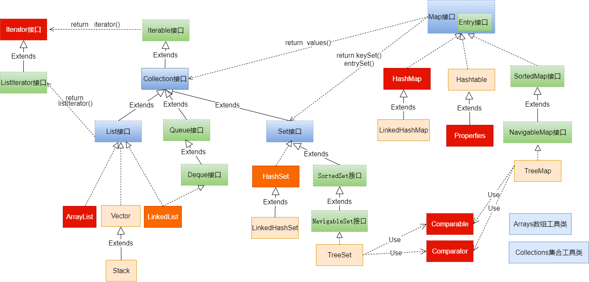
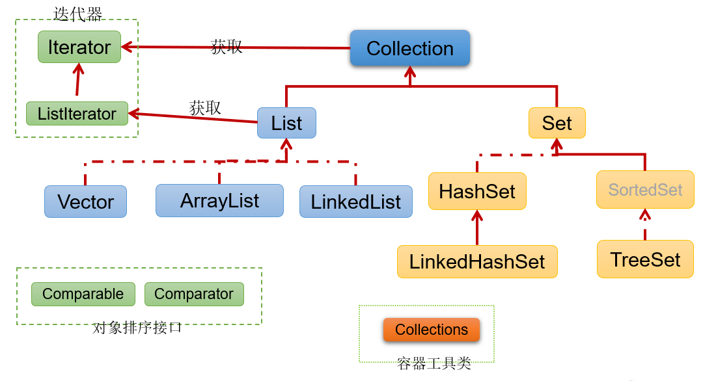

### 集合框架概述

#### 数组的特点与缺点

- 面向对象语言对事物的体现都是以对象的形式，为了方便对多个对象的操作，就需要对对象进行存储
- 使用数组存储对象方面具有一些弊端，而Java集合就像一种容器，可以**动态的**把多个对象的引用存入容器中。
- 数组在内存存储方面的特点：
  - 数组初始化以后，其长度就确定了
  - 数组中的添加的元素类型是依次紧密排列的，有序的，可以重复的
  - 数组声明的类型，就觉定了进行元素初始化时的类型。不是以此类型的变量，不能添加。
  - 可以存储基本数据类型值，也可以存储引用数据类型的变量。
- 数组在存储数据方面的缺点：
  - 数组初始化以后，长度就不可变，不便于扩展
  - 数组中提供的属性和方法较少，不便于进行添加、删除、插入、获取元素个数等操作，且效率不高。
  - 数组存储数据的特点单一，只能存储有序的、可以重复的数据
- Java集合框架中的类可以用于存储多个**对象**，还可以存储具有**映射关系**的关联数组

#### Java集合框架体系

Java集合可分为Collection和Map两大体系：

- Collection接口：用于存储一个一个的数据，也称**单列数据集合**
  - List子接口：用于存储有序的、可以重复的数据（主要用来替换数组，**动态数组**）
    - 实现类：ArrayList（主要实现类）、LinkedList、Vector
- Set子接口：用来存储无序的、不可重复的数据
  - 实现类：HashSet（主要实现类）、LinkedHashSet、TreeSet
- Map接口：用于存储具有映射关系（**Key-Value**）键值对的集合，也称**双列数据集合**
  - HashMap（主要实现类）、LinkedHashMap、TreeMap、Hashtable、Properties
- JDK提供的集合API位于`java.util`包内
- 集合框架全图



- Collection接口继承树



- Map接口继承树

  

### Collection接口及方法

- JDK不提供此接口的任何直接实现，而是提供更具体的子接口(如：Set和List)实现。
- Collection接口是List和Set接口的父接口，该接口里定义的方法即可用于操作Set集合，也可用于操作List集合

#### 添加

- 1、add(E obj)：添加元素对象岛当前集合中
- addAll(Collection other)：添加other集合中的所有元素对象到当前集合中

```java
public class CollectionTest {
    @Test
    public void test01(){	//使用数组存储不同类型的元素
        Object[] obj = new Object[10];
        obj[0] = 123;
        obj[1] = "Java";
        obj[2] = Double.valueOf(4.5);
        System.out.println(Arrays.toString(obj));
    }
    @Test
    public void testAdd(){
        Collection coll = new ArrayList();
        coll.add(123);
        coll.add(Integer.valueOf(200));
        coll.add("java");
        coll.add(new Person("Tom",22));
        System.out.println(coll.size());
        System.out.println(coll);
    }
    @Test
    public void testAddAll(){
        Collection coll = new ArrayList();
        coll.add("java");
        coll.add("python");
        coll.add("c");
        coll.add("c++");
        System.out.println(coll);
        Collection list = new ArrayList();
        list.add("rust");
        list.add("golang");
        coll.addAll(list);
        System.out.println(coll);
        System.out.println(coll.size());
    }
}
```

#### 判断

- int size()：获取当前集合中实际存储的元素个数
- boolean isEmpty()：判断当前集合是否为空集合
- boolean contains(Object obj)：判断当前集合中是否存在一个与obj对象equals返回true的元素
- boolean containsAll(Collection coll)：判断coll集合中的元素是否在当前集合中都存在；即coll集合是否是当前集合的子集。
- boolean equals(Object obj)：判断当前集合与obj是否相等

```java
public void test02(){
        Collection coll = new ArrayList();
        coll.add("java");
        coll.add("python");
        coll.add("c");
        coll.add(new Person("Tom",22));
        System.out.println(coll.isEmpty()); //false
        System.out.println(coll.size());    //4
        System.out.println(coll.contains("python"));    //true
        System.out.println(coll.contains(new Person("Tom",22)));    //true
        Collection coll1 = new ArrayList();
        coll1.add("python");
        coll1.add(new Person("Tom",22));
        System.out.println(coll.containsAll(coll1));    //true
        System.out.println(coll.equals(coll1)); //false
        Collection coll2 = new ArrayList();
        coll2.add("python");
        coll2.add(new Person("Tom",22));
        System.out.println(coll1.equals(coll2));    //true
    }
```

#### 删除

- Void clear()：清空集合元素
- boolean remove(Object obj)：从当前集合中删除第一个找到的与obj对象equals返回true的元素。
- boolean removeAll(Collection coll)：从当前集合中删除所有与coll集合中相同的元素。
- Boolean retainAll(Collection coll)：从当前集合中删除两个集合中不同的元素，使得当前集合仅保留了coll集合中的元素相同的元素。即当前集合中仅保留两个集合的交集。

```java
	public void testRemove(){
        Collection coll = new ArrayList();
        coll.add("on java");
        coll.add("java编程思想");
        coll.add("深入理解java虚拟机");
        coll.add("on java");
        coll.add("effective java");
        System.out.println(coll);
        coll.remove("on java");
        System.out.println(coll);
        System.out.println(coll.size());
    }
    public void testRemoveAll(){
        Collection coll = new ArrayList();
        coll.add("java编程思想");
        coll.add("深入理解java虚拟机");
        coll.add("深入理解java虚拟机");
        coll.add("on java");
        coll.add("effective java");
        coll.add("on java");
        System.out.println(coll);
        Collection coll1 = new ArrayList();
        coll1.add("effective java");
        coll1.add("深入理解java虚拟机");
        coll.removeAll(coll1);  //会删除重复所有元素
        System.out.println(coll);   //[java编程思想, on java, on java]
    }
    public void testReatainAll(){
        Collection coll = new ArrayList();
        coll.add("java编程思想");
        coll.add("深入理解java虚拟机");
        coll.add("深入理解java虚拟机");
        coll.add("on java");
        coll.add("effective java");
        coll.add("on java");
        System.out.println(coll);
        Collection coll1 = new ArrayList();
        coll1.add("effective java");
        coll1.add("深入理解java虚拟机");
        coll.retainAll(coll1);
        System.out.println(coll); //[深入理解java虚拟机, 深入理解java虚拟机, effective java]
        coll.clear();
        System.out.println(coll);   //[]
        System.out.println(coll.size());    //0
    }
```

#### 其他

- Object[] toArray()：返回包含当前集合中所有元素的数组
- hashCode()：获取集合对象的哈希值
- iterator()：返回迭代器对象，用于集合遍历
- removeIf()：根据条件删除

```java
    public void testToArry(){
        Collection coll = new ArrayList();
        coll.add("java编程思想");
        coll.add("深入理解java虚拟机");
        coll.add("深入理解java虚拟机");
        coll.add("on java");
        coll.add("effective java");
        coll.add(new Person("Tom",23));
      	//将集合转为数组
        Object[] arr = coll.toArray();
        System.out.println(Arrays.toString(arr));
        String[] str = {"Tom","Jack","Canvs"};
      	//将数组转为List集合
        Collection coll1 = Arrays.asList(str);
        System.out.println(coll1);
    }
    public void testIterator(){
        Collection coll = new ArrayList();
        coll.add("java编程思想");
        coll.add("深入理解java虚拟机");
        coll.add("深入理解java虚拟机");
        coll.add("on java");
        coll.add("effective java");
        coll.add(new Person("Tom",23));
        Iterator iterator = coll.iterator();    //获取迭代器对象
        //推荐写法
        while (iterator.hasNext()){
            System.out.println(iterator.next());
        }
    }
    public void testOther(){
        Collection coll = new ArrayList();
        coll.add("java编程思想");
        coll.add("深入理解java虚拟机");
        coll.add("深入理解java虚拟机");
        coll.add("on java");
        coll.add("effective java");
        System.out.println(coll.hashCode());    //-1761129567
    }
    public void testRemoveIf(){
        Collection coll = new ArrayList();
        coll.add(new Person("Tom",22));
        coll.add(new Person("jack",25));
        coll.add(new Person("lisa",22));
        coll.add(new Person("canvs",24));
        System.out.println(coll);
        coll.removeIf(new Predicate() {	//删除指定条件元素
            @Override
            public boolean test(Object o) {
                Person p = (Person) o;
                return p.age==22;
            }
        });
        System.out.println(coll);
    }
}
```

### Iterator(迭代器)接口

- 在程序开发中，经常需要遍历集合中的所有元素。正对这种需求，JDK专门提供了一个接口`java.util.Iterator`。`Iterator`接口也是Java集合中的一员，但它与`Collection`、`Map`接口有所不同
  - Collection接口与Map接口主要用于存储元素
  - Iterator被称为迭代器接口，本身并不提供存储对象的能力，主要用于遍历Collection中的元素
- Collection接口继承了java.lang.Iterable接口，该接口有一个iterator()方法，那么所有实现了Collection接口的集合类都一个iterator()方法，用于返回一个实现了Iterator接口的对象。
  - `public Iterator iterator()`：获取集合对应的迭代器，用来遍历集合中的元素。
  - 集合对象每次调用iterator()方法都得到一个全新的迭代器对象，默认游标都在集合的第一个元素之前。
- Iterator接口的常用方法：
  - `public E next()`：返回迭代下一个元素。
  - `public boolean hasNext()`：如果仍有元素可以迭代，则返回true注意;
- 在调用`iterator.next()`方法之前必须调用`iterator.hasNext()`方法进行检测。若不调用，且没有下一条记录，直接调用，则抛出`NoSuchElementException`异常。

```java
 	public void testIterator(){
        Collection coll = new ArrayList();
        coll.add("java编程思想");
        coll.add("深入理解java虚拟机");
        coll.add("深入理解java虚拟机");
        coll.add("on java");
        coll.add("effective java");
        coll.add(new Person("Tom",23));
        Iterator iterator = coll.iterator();    //获取迭代器对象
        //推荐写法
        while (iterator.hasNext()){
            System.out.println(iterator.next());
        }
//        for (int i = 0; i < coll.size(); i++) {   //不推荐写法
//            System.out.println(iterator.next());
//        }
    }
```

#### 迭代器原理

Iterator迭代器对象在遍历集合时，内部采用指针的方法来跟踪集合中的元素。


**注意：**

- Iterator可以删除集合的元素，但是遍历过程中通过迭代器对象的remove方法，不是集合对象的remove方法
- 如果还未调用next()或在上一次调用next()方法之后已经调用了remove()方法，再调用remove()都会报IllegalStateException。
- Collection已经有remove(xx)方法了，为什么Iterator迭代器还要提供删除方法呢？因为迭代器的remove()可以按指定的条件进行删除。

例如：删除集合中的所有偶数

```java
    public void testRemove(){
        Collection coll = new ArrayList();
        coll.add(1);
        coll.add(2);
        coll.add(3);
        coll.add(4);
        coll.add(5);
        coll.add(6);
        Iterator iterator = coll.iterator();
        while (iterator.hasNext()){
            //删除coll中的偶数
            if (0 == (((int) iterator.next()) % 2)) iterator.remove();
        }
        System.out.println(coll);
    }
```

#### foreach循环

- foreach循环(增强for循环)是JDK5.0中定义的一个高级for循环，专门用来遍历数组和集合的。
- foreach循环的语法格式：

```java
for(元素的数据类型 局部变量 : Collection集合或数组){ 
  	//操作局部变量的输出操作
}
```

```java
public class ForeachTest {
    @Test
    public void test01(){
        Collection coll = new ArrayList();
        coll.add(1);
        coll.add(2);
        coll.add(3);
        coll.add(4);
        coll.add(5);
        coll.add(6);
        for (Object obj:coll) System.out.println(obj);
    }
    @Test
    public void test02(){
        Collection coll = new ArrayList();
        coll.add("java编程思想");
        coll.add("深入理解java虚拟机");
        coll.add("深入理解java虚拟机");
        coll.add("on java");
        coll.add("effective java");
        for (Object obj:coll) System.out.println(obj);
    }
}
```

- 对于集合的遍历，foreach的内部原理其实就Iterator迭代器。


- 它用于遍历Collection和数组。通常只进行遍历元素，不要在遍历的过程中对集合元素进行增删操作。

**面试题：**

```java
public class ForeachInterviewQuestion {
    public static void main(String[] args) {
        String[] str = new String[5];
        for (String s : str){
            s = "hello";
            System.out.println(s);  //hello
        }
        for (String s : str) System.out.println(s); //null
    }
}
```

### Collection子接口：List

#### List接口特点

- 鉴于Java中数组用来存储数据的局限性，我们通常使用`java.util.List`替代数组
- List集合类中元素**有序、且可重复**，集合中的每个元素都有其对应的顺序索引
- JDK API中List接口的实现类常用的有：`ArrayList` `LinkedList` `Vector`

#### List接口方法

List除了从Collection集合继承的方法外，List集合里添加了一些**根据索引**来操作集合元素的方法。

- 插入元素
  - `void add(int index, Object ele)`：在index位置插入ele元素
  - `boolean addAll(int index, Collection eles)`：从index位置开始将eles中的所有元素添加进来
- 获取元素
  - `Object get(int index)`：获取指定index位置的元素
  - `boolean subList(int fromIndex, int toIndex)`：返回fromIndex到toIndex位置的子集
- 获取元素索引
  - `int indexOf(Object obj)`：返回obj在集合中首次出现的位置
  - `int lastIndexOf(Object obj)`：返回obj在当前集合中末次出现的位置
- 删除和替换元素
  - `Object remove(int index)`：删除指定index位置的元素，并返回此元素
  - `Object set(int index, Object ele)`：设置指定index位置的元素为ele

```java
public class ListTest {
    @Test
    public void testAdd(){
        List list = new ArrayList();
        list.add("java编程思想");
        list.add("深入理解java虚拟机");
        list.add("effective java");
        list.add("on java");
        list.add(new Person("Tom",25));
        System.out.println(list);
    }
    @Test
    public void testAddAll(){
        List list = new ArrayList();
        list.add("java编程思想");
        list.add("深入理解java虚拟机");
        list.add("effective java");
        list.add("on java");
        System.out.println(list);
        List list2 = new ArrayList();
        list2.add("鸟哥Linux私房菜");
        list2.add("鸟哥Linux私房菜");
        list2.add("JavaScript");
        list.addAll(list2);
        System.out.println(list);
    }
    @Test
    public void testGet(){
        List list = new ArrayList();
        list.add("java编程思想");
        list.add("深入理解java虚拟机");
        list.add("effective java");
        list.add("on java");
        list.add(new Person("canvs",23));
        System.out.println(list.get(2));
        for (int i = 0; i < list.size(); i++) {
            System.out.println(list.get(i));
        }
    }
    @Test
    public void testSubList(){
        List list = new ArrayList();
        list.add("java编程思想");
        list.add("深入理解java虚拟机");
        list.add("effective java");
        list.add("on java");
        list.add(new Person("canvs",23));
        List list1 = list.subList(2,4); //[effective java, on java]
        System.out.println(list1);
    }
    @Test
    public void testIndexOf(){
        List list = new ArrayList();
        list.add("java编程思想");
        list.add("深入理解java虚拟机");
        list.add("effective java");
        list.add("on java");
        list.add(new Person("canvs",23));
        System.out.println(list.indexOf("on java"));    //3
        System.out.println(list.indexOf(new Person("canvs",23)));//4
    }
    @Test
    public void testRemove(){
        List list = new ArrayList();
        list.add("java编程思想");
        list.add("深入理解java虚拟机");
        list.add("effective java");
        list.add("on java");
        list.add(new Person("canvs",23));
        list.remove(2);
        list.remove("on java");
        System.out.println(list);
    }
    @Test
    public void testSet(){
        List list = new ArrayList();
        list.add("java编程思想");
        list.add("深入理解java虚拟机");
        list.add("effective java");
        list.add("on java");
        System.out.println(list);
        list.set(2,"鸟哥Linux私房菜");
        System.out.println(list);
    }
}
```

##### 面试题：

判断输出结果？

```java
public class Test {
    public static void main(String[] args) {
        List list = new ArrayList();
        list.add("helo");
        list.add(2);
        list.add(3);
        list.add("java");
        list.add("python");
        list.remove(2);
        System.out.println(list);
//        list.remove(Integer.valueOf(2));
//        System.out.println(list);
    }
}
```

#### List接口主要实现类：ArrayList

- ArrayList是List接口的主要实现类
- 本质上，ArrayList是对象引用的一个变长数组
- Arrays.asList(...)方法返回的List集合，既不是ArrayList实例，也不是Vector实例。Arrays.asList(...)返回值是一个固定长度的List集合

#### List的实现类：LinkedList

- 对于频繁的插入或删除元素的操作，建议使用LinkedList类，效率较高。这是由底层采用链表（双向链表）结构存储数据决定的。
- 特有方法：
  - void addFirst(Object obj)：在集合首部插入元素
  - void addLast(Object obj)：在集合尾部插入元素
  - Object getFirst()：获取集合第一个元素
  - Object getLast()：获取集合末尾元素
  - Object removeFirst()：删除集合第一个元素
  - Object removeLast()：删除集合最后一个元素

```java
public class LinkedListTest {
    @Test
    public void test01(){
        LinkedList list = new LinkedList();
        list.add("java编程思想");
        list.add("深入理解java虚拟机");
        list.add("深入理解java虚拟机");
        list.add("on java");
        list.add("effective java");
        System.out.println(list);
        list.addFirst("鸟哥Linux私房菜");
        list.addLast("Linux就该这么学");
        System.out.println(list);
    }
    @Test
    public void test02(){
        LinkedList list = new LinkedList();
        list.add("java编程思想");
        list.add("深入理解java虚拟机");
        list.add("深入理解java虚拟机");
        list.add("on java");
        list.add("effective java");
        System.out.println(list.getFirst());
        System.out.println(list.getLast());
        list.removeFirst();
        list.removeLast();
        System.out.println(list);
    }
}
```

#### List的实现类：Vector

- Vector是一个古老的集合，JDK1.0就有了。大多数操作与ArrayList相同，区别在于Vector**是线程安全的**
- 在各种List中，最好把ArrayList作为默认选择。当插入、删除频繁时，使用LinkedList；Vector总是比ArrayList慢，所以尽量避慢使用。
- 特有方法：
  - void addElement(Object obj)：添加元素
  - void insertElementAt(Object obj, int index)：在指定位置插入元素
  - void setElementAt(Object obj, int index)：修改指定位置元素
  - void removeElement(Object obj)：删除指定元素
  - void removeAllElements()：清空集合

```java
public class VectorTest {
    public static void main(String[] args) {
        Vector v = new Vector();
        v.addElement(Integer.valueOf(1));
        v.addElement(Integer.valueOf(2));
        v.addElement(Integer.valueOf(3));
        v.addElement("hello");
        System.out.println(v);
        v.insertElementAt("java", 1);
        v.setElementAt("world", 4);
        System.out.println(v);
        v.removeElement("java");
        System.out.println(v);
        v.removeAllElements();
        System.out.println(v);
    }
}
```

#### 练习

**面试题：**

打印结果

```java
public class InterviewQuestion {
    public static void main(String[] args) {
        List list = new ArrayList();
        list.add(1);
        list.add(2);
        list.add(3);
        updateList(list);
        System.out.println(list);
    }
    public static void updateList(List list){
        list.remove(2);
    }
}
```

**练习1：**

- 定义学生类，属性为姓名、年龄，提供必要的getter、setter方法，构造器，toString()，equals()方法。
- 使用ArrayList集合，保存录入的多个学生对象。
- 循环录入的方式，1：继续录入，0：结束录入。
- 录入结束后，遍历集合。

```java
public class Student {
    private String name;
    private int age;
    public Student(String name, int age) {
        this.name = name;
        this.age = age;
    }
    public String getName() {
        return name;
    }
    public void setName(String name) {
        this.name = name;
    }
    public int getAge() {
        return age;
    }
    public void setAge(int age) {
        this.age = age;
    }
    @Override
    public String toString() {
        return "Student{" +
                "name='" + name + '\'' +
                ", age=" + age +
                '}';
    }
}
```

```java
public class StudentTest {
    public static void main(String[] args) {
        Scanner scan = new Scanner(System.in);
        List list = new ArrayList();
        while (true){
            System.out.print("选择（1.录入; 0.退出）：");
            int num = scan.nextInt();
            System.out.println();
            if (num == 1){
                System.out.print("姓名:");
                String name = scan.next();
                System.out.println();
                System.out.print("年龄:");
                int age = scan.nextInt();
                list.add(new Student(name,age));
            }else if (num == 0){
                break;
            }else{
                System.out.println("输入有误！");
            }
        }
        Iterator iterator = list.iterator();
        while (iterator.hasNext()){
            System.out.println(iterator.next());
        }
        scan.close();
    }
}
```

**练习2：**

- 请定义方法public static int listTest(Collection list,String s)统计集合中指定元素出现的次数
- 创建集合，集合存放随机生成的30个小写字母
- 用listTest统计，a、b、c、x元素的出现次数

```java
public class Test {
    public static void main(String[] args) {
        Random random = new Random();
        List list = new ArrayList();
        for (int i = 0; i < 30; i++) {
            list.add((char)(random.nextInt(26)+97));
        }
        System.out.println(list);
        System.out.println("a:"+countList(list,"a"));
        System.out.println("b:"+countList(list,"b"));
        System.out.println("c:"+countList(list,"c"));
        System.out.println("d:"+countList(list,"d"));
    }
    public static int countList(List list,String str){
        int count=0;
        for (Object obj : list) {
            if (str.equals(String.valueOf(obj))){
                count++;
            }
        }
        return count;
    }
}
```

**练习3:ktv点个系统**

```java
public class KTVByLinkedList {
    static List list = new LinkedList();
    static Scanner scan = new Scanner(System.in);
    public static void main(String[] args) {
        addMusic(list);
        l:while (true){
            System.out.println(list);
            System.out.println("-------------欢迎来到点歌系统------------");
            System.out.println("1.添加歌曲至列表");
            System.out.println("2.将歌曲置顶");
            System.out.println("3.将歌曲前移一位");
            System.out.println("4.退出");

            System.out.print("请选择：");
            int num = scan.nextInt();
            switch (num){
                case 1:
                    addMusic();
                    break;
                case 2:
                    topMusic();
                    break;
                case 3:
                    setBefore();
                    break;
                case 4:
                    System.out.println("----------------退出---------------");
                    System.out.println("您已退出系统");
                    break l;
                default:
                    System.out.println("----------------------------------");
                    System.out.println("选择错误！");
                    break;
            }
        }
        scan.close();
    }
    public static void addMusic(){
        System.out.println("请输入歌曲:");
        String musicName = scan.next();
        list.add(musicName);
        System.out.println(musicName +" 添加成功");
    }
    public static void topMusic(){
        System.out.println("输入置顶歌曲:");
        String musicName = scan.next();
        int index = list.indexOf(musicName);
        if (index==0){
            System.out.println(musicName+" 已置顶");
        }else if (index < 0) {
            System.out.println("歌曲不存在");
        }else{
            list.remove(musicName);
            list.add(0,musicName);
            System.out.println(musicName+" 已添加置顶");
        }
    }
    public static void setBefore(){
        System.out.println("请输入歌曲:");
        String musicName = scan.next();
        int index = list.indexOf(musicName);
        if (index < 0){
            System.out.println("当前列表没有次歌曲");
        }else if(index == 0){
            System.out.println("歌曲已经置顶");
        }else {
            list.remove(musicName);
            list.add(index-1,musicName);
            System.out.println(musicName+"向前移一位");
        }
    }
    public static void addMusic(List list){
        list.add("一千个伤心的理由");
        list.add("遥远的她");
        list.add("只想一生跟你走");
        list.add("你瞒我瞒");
    }
}
```

