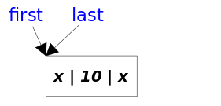
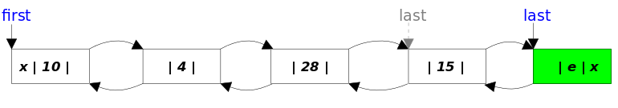
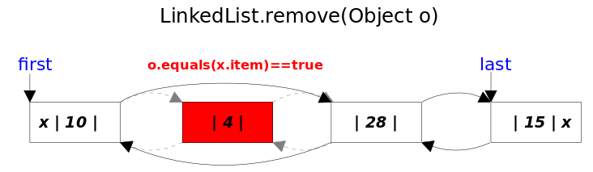
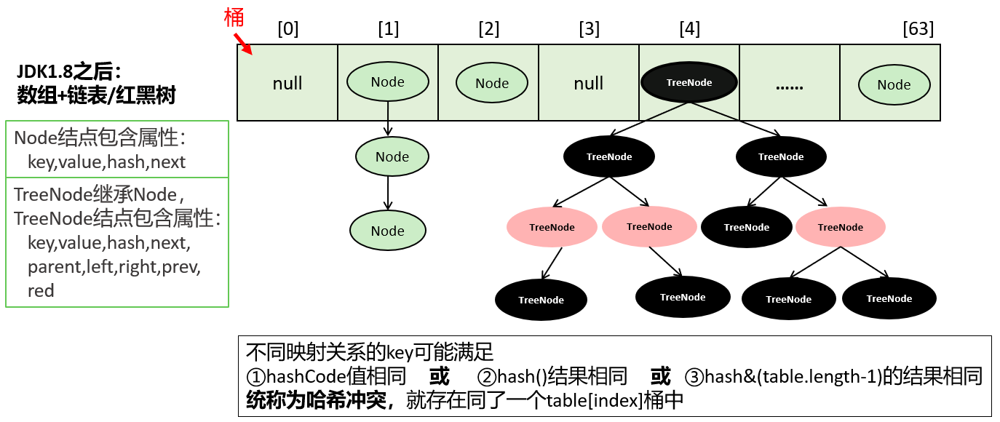

### List接口

#### List接口特点

- List集合所有的元素是以一种线性方式进行存储的，例如，存元素的顺序是11、22、33。那么集合中，元素的存储就是按照11、22、33的顺序完成的。
- 它是一个元素存取有序的集合。即元素的存入顺序和取出顺序有保证。
- 它是一个带有索引的集合，通过索引就可以精确的操作集合中的元素（与数组的索引是一个道理）。
- 集合中可以有重复的元素，通过元素的equals方法，来比较是否为重复的元素。

- List接口的主要实现类：
  - ArrayList：动态数组
  - LinkedList：双向链表
  - Vector：动态数组
  - Stack：栈

#### ArrayList与Vector的区别

- ArrayList是新版的动态数组，线程不安全，Vector是旧版的动态数组，线程安全，效率低。
- 动态数组的扩容机制不同，ArrayList默认扩容是原来的1.5倍，Vector默认扩容增加原来的2倍。
- 数组的初始化容量，如果在构建ArrayList与Vector的集合对象时，没有显式指定初始化容量，那么Vector的内部数组的初始化容量默认为10，而ArrayList在JDK6.0及以前的版本也是10，JDK8.0之后的版本ArrayList初始化长度为0的空数组，之后在添加第一个元素时，再创建长度为10的数组。
  - 用的时候，再创建数组，避免浪费。因为很多方法的返回值是ArrayList类型，需要返回一个ArrayList的对象，例如：从数据库查询对象的方法，返回值很多就是ArrayList。有可能查询的数据不存在，要么返回null，要么返回一个没有元素的ArrayList对象。

#### ArrayList部分源码分析

**JDK1.7.0_07**

```java
//属性
private transient Object[] elementData; //存储底层数组元素
private int size; //记录数组中存储的元素的个数

//构造器
public ArrayList() {
    this(10); //指定初始容量为10
}

public ArrayList(int initialCapacity) {
    super();
    //检查初始容量的合法性
    if (initialCapacity < 0)
        throw new IllegalArgumentException("Illegal Capacity: "+ initialCapacity);
    //数组初始化为长度为initialCapacity的数组
    this.elementData = new Object[initialCapacity]; 
}

//方法：add()相关方法
public boolean add(E e) {
    ensureCapacityInternal(size + 1);  //查看当前数组是否够多存一个元素
    elementData[size++] = e; //将元素e添加到elementData数组中
    return true;
}

private void ensureCapacityInternal(int minCapacity) {
    modCount++;
    // 如果if条件满足，则进行数组的扩容
    if (minCapacity - elementData.length > 0)
        grow(minCapacity);
}

private void grow(int minCapacity) {
    // overflow-conscious code
    int oldCapacity = elementData.length; //当前数组容量
    int newCapacity = oldCapacity + (oldCapacity >> 1); //新数组容量是旧数组容量的1.5倍
    if (newCapacity - minCapacity < 0)  //判断旧数组的1.5倍是否够
        newCapacity = minCapacity;
    //判断旧数组的1.5倍是否超过最大数组限制
    if (newCapacity - MAX_ARRAY_SIZE > 0)
        newCapacity = hugeCapacity(minCapacity);
    //复制一个新数组
    elementData = Arrays.copyOf(elementData, newCapacity);
}

//方法：remove()相关方法
public E remove(int index) {
    rangeCheck(index); //判断index是否在有效的范围内

    modCount++; //修改次数加1
    //取出[index]位置的元素，[index]位置的元素就是要被删除的元素，用于最后返回被删除的元素
    E oldValue = elementData(index); 

    int numMoved = size - index - 1; //确定要移动的次数
    //如果需要移动元素，就用System.arraycopy移动元素
    if (numMoved > 0)
        System.arraycopy(elementData, index+1, elementData, index, numMoved);
    //将elementData[size-1]位置置空，让GC回收空间，元素个数减少
    elementData[--size] = null; 

    return oldValue;
}

private void rangeCheck(int index) {
    if (index >= size) //index不合法的情况
        throw new IndexOutOfBoundsException(outOfBoundsMsg(index));
}

E elementData(int index) { //返回指定位置的元素
    return (E) elementData[index];
}

//方法：set()方法相关
public E set(int index, E element) {
    rangeCheck(index); //检验index是否合法
	
    //取出[index]位置的元素，[index]位置的元素就是要被替换的元素，用于最后返回被替换的元素
    E oldValue = elementData(index);
    //用element替换[index]位置的元素
    elementData[index] = element;
    return oldValue;
}

//方法：get()相关方法
public E get(int index) {
    rangeCheck(index); //检验index是否合法

    return elementData(index); //返回[index]位置的元素
}

//方法：indexOf()
public int indexOf(Object o) {
    //分为o是否为空两种情况
    if (o == null) {
        //从前往后找
        for (int i = 0; i < size; i++)
            if (elementData[i]==null)
                return i;
    } else {
        for (int i = 0; i < size; i++)
            if (o.equals(elementData[i]))
                return i;
    }
    return -1;
}

//方法：lastIndexOf()
public int lastIndexOf(Object o) {
    //分为o是否为空两种情况
    if (o == null) {
        //从后往前找
        for (int i = size-1; i >= 0; i--)
            if (elementData[i]==null)
                return i;
    } else {
        for (int i = size-1; i >= 0; i--)
            if (o.equals(elementData[i]))
                return i;
    }
    return -1;
}
```

**jdk1.8.0_271中：**

```java
//属性
transient Object[] elementData;
private int size;
private static final Object[] DEFAULTCAPACITY_EMPTY_ELEMENTDATA = {};

//构造器
public ArrayList() {
    this.elementData = DEFAULTCAPACITY_EMPTY_ELEMENTDATA;  //初始化为空数组
}

//方法:add()相关方法
public boolean add(E e) {
    //查看当前数组是否够多存一个元素
    ensureCapacityInternal(size + 1);  // Increments modCount!!
    //存入新元素到[size]位置，然后size自增1
    elementData[size++] = e;
    return true;
}

private void ensureCapacityInternal(int minCapacity) {
    ensureExplicitCapacity(calculateCapacity(elementData, minCapacity));
}

private static int calculateCapacity(Object[] elementData, int minCapacity) {
    //如果当前数组还是空数组
    if (elementData == DEFAULTCAPACITY_EMPTY_ELEMENTDATA) {
        //那么minCapacity取DEFAULT_CAPACITY与minCapacity的最大值
        return Math.max(DEFAULT_CAPACITY, minCapacity);
    }
    return minCapacity;
}

//查看是否需要扩容
private void ensureExplicitCapacity(int minCapacity) {
    modCount++;  //修改次数加1

    //如果需要的最小容量比当前数组的长度大，即当前数组不够存，就扩容
    if (minCapacity - elementData.length > 0)
        grow(minCapacity);
}

private void grow(int minCapacity) {
    // overflow-conscious code
    int oldCapacity = elementData.length; //当前数组容量
    int newCapacity = oldCapacity + (oldCapacity >> 1); //新数组容量是旧数组容量的1.5倍
    //看旧数组的1.5倍是否够
    if (newCapacity - minCapacity < 0)
        newCapacity = minCapacity;
    //看旧数组的1.5倍是否超过最大数组限制
    if (newCapacity - MAX_ARRAY_SIZE > 0)
        newCapacity = hugeCapacity(minCapacity);
    //复制一个新数组
    elementData = Arrays.copyOf(elementData, newCapacity);
}
```

#### Vector部分源码分析

**jdk1.8.0_271中：**

```java
//属性
protected Object[] elementData;
protected int elementCount;

//构造器
public Vector() {
	this(10); //指定初始容量initialCapacity为10
}

public Vector(int initialCapacity) {
	this(initialCapacity, 0); //指定capacityIncrement增量为0
}

public Vector(int initialCapacity, int capacityIncrement) {
    super();
    //判断了形参初始容量initialCapacity的合法性
    if (initialCapacity < 0)
        throw new IllegalArgumentException("Illegal Capacity: "+ initialCapacity);
    //创建了一个Object[]类型的数组
    this.elementData = new Object[initialCapacity];
    //增量，默认是0，如果是0，后面就按照2倍增加，如果不是0，后面就按照你指定的增量进行增量
    this.capacityIncrement = capacityIncrement;
}

//方法：add()相关方法
//synchronized意味着线程安全的   
public synchronized boolean add(E e) {
    modCount++;
    //看是否需要扩容
    ensureCapacityHelper(elementCount + 1);
    //把新的元素存入[elementCount]，存入后，elementCount元素的个数增1
    elementData[elementCount++] = e;
    return true;
}

private void ensureCapacityHelper(int minCapacity) {
     //看是否超过了当前数组的容量
    if (minCapacity - elementData.length > 0)
        grow(minCapacity); //扩容
}

private void grow(int minCapacity) {
    // overflow-conscious code
    int oldCapacity = elementData.length; //获取目前数组的长度
    //如果capacityIncrement增量是0，新容量 = oldCapacity的2倍
    //如果capacityIncrement增量是不是0，新容量 = oldCapacity + capacityIncrement增量;
    int newCapacity = oldCapacity + ((capacityIncrement > 0) ?
                                     capacityIncrement : oldCapacity);
    //如果按照上面计算的新容量还不够，就按照你指定的需要的最小容量来扩容minCapacity
    if (newCapacity - minCapacity < 0)
        newCapacity = minCapacity;
    //如果新容量超过了最大数组限制，那么单独处理
    if (newCapacity - MAX_ARRAY_SIZE > 0)
        newCapacity = hugeCapacity(minCapacity);
    //把旧数组中的数据复制到新数组中，新数组的长度为newCapacity
    elementData = Arrays.copyOf(elementData, newCapacity);
}

//方法：remove()相关方法
public boolean remove(Object o) {
    return removeElement(o);
}
public synchronized boolean removeElement(Object obj) {
    modCount++;
    //查找obj在当前Vector中的下标
    int i = indexOf(obj);
    //如果i>=0，说明存在，删除[i]位置的元素
    if (i >= 0) {
        removeElementAt(i);
        return true;
    }
    return false;
}

//方法：indexOf()
public int indexOf(Object o) {
    return indexOf(o, 0);
}
public synchronized int indexOf(Object o, int index) {
    if (o == null) {//要查找的元素是null值
        for (int i = index ; i < elementCount ; i++)
            if (elementData[i]==null)//如果是null值，用==null判断
                return i;
    } else {//要查找的元素是非null值
        for (int i = index ; i < elementCount ; i++)
            if (o.equals(elementData[i]))//如果是非null值，用equals判断
                return i;
    }
    return -1;
}

//方法：removeElementAt()
public synchronized void removeElementAt(int index) {
    modCount++;
    //判断下标的合法性
    if (index >= elementCount) {
        throw new ArrayIndexOutOfBoundsException(index + " >= " +
                                                 elementCount);
    }
    else if (index < 0) {
        throw new ArrayIndexOutOfBoundsException(index);
    }

    //j是要移动的元素的个数
    int j = elementCount - index - 1;
    //如果需要移动元素，就调用System.arraycopy进行移动
    if (j > 0) {
        //把index+1位置以及后面的元素往前移动
        //index+1的位置的元素移动到index位置，依次类推
        //一共移动j个
        System.arraycopy(elementData, index + 1, elementData, index, j);
    }
    //元素的总个数减少
    elementCount--;
    //将elementData[elementCount]这个位置置空，用来添加新元素，位置的元素等着被GC回收
    elementData[elementCount] = null; /* to let gc do its work */
}
```

#### 链表LinkedList

Java中有双链表的实现：LinkedList，它是List接口的实现类。


#### 链表与动态数组的区别

动态数组底层的物理结构是数组，因此根据索引访问的效率非常高。但是非末尾位置的插入和删除效率不高，因为涉及到移动元素。另外添加操作时涉及到扩容问题，就会增加时间空间消耗。

LinkedList底层的物理结构是链表，因此根据索引访问的效率不高，即查找元素慢。但是插入和删除不需要移动元素，只需要修改前后元素的指向关系即可，所以插入、删除元素快。而且链表的添加不会涉及到扩容问题。

#### LinkedList源码分析

**jdk1.8.0_271中：**

```java
//属性
transient Node<E> first; //记录第一个结点的位置
transient Node<E> last; //记录当前链表的尾元素
transient int size = 0; //记录最后一个结点的位置

//构造器
public LinkedList() {
}

//方法：add()相关方法
public boolean add(E e) {
    linkLast(e); //默认把新元素链接到链表尾部
    return true;
}

void linkLast(E e) {
    final Node<E> l = last; //用 l 记录原来的最后一个结点
    //创建新结点
    final Node<E> newNode = new Node<>(l, e, null);
    //现在的新结点是最后一个结点了
    last = newNode;
    //如果l==null，说明原来的链表是空的
    if (l == null)
        //那么新结点同时也是第一个结点
        first = newNode;
    else
        //否则把新结点链接到原来的最后一个结点的next中
        l.next = newNode;
    //元素个数增加
    size++;
    //修改次数增加
    modCount++;
}

//其中，Node类定义如下
private static class Node<E> {
    E item; //元素数据
    Node<E> next; //下一个结点
    Node<E> prev; //前一个结点

    Node(Node<E> prev, E element, Node<E> next) {
        this.item = element;
        this.next = next;
        this.prev = prev;
    }
}
//方法：获取get()相关方法
public E get(int index) {
    checkElementIndex(index);
    return node(index).item;
} 

//方法：插入add()相关方法
public void add(int index, E element) {
    checkPositionIndex(index);//检查index范围

    if (index == size)//如果index==size，连接到当前链表的尾部
        linkLast(element);
    else
        linkBefore(element, node(index));
}

Node<E> node(int index) {
    // assert isElementIndex(index);
	/*
	index < (size >> 1)采用二分思想，先将index与长度size的一半比较，如果index<size/2，就只从位置0
	往后遍历到位置index处，而如果index>size/2，就只从位置size往前遍历到位置index处。这样可以减少一部
	分不必要的遍历。
	*/
    //如果index<size/2，就从前往后找目标结点
    if (index < (size >> 1)) {
        Node<E> x = first;
        for (int i = 0; i < index; i++)
            x = x.next;
        return x;
    } else {//否则从后往前找目标结点
        Node<E> x = last;
        for (int i = size - 1; i > index; i--)
            x = x.prev;
        return x;
    }
}

//把新结点插入到[index]位置的结点succ前面
void linkBefore(E e, Node<E> succ) {//succ是[index]位置对应的结点
    // assert succ != null;
    final Node<E> pred = succ.prev; //[index]位置的前一个结点

    //新结点的prev是原来[index]位置的前一个结点
    //新结点的next是原来[index]位置的结点
    final Node<E> newNode = new Node<>(pred, e, succ);

    //[index]位置对应的结点的prev指向新结点
    succ.prev = newNode;

    //如果原来[index]位置对应的结点是第一个结点，那么现在新结点是第一个结点
    if (pred == null)
        first = newNode;
    else
        pred.next = newNode;//原来[index]位置的前一个结点的next指向新结点
    size++;
    modCount++;
}

//方法：remove()相关方法
public boolean remove(Object o) {
    //分o是否为空两种情况
    if (o == null) {
        //找到o对应的结点x
        for (Node<E> x = first; x != null; x = x.next) {
            if (x.item == null) {
                unlink(x);//删除x结点
                return true;
            }
        }
    } else {
        //找到o对应的结点x
        for (Node<E> x = first; x != null; x = x.next) {
            if (o.equals(x.item)) {
                unlink(x);//删除x结点
                return true;
            }
        }
    }
    return false;
}
E unlink(Node<E> x) {//x是要被删除的结点
    // assert x != null;
    final E element = x.item;//被删除结点的数据
    final Node<E> next = x.next;//被删除结点的下一个结点
    final Node<E> prev = x.prev;//被删除结点的上一个结点

    //如果被删除结点的前面没有结点，说明被删除结点是第一个结点
    if (prev == null) {
        //那么被删除结点的下一个结点变为第一个结点
        first = next;
    } else {//被删除结点不是第一个结点
        //被删除结点的上一个结点的next指向被删除结点的下一个结点
        prev.next = next;
        //断开被删除结点与上一个结点的链接
        x.prev = null;//使得GC回收
    }

    //如果被删除结点的后面没有结点，说明被删除结点是最后一个结点
    if (next == null) {
        //那么被删除结点的上一个结点变为最后一个结点
        last = prev;
    } else {//被删除结点不是最后一个结点
        //被删除结点的下一个结点的prev执行被删除结点的上一个结点
        next.prev = prev;
        //断开被删除结点与下一个结点的连接
        x.next = null;//使得GC回收
    }
    //把被删除结点的数据也置空，使得GC回收
    x.item = null;
    //元素个数减少
    size--;
    //修改次数增加
    modCount++;
    //返回被删除结点的数据
    return element;
}

public E remove(int index) { //index是要删除元素的索引位置
    checkElementIndex(index);
    return unlink(node(index));
}
```

#### LinkedList相关方法图示

- **只有1个元素的LinkedList**



- **包含4个元素的LinkedList**


- **add(E e)方法**



- **add(int index,E e)方法**


- **remove(Object obj)方法**



- **remove(int index)方法**


### Map接口

#### 哈希表的物理结构

HashMap和Hashtable底层都是哈希表（也称散列表），其中维护了一个长度为2的幂次方的Entry类型的数组table，数组的每一个索引位置被称为一个桶（bucket），添加的映射关系(key,value)最终都被封装为一个Map.Entry类型的对象，放到某个table[index]桶中。

使用数组的目的是查询和添加的效率高，可以根据索引直接定位到某个table[index]。


#### HashMap中数据添加过程

##### **JDK7**：

```java
HashMap map = new HashMap(); 
map.put(key1,value1);
//在不断的添加情况下，满足以下条件的情况，会进行扩容；默认情况下，当要添加的元素个数超过12（即：数组长度 * 
//loadFactor）得到的结果时，就要考虑扩容
if ((size >= threshold) && (null != table[bucketIndex]))
static class Entry<K,V> implements Map.Entry<K,V>
map.get(key1);
/*
	1.通过hash(key1)计算key1的hash值
	2.找index=table.length-1 & hash
	3.如果table[index]不为空，那么就挨个比较哪个Entry的key与它相同，就返回它的value
*/
map.remove(key1);
/*
	1.计算key1的hash值，用这个方法hash(key1)
	2.找index=table.length-1 & hash
	3.如果table[index]不为空，那么久挨个比较哪个Entry的key与它相同，就删除它，把它前面的Entry的next的值修	改为被删除的Entry的next
*/
```

- 将(key1,value1)添加到当前hashmap的对象中。首先会调用key1所在类的hashCode()方法，计算key1的哈希值1，此哈希值1再经过hash()运算，得到哈希值2。此哈希值2再经过indexFor()运算，确定了在底层table数组中的索引位置i。
- 如果数组索引i的位置为空，则(key1,value1)直接添加成功；直接将(key1,value1)以Entry对象的方式存放到table数组索引i的位置。
- 如果数组索引i的位置不为空，有(key2,value2)，则需要进一步判断key1的哈希值2与key2的哈希值是否相同
  - 如果哈希值不同，则(key1,value1)直接添加成功；将(key1,value1)与现有的元素以链表的方法存储在table数组索引i的位置，新添加的元素指向旧添加的元素。
  - 如果哈希值相同，则需要继续调用key1所在类的equals()方法，将key2放入equals形参进行判断
    - equals方法返回false：则(key1,value1)直接添加成功，以头插法链表存储。
    - equals方法返回true：默认情况下，value会覆盖value2

##### **JDK8**

- 使用HashMap()的构造器创建对象时，并没有在底层初始化长度为16的table数组。
- jdk8中添加的key,value封装到了HashMap.Node类的对象中。而非jdk7中的HashMap.Entry
- jdk8中新增的元素所在的索引位置如果有其他元素。在经过一些列判断后，如果能添加，则是旧的元素指向新的元素。而非jdk7中的新元素指向旧的元素。
- jdk7时底层的数据结构是：数组+单向链表。而jdk8时，底层的数据结构是：数组+单向链表+红黑树。
  - 红黑树出现的时机：当某个索引位置i上的链表的长度达到8，且数组的长度超过64时，此索引位置上的元素要从单向链表改为红黑树。
  - 如果索引i位置是红黑树的结构，当不断删除元素的情况下，当前索引i位置上的元素的个数低于6时，要从红黑树改为单想链表。

#### JDK1.7.0_07中HashMap的源码


##### **1、Entry**

key-value被封装为HashMap.Entry类型，而这个类型实现了Map.Entry接口。

```java
public class HashMap<K,V>{
    transient Entry<K,V>[] table;
    
    static class Entry<K,V> implements Map.Entry<K,V> {
        final K key;
        V value;
        Entry<K,V> next;
        int hash;

        /**
         * Creates new entry.
         */
        Entry(int h, K k, V v, Entry<K,V> n) {
            value = v;
            next = n;
            key = k;
            hash = h;
        }
        //略
    }
}
```

##### **2、属性**

```java
//table数组的默认初始化长度
static final int DEFAULT_INITIAL_CAPACITY = 16;
//哈希表
transient Entry<K,V>[] table;
//哈希表中key-value的个数
transient int size;
//临界值、阈值（扩容的临界值）
int threshold;
//加载因子
final float loadFactor;
//默认加载因子
static final float DEFAULT_LOAD_FACTOR = 0.75f;
```

##### **3、构造器**

```java
public HashMap() {
    //DEFAULT_INITIAL_CAPACITY：默认初始容量16
  	//DEFAULT_LOAD_FACTOR：默认加载因子0.75
    this(DEFAULT_INITIAL_CAPACITY, DEFAULT_LOAD_FACTOR);
}
```

```java
public HashMap(int initialCapacity, float loadFactor) {
    //校验initialCapacity合法性
    if (initialCapacity < 0)
        throw new IllegalArgumentException("Illegal initial capacity: " + initialCapacity);
    //校验initialCapacity合法性 
    if (initialCapacity > MAXIMUM_CAPACITY)
        initialCapacity = MAXIMUM_CAPACITY;
    //校验loadFactor合法性
    if (loadFactor <= 0 || Float.isNaN(loadFactor))
        throw new IllegalArgumentException("Illegal load factor: " + loadFactor);

    //计算得到table数组的长度（保证capacity是2的整次幂）
    int capacity = 1;
    while (capacity < initialCapacity)
        capacity <<= 1;
	//加载因子，初始化为0.75
    this.loadFactor = loadFactor;
    // threshold 初始为默认容量
    threshold = (int)Math.min(capacity * loadFactor, MAXIMUM_CAPACITY + 1);
    //初始化table数组
    table = new Entry[capacity];
    useAltHashing = sun.misc.VM.isBooted() &&
                                       (capacity >= Holder.ALTERNATIVE_HASHING_THRESHOLD);
    init();
}
```

##### **4、put()方法**

```java
public V put(K key, V value) {
    //如果key是null，单独处理，存储到table[0]中，如果有另一个key为null，value覆盖
    if (key == null)
        return putForNullKey(value);
    //对key的hashCode进行干扰，算出一个hash值
    /*
      hashCode值        xxxxxxxxxx
      table.length-1    000001111
   
      hashCode值 xxxxxxxxxx  无符号右移几位和原来的hashCode值做^运算，使得hashCode高位二进制值参与计算，
                            也发挥作用，降低index冲突的概率。
    */
    int hash = hash(key);
    //计算新的映射关系应该存到table[i]位置，
    //i = hash & table.length-1，可以保证i在[0,table.length-1]范围内
    int i = indexFor(hash, table.length);
    //检查table[i]下面有没有key与我新的映射关系的key重复，如果重复替换value
    for (Entry<K,V> e = table[i]; e != null; e = e.next) {
        Object k;
        if (e.hash == hash && ((k = e.key) == key || key.equals(k))) {
            V oldValue = e.value;
            e.value = value;
            e.recordAccess(this);
            return oldValue;
        }
    }

    modCount++;
    //添加新的映射关系
    addEntry(hash, key, value, i);
    return null;
}
```

其中，

```java
//如果key是null，直接存入[0]的位置
private V putForNullKey(V value) {
    //判断是否有重复的key，如果有重复的，就替换value
    for (Entry<K,V> e = table[0]; e != null; e = e.next) {
        if (e.key == null) {
            V oldValue = e.value;
            e.value = value;
            e.recordAccess(this);
            return oldValue;
        }
    }
    modCount++;
    //把新的映射关系存入[0]的位置，而且key的hash值用0表示
    addEntry(0, null, value, 0);
    return null;
}
```

```java
final int hash(Object k) {
    int h = 0;
    if (useAltHashing) {
        if (k instanceof String) {
            return sun.misc.Hashing.stringHash32((String) k);
        }
        h = hashSeed;
    }

    h ^= k.hashCode();

    // This function ensures that hashCodes that differ only by
    // constant multiples at each bit position have a bounded
    // number of collisions (approximately 8 at default load factor).
    h ^= (h >>> 20) ^ (h >>> 12);
    return h ^ (h >>> 7) ^ (h >>> 4);
}
```

```java
static int indexFor(int h, int length) {
    return h & (length-1);
}
```

```java
void addEntry(int hash, K key, V value, int bucketIndex) {
    //判断是否需要库容
    //扩容：（1）size达到阈值（2）table[i]正好非空
    if ((size >= threshold) && (null != table[bucketIndex])) {
        //table扩容为原来的2倍，并且扩容后，会重新调整所有key-value的存储位置
        resize(2 * table.length); 
        //新的key-value的hash和index也会重新计算
        hash = (null != key) ? hash(key) : 0;
        bucketIndex = indexFor(hash, table.length);
    }
	//存入table中
    createEntry(hash, key, value, bucketIndex);
}
```

```java
void createEntry(int hash, K key, V value, int bucketIndex) {
    Entry<K,V> e = table[bucketIndex];
    //原来table[i]下面的映射关系作为新的映射关系next
    table[bucketIndex] = new Entry<>(hash, key, value, e);
    //个数增加
    size++; 
}
```

####  JDK1.8.0_271中源码

##### **1、Node**

key-value被封装为HashMap.Node类型或HashMap.TreeNode类型，它俩都直接或间接的实现了Map.Entry接口。

存储到table数组的可能是Node结点对象，也可能是TreeNode结点对象，它们也是Map.Entry接口的实现类。即table[index]下的映射关系可能串起来一个链表或一棵红黑树。



```java
public class HashMap<K,V>{
    transient Node<K,V>[] table;
    
    //Node类
    static class Node<K,V> implements Map.Entry<K,V> {
        final int hash;
        final K key;
        V value;
        Node<K,V> next;

        Node(int hash, K key, V value, Node<K,V> next) {
            this.hash = hash;
            this.key = key;
            this.value = value;
            this.next = next;
        }
        // 其它结构：略
    }
    
    //TreeNode类
    static final class TreeNode<K,V> extends LinkedHashMap.Entry<K,V> {
        TreeNode<K,V> parent;
        TreeNode<K,V> left;
        TreeNode<K,V> right;
        TreeNode<K,V> prev;
        boolean red; //是红结点还是黑结点
        TreeNode(int hash, K key, V val, Node<K,V> next) {
            super(hash, key, val, next);
        }
    }
    
    //....
}
```

##### **2、属性**

```java
static final int DEFAULT_INITIAL_CAPACITY = 1 << 4; // 默认的初始容量 16
static final int MAXIMUM_CAPACITY = 1 << 30; //最大容量  1 << 30
static final float DEFAULT_LOAD_FACTOR = 0.75f;  //默认加载因子
static final int TREEIFY_THRESHOLD = 8; //默认树化阈值8，当链表的长度达到这个值后，要考虑树化
static final int UNTREEIFY_THRESHOLD = 6;//默认反树化阈值6，当树中结点的个数达到此阈值后，要考虑变为链表

//当单个的链表的结点个数达到8，并且table的长度达到64，才会树化。
//当单个的链表的结点个数达到8，但是table的长度未达到64，会先扩容
static final int MIN_TREEIFY_CAPACITY = 64; //最小树化容量64

transient Node<K,V>[] table; //数组
transient int size;  //记录有效映射关系的对数，也是Entry对象的个数
int threshold; //阈值，当size达到阈值时，考虑扩容
final float loadFactor; //加载因子，影响扩容的频率
```

##### **3、构造器**

```java
public HashMap() {
    this.loadFactor = DEFAULT_LOAD_FACTOR; // all other fields defaulted (其他字段都是默认值)
}
```

##### **4、put()方法**

```
public V put(K key, V value) {
    return putVal(hash(key), key, value, false, true);
}
```

其中，

```java
static final int hash(Object key) {
    int h;
    //如果key是null，hash是0
	//如果key非null，用key的hashCode值 与 key的hashCode值高16进行异或
	//		即就是用key的hashCode值高16位与低16位进行了异或的干扰运算
		
	/*
	index = hash & table.length-1
	如果用key的原始的hashCode值  与 table.length-1 进行按位与，那么基本上高16没机会用上。
	这样就会增加冲突的概率，为了降低冲突的概率，把高16位加入到hash信息中。
	*/
    return (key == null) ? 0 : (h = key.hashCode()) ^ (h >>> 16);
}
```

```java
final V putVal(int hash, K key, V value, boolean onlyIfAbsent,boolean evict) {
    Node<K,V>[] tab; //数组
    Node<K,V> p;  //一个结点
    int n, i; //n是数组的长度   i是下标
    
    //tab和table等价
	//如果table是空的
    if ((tab = table) == null || (n = tab.length) == 0){
        n = (tab = resize()).length;
        /*
		tab = resize();
		n = tab.length;*/
		/*
		如果table是空的，resize()完成了①创建了一个长度为16的数组②threshold = 12
		n = 16
		*/
	}
    //i = (n - 1) & hash ，下标 = 数组长度-1 & hash
	//p = tab[i] 第1个结点
	//if(p==null) 条件满足的话说明 table[i]还没有元素
    if ((p = tab[i = (n - 1) & hash]) == null){
        //把新的映射关系直接放入table[i]
        tab[i] = newNode(hash, key, value, null);
        //newNode（）方法就创建了一个Node类型的新结点，新结点的next是null
    }else {
        Node<K,V> e; K k;
        //p是table[i]中第一个结点
		//if(table[i]的第一个结点与新的映射关系的key重复)
        if (p.hash == hash &&
            ((k = p.key) == key || (key != null && key.equals(k))))
            e = p;//用e记录这个table[i]的第一个结点
        else if (p instanceof TreeNode){ //如果table[i]第一个结点是一个树结点
            //单独处理树结点
            //如果树结点中，有key重复的，就返回那个重复的结点用e接收，即e!=null
            //如果树结点中，没有key重复的，就把新结点放到树中，并且返回null，即e=null
            e = ((TreeNode<K,V>)p).putTreeVal(this, tab, hash, key, value);
        }else {
            //table[i]的第一个结点不是树结点，也与新的映射关系的key不重复
			//binCount记录了table[i]下面的结点的个数
            for (int binCount = 0; ; ++binCount) {
                //如果p的下一个结点是空的，说明当前的p是最后一个结点
                if ((e = p.next) == null) {
                    //把新的结点连接到table[i]的最后
                    p.next = newNode(hash, key, value, null);
                    //如果binCount>=8-1，达到7个时
                    if (binCount >= TREEIFY_THRESHOLD - 1) // -1 for 1st
                        //要么扩容，要么树化
                        treeifyBin(tab, hash);
                    break;
                }
                //如果key重复了，就跳出for循环，此时e结点记录的就是那个key重复的结点
                if (e.hash == hash &&
                        ((k = e.key) == key || (key != null && key.equals(k))))
                    break;
                p = e;//下一次循环，e=p.next，就类似于e=e.next，往链表下移动
            }
        }
        //如果这个e不是null，说明有key重复，就考虑替换原来的value
        if (e != null) { // existing mapping for key
            V oldValue = e.value;
            if (!onlyIfAbsent || oldValue == null)
                e.value = value;
            afterNodeAccess(e); //什么也没干
            return oldValue;
        }
    }
    ++modCount;
    
    //元素个数增加
	//size达到阈值
    if (++size > threshold)
        resize(); //一旦扩容，重新调整所有映射关系的位置
    afterNodeInsertion(evict); //什么也没干
    return null;
}
```

```java
final Node<K,V>[] resize() {
    Node<K,V>[] oldTab = table; //oldTab原来的table
    //oldCap：原来数组的长度
    int oldCap = (oldTab == null) ? 0 : oldTab.length;
    //oldThr：原来的阈值
    int oldThr = threshold;//最开始threshold是0
    
    //newCap，新容量
	//newThr：新阈值
    int newCap, newThr = 0;
    if (oldCap > 0) { //说明原来不是空数组
        if (oldCap >= MAXIMUM_CAPACITY) { //是否达到数组最大限制
            threshold = Integer.MAX_VALUE;
            return oldTab;
        }
        else if ((newCap = oldCap << 1) < MAXIMUM_CAPACITY &&
                 oldCap >= DEFAULT_INITIAL_CAPACITY)
            //newCap = 旧的容量*2 ，新容量<最大数组容量限制
			//新容量：32,64，...
			//oldCap >= 初始容量16
			//新阈值重新算 = 24，48 ....
            newThr = oldThr << 1; // double threshold
    }
    else if (oldThr > 0) // initial capacity was placed in threshold
        newCap = oldThr;
    else {               // zero initial threshold signifies using defaults
        newCap = DEFAULT_INITIAL_CAPACITY; //新容量是默认初始化容量16
        //新阈值= 默认的加载因子 * 默认的初始化容量 = 0.75*16 = 12
        newThr = (int)(DEFAULT_LOAD_FACTOR * DEFAULT_INITIAL_CAPACITY);
    }
    if (newThr == 0) {
        float ft = (float)newCap * loadFactor;
        newThr = (newCap < MAXIMUM_CAPACITY && ft < (float)MAXIMUM_CAPACITY ?
                  (int)ft : Integer.MAX_VALUE);
    }
    threshold = newThr; //阈值赋值为新阈值12，24.。。。
    //创建了一个新数组，长度为newCap，16，32,64.。。
    @SuppressWarnings({"rawtypes","unchecked"})
    Node<K,V>[] newTab = (Node<K,V>[])new Node[newCap];
    table = newTab;
    if (oldTab != null) { //原来不是空数组
        //把原来的table中映射关系，倒腾到新的table中
        for (int j = 0; j < oldCap; ++j) {
            Node<K,V> e;
            if ((e = oldTab[j]) != null) {//e是table下面的结点
                oldTab[j] = null; //把旧的table[j]位置清空
                if (e.next == null) //如果是最后一个结点
                    newTab[e.hash & (newCap - 1)] = e; //重新计算e的在新table中的存储位置，然后放入
                else if (e instanceof TreeNode) //如果e是树结点
                    //把原来的树拆解，放到新的table
                    ((TreeNode<K,V>)e).split(this, newTab, j, oldCap);
                else { // preserve order
                    Node<K,V> loHead = null, loTail = null;
                    Node<K,V> hiHead = null, hiTail = null;
                    Node<K,V> next;
                    //把原来table[i]下面的整个链表，重新挪到了新的table中
                    do {
                        next = e.next;
                        if ((e.hash & oldCap) == 0) {
                            if (loTail == null)
                                loHead = e;
                            else
                                loTail.next = e;
                            loTail = e;
                        }
                        else {
                            if (hiTail == null)
                                hiHead = e;
                            else
                                hiTail.next = e;
                            hiTail = e;
                        }
                    } while ((e = next) != null);
                    if (loTail != null) {
                        loTail.next = null;
                        newTab[j] = loHead;
                    }
                    if (hiTail != null) {
                        hiTail.next = null;
                        newTab[j + oldCap] = hiHead;
                    }
                }
            }
        }
    }
    return newTab;
}
```

```java
Node<K,V> newNode(int hash, K key, V value, Node<K,V> next) {
    //创建一个新结点
    return new Node<>(hash, key, value, next);
}
```

```java
final void treeifyBin(Node<K,V>[] tab, int hash) {
    int n, index; 
    Node<K,V> e;
    //MIN_TREEIFY_CAPACITY：最小树化容量64
    //如果table是空的，或者  table的长度没有达到64
    if (tab == null || (n = tab.length) < MIN_TREEIFY_CAPACITY)
        resize();//先扩容
    else if ((e = tab[index = (n - 1) & hash]) != null) {
        //用e记录table[index]的结点的地址
        TreeNode<K,V> hd = null, tl = null;
        /*
			do...while，把table[index]链表的Node结点变为TreeNode类型的结点
			*/
        do {
            TreeNode<K,V> p = replacementTreeNode(e, null);
            if (tl == null)
                hd = p;//hd记录根结点
            else {
                p.prev = tl;
                tl.next = p;
            }
            tl = p;
        } while ((e = e.next) != null);

        //如果table[index]下面不是空
        if ((tab[index] = hd) != null)
            hd.treeify(tab);//将table[index]下面的链表进行树化
    }
}	
```

小结：


#### LinkedHashMap源码剖析

内部定义的Entry如下：

```java
static class Entry<K,V> extends HashMap.Node<K,V> {
	Entry<K,V> before, after;
	
	Entry(int hash, K key, V value, Node<K,V> next) {
		super(hash, key, value, next);
	}
}
```

LinkedHashMap重写了HashMap中的newNode()方法：

```java
Node<K,V> newNode(int hash, K key, V value, Node<K,V> e) {
    LinkedHashMap.Entry<K,V> p =
        new LinkedHashMap.Entry<K,V>(hash, key, value, e);
    linkNodeLast(p);
    return p;
}
```

```java
TreeNode<K,V> newTreeNode(int hash, K key, V value, Node<K,V> next) {
    TreeNode<K,V> p = new TreeNode<K,V>(hash, key, value, next);
    linkNodeLast(p);
    return p;
}
```

**图示**


### Set接口

#### Set集合与Map集合的关系

Set的内部实现其实是一个Map，Set中的元素，存储在HashMap的key中。即HashSet的内部实现是一个HashMap，TreeSet的内部实现是一个TreeMap，LinkedHashSet的内部实现是一个LinkedHashMap。

#### HashSet源码：

```java
//构造器
public HashSet() {
    map = new HashMap<>();
}

public HashSet(int initialCapacity, float loadFactor) {
    map = new HashMap<>(initialCapacity, loadFactor);
}

public HashSet(int initialCapacity) {
    map = new HashMap<>(initialCapacity);
}

//这个构造器是给子类LinkedHashSet调用的
HashSet(int initialCapacity, float loadFactor, boolean dummy) {
    map = new LinkedHashMap<>(initialCapacity, loadFactor);
}

//add()方法：
public boolean add(E e) {
    return map.put(e, PRESENT)==null;
}
//其中，
private transient HashMap<E,Object> map;
private static final Object PRESENT = new Object();

//iterator()方法：
public Iterator<E> iterator() {
    return map.keySet().iterator();
}
```

#### LinkedHashSet源码：

```java
//构造器
public LinkedHashSet() {
    super(16, .75f, true);
} 
public LinkedHashSet(int initialCapacity) {
    super(initialCapacity, .75f, true);//调用HashSet的某个构造器
}
public LinkedHashSet(int initialCapacity, float loadFactor) {
    super(initialCapacity, loadFactor, true);//调用HashSet的某个构造器
} 
```

#### TreeSet源码：

```java
public TreeSet() {
    this(new TreeMap<E,Object>());
}

TreeSet(NavigableMap<E,Object> m) {
    this.m = m;
}
//其中，
private transient NavigableMap<E,Object> m;

//add()方法：
public boolean add(E e) {
    return m.put(e, PRESENT)==null;
}
//其中，
private static final Object PRESENT = new Object();
```

