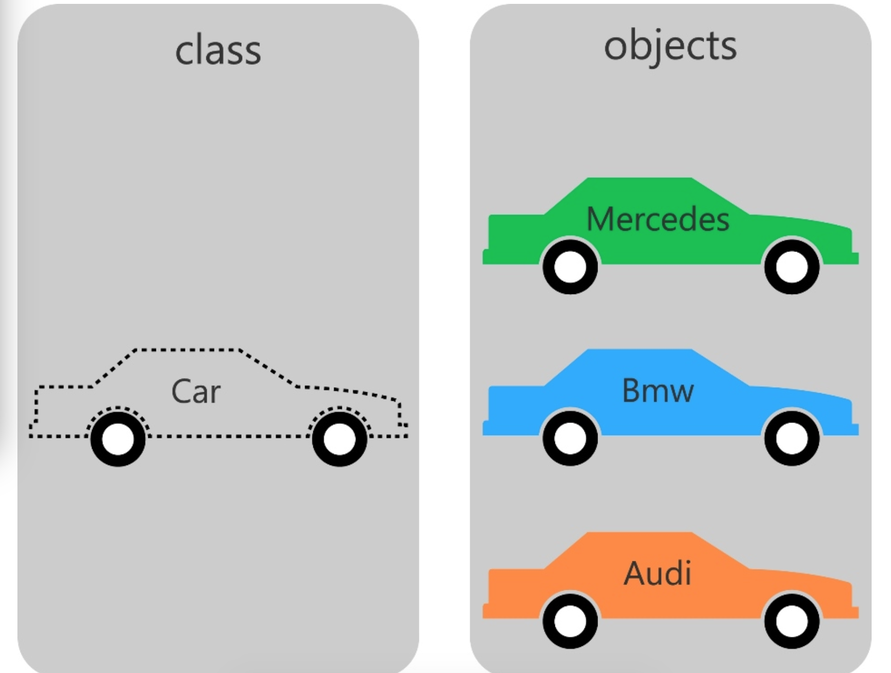
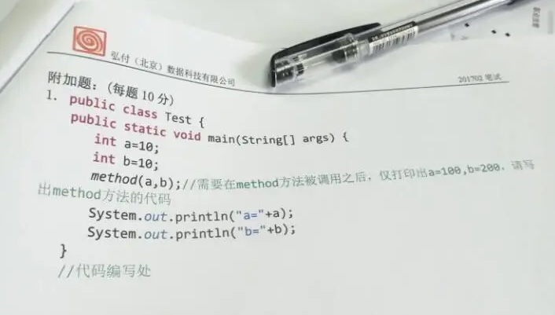

#### 面向对象

向对象程序设计（英语：Object-oriented programming，缩写：OOP）是种具有物件概念的**编程典范**，同时也是一种程序开发的抽象方针。它可能包含数据、特性、代码与方法。对象则指的是**类**（class）的**实例**。它将对象作为程序的基本单元，将程序和数据封装其中，以提高软件的**重用性、灵活性和扩展性**，物件里的程序可以访问及经常修改物件相关连的数据。在面向对象程序编程里，计算机程序会被设计成彼此相关的物件

##### **面向过程的程序设计思想（Process-Oriented Programming）**简称POP

- 关注的焦点是过程：过程就是操作数据的步骤。如果代码重复出现，就可以将这个过程抽取为一个**函数**。从而简化冗余代码，便于维护。
- 是一种**执行者思维**，适合解决简单问题。扩展能力差、不便于后期维护。

**面向对象的程序设计思想（Object Oriented Programming）简称OOP**

- 关注的焦点是**类**：在计算机程序设计过程中，参照现实中事物，将事物的属性特征、行为特征抽象出来，用类表示。
- 是一种**设计者思维**，适合解决复杂问题。代码扩展性强、可便于后期维护。

##### 面向对象和面向过程

- 面向过程

```java
1.打开冰箱
2.把大象装进冰箱
3.关闭冰箱
```

- 面向对象

```java
   人 {
        打开(冰箱) {
            冰箱.开门();
        }
        操作(大象) {
            大象.进入(冰箱);
        }
        关闭(冰箱) {
            冰箱.关门();
        }
    }

    冰箱 {
        开门() {
        }
    }
```

#### 类和对象

类和对象是面向对象的核心概念。

- 对象（Object）：对象具有状态和行为。例如：一只狗的状态有：颜色、名称、品种；它的行为有：吠叫、吃东西、摇尾巴等。对象就是类的实例。

- 类（Class）：可以将类定义为描述其类型对象支持的行为/状态的模版



##### 类的成员

- 属性：该类事物的状态信息。对应类中的成员变量	 
- 行为：该类事物要做什么操作。对应类中成员方法

##### 面向对象三个步骤

- 类的定义
  - 属性
  - 方法
- 对象创建
- 对象调用
  - 属性
  - 方法

##### 匿名对象（anonymous object）

如果一个对象只需要进行一次方法调用，那么就可以使用匿名对象。也可以将匿名对象作为一个实参传递给方法调用。

- new Person().eat();

#### 类的成员变量（field）

- 修饰符
  - 常用修饰符：private、缺省、protected、public
  - 其他修饰符：final、static
- 数据类型
  - 基本数据类型
  - 引用数据类型
- 成员变量名
- 初始化值
  - 不赋值，使用数据类型默认值。

#### 成员变量和局部变量

- 成员变量：在方法体外，类体内声明的变量称为成员变量
- 局部变量：在方法体内部等位置声明的变量称为局部变量

##### 成员变量局部变量区别

- 在内存中存储的位置不同
  - 实例变量：堆
  - 局部变量：栈
- 生命周期
  - 实例变量：和对象的生命周期一样，随着对象的创建而存在，随着对象被GC回收而消亡，而且每一个对象的实例变量是独立的。
  - 局部变量：和方法调用的生命周期一样，每一次方法被调用而存在，随着方法执行的结束而消亡，而且每一次方法调用都是独立的。
- 作用域
  - 实例变量：本类中直接调用，通过对象使用（对象.实例遍历）
  - 局部变量：作用域内使用
- 修饰符
  - 实例变量：public,protected,private,final,volatile,transient等
  - 局部变量：final
- 默认值
  - 实例变量：有默认值
  - 局部变量：没有默认值，必须手动初始化

#### 类成员方法（method）

方法是类或对象行为特征的抽象，用来完成某个功能操作。

##### 方法声明

- 方法头声明

  - 修饰符
    - 返回值类型
      - 无返回值：void
      - 有返回值，声明返回值数据类型，方法体结尾以`return 返回值`搭配使用

  - 方法名

  - 形参列表

  - throws异常列表

- 方法体

##### 关键字return

结束一个方法，在结束一个方法的同时，可以返回数据给方法调用者；在return关键字后面不能声明执行语句

```java
public class Person {
    String name;
    int age;
    char gender;
    public void showPersonalDetails(){
        System.out.println("姓名："+name+ "  年龄："+age+"  性别："+gender);
    }
    public String getName(){
        return name;
    }
   	public void setName(String newName){
        name = newName;
    }
}
```

#####  用面向对象的方式编写用户登录程序

- 用户类
  - 属性：用户名、密码
  - 方法：登录

```java
public class User {
    String username;
    String password;

    public Boolean login(String inputName,String inputPassword){
        return username.equals(inputName) && password.equals(inputPassword);
    }
}
```

- 界面类：

```
public class UserInterface {
    public static void main(String[] args) {
        User u1 = new User();
        u1.username = "canvs";
        u1.password = "123456";
        Scanner input = new Scanner(System.in);
        System.out.print("用户名：");
        String inputName = input.next();
        System.out.print("密  码：");
        String inputPassword = input.next();
        if(u1.login(inputName,inputPassword)){
            System.out.println("login successfully");
        }else {
            System.out.println("login failure");
        }
    }
}
```

##### 用面向对象编写数组util类

- **util类**

```java
public class ArrayUtil {
    public int binarySearch(int[] arr, int value){
        int head = 0;
        int end = arr.length-1;
        while (head <= end){
            int mid = (head+end)/2;
            if (arr[mid] == value){
                return mid;
            }else if(arr[mid]>value){
                end = mid -1;
            }else {
                head = mid +1;
            }

        }
        return -1;
    }
    public void bubbleSort(int[] arr){
        for (int i = 0; i < arr.length-1; i++) {
            for (int j = 0; j < arr.length-1-i; j++) {
                if(arr[j]>arr[j+1]){
                    int temp = arr[j];
                    arr[j] = arr[j+1];
                    arr[j+1] = temp;
                }
            }
        }
    }
    public void reversely(int[] arr){
        for (int i = 0; i < arr.length/2; i++) {
            int temp = arr[i];
            arr[i] = arr[arr.length-1-i];
            arr[arr.length-1-i] = temp;
        }
    }
}
```

- **测试类**

```java
public class ArrayUtilTest {
    public static void main(String[] args) {
        ArrayUtil util = new ArrayUtil();
        int[] arr = new int[]{-99, -54, -2, 0, 2, 33, 43, 256, 999};
        System.out.println(Arrays.toString(arr));
        util.bubbleSort(arr);
        System.out.println(Arrays.toString(arr));
        System.out.println(util.binarySearch(arr, 2));
        util.reversely(arr);
        System.out.println(Arrays.toString(arr));
    }
}
```

#### 对象数组

数组的元素可以是基本数据类型，也可以是引用数据类型。当元素是引用数据类型时，称为对象数组。

**练习**

- 定义矩形类Rectangle，包含长、宽属性，area()返回矩形面积的方法，perimeter()返回矩形周长的 方法，String getInfo()返回圆对象的详细信息(如:长、宽、面积、周长等数据)的方法
- 在测试类中创建长度为3的Rectangle[]数组，用来装3个矩形对象，并给3个矩形对象的长分别赋值 为10,20,30，宽分别赋值为5,15,25，遍历输出

**Rectangle类**

```java
public class Rectangle {
    double length;
    double width;
    public double area(){
        return length*width;
    }
    public double perimeter(){
        return (length+width)*2;
    }
    public String getInfo(){
        return "长="+length+"\t宽="+width+"\t面积="+area()+"\t周长="+perimeter();
    }
}
```

**测试类**

```java
public class RectangleTest {
    public static void main(String[] args) {
        Rectangle[] rectangle = new Rectangle[3];
        double[] length = new double[]{10,20,30};
        double[] winth = new double[]{5,15,25};
        for (int i = 0; i < 3; i++) {
            rectangle[i] = new Rectangle();
            rectangle[i].length = length[i];
            rectangle[i].width = winth[i];
        }
        new RectangleUtil().traversal(rectangle);
    }
}
class  RectangleUtil{
    public void traversal(Rectangle[] arr){
        for (int i = 0; i < arr.length; i++) {
            System.out.println(arr[i].getInfo());
        }
    }
}
```

>对象数组，首先要创建数组对象本身，即确定数组的长度，然后再创建每一个元素对象，如果不创建，数组的元素的默认值就是 null ，所以很容易出现 空指针异常NullPointerException 。


#### 方法的重载（overload）

- 方法重载：在同一个类中，允许存在一个以上的同名方法，只要它们的参数列表的**参数个数或参数类型不同**。
- 重载特点：**与修饰符、返回值类型无关**只能看参数列表；调用时根据方法参数的不同来匹配方法。
- 重载方法调用：JVM通过方法的参数列表，调用匹配的方法。

##### 可变个数的形参

在JDK 5.0 中提供了Varargs(variable number of arguments)机制。即定义一个方法时，行参的类型可以确定，单行参的个数不确定，可以使用可变个数的行参。

- 特点：
  - 可变参数：可变参数制定类型的参数个数可变：0个或多个
  - 方法的参数中有可变形参，需要放在形参声明的最后
  - 在一个方法形参中，只能声明一个可变个数形参

- 格式

```java
方法名(形参数类型...参数名)
```

```java
public class MathTools {
    public int getSum(int i, int j) {
        return i + j;
    }

    public int getSum(int... arr) {
        int sum = 0;
        for (int j = 0; j < arr.length; j++) {
            sum+=arr[j];
        }
        return sum;
    }
}
```

```java
public class MathToolsTest {
    public static void main(String[] args) {
        MathTools math = new MathTools();
        System.out.println(math.getSum(1, 5));	//6
        System.out.println(math.getSum(1, 2, 3, 4, 5));	//15
    }
}
```

##### 方法的参数传递机制

- 形参（formal parameter）：在定义方法时，方法名后面括号中声明的变量称为形式参数，简称行参

- 实参（actual parameter）：在调用方法时，方法名后面括号中使用的值/变量/对象/表达式称为实际参数，简称实参

##### 值传递

- 形参是基本数据类型：将实参基本数据类型变量的"数据值"传递给形参
- 形参是引用数据类型：将实参引用数据类型变量的"地址值"传递给形参

##### 练习：实现数组排序

```java
public class ArrayUtil {
    public void bubbleSort(int[] arr){
        for (int i = 0; i < arr.length-1; i++) {
            for (int j = 0; j < arr.length-1-i; j++) {
                if(arr[j]>arr[j+1]){
                    arrayValueSwap(arr,j);
                }
            }
        }
    }
    public void bubbleSort(int[] arr,int isFlag){
        if (0 < isFlag){    //正数升序，符数降序
            bubbleSort(arr);
        }else {
            for (int i = 0; i < arr.length-1; i++) {
                for (int j = 0; j < arr.length-1-i; j++) {
                    if (arr[j]<arr[j+1]){
                       arrayValueSwap(arr,j);
                    }
                }
            }
        }
    }
    public void arrayValueSwap(int[] arr,int j){
        int temp = arr[j];
        arr[j] = arr[j+1];
        arr[j+1] = temp;
    }
    public String info(int[] arr){
        String info = "【";
        for (int i = 0; i < arr.length; i++) {
            String symbol = ", ";
            if(i==0){
                symbol = "";
            }
            info += symbol+arr[i];
        }
        return info+"】";
    }
}
```

```java
public class ArrayUtilTest {
    public static void main(String[] args) {
        ArrayUtil util = new ArrayUtil();
        int[] arr = new int[]{-99, 6,-54, 7,-2, 0, 2, 33, 43, 256,-33, 999};
      	System.out.println(util.info(arr));
        util.bubbleSort(arr,1);
        System.out.println(util.info(arr));
    }
}
```


##### 面试题



```java
public class InterviewQuestion {
    public static void main(String[] args) {
        int a = 10;
        int b = 10;
        method(a, b);    //需要在method方法被调用之后，仅打印出a=100，b=200，写出method方法。
        System.out.println(a);
        System.out.println(b);
    }
    //方法1
    public static void method(int a, int b) {
        System.out.println(a = 100);
        System.out.println(b = 200);
        System.exit(0);
    }
    //方法2
    public static void method2(int a, int b) {
        PrintStream ps = new PrintStream(System.out) {
            @Override
            public void println(String x) {
                if ("a=10".equals(x)) {
                    x = "a=100";
                } else if ("b=10".equals(x)) {
                    x = "b=200";
                }
                super.println(x);
            }
        };
        System.setOut(ps);
    }
}
```

##### 练习：将对象作为参数传递给方法

- (1)定义一个Circle类，包含一个double型的radius属性代表圆的半径，一个findArea()方法返回圆的面 积。

-  (2)定义一个类PassObject，在类中定义一个方法printAreas()，该方法的定义如下:public void printAreas(Circle c, int time)，在printAreas方法中打印输出1到time之间的每个整数半径值，以及对应的面积。

```java
public class PassObject {
    public static void main(String[] args) {
        Circle circle = new Circle();
        System.out.println("Radius\t\t"+"Area");
        for (int i = 1; i <=5; i++) {
            printAreas(circle,i);
        }
    }
    public static void printAreas(Circle c , int time){
        c.radius = time;
        System.out.println(c.radius+"\t\t\t"+c.area());
    }
}
```

#### 递归方法（recursion）


- 递归方法调用：方法自己调用自己的现象称为递归。

- 递归的分类：直接递归、间接递归
- 递归方法包含了一种隐式的循环。
- 递归方法会重复执行某段代码，但这种重复执行无须循环控制。
- 递归一定要向已知方向递归，否则递归就变成无穷递归，最终发生栈内存溢出

##### 练习：

**计算1-n的和**

```java
public class RecursionSum {
    public static void main(String[] args) {
        RecursionSum re = new RecursionSum();
        System.out.println(re.getSum(100));
    }
    public int getSum(int num){
        if(num == 1){
            return 1;
        }
        return num+getSum(num-1);
    }
}
```

**递归方法计算n!**

```java
public int multiply(int n){
        if(n == 1){
            return 1;
        }
        return n*multiply(n-1);
    }
```

#### 关键字：package、import

- package称为包，用于指名该文件中定义的类、接口等结构所在的包
  - 一个源文件只能有一个声明包的package语句；若缺省packgae语句，则为无名包
  - 包对应文件系统的目录，package语句中 `.` 来指名包（目录）的层次。
  - 同一个包下可以声明多个结构（类、接口），但不能定义同名的类和接口。不同的包下可以定义同名的类和接口。
  - JDK中主要的包：
    -  `java.lang` ：包含一些Java语言的核心类，如String、Math、System等。
    -  `java.net` ：包含执行与网络相关的操作的类和接口。
    -  `java.io` ：包含能提供多种输入/输出功能的类
    -  `java.util` ：包含一些实用工具类
    -  `java.text` ：包含一些java格式化相关的类
    -  `java.sql` ：包含Java进行jdbc数据库编程相关的类/接口
- import：为了使用定义在其他包中的Java类，需要用import语句来显式引入指定包下所需要的类。

```java
//包名
package com.canvs.method;
//导入java.util.Scanner方法
import java.util.Scanner;
```

#### 面向对象特征一：封装性(encapsulation)

所谓封装，就是把客观的事物封装成抽象概念的类，并且类可以把自己的数据和方法只向可信的类或者对象开放，向没必要开放的类或者对象隐藏信息。这就是封装性的设计思想。

随着系统的越来越复杂，类会越来越多，那么类之间的访问边界必须把握好，面向对象的开放原则要遵循 `高类聚`、`低耦合`。

- 高类聚：类的内部数据操作细节自己完成，不允许外部干涉；
- 低耦合：仅暴露少量的方法给外部使用，尽量方便外部调用。

> 高类聚、低耦合是软件工程中的概念，也是UNIX操作系统设计的经典原则。
>
> 内聚，指一个模块内各个元素彼此结合的紧密程度；耦合指一个软件结构内不同模块之间互连程度的度量。内举意味着重用和独立，耦合意味着多米诺效应牵一发动全身。

#### Java如何实现数据封装

- 实现封装就是控制类或成员的可见性范围。
- 权限修饰符：public、protected、缺省、private。
  - 外部类：public、缺省
  - 成员变量、成员方法、构造器、成员内部类：public、protected、缺省、private

|  修饰符   | 本类内部 | 本包内 | 其他包的子内 | 其他包非子类 |
| :-------: | :------: | :----: | :----------: | :----------: |
|  private  |    √     |   ×    |      ×       |      ×       |
|   缺省    |    √     |   √    |      ×       |      ×       |
| protected |    √     |   √    |      √       |      ×       |
|  public   |    √     |   √    |      √       |      √       |

#### 封装性的体现

##### 成员变量/属性私有化

私有化类的成员变量，提供公共的get和set方法，对外暴露获取和修改属性的功能。

```java
public class Person {
    private String name;
    private int age;
    public String getName() {
        return name;
    }
    public void setName(String name) {
        this.name = name;
    }
    public int getAge() {
        return age;
    }
    public void setAge(int age) {
        this.age = age;
    }
}
```

```java
public class PersonTest {
    public static void main(String[] args) {
        Person p = new Person();
        p.setName("Canvs");
        p.setAge(23);
        System.out.println("姓名：" + p.getName() +"\t年龄：" + p.getAge());
    }
}
```

##### 成员变量封装的好处：

- 让使用者只能通过预先定义的方法来访问数据，从而可以在该方法里面加入控制逻辑，限制对成员变量不合理的访问。还可以进行数据检查，从而有利于保证对象信息的完整性。
- 便于修改，提高代码的可维护性；例如：Java8 -> java9，String从char[]转为byte[]内部实现，而对外的方法不变，我们使用者根本察觉不到它内部的修改。

> 对于final的实例变量，不提供set()方法。
>
> 对于static final的成员变量，习惯上使用public修饰。

##### 私有化方法

```java
public class Person {
    private String name;
    private int age;
    public String getName() {
        return name;
    }
    public void setName(String name) {
        this.name = name;
    }
    public int getAge() {
        return age;
    }
    public void setAge(int age) {
        this.age = age;
    }
    public void showInfo(){
        System.out.println(stringUtil());
    }
    private String stringUtil(){
        return "【 姓名："+name+"   年龄："+age+" 】";
    }
}
```

```java
public class PersonTest {
    public static void main(String[] args) {
        Person p = new Person();
        p.setName("Canvs");
        p.setAge(23);
        p.showInfo();
    }
}
```

##### 练习：

自定义图书类。设定属性包括:书名bookName，作者author，出版社名publisher，价格price;方法包

括:相应属性的get/set方法，图书信息介绍等。

```java
public class Book {
    private String bookName;
    private String author;
    private String publisher;
    private double price;
    public String getBookName() {
        return bookName;
    }
    public void setBookName(String bookName) {
        this.bookName = bookName;
    }
    public String getAuthor() {
        return author;
    }
    public void setAuthor(String author) {
        this.author = author;
    }
    public String getPublisher() {
        return publisher;
    }
    public void setPublisher(String publisher) {
        this.publisher = publisher;
    }
    public double getPrice() {
        return price;
    }
    public void setPrice(double price) {
        this.price = price;
    }
    public String bookInfo(){
        return "书名："+bookName+"  作者："+author+"  出版社："+publisher+"  价格："+price;
    }
}
```

```java
public class BookTest {
    public static void main(String[] args) {
        Book book = new Book();
        book.setBookName("JAVA编程思想");
        book.setAuthor("Bruce Eckel");
        book.setPrice(80);
        book.setPublisher("机械工业出版社");
        System.out.println(book.bookInfo());    //书名：JAVA编程思想  作者：Bruce Eckel  出版社：机械工业出版社  价格：80.0
    }
}
```


#### 类成员：构造器（Constructor）

new对象，并在new对象的时候为实例变量赋值。

```java
[修饰符] class 类名{ 
  		[修饰符] 构造器名(){
					// 实例初始化代码 }
			[修饰符] 构造器名(参数列表){ // 实例初始化代码
			} 
}
```

- 构造器名必须与它所在的类名同名
- 它没有返回值，所以不需要返回值类型，也不需要void。
- 构造器的修饰符只能是权限修饰符，不能被其他任何修饰符。如static、final、synchronized、abstract、native修饰，不能使用return语句。
- 当我们没有显示的声明类中的构造器时，Java会默认提供一个无参的构造器并且该构造器的修饰符默认与类名相同。
- 当我们显示定义类的构造器时，Java就不再提供默认的无参构造器。
- 在类中至少会存在一个构造器；构造器是可以重载的。

```java
public class Student {
    private String name;
    private int age;
    public Student(){   //无参构造器
      
    }
    public Student(String n,int a){ //构造器重载
        name = n;
        age = a;
    }
    public String studentInfo(){
        return "姓名："+name+"  年龄："+age;
    }
    public String getName() {
        return name;
    }
    public void setName(String name) {
        this.name = name;
    }
    public int getAge() {
        return age;
    }
    public void setAge(int age) {
        this.age = age;
    }
}
```

```java
public class StudentTest {
    public static void main(String[] args) {
        Student stu = new Student();
        stu.setName("tom");
        stu.setAge(23);
        Student stu2 = new Student("jerry",20);
        System.out.println(stu.studentInfo());  //姓名：tom  年龄：23
        System.out.println(stu2.studentInfo()); //姓名：jerry  年龄：20
    }
}
```

##### 练习：

- 写一个名为Account的类模拟账户。该类的属性和方法如下图所示。 该类包括的属性:账号id，余额balance，年利率annualInterestRate; 包含的方法:访问器方法(getter和setter方法)，取款方法withdraw()，存款方法deposit()。

- 创建Customer类。

```java
public class Account {
    private int id;
    private double balance;
    private double annuallnterestRate;
    public Account(int i, double b, double a) {
        id = i;
        balance = b;
        annuallnterestRate = a;
    }
    public void withdraw(double amount) {
        if (amount <= balance && amount > 0) {
            balance -= amount;
            System.out.println("成功取款："+amount);
        } else {
            System.out.println("余额不足");
        }
    }
    public void deposit(double amount) {
        if (amount > 0) {
            balance += amount;
            System.out.println("成功存入：" + amount);
        }else {
            System.out.println("非法输入");
        }
    }
    public int getId() {
        return id;
    }
    public void setId(int id) {
        this.id = id;
    }
    public double getBalance() {
        return balance;
    }
    public void setBalance(double balance) {
        this.balance = balance;
    }
    public double getAnnuallnterestRate() {
        return annuallnterestRate;
    }
    public void setAnnuallnterestRate(double annuallnterestRate) {
        this.annuallnterestRate = annuallnterestRate;
    }
}
```

```java
public class Customer {
    private String firstName;
    private String lastName;
    private Account account;
    public Customer(String fn, String ln) {
        firstName = fn;
        lastName = ln;
    }
    public String customerInfo(){
        return "姓名："+lastName+" "+firstName+"  账号："+account.getId()+
                "  余额："+account.getBalance()+"  年利率："
                +account.getAnnuallnterestRate()*100+"%";
    }
    public String getFirstName() {
        return firstName;
    }
    public void setFirstName(String firstName) {
        this.firstName = firstName;
    }
    public String getLastName() {
        return lastName;
    }
    public void setLastName(String lastName) {
        this.lastName = lastName;
    }
    public Account getAccount() {
        return account;
    }
    public void setAccount(Account account) {
        this.account = account;
    }
}
```

```java
public class CustomerTest {
    public static void main(String[] args) {
        Customer customer = new Customer("Smith","jane");
        customer.setAccount(new Account(1024,2000,0.023));
        customer.getAccount().deposit(2000);    //成功存入：2000.0
        customer.getAccount().withdraw(500);    //成功取款：500.0
        customer.getAccount().withdraw(10000);  //余额不足
        System.out.println(customer.customerInfo()); 
    }
}
```

#### JavaBean

- JavaBean是一种Java语言写成的可重用组件。
- JavaBean，是指符合如下标准的Java类：
  - 类是公共的。
  - 有一个无参的公共构造器
  - 有属性，且有对应的get、set方法
- 用户可以使用JavaBean将功能、处理、值、数据库访问和其他任何可以用Java代码创造的对象进行打包，并且其他的开发者可以通过内部的JSP页面、Servlet、其他JavaBean、applet程序或者应用来使用这些对象。
- 《Think in Java》中提到，JavaBean最初是为Java GUI的可视化编程实现的。你拖动IDE构建工具创建一个GUI组件，其实是工具给你创建Java类，并提供将类的属性暴露出来给你修改调整，将事件监听暴露出来。

```java
public class JavaBean {
    private String name;
    private int age;
    public JavaBean(){

    }
    public String getName() {
        return name;
    }
    public void setName(String name) {
        this.name = name;
    }
    public int getAge() {
        return age;
    }
    public void setAge(int age) {
        this.age = age;
    }
}
```

#### UML类图

- UML（Unified Modeling Language）统一建模语言，用来描述软件模型和架构的图形化语言。
- 常用的UML工具有：PowerDesinger、Rose和Enterprise Architect。
- UML工具不仅可以绘制团建开发中所需的各种图表，还可以生成对应的源代码。
- 在软件开发中，使用UML类图可以更加直观地描述类内部结构（类的属性和操作）以及类之间的关系（如关联、依赖、聚合等）。
  - +表示 public 类型，-表示private类型，#表示protected类型
  - 方法的写法：方法的类型(+、-)方法名（参数名：参数类型）：返回值类型
  - 斜体表示抽象方法或类。
