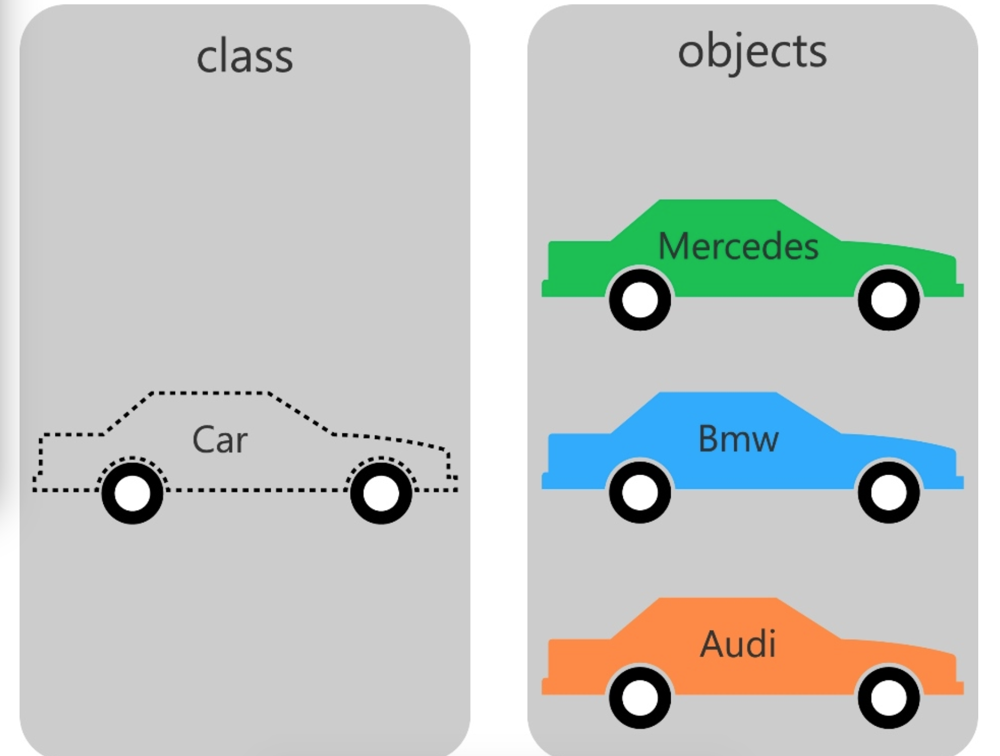

#### 面向对象

向对象程序设计（英语：Object-oriented programming，缩写：OOP）是种具有物件概念的**编程典范**，同时也是一种程序开发的抽象方针。它可能包含数据、特性、代码与方法。对象则指的是**类**（class）的**实例**。它将对象作为程序的基本单元，将程序和数据封装其中，以提高软件的**重用性、灵活性和扩展性**，物件里的程序可以访问及经常修改物件相关连的数据。在面向对象程序编程里，计算机程序会被设计成彼此相关的物件

##### **面向过程的程序设计思想（Process-Oriented Programming）**简称POP

- 关注的焦点是过程：过程就是操作数据的步骤。如果代码重复出现，就可以将这个过程抽取为一个**函数**。从而简化冗余代码，便于维护。
- 是一种**执行者思维**，适合解决简单问题。扩展能力差、不便于后期维护。

**面向对象的程序设计思想（Object Oriented Programming）简称OOP**

- 关注的焦点是**类**：在计算机程序设计过程中，参照现实中事物，将事物的属性特征、行为特征抽象出来，用类表示。
- 是一种**设计者思维**，适合解决复杂问题。代码扩展性强、可便于后期维护。

##### 面向对象和面向过程

- 面向过程

```java
1.打开冰箱
2.把大象装进冰箱
3.关闭冰箱
```

- 面向对象

```java
   人 {
        打开(冰箱) {
            冰箱.开门();
        }
        操作(大象) {
            大象.进入(冰箱);
        }
        关闭(冰箱) {
            冰箱.关门();
        }
    }

    冰箱 {
        开门() {
        }
    }
```

#### 类和对象

类和对象是面向对象的核心概念。

- 对象（Object）：对象具有状态和行为。例如：一只狗的状态有：颜色、名称、品种；它的行为有：吠叫、吃东西、摇尾巴等。对象就是类的实例。

- 类（Class）：可以将类定义为描述其类型对象支持的行为/状态的模版



##### 类的成员

- 属性：该类事物的状态信息。对应类中的成员变量	 
- 行为：该类事物要做什么操作。对应类中成员方法

##### 面向对象三个步骤

- 类的定义
  - 属性
  - 方法
- 对象创建
- 对象调用
  - 属性
  - 方法

##### 匿名对象（anonymous object）

如果一个对象只需要进行一次方法调用，那么就可以使用匿名对象。也可以将匿名对象作为一个实参传递给方法调用。

- new Person().eat();

#### 类的成员变量（field）

- 修饰符
  - 常用修饰符：private、缺省、protected、public
  - 其他修饰符：final、static
- 数据类型
  - 基本数据类型
  - 引用数据类型
- 成员变量名
- 初始化值
  - 不赋值，使用数据类型默认值。

#### 成员变量和局部变量

- 成员变量：在方法体外，类体内声明的变量称为成员变量
- 局部变量：在方法体内部等位置声明的变量称为局部变量

##### 成员变量局部变量区别

- 在内存中存储的位置不同
  - 实例变量：堆
  - 局部变量：栈
- 生命周期
  - 实例变量：和对象的生命周期一样，随着对象的创建而存在，随着对象被GC回收而消亡，而且每一个对象的实例变量是独立的。
  - 局部变量：和方法调用的生命周期一样，每一次方法被调用而存在，随着方法执行的结束而消亡，而且每一次方法调用都是独立的。
- 作用域
  - 实例变量：本类中直接调用，通过对象使用（对象.实例遍历）
  - 局部变量：作用域内使用
- 修饰符
  - 实例变量：public,protected,private,final,volatile,transient等
  - 局部变量：final
- 默认值
  - 实例变量：有默认值
  - 局部变量：没有默认值，必须手动初始化

#### 类成员方法（method）

方法是类或对象行为特征的抽象，用来完成某个功能操作。

##### 方法声明

- 方法头声明

  - 修饰符
    - 返回值类型
      - 无返回值：void
      - 有返回值，声明返回值数据类型，方法体结尾以`return 返回值`搭配使用

  - 方法名

  - 形参列表

  - throws异常列表

- 方法体

##### 关键字return

结束一个方法，在结束一个方法的同时，可以返回数据给方法调用者；在return关键字后面不能声明执行语句

```java
public class Person {
    String name;
    int age;
    char gender;
    public void showPersonalDetails(){
        System.out.println("姓名："+name+ "  年龄："+age+"  性别："+gender);
    }
    public String getName(){
        return name;
    }
   	public void setName(String newName){
        name = newName;
    }
}
```

#####  用面向对象的方式编写用户登录程序

- 用户类
  - 属性：用户名、密码
  - 方法：登录

```java
public class User {
    String username;
    String password;

    public Boolean login(String inputName,String inputPassword){
        return username.equals(inputName) && password.equals(inputPassword);
    }
}
```

- 界面类：

```
public class UserInterface {
    public static void main(String[] args) {
        User u1 = new User();
        u1.username = "canvs";
        u1.password = "123456";
        Scanner input = new Scanner(System.in);
        System.out.print("用户名：");
        String inputName = input.next();
        System.out.print("密  码：");
        String inputPassword = input.next();
        if(u1.login(inputName,inputPassword)){
            System.out.println("login successfully");
        }else {
            System.out.println("login failure");
        }
    }
}
```

##### 用面向对象编写数组util类

- **util类**

```java
public class ArrayUtil {
    public int binarySearch(int[] arr, int value){
        int head = 0;
        int end = arr.length-1;
        while (head <= end){
            int mid = (head+end)/2;
            if (arr[mid] == value){
                return mid;
            }else if(arr[mid]>value){
                end = mid -1;
            }else {
                head = mid +1;
            }

        }
        return -1;
    }
    public void bubbleSort(int[] arr){
        for (int i = 0; i < arr.length-1; i++) {
            for (int j = 0; j < arr.length-1-i; j++) {
                if(arr[j]>arr[j+1]){
                    int temp = arr[j];
                    arr[j] = arr[j+1];
                    arr[j+1] = temp;
                }
            }
        }
    }
    public void reversely(int[] arr){
        for (int i = 0; i < arr.length/2; i++) {
            int temp = arr[i];
            arr[i] = arr[arr.length-1-i];
            arr[arr.length-1-i] = temp;
        }
    }
}
```

- **测试类**

```java
public class ArrayUtilTest {
    public static void main(String[] args) {
        ArrayUtil util = new ArrayUtil();
        int[] arr = new int[]{-99, -54, -2, 0, 2, 33, 43, 256, 999};
        System.out.println(Arrays.toString(arr));
        util.bubbleSort(arr);
        System.out.println(Arrays.toString(arr));
        System.out.println(util.binarySearch(arr, 2));
        util.reversely(arr);
        System.out.println(Arrays.toString(arr));
    }
}
```

#### 对象数组

数组的元素可以是基本数据类型，也可以是引用数据类型。当元素是引用数据类型时，称为对象数组。

**练习**

- 定义矩形类Rectangle，包含长、宽属性，area()返回矩形面积的方法，perimeter()返回矩形周长的 方法，String getInfo()返回圆对象的详细信息(如:长、宽、面积、周长等数据)的方法
- 在测试类中创建长度为3的Rectangle[]数组，用来装3个矩形对象，并给3个矩形对象的长分别赋值 为10,20,30，宽分别赋值为5,15,25，遍历输出

**Rectangle类**

```java
public class Rectangle {
    double length;
    double width;
    public double area(){
        return length*width;
    }
    public double perimeter(){
        return (length+width)*2;
    }
    public String getInfo(){
        return "长="+length+"\t宽="+width+"\t面积="+area()+"\t周长="+perimeter();
    }
}
```

**测试类**

```java
public class RectangleTest {
    public static void main(String[] args) {
        Rectangle[] rectangle = new Rectangle[3];
        double[] length = new double[]{10,20,30};
        double[] winth = new double[]{5,15,25};
        for (int i = 0; i < 3; i++) {
            rectangle[i] = new Rectangle();
            rectangle[i].length = length[i];
            rectangle[i].width = winth[i];
        }
        new RectangleUtil().traversal(rectangle);
    }
}
class  RectangleUtil{
    public void traversal(Rectangle[] arr){
        for (int i = 0; i < arr.length; i++) {
            System.out.println(arr[i].getInfo());
        }
    }
}
```

>对象数组，首先要创建数组对象本身，即确定数组的长度，然后再创建每一个元素对象，如果不创建，数组的元素的默认值就是 null ，所以很容易出现 空指针异常NullPointerException 。


#### 方法的重载（overload）

- 方法重载：在同一个类中，允许存在一个以上的同名方法，只要它们的参数列表的**参数个数或参数类型不同**。
- 重载特点：**与修饰符、返回值类型无关**只能看参数列表；调用时根据方法参数的不同来匹配方法。
- 重载方法调用：JVM通过方法的参数列表，调用匹配的方法。

##### 可变个数的形参

在JDK 5.0 中提供了Varargs(variable number of arguments)机制。即定义一个方法时，行参的类型可以确定，单行参的个数不确定，可以使用可变个数的行参。

- 特点：
  - 可变参数：可变参数制定类型的参数个数可变：0个或多个
  - 方法的参数中有可变形参，需要放在形参声明的最后
  - 在一个方法形参中，只能声明一个可变个数形参

- 格式

```java
方法名(形参数类型...参数名)
```

```java
public class MathTools {
    public int getSum(int i, int j) {
        return i + j;
    }

    public int getSum(int... arr) {
        int sum = 0;
        for (int j = 0; j < arr.length; j++) {
            sum+=arr[j];
        }
        return sum;
    }
}
```

```java
public class MathToolsTest {
    public static void main(String[] args) {
        MathTools math = new MathTools();
        System.out.println(math.getSum(1, 5));	//6
        System.out.println(math.getSum(1, 2, 3, 4, 5));	//15
    }
}
```

##### 方法的参数传递机制

- 形参（formal parameter）：在定义方法时，方法名后面括号中声明的变量称为形式参数，简称行参

- 实参（actual parameter）：在调用方法时，方法名后面括号中使用的值/变量/对象/表达式称为实际参数，简称实参

##### 值传递

- 形参是基本数据类型：将实参基本数据类型变量的"数据值"传递给形参
- 形参是引用数据类型：将实参引用数据类型变量的"地址值"传递给形参

##### 练习：实现数组排序

```java
public class ArrayUtil {
    public void bubbleSort(int[] arr){
        for (int i = 0; i < arr.length-1; i++) {
            for (int j = 0; j < arr.length-1-i; j++) {
                if(arr[j]>arr[j+1]){
                    arrayValueSwap(arr,j);
                }
            }
        }
    }
    public void bubbleSort(int[] arr,int isFlag){
        if (0 < isFlag){    //正数升序，符数降序
            bubbleSort(arr);
        }else {
            for (int i = 0; i < arr.length-1; i++) {
                for (int j = 0; j < arr.length-1-i; j++) {
                    if (arr[j]<arr[j+1]){
                       arrayValueSwap(arr,j);
                    }
                }
            }
        }
    }
    public void arrayValueSwap(int[] arr,int j){
        int temp = arr[j];
        arr[j] = arr[j+1];
        arr[j+1] = temp;
    }
    public String info(int[] arr){
        String info = "【";
        for (int i = 0; i < arr.length; i++) {
            String symbol = ", ";
            if(i==0){
                symbol = "";
            }
            info += symbol+arr[i];
        }
        return info+"】";
    }
}
```

```java
public class ArrayUtilTest {
    public static void main(String[] args) {
        ArrayUtil util = new ArrayUtil();
        int[] arr = new int[]{-99, 6,-54, 7,-2, 0, 2, 33, 43, 256,-33, 999};
      	System.out.println(util.info(arr));
        util.bubbleSort(arr,1);
        System.out.println(util.info(arr));
    }
}
```


##### 面试题


```java
public class InterviewQuestion {
    public static void main(String[] args) {
        int a = 10;
        int b = 10;
        method(a, b);    //需要在method方法被调用之后，仅打印出a=100，b=200，写出method方法。
        System.out.println(a);
        System.out.println(b);
    }
    //方法1
    public static void method(int a, int b) {
        System.out.println(a = 100);
        System.out.println(b = 200);
        System.exit(0);
    }
    //方法2
    public static void method2(int a, int b) {
        PrintStream ps = new PrintStream(System.out) {
            @Override
            public void println(String x) {
                if ("a=10".equals(x)) {
                    x = "a=100";
                } else if ("b=10".equals(x)) {
                    x = "b=200";
                }
                super.println(x);
            }
        };
        System.setOut(ps);
    }
}
```

##### 练习：将对象作为参数传递给方法

- (1)定义一个Circle类，包含一个double型的radius属性代表圆的半径，一个findArea()方法返回圆的面 积。

-  (2)定义一个类PassObject，在类中定义一个方法printAreas()，该方法的定义如下:public void printAreas(Circle c, int time)，在printAreas方法中打印输出1到time之间的每个整数半径值，以及对应的面积。

```java
public class PassObject {
    public static void main(String[] args) {
        Circle circle = new Circle();
        System.out.println("Radius\t\t"+"Area");
        for (int i = 1; i <=5; i++) {
            printAreas(circle,i);
        }
    }
    public static void printAreas(Circle c , int time){
        c.radius = time;
        System.out.println(c.radius+"\t\t\t"+c.area());
    }
}
```

#### 递归方法（recursion）


- 递归方法调用：方法自己调用自己的现象称为递归。

- 递归的分类：直接递归、间接递归
- 递归方法包含了一种隐式的循环。
- 递归方法会重复执行某段代码，但这种重复执行无须循环控制。
- 递归一定要向已知方向递归，否则递归就变成无穷递归，最终发生栈内存溢出

##### 练习：

**计算1-n的和**

```java
public class RecursionSum {
    public static void main(String[] args) {
        RecursionSum re = new RecursionSum();
        System.out.println(re.getSum(100));
    }
    public int getSum(int num){
        if(num == 1){
            return 1;
        }
        return num+getSum(num-1);
    }
}
```

**递归方法计算n!**

```java
public int multiply(int n){
        if(n == 1){
            return 1;
        }
        return n*multiply(n-1);
    }
```


