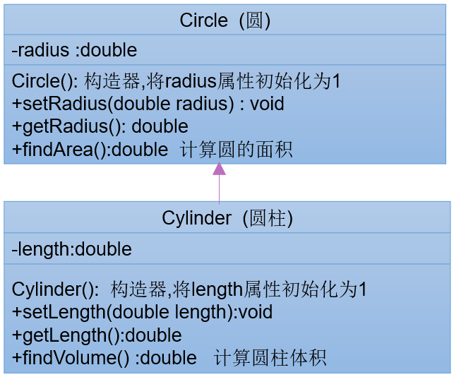
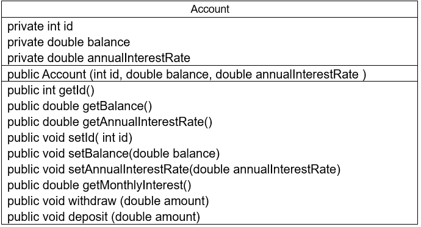

### 关键字：this

在实例方法或构造器中，如果使用当前类的成员变量或成员方法可以在其前面添加this，增强程序的可读性。通常习惯省略this。

this用于区分成员变量和局部变量当形参与成员变量同名时，如果在方法内或构造器内需要使用成员变量，必须添加this来表明该变量是类的成员变量。

- this在方法（实例方法或非static方法）内部使用，表示调用该方法的对象
- this在构造器内部使用，表示该构造器正在初始化的对象
- 使用this访问属性和方法时，如果在本类中未找到，会从父类中查找

#### 实例方法或构造器中使用当前对象的成员

```java
public class Person {
    private String name;
    private int age;
    public Person() {
    }
    public Person(String name, int age) {
        this.name = name;
        this.age = age;
    }
    public void setName(String name) {
        this.name = name;
    }
    public void setAge(int age) {
        this.age = age;
    }
}
```

#### 同一类中构造器互相调用

this可以作为一个类中构造器互相调用的特殊格式

- this():调用本类的无参构造器
- this(实参列表):调用本类的有参构造器

**注意**

- 不能出现递归调用
- this()和this(实参列表)只能声明在构造器首行

```java
public class Student {
    private String name;
    private  int age;
    public Student() {
    }
    public Student(String name) {
        this();
        this.name = name;
    }
    public Student(String name, int age) {
        this(name);
        this.age = age;
    }
}
```

```java
public class StudentTest {
    public static void main(String[] args) {
        Student stu = new Student("canvs",23);
    }
}
```

#### 练习：按照如下的UML类图，创建相应的类，提供必要的结构


```java
public class Account {
    private double balance;
    public Account(double init_balance) {
        this.balance = init_balance;
    }
    public double getBalance() {
        return balance;
    }
    public void deposit(double amt) {
        if (amt > 0) {
            this.balance += amt;
            System.out.println("存入成功：" + amt);
        } else {
            System.out.println("输入金额有误！");
        }
    }
    public void withdraw(double amt) {
        if (amt >= this.balance && amt > 0) {
            this.balance -= amt;
            System.out.println("取出成功：" + amt);
        } else {
            System.out.println("输入余额有误或余额不足！");
        }
    }
}
```


```java
public class Customer {
    private String firstName;
    private String lastName;
    private Account account;
    public Customer() {
    }
    public Customer(String firstName, String lastName) {
        this.firstName = firstName;
        this.lastName = lastName;
    }
    public String getFirstName() {
        return firstName;
    }
    public String getLastName() {
        return lastName;
    }
    public Account getAccount() {
        return account;
    }
    public void setAccount(Account account) {
        this.account = account;
    }
    public String info(){
        return "姓名："+this.firstName+this.lastName+"  余额："+this.account.getBalance();
    }
}
```


```java
public class Bank {
    private Customer customer[];
    private int numberOfCustomer;
    public Bank() {
        this.customer = new Customer[10];
    }
    public void addCustomer(String firstName, String lastName) {
        if (numberOfCustomer < this.customer.length) {
            this.customer[numberOfCustomer++] = new Customer(firstName, lastName);
        } else {
            System.out.println("用户已满了");
        }
    }
    public int getNumberOfCustomer() {
        return this.numberOfCustomer;
    }
    public Customer getCustomer(int index) {
        if (index < 0 || index >= numberOfCustomer) {
            return null;
        }
        return this.customer[index];
    }
}
```

```java
public class BankTest {
    public static void main(String[] args) {
        Bank bank = new Bank();
        bank.addCustomer("刘","备");
        bank.addCustomer("曹","操");
        bank.getCustomer(0).setAccount(new Account(2000));
        bank.getCustomer(0).getAccount().withdraw(500);
        System.out.println(bank.getCustomer(0).info());
        bank.getCustomer(0).getAccount().deposit(1000);
        System.out.println(bank.getCustomer(0).info());
        System.out.println("当前用户个数："+bank.getNumberOfCustomer());
    }
}
```

### 面向对象：继承（Inheritance）


多个类中存在相同属性和行为时，将这些内容抽取到单独一个类中，那么多个类中无需在定义这些相同的属性和行为，只需和抽取出来的类构成继承关系。

#### 继承的优点

- 继承减少了代码冗余，提高了代码的复用性；
- 便利于功能的扩展；
- 让类与类之间产生了 `is -a`的关系，为多态的使用提供了前提。

#### 继承基本概念

- Person类，称为父类、超类、基类
- Student类，称为子类、派生类


```java
public class Animal {
    String name;
    int age;

    public void sleep() {
        System.out.println(name + "在睡觉...");
    }
}

class Cat extends Animal {
    public void catchTheMouse() {
        System.out.println(name + "在抓老鼠...");
    }
}

class Dog extends Animal {
    public void watchDog() {
        System.out.println(name + "在看门...");
    }
}
```

```java
public class AnimalTest {
    public static void main(String[] args) {
        Cat cat = new Cat();
        cat.name="假老练";
        cat.age=5;
        cat.sleep();	//假老练在睡觉...
        cat.catchTheMouse();	//假老练在抓老鼠...
        Dog dog = new Dog();
        dog.name = "莽哥";
        dog.age = 7;
        dog.watchDog();	//莽哥在看门...
    }
}
```

### 继承性

#### 子类会继承父类所有的实例变量和实例方法

从类的定义来看，类是一类具有相同特性事物的抽象描述。父类是所有子类共同特征的抽象描述。而实例变量和实例方法就是事物的特征，那么父类中声明的实例变量和实例方法代表子类事物也有这个特征。

- 当子类对象要被创建时，在堆中给对象申请内存时，要看子类和父类都声明了什么实例变量，这些实例变量都要分配内存。
- 当子类对象调用方法时，编译器会先在子类模版中看该类是否有这个方法，如果没有找到，会看它父类甚至父类的父类是否声明了这个方法，遵循从下往上找的顺序，一直找到Object类都没找到，就会报编译错误。

#### 子类不能直接访问父类中私有（private）的成员变量和方法

子类虽会继承父类私有的成员变量，但子类不能对继承的私有成员变量直接访问，可通过继承的get/set方法访问。

#### Java中，子类不是父类的子集，而是对父类的扩展

子类在继承父类，还可以定义自己特有的方法，父类功能上的扩展。

#### Java支持多层继承

- 子类和父类是一种相对的概念
- 顶级父类是Object类。所有的类默认继承Object，作为父类


#### Java支持单继承，不支持多重继承


> 吕布：吾堂堂大丈夫，安肯为汝之义子？</br>
> 丁原：奉先，何故变心？</br>
> （丁原人头落地）</br>
> （吕布向董卓献上丁原的首级）</br>
>
> 吕布：吕布飘零半生，只恨未逢明主，公若不弃，布愿拜为义父。</br>
> 董卓：我得奉先，真天赐英杰也。吾儿快起，吾儿快起！</br>
> 吕布：义父在上，儿从此后，跟定义父。赴汤蹈火，在所不辞，襄助义父，共图大业。</br>
> （若干年后）</br>
> 吕布：大丈夫生于天地之间，岂能郁郁久居于人下！</br>

#### 练习：

- 根据下图实现类。在CylinderTest类中创建Cylinder类的对象，设置圆柱的底面半径和高，并输出圆柱的体积。



```java
public class Circle {
    private double radius;
    public double getRadius() {
        return radius;
    }
    public void setRadius(double radius) {
        this.radius = radius;
    }
    public double findArea(){
        return radius*radius*3.14;
    }
}
```

```java
public class Cylinder extends Circle{
    double length;
    public Cylinder() {
        this.length = 1;
    }
    public double getLength() {
        return length;
    }
    public void setLength(double length) {
        this.length = length;
    }
    public double findVolume(){
        return findArea()*length;
    }
}
```

```java
public class CylinderTest {
    public static void main(String[] args) {
        Cylinder cylinder = new Cylinder();
        cylinder.setRadius(2.3);
        System.out.println(cylinder.findVolume());
    }
}
```

### 方法重写（override/overwrite）

父类的所有方法子类都会继承，但某个方法被继承到子类，子类觉得父类原来的实现不适合自己当前的类；子类可以对父类中继承的方法进行重写。

```java
public class Phone {
    public void sendMessage(){
        System.out.println("发短信");
    }
    public void callUp(){
        System.out.println("打电话");
    }
    public void showNum(){
        System.out.println("来电号码");
    }
    public void callMe(){
        showNum();
    }
}
class Iphone extends Phone{
    @Override
    public void callUp() {
        System.out.println("视频通话");
    }

    @Override
    public void showNum() {
        System.out.println("来电号码");
        System.out.println("来电用户头像");
    }
}
```

#### 方法重写规范

- 子类重写的方法必须和父类被重写的方法具有**相同的方法名称、参数列表**
- 子类重写的方法的返回值类型不能大于父类被重写方法的返回值类型，（Person>Student）。
  - 如果返回值是基本数据类型和void，那么必须一致。
- 子类重写的方法使用的访问权限（修饰符）不能小于父类被重写方法的访问权限（public > protected > 缺省 >private）
  - 父类的私有方法不能被重写
  - 跨包的父类缺省的方法也不能被重写
- 子类方法抛出的异常不能大于父类被重写方法的异常

> 子类与父类同名同参数的方法必须同时声明为非static的（即为重写），或者同时声明为static的（不是重写）

#### 方法重载与重写

方法的重载：方法名相同，形参列表不同。不看返回值类型。

```java
public class Father {
    public void method(int i){
        System.out.println("Father Method");
    }
}
class Son extends Father{   //重写
    @Override
    public void method(int i) {
        System.out.println("Son Method");
    }
}
class Daughter extends Father{
    public void method(int i,int b){    //重载
        System.out.println("Daughter Method");
    }
}
```

### 关键字：super

在Java类中使用super来调用父类中的指定操作

- super可用于访问父类中定义的属性
- super可用于访问父类中定义的成员变量
- super可用于在子类构造器中调用父类的构造器

- 当子类和父类出现同名成员时，可以用super表明调用的是父类的成员
- super的追溯不仅限于直接父类
- super和this的用法相同，this代表本类对象的引用，super代表父类的内存空间标识

### 子类中调用父类被重写的方法

- 如果子类没有重写父类的方法，只要权限修饰符允许，在子类中可以直接调用父类的方法
- 如果子类重写了父类的方法，在子类中需要通过 `super.` 才能调用父类被重写的方法，否则默认调用子类重写的方法

```java
public class Phone {
    public void sendMessage(){
        System.out.println("发短信");
    }
    public void callUp(){
        System.out.println("打电话");
    }
    public void showNum(){
        System.out.println("来电号码");
    }
    public void callMe(){
        showNum();
    }
}
class Iphone extends Phone{
    @Override
    public void callUp() {
        System.out.println("视频通话");
    }
    @Override
    public void showNum() {
        super.showNum();
        System.out.println("来电用户头像");
    }
}
```

#### super和this总结

- 方法前面没有 `super.`  和 `this.`
  - 先从子类找匹配方法，如果没有，再从直接父类找，依次往上追溯，直到追溯到Object类
- 方法前面有 `this.`
  - 先从子类找到匹配方法，如果没有，再从直接父类找，依次往上追溯，直到追溯到Object类
- 方法前面有 `super.`
  - 从当前子类的直接父类找，如果没有，依次往上追溯，直到追溯到Object类

### 子类中调用父类中同名的成员变量

- 如果实例变量与局部变量重名，可以在实例变量前面加 `this.` 进行区别
- 如果子类实例变量和父类实例变量重名，并且父类的该实例变量在子类仍然可见，在子类中要访问父类声明的实例变量需要在父类实例变量前加 `super.` ，否则默认访问的是子类声明的实例变量。
- 如果父类实例变量没有重名，只要权限修饰符允许，在子类中完全可以直接访问父类中声明的实例变量，也可以用 `this.` 实例访问，也可以用 `super.` 实例变量来访问。

```java
public class Father {
    String name;
    int age;
    int id;
    public Father() {}
    public Father(String name, int age, int id) {
        this.name = name;
        this.age = age;
        this.id = id;
    }
}
class Son extends Father{
    int age;
    public Son(String name, int age, int id) {
        this.name = name;
        this.id = id;
        this.age = age;
    }
    public int getSuperAge(){
        return super.age;	//直接获取父类成员变量
    }
    public String getName(){
        return this.name;	//先从本类成员找
    }
}
```

```java
public class Test {
    public static void main(String[] args) {
        Son s = new Son("Canvs",22,1024);
        System.out.println(s.age);  //22
        System.out.println(s.getSuperAge());    //0
        System.out.println(s.getName());    //Canvs
    }
}
```

#### super和this总结

- 变量前没有 `super.` 和 `this.`
  - 在构造器、代码块、方法中如果出现使用某个变量，先查看是否是当前声明的局部变量
  - 如果不是局部变量，先从当前执行代码本类成员变量找
  - 如果当前执行代码本类没有找到，会往上找父类声明的成员变量（权限修饰符允许在子类访问的）
- 变量前有 `this.`
  - 通过this找成员变量时，先从当前执行代码的本类去找成员变量
  - 如果从当前执行代码本类没有找到，会往上找父类声明的成员变量（权限修饰符允许在子类访问的）
- 前面有 `super.`
  - 通过super找成员变量，直接从当前执行代码的直接父类去找成员变量（权限修饰符允许在子类访问的）
  - 如果直接父类没有，就去父类的父类中找

> 在阿里开发规范文档中明确说明：避免在子类的成员变量之间、或者不同代码块的局部变量之间采用完全相同的命名，使可读性降低。

### 子类构造器中调用父类构造器

- 子类继承父类时，不会继承父类的构造器。只能通过super(形参列表)的方式调用父类的构造器
- super(形参列表)，必须声明在构造器的首行；所以在构造器的首行，`this(形参列表)` 和 `super(形参列表)` 只能二选一
- 如果子类构造器首行没有显示调用`this(形参列表)` 和 `super(形参列表)`，则子类此构造器默认调用 `super()` ，即调用父类中无参的构造器

> 如果子类构造器中既未显示调用父类或本类的构造器，且父类中又没有空参构造器，则编译出错。

#### 练习1：

- 修改继承中的练习3中定义的Cylinder类，在Cylinder类中覆盖findArea()方法，计算圆柱的表面积。

```java
public class Circle {
    private double radius;
    public double getRadius() {
        return radius;
    }
    public void setRadius(double radius) {
        this.radius = radius;
    }
    public double findArea(){
        return radius*radius*3.14;
    }
}
```

```java
public class Cylinder extends Circle {
    double length;
    public Cylinder() {
        this.length = 3;
    }
    public double getLength() {
        return length;
    }
    public void setLength(double length) {
        this.length = length;
    }
    public double findVolume() {
        return super.findArea() * getLength();
    }
    @Override
    public double findArea() {
        return super.findArea() * 2 + 2 * getRadius() * Math.PI * getLength();
    }
}
```

```java
public class CylinderTest {
    public static void main(String[] args) {
        Cylinder cylinder = new Cylinder();
        cylinder.setRadius(2.7);
        System.out.println("圆柱体积："+cylinder.findVolume());
        System.out.println("圆柱表面积："+cylinder.findArea());
    }
}
```

#### 练习2：

- 1.写一个名为Account的类模拟账户。该类的属性和方法如下图所示。该类包括的属性：账号id，余额balance，年利率annualInterestRate；包含的方法：访问器方法（getter和setter方法），返回月利率的方法getMonthlyInterest()，取款方法withdraw()，存款方法deposit()。



```java
public class Account {
    private double balance;
    private int id;
    private double annuallnterestRate;  //年利率
    public Account(){}
    public Account(double balance, int id, double annuallnterestRate) {
        this.balance = balance;
        this.id = id;
        this.annuallnterestRate = annuallnterestRate;
    }
    public double getBalance() {
        return balance;
    }
    public void setBalance(double balance) {
        this.balance = balance;
    }
    public int getId() {
        return id;
    }
    public void setId(int id) {
        this.id = id;
    }
    public double getAnnuallnterestRate() {
        return annuallnterestRate;
    }
    public void setAnnuallnterestRate(double annuallnterestRate) {
        this.annuallnterestRate = annuallnterestRate;
    }
    public void deposit(double amt) {
        if (amt > 0) {
            this.balance += amt;
            System.out.println("存入成功：" + amt);
        } else {
            System.out.println("输入金额有误！");
        }
    }
    public void withdraw(double amt) {
        if (amt >= this.balance && amt > 0) {
            this.balance -= amt;
            System.out.println("取出成功，余额为：" + getBalance());
        } else {
            System.out.println("输入余额有误或余额不足！");
        }
    }
    public double getMonthlyInterest(){ //每月利率
        return this.annuallnterestRate / 12;
    }
}
```

- 创建Account类的一个子类CheckAccount代表可透支的账户，该账户中定义一个属性overdraft代表可透支限额。在CheckAccount类中重写withdraw方法

```java
public class CheckAccount extends Account {
    private int overdraft;  //可透支额度
    public CheckAccount(double balance, int id, double annuallnterestRate, int overdraft) {
        super(balance, id, annuallnterestRate);
        this.overdraft = overdraft;
    }
    @Override
    public void withdraw(double amt) {
        if (getBalance() >= amt) {
            super.withdraw(amt);
        } else if (getBalance()==0&&overdraft>=amt) {
            this.overdraft -=amt;
        } else if (getBalance() + overdraft >= amt) {
            this.overdraft -= amt - getBalance();
            super.withdraw(getBalance());
        } else {
            System.out.println("输入金额有误！");
        }
    }
    public String accountInfo() {
        return "id:" + getId() + "  余额:" + getBalance() + " 月利率:" + getMonthlyInterest() + " 额度:" + this.overdraft;
    }
}
```

```java
public class CheckAccountTest {
    public static void main(String[] args) {
        CheckAccount ca = new CheckAccount(10000,1024,0.045,20000);
        System.out.println(ca.accountInfo());
        ca.withdraw(25000);
        System.out.println(ca.accountInfo());
        ca.withdraw(5000);
        System.out.println(ca.accountInfo());
    }
}
```

#### 子类对象实例化过程

```java
public class Creature {
    public Creature() {
        System.out.println("Creature无参构造器");
    }
}
class Animal extends Creature {
    public Animal(String name) {
        System.out.println("Animal无参构造器" + "姓名：" + name);
    }
    public Animal(String name, int age) {
        this(name);
        System.out.println("Animal无参构造器" + "  年龄：" + age);
    }
}
class Dog extends Animal {
    public Dog() {
        super("假老练", 8);
        System.out.println("Dog无参构造器");
    }
    public static void main(String[] args) {
        new Dog();
    }
}
```

### 面向对象：多态性

#### 对象的多态性

多态性，是面向对象中最重要的概念；**对象的多态性：父类的引用指向子类的对象**

```JAVA
父类对象 变量名 = new 子类对象;
```

```java
Person p1 = new Student();
Object o = new Student();
```

**多态的使用前提：类的继承关系，方法的重写**

- 若编译时类型和运行时类型不一致，就出现了多态性（Polymorphism）
- 多态情况下，父类不具备子类独有的方法，实际运行的是子类重写父类的方法

```java
public class Animal {
    public void eat(){
        System.out.println("动物觅食");
    }
    public void sleep(){
        System.out.println("动物睡觉");
    }
}
class Cat extends Animal{
    @Override
    public void eat() {
        System.out.println("小猫爱吃鱼");
    }
    @Override
    public void sleep() {
        System.out.println("小猫在睡觉");
    }
}
class Dog extends Animal{
    @Override
    public void eat() {
        System.out.println("小狗吭骨头");
    }
    @Override
    public void sleep() {
        System.out.println("小狗在睡觉");
    }
}
```

**方法内局部变量赋值多态**

```java
public class AnimalTest {
    public static void main(String[] args) {
        Animal dog = new Dog();
        dog.eat();
        dog.sleep();
    }
}
```

**方法的行参声明多态**

```java
public class Person {
    private Animal animal;
    public void adopt(Animal animal){
        this.animal = animal;
    }
    public void feed(){
        animal.eat();
    }
}
```

```java
public class AnimalTest {
    public static void main(String[] args) {
        Person person = new Person();
        person.adopt(new Cat());
        person.feed();
    }
}
```

**返回值类型多态**

```java
public class PetShop {
    public Animal sale(String type) {
        switch (type) {
            case "Dog":
                return new Dog();
            case "Cat":
                return new Cat();
        }
        return null;
    }
    public static void main(String[] args) {
        PetShop ps = new PetShop();
        Animal dog = ps.sale("Dog");
        dog.eat();
        dog.sleep();
    }
}
```

#### 为什么要使用多态

开发中，有时在设计一个数组、或一个成员变量、或一个方法的形参时，无法确定他具体的类型，只能确定他是某个系列的类型。

#### 多态优点和弊端

**优点**：变量引用的子类对象不同，执行的方法就不同，实现动态绑定。代码编写更加灵活、功能更强大，可维护性和扩展性更好。

**弊端**：一个引用类型变量如果声明为父类的类型，但实际引用子类对象，那么该变量就不能访问子类中独有的属性和方法。

```java
Animal dog = new Dog();
dog.watchdog();	//不能调用子类独有的方法
```

> 开发中，使用父类做方法的行参，是多态使用最多的场合。即使增加了新的子类，方法也无需改变，提高了扩展性，符合开闭原则。
>
> 【开闭原则OCP】
>
> - 对扩展开放，对修改关闭
> - 软件系统中的各个组件，如模块、类、以及功能等，应该在不修改现有代码的基础上，引入新功能

#### 虚方法调用（Virtual Method Invocation）

在Java中虚方法是指在编译阶段不能确定方法的调用入口地址，在运行阶段才能确定的方法，即可能被重写的方法。

子类中定义了与父类同名同参数的方法，在多态情况下，将此时父类的方法称为虚方法，父类根据赋值给它的不同子类对象，动态调用属于子类的该方法。这样的方法调用在编译期是无法确定的。

**动态绑定**：当一个字节码文件被装载进JVM内部时，如果被调用的目标方法编译期可知，且运行期保持不变时。这种情况下将调用方法的符号引用转换为直接引用的过程称为静态链接。也称为非虚方法。如调用静态方法、私有方法、final方法、父类构造器、本类重载构造器等。

**静态绑定**：如果被调的方法在编译器无法被确定下来，也就是，只能在程序运行期将调用的方法的符号引用转换为直接引用，由于这种引用转换过程具备动态性，被称为动态链接。也被称为虚方法调用。如调用重写的方法（针对父类）、实现的方法（针对接口）。

#### 成员变量没有多态性

- 若子类重写了父类方法，就意味着子类里定义的方法彻底覆盖了父类里同名的方法。系统将不可能把父类里的方法转移到子类中。
- 对于实例变量则不存在这样的现象，即使子类里定义了与父类完全相同的实例变量，这个实例变量依然不可能覆盖父类中定义的实例变量。

#### 向上转型与向下转型

- 向上转型：当左边的变量的类型（父类）> 右边对象/变量的类型（子类），就称为向上转型
  - 编译时按左边变量的类型处理，只能调用父类中有的变量和方法，不能调用子类独有的变量和方法。
  - 运行时，仍然是对象本身的类型，所以执行的方法是子类重写的方法体
- 向下转型：当左边的变量的类型（子类）< 右边对象/变量的编译时类型（父类），就称为向下转型
  - 编译时按左边变量的类型处理，就可以调用子类独有的变量和方法
  - 运行时，仍然是对象本身的类型
  - 不是所有通过编译的向下转型都是正确的。可能会发生ClassCastException，为了安全，通过instanceof判断

**向上转型就是多态**：Animal dog = new Dog();

**向下转型**：Dog dog = (Dog)Animal;

#### instanceof关键字

**instanceof是 Java的保留关键字，判断左边对象是否是右边类的实例**

- 只要用instanceof判断返回true，那么强转为该类型就一定是安全的。
- 如果对象a属于类A的子类B， a instance A返回true

```java
public class Animal {
    public void eat(){
        System.out.println("动物觅食");
    }
}
class Cat extends Animal{
    @Override
    public void eat() {
        System.out.println("小猫爱吃鱼");
    }
    public void catchMouse(){
        System.out.println("猫抓老鼠");
    }
}
class Dog extends Animal{
    @Override
    public void eat() {
        System.out.println("小狗吭骨头");
    }
    public void watchDog(){
        System.out.println("狗看门");
    }
}
```

```java
public class AnimalTest {
    public static void main(String[] args) {
        AnimalTest animal = new AnimalTest();
        animal.adopt(new Dog());
        animal.adopt(new Cat());
    }
    public void adopt(Animal animal){
        animal.eat();
        if(animal instanceof Dog){
            Dog dog = (Dog)animal;
            dog.watchDog();
        }else if(animal instanceof  Cat){
            Cat cat = (Cat) animal;
            cat.catchMouse();
        }
    }
}
```

### Object类的使用

`java.lang.Object` 即所有其他类的父类。每个类都使用Object作为超类。


- Object类型的变量与除Object以外的任何引用数据类型的对象都存在多态引用
- 所有对象（数组）都实现这个类的方法
- 如果一个类没有指定的父类，那么默认则继承Object类

### Object类方法

#### equals()

**==:**

- 基本数据类型比较值：只要两个变量值相等，即为true
- 引用数据类型比较（是否指向同一个对象）：只有指向同一个对象时，==才返回true
  - 用==比较时，符号两边的数据类型必须兼容（可自动转换的基本数据类型除外），否则编译出错。

**equals()** ：所有类都继承了Object，也就获得了equals()方法。

- 只能比较引用数据类型，Object类源码中的equals()的作用与 `==` 相同：比较是否指向同一对象
- File、String、Date及包装类（Wrapper Class）这些类中重写了Object类的equals()方法；比较类型及内容不考虑引用的是否同一个对象。
- 重写equals()方法的原则
  - 对称性：如果x.equals(y)返回true，那么y.equals(x)也返回true
  - 自反性：x.equals(x)必须返回true
  - 传递性：如果x.equals(y) 返回true，且y.equals(z)返回true，那么z.equals(x)也应该返回true
  - 一致性：如果x.equals(y) 返回true，只要x和y内容一直不变，返回都是true
  - 任何情况下，x.equals(null)，永远返回false；x.equals(和x不同类型的对象)，永远返回false

**重写equals方法**

```java
public class User {
    private String name;
    private String password;

    public User(String name, String password) {
        this.name = name;
        this.password = password;
    }
    @Override
    public boolean equals(Object obj) {
        if(this == obj){
            return true;
        }
        if(obj instanceof User){
            return this.name.equals(((User) obj).name)&&this.password.equals(((User) obj).password);
        }
        return false;
    }
}
```

```java
public class UserTest {
    public static void main(String[] args) {
        User u1= new User("canvs","1234");
        User u2= new User("canvs","1234");
        System.out.println(u1 == u2);	//false
        System.out.println(u1.equals(u2));	//true
    }
}
```

#### toString()

- 默认情况下，toString()返回的是 "对象的运行时类型@对象的hashCode值的十六进制"
- 在进行String与其他类型数据的连接操作时，自动调用toString()方法

**重写to String()方法**

```java
public class Person {
    private String name;
    private int age;
    public Person(String name, int age) {
        this.name = name;
        this.age = age;
    }
    @Override
    public String toString() {
        return "Person{"+"name="+name+",age="+age+"}";
    }
}
```

```java
public class PersonTest {
    public static void main(String[] args) {
        Person p = new Person("canvs",22);
        System.out.println(p);  //Person{name=canvs,age=22}
    }
}
```

#### clone()

```java
public class Person implements Cloneable {
    private String name;
    private int age;
    public Person(String name, int age) {
        this.name = name;
        this.age = age;
    }
    @Override
    public String toString() {
        return "Person{" + "name=" + name + ",age=" + age + "}";
    }
    @Override
    protected Object clone() throws CloneNotSupportedException {
        return super.clone();
    }
    @Override
    public boolean equals(Object obj) {
        if (this == obj) return true;
        if (obj instanceof Person) return this.name.equals(((Person) obj).name) && this.age == ((Person) obj).age;
        return false;
    }
}
```

```java
public class PersonTest {
    public static void main(String[] args) {
        Person p = new Person("Tom", 22);
        try {
            Person p2 = (Person) p.clone();
            System.out.println(p);
            System.out.println(p2);
            System.out.println(p == p2);	//false
            System.out.println(p.equals(p2));	//true
        } catch (CloneNotSupportedException e) {
            e.printStackTrace();
        }
    }
}
```

#### finalize()

- 当对象被回收时，系统自动调用该对象的finalize()方法。（不是垃圾回收器调用，是本类对象调用）；不要调用某个对象的finalize()方法，应该交给垃圾回收机制调用
- 当某个对象没有任何引用时，JVM就认为这个对象是垃圾对象，就会在之后不确定的时间使用垃圾回收机制来销毁该对象，在销毁该对象前，会先调用finalize()方法。
- 子类可以重写该方法，目的是在对象被清理之前执行必要的清理操作。比如，在方法内断开相关连接资源。如果重写该方法，让一个新的引用变量重写引用该对象，则会重新激活对象。
- 在JDK 9中此方法标记过时

```java
public class Person {
    private String name;
    private int age;
    Person(String name,int age){
        this.name =name;
        this.age = age;
    }
    @Override
    protected void finalize() throws Throwable {
        System.out.println("被释放的对象"+this);
    }
    @Override
    public String toString() {
        return "Person{" +
                "name='" + name + '\'' +
                ", age=" + age +
                '}';
    }
}
```

```java
public class FinalizeTest {
    public static void main(String[] args) {
        Person p = new Person("Tom",22);
        p = null;
        System.gc();    //被释放的对象Person{name='Tom', age=22}
        try {
            Thread.sleep(1000);
        } catch (InterruptedException e) {
            throw new RuntimeException(e);
        }
    }
}
```

#### getClass()

public final Class<?>getClass：获取该对象的运行时类

> 由于Java有多态现象，所以一个引用数据类型的变量的编译时类型与运行时类型可能不一致，因此如果需要查看这个变量实际指向的对象的类型，需要getClass()方法

```java
class PersonTest{
    public static void main(String[] args) {
        Person p = new Person("canvs",12);
        System.out.println(p.getClass());   //class com.canvs._hashcode.Person
    }
}
```

#### hashCode()

public int hashCode()：返回每个对象的hash值

```java
public static void main(String[] args) {
        System.out.println("canvs".hashCode()); //94427789
        System.out.println("A".hashCode()); //65
    }
```

#### native关键字

native关键字说明这个方法是原生函数，也就是这个方法使用c/c++非Java语言实现的，并且被编译成了dll，由Java调用。

**为什么使用native方法**

Java使用起来非常方便，然而有些层次的任务用java实现起来不容易，或者我们对程序的效率很在意时，例如：Java需要与一些底层操作系统或某些硬件交换信息时的情况。native方法正是这样一种交流机制：它为我们提供了一个非常简洁的接口，而且我们无需去了解Java应用之外的繁琐的细节。

**native声明的方法，对于调用者，可以当做和其他Java方法一样使用**

native method的存在并不会对其他类调用这些本地方法产生任何影响，实际上调用这些方法的其他类甚至不知道它所调用的是一个本地方法。JVM将控制调用本地方法的所有细节。
