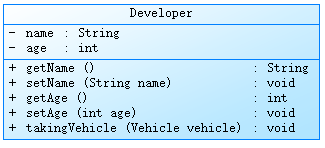

### 关键字：static

如果想让一个成员变量被类的所有实例所共享，就用static修饰即可，称为类变量（类属性）

- 使用范围
  - 在Java类中，可用static修饰属性、方法、代码块、内部类
- 被修饰后成员特点：
  - 随着类的加载而加载
  - 优先于对象存在
  - 修饰的成员，被所有对象共享
  - 访问权限允许，可以不创建对象，直接被类调用

#### 静态变量

**静态变量特点：**

- 静态变量默认值规则和实例变量一样
- 静态变量值是所有对象共享 
- 静态变量在本类中，可以在任意方法、代码块、构造器中直接使用
  - 如果权限修饰符允许，在其他类中可以通过 `类名.静态变量` 直接访问，也可以通过对象调用
- 静态变量的get/set方法也是静态的，当局部变量与静态变量同名时，使用 `类名.静态变量` 区分

```java
public class Person {
    private String name;
    static String nation;
    public Person(){}
    public Person(String name) {
        this.name = name;
    }
    @Override
    public String toString() {
        return "Person{" +
                "name='" + name + '\'' +
                '}';
    }
}
```

```java
public class PersonTest {
    public static void main(String[] args) {
        Person.nation = "US";
        System.out.println(Person.nation);
    }
}
```

#### 静态方法

**静态方法特点：**

- 静态方法在本类的任意方法、代码块、构造器中都可以直接被调用
- 只要权限修饰符允许，静态方法在其他类中可以通过 `类名.静态方法` 的方式调用。也可以通过对象调用。
- static方法内部只能访问类的static修饰的属性或方法，不能访问类的非static的属性和方法
- 静态方法可以被子类继承，但不能被重写
- 静态方法的调用都只看编译时类型
- 因为不需要实例就可以访问static方法，所以static方法内部不能使用当前类对象this，也不能有super，如果有重名，使用 `类名.` 区别

```java
public class Person {
    private String name;
    private static String nation;
    public static String getNation() {
        return nation;
    }
    public static void setNation(String nation) {
        Person.nation = nation;
    }
    public Person() {}
    public Person(String name) {
        this.name = name;
    }
    @Override
    public String toString() {
        return "Person{" +
                "name='" + name + '\'' +
                '}';
    }
}
```

```java
public class PersonTest {
    public static void main(String[] args) {
        Person.setNation("America") ;
        System.out.println(Person.getNation()); //America
        Student.setNation("Hongkong");
        System.out.println(Student.getNation());    //Hongkong
    }
}
class Student extends Person{	//static属性可以被继承
}
```

#### 练习

**笔试题：程序执行会不会报错？**

```java
public class StaticInterviewQuestion {
    public static void main(String[] args) {
        Demo d = null;
        d.hello();  
    }
}
class Demo{
    public static void hello(){
        System.out.println("hello!");
    }
}
```

**编写一个类实现银行账户的概念，包含的属性有“帐号”、“密码”、“存款余额”、“利率”、“最小余额”，定义封装这些属性的方法。`账号要自动生成。`**

```java
public class Account {
    private double balance;
    private int id;
    private static double annuallnterestRate;  //年利率
    private static double minBalance;
    private String password;
    private static int idInit=1000;
    public Account(){
        this.id = idInit++;
    }
    public Account(double balance, String password) {
        this();
        this.balance = balance;
        this.password = password;
    }
    public double getBalance() {
        return balance;
    }
    public void setBalance(double balance) {
        this.balance = balance;
    }
    public int getId() {
        return id;
    }
    public void setId(int id) {
        this.id = id;
    }
    public static double getAnnuallnterestRate() {
        return annuallnterestRate;
    }
    public static void setAnnuallnterestRate(double annuallnterestRate) {
        Account.annuallnterestRate = annuallnterestRate;
    }
    public static double getMinBalance() {
        return minBalance;
    }
    public static void setMinBalance(double minBalance) {
        Account.minBalance = minBalance;
    }
    public String getPassword() {
        return password;
    }
    public void setPassword(String password) {
        this.password = password;
    }
    public String getInfo(){
        return "id:"+getId()+" 余额："+getBalance()+" 年利率："+getAnnuallnterestRate()+" 密码："+getPassword();
    }
}
```

```java
public class AccountTest {
    public static void main(String[] args) {
        Account.setAnnuallnterestRate(0.012);
        Account.setMinBalance(10);
        Account ac1 = new Account(2000,"123456");
        Account ac2 = new Account(3000,"123456");
        Account ac3 = new Account(4000,"123456");
        System.out.println(ac1.getInfo()); //id:1000 余额：2000.0 年利率：0.012 密码：123456
        System.out.println(ac2.getInfo()); //id:1001 余额：3000.0 年利率：0.012 密码：123456
        System.out.println(ac3.getInfo()); //id:1002 余额：4000.0 年利率：0.012 密码：123456
    }
}
```

### 单例设计模式（Singleton）

类的单例设计模式，就是采取一定的方法保证整个软件系统中，对某个类只能存在一个对象实例，并且该类只提供一个取得其对象实例方法。

**实现思路**

- 将类的构造器访问权限设置为private，这样，就不能用new操作法在类的外部产生类的对象，但在类的内部仍可以产生该类对象
- 类内部创建静态方法以返回类内部创建的对象，静态方法只能访问类中的静态成员变量，所以，指向类内部产生的该类对象的变量也必须定义为静态的

**饿汉式**

```java
public class HungrySingleton {
    private static HungrySingleton singleton = new HungrySingleton();
    private HungrySingleton(){}
    public static HungrySingleton getInstance() {
        return singleton;
    }
}
class HungrySingletonTest{
    public static void main(String[] args) {
        HungrySingleton s1 = HungrySingleton.getInstance();
        HungrySingleton s2 = HungrySingleton.getInstance();
        System.out.println(s1 == s2);   //true
    }
}
```

**懒汉式**

```java
public class LazySingleton {
    private static LazySingleton lazySingleton;
    private LazySingleton() {}
    public static LazySingleton getInstance(){
        if(lazySingleton==null){
            lazySingleton = new LazySingleton();
        }
        return lazySingleton;
    }
}
class LazySingletonTest{
    public static void main(String[] args) {
        LazySingleton lz1 = LazySingleton.getInstance();
        LazySingleton lz2 = LazySingleton.getInstance();
        System.out.println(lz2 == lz1);
    }
}
```

**饿汉式**

- 特点：立即加载，即在使用类的时候已经将对象创建完毕
- 优点：实现起来简单；没有多线程安全问题
- 缺点：当类被加载时候，会初始化static实例，静态变量被创建分配内存空间，从这以后，这个static的实例一直占着这块内存，知道类被卸载时，静态变量被摧毁，并释放所占有空间。因此在某些特定条件下辉耗费内存

**懒汉式**

- 特点：延迟加载，即在调用静态方法时实例才被创建
- 优点：实现比较简单；当类被加载的时候，static的实例未被创建并分配内存空间，当静态方法第一次被调用时，初始化实例变量，并分配内存，因此在某些特定条件下会节约内存
- 缺点：在多线程环境中，这种实现方法是完全错误的，线程不安全，根本不能保证单例的唯一性

#### 单例模式优点

由于单例模式只生成一个实例，减少了系统性能开销，当一个对象产生需要比较多的资源时，如读取配置、产生其他依赖对象时，则可以通过在应用启动时直接产生一个单例对象，然后永久驻留内存的方式解决。

**应用场景**

- Windows的Task Manager (任务管理器)就是很典型的单例模式

- Windows的Recycle Bin (回收站)也是典型的单例应用。在整个系统运行过程中，回收站一直维护着仅有的一个实例。

- Application 也是单例的典型应用

- 应用程序的日志应用，一般都使用单例模式实现，这一般是由于共享的日志文件一直处于打开状态，因为只

  能有一个实例去操作，否则内容不好追加。

- 数据库连接池的设计一般也是采用单例模式，因为数据库连接是一种数据库资源。

### 理解main()方法的语法

由于JVM需要调用类的main()方法，所以该方法的访问权限必须是public，又因为JVM在执行main()方法时不必须创建对象，所以该方法必须是static的，该方法接收一个String类型的数组参数，该数组中保持秩序Java命令时传递给运行数组的类的参数

```java
public class CommandPara {
    public static void main(String[] args) {
        for (int i = 0; i < args.length; i++) {
            System.out.println(args[i]);
        }
    }
}
```

```shell
canvs@CanvsdeiMac-Pro Desktop % java CommandPara "Tom" "Jack" "Canvs"
```

```java
public class Hello {
    public static void main(String[] args) {
        Test.main(new String[]{"Tom","Jack","Jerry"});
    }
}
class Test{
    public static void main(String[] args) {
        for (int i = 0; i < args.length; i++) {
            System.out.println(args[i]);
        }
    }
}
```

### 类的成员：代码块

如果成员变量想要初始化的值不是一个硬编码的常量值，而是需要通过复杂的计算或读取文件、或读取运行环境信息等方式才能获取的一些值，可以考虑代码块（或初始化块）

- 一个类中代码块若有修饰符，则只能是static修饰，称为静态代码块(static block)
- 没有使用static修饰的，为非静态代码块

#### 静态代码块

**静态代码块特点**

- 可以有输出语句
- 可以对类的属性、类的声明进行初始化操作
- 不可以对非静态的属性初始化。即：不可以调用非静态的属性和方法
- 若有多个代码块，那么按照从上到下的顺序依次执行
- 静态代码块执行要先于非静态代码块
- 静态代码块随着类的加载而加载，且只执行一次

```java
public class Person {
    private static String name;
    private static int age;
    public Person() {
    }
    static {	//静态方法块
        Person.name = "Canvs";
        Person.age = 20;
    }
    public static String getName() {
        return name;
    }
    public static int getAge() {
        return age;
    }
}
```

```java
public class PersonTest {
    public static void main(String[] args) {
        System.out.println("name="+Person.getName()+" age="+Person.getAge()); 
    }
}
```

#### 非静态代码块

- 和构造器一样，也是用于实例变量的初始化操作
- 如果多个重载的构造器有公共代码，并且这些代码都是先于构造器其他代码执行的，那么可以将这部分代码抽取到非静态代码块，减少冗余

**非静态代码块特点**

- 可以有输出语句
- 可以对类的属性、类的声明进行初始化操作
- 除了调用非静态的结构外，还可以调用静态的变量和方法
- 有多个非静态代码块，那么按照从上到下顺序依次执行
- 每次创建对象的时候，都会执行一次。且先于构造器执行

**例子**

- User类
  - 包含属性：username（String类型），password（String类型），registrationTime（long类型），私有化
  - 包含get/set方法，其中registrationTime没有set方法
  - 包含无参构造
  - 包含有参构造(String username, String password)
  - 包含public String getInfo()方法，返回：“用户名：xx，密码：xx，注册时间：xx”

```java
public class User {
    private String username;
    private String password;
    private long registrationTime;
    public User() {
        this.username = registrationTime+"";
        this.password = "123456";
    }
    {
        this.registrationTime = System.currentTimeMillis();
    }
    public User(String username, String password) {
        this();
        this.username = username;
        this.password = password;
    }
    public String getInfo() {
        return "username:" + username + " password:" + password + " registrationTime:" + registrationTime;
    }
    public String getUsername() {
        return username;
    }
    public void setUsernam(String username) {
        this.username = username;
    }
    public String getPassword() {
        return password;
    }
    public void setPassword(String password) {
        this.password = password;
    }
    public long getRegistrationTime() {
        return registrationTime;
    }

}
```

```java
public class UserTest {
    public static void main(String[] args) {
        User u1 = new User();
        User u2 = new User("Canvs", "xjp@fuck");
        System.out.println(u1.getInfo());
        System.out.println(u2.getInfo());
    }
}
```

#### 实例变量赋值顺序


### final关键字

final：最终的，不可更改的

#### final修饰类

表示这个类不能被继承，没有子类。提高安全性，提高程序的可读性。如：String类、System类、StringBuffer类


```java
final class Eunuch{}
```

#### final修饰方法

表示这个方法不能被子类重写

```java
class Father{
	public final void method(){}
}
```

#### final修饰变量

final修饰某个变量（成员变量或局部变量），一旦赋值，它就不能被修改，即常量，常量命名建议使用大写字母

**修饰成员变量**

```java
public final class FinalTest {
    public static int totalNumber=5;
    public final int ID;
    public FinalTest(){
        ID = ++totalNumber;
    }
    public static void main(String[] args) {
        FinalTest ft = new FinalTest();
        System.out.println(ft.ID);
    }
}
```

**修饰局部变量**

```java
public class FinalTest2 {
    public static void main(String[] args) {
        final int MIN_SCORE;
        MIN_SCORE = 0;
        final int MAX_SCORE=100;
    }
}
```

### 抽象类与抽象方法（abstract）

随着继承层次中一个个新子类定义，类变得越来越具体，而父类则更通用。类的设计应该保证父类和子类能够共享特征。有时将父类设计的非常抽象，以至于它没有具体的实例，这样的类被称为抽象类。

父类声明一个方法但不提供实现，该方法的实现由子类提供，这样的方法称为抽象方法。有一个或更多的抽象方法的类称为抽象类。

#### 语法格式

- 抽象类：被abstract修饰的类
- 抽象方法：被abstract修饰没有方法体的方法

```java
public abstract class Animal {
    public abstract void eat();
}
```

```java
public class Dog extends Animal{
    @Override
    public void eat() {
        System.out.println("狗在吭骨头");
    }
}
```

此时的方法重写，是子类对父类抽象方法的实现，也称实现方法

#### 使用说明

- 抽象类不能创建对象，如果创建，编译无法通过而报错。只能创建非抽象子类的对象
  - 假设创建了抽象类的对象，通过对象调用抽象方法，而抽象方法没有具体方法体，没有意义。
  - 抽象类是用类被继承的。
- 抽象类中，也有构造器，是提供子类创建对象时，初始化父类成员变量使用的
  - 子类的构造器中，有默认super()或手动的super(实参列表)，需要访问父类构造器
- 抽象类中，不一定包含抽象方法，但有抽象方法的类必定是抽象类
  - 为包含抽象方法的抽象类，目的就是不让调用者创建该类对象，通常用于某些特殊的类结构设计。
- 抽象类的子类，必须重写抽象父类中的所有抽象方法，否则编译无法通过而报错，除非该子类也是抽象类。
  - 假设不重写抽象类的所有抽象方法，则类中可能包含抽象方法。那么创建对象后，调用抽象方法，没有意义。

#### 注意事项

- 不能用abstract修饰变量、代码块、构造器；
- 不能用abstract修饰私有方法、静态方法、final的方法、final的类。

**例子：**

在航运公司系统中，Vehicle类需要定义两个方法分别`计算运输工具的燃料效率`和`行驶距离`。

**问题：**卡车(Truck)和驳船(RiverBarge)的燃料效率和行驶距离的计算方法完全不同。Vehicle类不能提供计算方法，但子类可以。

```java
public abstract class Vehicle {
    public abstract double calcFuelEfficiency();
    public abstract double calcTripDistance();
}
public class Truck extends Vehicle{
    @Override
    public double calcFuelEfficiency() {
        return 0;
    }
    @Override
    public double calcTripDistance() {
        return 0;
    }
}
public class RiverBarge extends Vehicle{
    @Override
    public double calcFuelEfficiency() {
        return 0;
    }
    @Override
    public double calcTripDistance() {
        return 0;
    }
}
```

### 模版方法设计模式(TemplateMethod)

抽象类体现的就是一种模版模式的设计，抽象类作为多个子类的通用模版，子类在抽象类的基础上进行扩展、改造，但子类总体上辉保留类的行为方法。

#### 设计思路

- 当功能内部一部分实现是正确的，另一部分实现是不正确的。这时就可以把不确定的部分暴露出去，让子类去实现。
- 换而言之，在软件开发中实现一个算法时，整体步骤很固定、通用，这些步骤已经在父类中写好了。但是某些部分易改，易变的部分可以抽象出来，供不同子类实现。这就是一种模版模式。

**例子：**

```java
public abstract class Template {
    public final void getTime() {
        long start = System.currentTimeMillis();
        code();
        long end = System.currentTimeMillis();
        System.out.println("执行的时间：" + (end - start) + "ms");
    }
    public abstract void code();
}
public class SubTemplate extends Template{
    @Override
    public void code() {
        for (int i = 0; i < 10000; i++) {
            System.out.println(i);
        }
    }
}
public class SubTemplateTest {
    public static void main(String[] args) {
        SubTemplate sub = new SubTemplate();
        sub.code();
        sub.getTime();
    }
}
```

模版方法设计模式是编程中经常用得到的模式。各个框架、类库中都有它的影子，常见的有：

- 数据库访问的封装
- Junit单元测试
- JavaWeb的Servlet中关于doGet/doPost方法调用
- Hibernate中模版程序
- Spring中JDBCTemlate、HibernateTemplate等

#### 练习

工资统计系统设计

```
public abstract class Employee {
    private String name;
    private int number;
    private MyDate birthday;
    public abstract double earnings();
    public String toString(){
        return "姓名:"+getName()+" number:"+getNumber()+" birthday:"+getBirthday().toDateString();
    }
    public Employee() {
    }
    public Employee(String name, int number, MyDate birthday) {
        this.name = name;
        this.number = number;
        this.birthday = birthday;
    }
    public String getName() {
        return name;
    }
    public void setName(String name) {
        this.name = name;
    }
    public int getNumber() {
        return number;
    }
    public void setNumber(int number) {
        this.number = number;
    }
    public MyDate getBirthday() {
        return birthday;
    }
    public void setBirthday(MyDate birthday) {
        this.birthday = birthday;
    }
}
```

```java
public class HourlyEmployee extends Employee{
    private double wage;
    private double hour;
    public HourlyEmployee() {
    }
    public HourlyEmployee(String name, int number, MyDate birthday, double wage, double hour) {
        super(name, number, birthday);
        this.wage = wage;
        this.hour = hour;
    }
    @Override
    public double earnings() {
        return wage*hour;
    }
    public String toString(){
        return super.toString()+" 工资:"+earnings();
    }
}
```

```java
public class SalariedEmployee extends Employee{
    private double monthlySalary;
    @Override
    public double earnings() {
        return monthlySalary;
    }
    public SalariedEmployee() {
    }
    public SalariedEmployee(String name, int number, MyDate birthday, double monthlySalary) {
        super(name, number, birthday);
        this.monthlySalary = monthlySalary;
    }
    public String toString(){
        return super.toString()+" 工资:"+earnings();
    }
}
```

```java
public class SalariedEmployee extends Employee{
    private double monthlySalary;
    @Override
    public double earnings() {
        return monthlySalary;
    }
    public SalariedEmployee() {
    }
    public SalariedEmployee(String name, int number, MyDate birthday, double monthlySalary) {
        super(name, number, birthday);
        this.monthlySalary = monthlySalary;
    }
    public String toString(){
        return super.toString()+" 工资:"+earnings();
    }
}
```

### 接口(interface)

接口就是规范，定义的是一组规则，体现了世界中“如果你是/要...则必须能...”的思想。继承是一个"是不是"的is-a关系,而接口是“能不能”的has-a关系。

> 引用数据类型：数组，类，枚举，接口，注解

#### 接口声明格式

```java
[修饰符] interface 接口名{}
```

```java
public interface USB {
    void start();
    void stop();
}
```

#### 接口的成员

**JDK8.0之前**

- 公共的静态的常量：其中public static final可以省略
- 公共的抽象的方法：其中public abstract可以省略

**JDK8.0时** ，接口中允许声明默认方法和静态方法：

- 公共的默认方法：其中public可以省略，建议保留，但是default不能省略
- 公共的静态方法：其中public可以省略，建议保留，但是static不能省略

**JDK9.0时**，接口又增加私有方法

> 接口是从多个相似类中抽象出来的规范，不需要提供具体实现；接口中没有构造器，没有初始化块，因为接口中没有成员变量需要初始化

### 接口的使用规则

#### 类实现接口(implements)

接口**不能创建对象**，但是可以被类实现（类似于被继承）

类与接口的关系为实现关系，即**类实现接口**，改类可以称为接口的实现类。实现的动作类似继承，格式相仿，只是关键字不同，实现使用implements关键字。

```java
[修饰符] class 实现类 implements 接口{}
```

- 如果接口的实现类是非抽象类，那么必须重写接口中所有抽象方法
- 默认方法可以选择保留，也可以重写。
- 接口中的静态方法不能被继承也不能被重写

> 重写时，default单词就不要再写，他只用于在接口中表示默认方法，在类中就没有默认方法的概念了

```java
public class Computer{
    public static void useFlashDrive(USB usb){
        usb.start();
        System.out.println("USB设备工作中...");
        usb.stop();
    }
}
class ComputerTest{
    public static void main(String[] args) {
        Computer.useFlashDrive(new FlashDrive());
        Computer.useFlashDrive(new Print());
        Computer.useFlashDrive(new USB(){
            @Override
            public void start() {
                System.out.println("移动优盘开始工作");
            }
            public void stop(){
                System.out.println("移动优盘停止工作");
            }
        });
    }
}
```

```java
public interface USB {
    void start();
    void stop();
}
```

```java
public class FlashDrive implements USB{
    @Override
    public void start() {
        System.out.println("U盘开始工作");
    }
    @Override
    public void stop() {
        System.out.println("U盘弹出");
    }
}
```

```java
public class Print implements USB{
    @Override
    public void start() {
        System.out.println("打印机开始工作");
    }
    @Override
    public void stop() {
        System.out.println("打印机停止工作");
    }
}
```

#### 接口的多实现

在继承体系中，一个类只能继承一个父类。而对于接口而言，一个类是可以实现多个接口的。这叫做接口的多实现。且一个类能继承一个父类，同时实现多个接口。

```java
[修饰符] class 实现类 implements 接口名,接口名{}
[修饰符] class 实现类 extends 父类 implements 接口名,接口名{}
```

> 接口中，有多个抽象方法时，实现类必须重写所有抽象方法。如果抽象方法有重名的，只需要重写一次

**接口**

```java
public  interface Animal {
    void eat();
}
class AnimalTest{
    public static void main(String[] args) {
        Dog dog = new Dog();
        dog.eat();  //狗吭骨头
        dog.breathe();  //小狗呼吸新鲜空气
    }
}
```

```java
public interface Biological {
    void breathe();
}
```

**接口实现类**

```java
public class Dog  implements Animal,Biological{
    @Override
    public void eat() {
        System.out.println("狗吭骨头");
    }
    @Override
    public void breathe() {
        System.out.println("小狗呼吸新鲜空气");
    }
}
```

#### 接口的多继承(extends)

一个接口能继承另一个或者多个接口，接口的继承也使用extends关键字，子接口继承父接口的方法。

**父接口**

```java
public interface USB3{
    long MAX_SPEED = 500*1024*1024;
    void in();
    void out();
    static void show(){
        System.out.println("USB3.0快速传输");
    }
    default void method(){
        System.out.println("USB3默认方法");
    }
}
```

```java
public interface Chargeable {
    void charge();
    void in();
    void out();
}
```

**子接口**

```java
public interface USBC extends Chargeable,USB3{
    void reverse();
}
```

**子接口实现类**

```java
public class TypeCConverter implements USBC{
    @Override
    public void charge() {
        System.out.println("可充电");
    }
    @Override
    public void in() {
        System.out.println("接收数据");
    }
    @Override
    public void out() {
        System.out.println("输出数据");
    }
    @Override
    public void reverse() {
        System.out.println("正反面都支持");
    }
}
```

> 所有父接口的抽象方法都有重写
>
> 方法签名相同的抽象方法只需要实现一次

#### 接口实现类对象构成多态引用

实现类实现接口，类似于子类继承父类，因此，接口类型的变量与实现类的对象之间，也可以构成多态引用。通过接口类型的变量调用方法，最终执行的是new的实现类对象的方法体。

```java
public class PeripheralTest {
    public static void main(String[] args) {
      Computer.useUSB(new Mouse());
      Computer.useUSB(new Keyword());
    }
}
class Computer{
    public static void useUSB(USB3 usb){
        usb.in();
        usb.out();
    }
}
class Mouse implements USB3{
    @Override
    public void in() {
        System.out.println("鼠标接收信号");
    }
    @Override
    public void out() {
        System.out.println("鼠标不接收信号");
    }
}
class Keyword implements USB3{
    @Override
    public void in() {
        System.out.println("键盘接收信号");
    }
    @Override
    public void out() {
        System.out.println("键盘不接收信号");
    }
}
```

#### 使用接口的静态成员

接口不能直接创建对象，但是可以通过接口名直接调用接口的静态方法和静态常量。

```java
public class USB3Test {
    public static void main(String[] args) {
        USB3.show();    //USB3.0快速传输
        System.out.println(USB3.MAX_SPEED); //524288000
    }
}
```

#### 使用接口的非静态方法

- 对于接口的静态方法，直接使用接口名直接调用；不能通过实现类对象进行调用
- 对于接口的抽象方法、默认方法，只能通过实现类对象调用；接口不能直接创建对象，只能创建实现类的对象

```java
public class MobileHDD implements USB3{
    @Override
    public void in() {}
    @Override
    public void out() { }
}
class MobileHDDTest{
    public static void main(String[] args) {
        MobileHDD hdd = new MobileHDD();
        hdd.method();   //USB3默认方法
    }
}
```

#### 默认方法冲突问题（JDK8）

**类优先原则**

当一个类，既继承一个父类，有实现若干个接口时，父类中的成员方法与接口中的抽象方法重名，子类就近选择执行父类的成员方法。

#### 接口与抽象类的对比

|     区别     |                  抽象类                  |                 接口                 |
| :----------: | :--------------------------------------: | :----------------------------------: |
|     定义     |           可以包含抽象方法的类           |    主要是抽象方法和全局常量的集合    |
|     组成     | 构造方法、抽象方法、普通方法、常量、变量 |  常量、抽象方法、默认方法、静态方法  |
|     使用     |        子类继承抽象类（extends）         |      子类实现接口（implement）       |
|     关系     |          抽象类可以实现多个接口          | 接口不能继承抽象类，允许继承多个接口 |
| 常见设计模式 |                 模版方法                 |     简单工厂、工厂方法、代理模式     |
|     对象     |     通过对象类的多态性产生实例化对象     |   通过对象类的多态性产生实例化对象   |
|     局限     |           抽象类有单继承局限性           |            接口没有此局限            |
|     实际     |               作为一个模版               |     作为一个标准或是表示一种能力     |

> 如果抽象类和接口都可以使用的条件下，优先使用接口，因为避免单继承的局限性。
>
> 在开发中，常看到一个类不是继承了已经实现好的类，而是要么继承抽象类，要么实现接口。

#### 练习1

- 定义一个接口用来实现两个对象的比较。

- 定义一个Circle类，声明redius属性，提供getter和setter方法

- 定义一个ComparableCircle类，继承Circle类并且实现CompareObject接口。在ComparableCircle类中给出接口中方法compareTo的实现体，用来比较两个圆的半径大小。

- 定义一个测试类InterfaceTest，创建两个ComparableCircle对象，调用compareTo方法比较两个类的半径大小。

**接口类**

```java
public interface CompareObject {
    public int compareTo(Object o);
}
```

**父类**

```java
public class Circle {
    private double redius;
    public Circle() {}
    public Circle(double redius) {
        this.redius = redius;
    }
    public double getRedius() {
        return redius;
    }
    public void setRedius(double redius) {
        this.redius = redius;
    }
}
```

**子类实现类**

```java
public class ComparableCircle extends Circle implements CompareObject{
    public ComparableCircle(double redius) {
        super(redius);
    }
    @Override
    public int compareTo(Object o) {
        if(this == o){
            return 0;
        }
        if(o instanceof ComparableCircle){
            ComparableCircle c = (ComparableCircle) o;
            return Double.compare(c.getRedius(),this.getRedius());
        }
        throw new RuntimeException("输入有误！");
    }
}
```

**测试类**

```java
public class InterfaceTest {
    public static void main(String[] args) {
        CompareObject c1 = new ComparableCircle(2.9);
        CompareObject c2 = new ComparableCircle(2.9);
        System.out.println(c1.compareTo(c2));
    }
}
```

- 思考：参照上述做法定义矩形类Rectangle和ComparableRectangle类，在ComparableRectangle类中给出compareTo方法的实现，比较两个矩形的面积大小。

```java
public interface CompareObject {
    int compareTo(Object o);
}
```

```java
public abstract class Rectangle {
    private double length;
    private double high;
    public Rectangle(double length, double high) {
        this.length = length;
        this.high = high;
    }
    public abstract double findArea();
    public Rectangle() {}
    public double getLength() {
        return length;
    }
    public void setLength(double length) {
        this.length = length;
    }
    public double getHigh() {
        return high;
    }
    public void setHigh(double high) {
        this.high = high;
    }
}
```

```java
public class ComparableRectangle extends Rectangle implements CompareObject {
    public ComparableRectangle() {}
    public ComparableRectangle(double length, double high) {
        super(length, high);
    }
    @Override
    public int compareTo(Object o) {
        if(this == o) {
            return 1;
        }
        if(o instanceof ComparableRectangle){
            ComparableRectangle c = (ComparableRectangle) o;
            if (c.findArea() > this.findArea()){
                return 1;
            }else if(c.findArea() < this.findArea()){
                return -1;
            }else {
                return 0;
            }
        }
        throw new RuntimeException("输入有误！");
    }
    @Override
    public double findArea() {
        return this.getLength() * this.getHigh();
    }
}
```

```java
public class InterfaceTest {
    public static void main(String[] args) {
        CompareObject r1 = new ComparableRectangle(2.3,5);
        CompareObject r2 = new ComparableRectangle(2.3,5);
        System.out.println(r1.compareTo(r2));
    }
}
```

#### 练习2

交通工具案例



其中，有一个乘坐交通工具的方法takingVehicle()，在此方法中调用交通工具的run()。为了出行方便，他买了一辆捷安特自行车、一辆雅迪电动车和一辆奔驰轿车。这里涉及到的相关类及接口关系如下：


其中，电动车增加动力的方式是充电，轿车增加动力的方式是加油。在具体交通工具的run()中调用其所在类的相关属性信息。

请编写相关代码，并测试。

提示：创建Vehicle[]数组，保存阿里工程师的三辆交通工具，并分别在工程师的takingVehicle()中调用。

```java
public class Developer {
    private String name;
    private int age;
    public Developer(String name, int age) {
        this.name = name;
        this.age = age;
    }
    public void takingVehicle(Vehicle vehicle){
        vehicle.run();
    }
    public Developer() {
    }
    public String getName() {
        return name;
    }
    public void setName(String name) {
        this.name = name;
    }
    public int getAge() {
        return age;
    }
    public void setAge(int age) {
        this.age = age;
    }
}
```

```java
public abstract class Vehicle {
    private String brand;
    private String color;
    public abstract void run();
    public String getBrand() {
        return brand;
    }
    public void setBrand(String brand) {
        this.brand = brand;
    }
    public String getColor() {
        return color;
    }
    public void setColor(String color) {
        this.color = color;
    }
    public Vehicle() {
    }
    public Vehicle(String brand, String color) {
        this.brand = brand;
        this.color = color;
    }
}
```

```java
public interface IPower {
    void power();
}
```

```java
public class Bycicle extends Vehicle{
    public Bycicle() { }
    public Bycicle(String brand, String color) {
        super(brand, color);
    }
    @Override
    public void run() {
        System.out.println("行车通过人力脚蹬行驶");
    }
}
```

```java
public class ElectricVehicle extends Vehicle implements IPower{
    public ElectricVehicle(String brand, String color) {
        super(brand, color);
    }
    @Override
    public void run() {
        System.out.println("电动车通过点来行驶");
    }
    public ElectricVehicle() {
    }
    @Override
    public void power() {
        System.out.println("电动车通过电机来增加动力");
    }
}
```

```java
public class Car extends Vehicle implements IPower{
    private String carNumer;
    public String getCarNumer() {
        return carNumer;
    }
    public Car() {}
    public Car(String brand, String color, String carNumer) {
        super(brand, color);
        this.carNumer = carNumer;
    }
    public void setCarNumer(String carNumer) {
        this.carNumer = carNumer;
    }
    @Override
    public void power() {
        System.out.println("汽车通过汽油增加动力");
    }
    @Override
    public void run() {
        System.out.println("汽车通过发动机行驶");
    }
}
```

```java
public class VehicleTest {
    public static void main(String[] args) {
        Developer dev = new Developer("Canvs",22);
        Vehicle[] vehicles = new Vehicle[3];
        vehicles[0] = new Bycicle("捷安特","red");
        vehicles[1] = new ElectricVehicle("雅迪","blue");
        vehicles[2] = new Car("迈巴赫","黑色","沪A8888");
        for (int i = 0; i < vehicles.length; i++) {
            dev.takingVehicle(vehicles[i]);
            if(vehicles[i] instanceof IPower){
                ((IPower) vehicles[i]).power();
            }
        }
    }
}
```

### 内部内(InnerClass)

#### 什么是内部类

将一个类A定义在另一个类B里面，里面的那个A类就称为内部类InnerClasss，类B则称为外部类OuterClass

#### 为什么需要内部类

具体来说，当一个类B的内部，还有一部分需要一个完整的结构A进行描述，而这个内部的完整结构A又只为外部A提供服务，不在其他地方单独使用，那么整个内部的完整结构A最好使用内部类。遵循高内聚、低耦合的面向对象开发原则。

#### 内部类的分类

- 成员内部类
  - 静态成员内部类
  - 非静态成员内部类
- 局部内部类
  - 匿名局部内部类
  - 非匿名局部内部类

#### 成员内部类

如果成员内部类中只使用外部类的静态成员，那么通常将内部类声明为静态内部类，否则声明为非静态内部类。

**语法格式：**

```java
[修饰符] class 外部类{
    [其他修饰符] [static] class 内部类{
    }
}
```

**成员内部类的特征：**

- 成员内部类作为类的成员角色：
  - 和外部类不同，Inner class还可以声明为private或protected；
  - 可以调用外部类的结构，（在静态内部类中不能使用外部类的非静态成员）
  - Inner class可以声明为static的，但此时就不能再使用外层类的非static的成员变量
- 成员内部类作为类的角色：
  - 可以在内部类定义属性、方法、构造器等结构
  - 可以继承自己想要继承的父类，实现自己想要实现的父接口，和外部类的父类和父接口无关
  - 可以声明为abstract类，因此可以被其他内部类继承
  - 可以声明为final的，表示不能被继承
  - 编译以后生成OuterClass$InnerClass.class字节码文件

> 外部类访问成员内部类的成员，需要`内部类.成员` 或 `内部类对象.成员`的方式
>
> 成员内部类可以直接使用外部的所有成员，包括私有的属性
>
> 当想要在外部类的静态成员部分使用内部类时，可以考虑内部类的声明为静态的。

```java
public class Outer {
    private static String a = "外部类静态属性a";
    private static String b = "外部类非静态属性b";
    private String c = "外部类的非静态属性c";
    static class StaticInner{
        private static String a ="静态内部类的静态属性a";
        private String c = "静态内部类的非静态属性b";
        public static void show(){
            System.out.println(a);
            System.out.println(Outer.a);
            System.out.println(b);
        }
        public void show1(){
            System.out.println(a);
            System.out.println(this.c);
//            System.out.println(Outer.c); //静态内部类不能访问外部类的非静态成员
        }
    }
    class NoStaticInner{
        private String a = "内部类非静态属性a";
        private String c = "内部类非静态属性c";
        public void show(){
            System.out.println(a);
            System.out.println(c);
            System.out.println(Outer.a);
            System.out.println(Outer.this.c);   //调用外部类的非静态成员
            System.out.println(Outer.this.getClass());
        }
    }
    public NoStaticInner getInstance(){
        return new NoStaticInner();
    }
}
class OuterTest{
    public static void main(String[] args) {
        Outer.StaticInner inner = new Outer.StaticInner();
        Outer outer = new Outer();
        //通过方法获取非静态内部类的实例对象
        Outer.NoStaticInner inner1 = outer.getInstance();
        inner1.show();
        //通过外部类对象对非静态内部类实例化
        Outer.NoStaticInner inner2 = outer.new NoStaticInner();
        inner2.show();
    }
}
```

### 局部内部类

#### 非匿名局部内部类

```java
[修饰符] class 外部类{
    [修饰符] 返回值类型  方法名(形参列表){
            [final/abstract] class 内部类{
    	}
    }    
}
```

- 编译后有自己的独立字节码文件，只不过在内部类名前面冠以外部类名、$符号、编号；这里有编号是因为同一个外部类中，不同的方法中存在相同名称的局部内部类。
- 和成员内部类不同的是，它前面不能有权限修饰符等
- 局部内部类如同局部变量一样，有作用域
- 局部内部类中是否能访问外部类的非静态的成员，取决于所在的方法

```java
public class Outer1 {
    public static void method(){
        System.out.println("外部类static方法");
        class Inner {
            final String c = "局部变量c";
            public void inMethon() {
                System.out.println("内部类的非静态方法");
                System.out.println(c);
            }
        }
        new Inner().inMethon();
    }
    public void method2(){
        class Inner{
            public void inMethod(){
                System.out.println("Inner.inMethod");
            }
        }
        new Inner().inMethod();
    }
    public static Runner getRunner(){
        class Inner implements Runner{
            @Override
            public void run() {
                System.out.println("Inner Runner.run");
            }
        }
        return new Inner();
    }
}
interface Runner{
    void run();
}
class Outer1Test{
    public static void main(String[] args) {
        Outer1.method();
        Outer1 outer = new Outer1();
        outer.method2();
        Outer1.getRunner().run();
    }
}
```

#### 匿名内部类

因为考虑到这个子类或实现类是一次性的，那么我们费尽心思给它取名字，就显得多余。可以完全使用匿名内部类的方式来实现，避免给类命名的问题。

```java
new 父类([实参列表]){
    重写方法...
}
new 父接口(){
    重写方法...
}
```

**使用匿名重写父类方法**

```java
public class Outer2 {
    public void method(){
        System.out.println("Outer2");
    }
}
class Outer2Test{
    public static void main(String[] args) {
        new Outer2(){
            @Override
            public void method() {
                System.out.println("aaaa");
            }
        }.method();	//aaaa
    }
}
```

**通过父类或父接口的变量多态引用匿名内部类的对象**

```java
public interface Outer3 {
    void method();
}
class Outer3Test{
    public static void main(String[] args) {
        Outer3 out = new Outer3(){
            @Override
            public void method() {
                System.out.println("bbbb");
            }
        };
        out.method(); //bbbb
    }
}
```

**匿名内部类的对象作为实参**

```java
public interface Outer3 {
    void method();
}
class Outer3Test{
    public static void test(Outer3 out){
        out.method();
    }
    public static void main(String[] args) {
        Outer3 out = new Outer3(){
            @Override
            public void method() {
                System.out.println("bbbb");
            }
        };
        out.method(); //bbbb
        Outer3Test.test(new Outer3() {  //CCCCC
            @Override
            public void method() {
                System.out.println("CCCCC");
            }
        });
    }
}
```

#### 面试题：

编写一个匿名内部类，他继承Object，并在匿名内部类中，声明一个方法public void test()打印hello world。

```java
public class InterviewQuestion {
    public static void main(String[] args) {
        new Object(){
            public void test(){
                System.out.println("hello world!");
            }
        }.test();
    }
}
```

### 枚举类

#### 概述

- 枚举类型本质上也是一种类，只不过是这个类的对象是有限的、固定的几个，不能让用户随意创建。

- 例如：

  - 星期：星期一 .... 星期天

  - 性别：男、女

  - 月份：1月...12月

  - 线程状态：创建、就绪、运行、阻塞、死亡

  - 支付方式：现金、微信、支付宝、银行卡、信用卡

- 若枚举只有一个对象，则可以作为一种单列模式的实现方式

- 枚举类的实现：
  - 在JDK5.0之前，需要自定义枚举类型
  - 在JDK5.0之后，Java支持enum关键字来快速定义枚举类型

#### 定义枚举类（JDK5.0之前）

- 私有化类的构造器，保证不能在类的外部创建其对象
- 在类的内部创建枚举类的实例。声明为：public static final，对外暴露这些常量对象
- 对象如果有实例变量，应该声明为private final（建议），并在构造器中初始化

```java
public class PayTest {
    public static void main(String[] args) {
        System.out.println(Pay.ALIPAY);	//Pay{PAY_NAME='ALIPAY', PAY_DESC='支付宝支付'}
    }
}
class Pay{
    private final String PAY_NAME;
    private final String PAY_DESC;

    private Pay(String PAY_NAME,String PAY_DESC) {
        this.PAY_NAME = PAY_NAME;
        this.PAY_DESC = PAY_DESC;
    }
    public static final Pay WECHAT = new Pay("WECHAT","微信支付");
    public static final Pay ALIPAY = new Pay("ALIPAY","支付宝支付");
    public static final Pay BANK_CARD = new Pay("BANK_CARD","银行卡支付");
    public static final Pay CREDIT_CARD = new Pay("CREDIT_CARD","信用卡支付");
    @Override
    public String toString() {
        return "Pay{" +
                "PAY_NAME='" + PAY_NAME + '\'' +
                ", PAY_DESC='" + PAY_DESC + '\'' +
                '}';
    }
}
```

#### 定义枚举类（JDK5.0之后）

```java
【修饰符】 enum 枚举类名{
    常量对象列表
}
【修饰符】 enum 枚举类名{
    常量对象列表;
    对象的实例变量列表;
}
```

```java
public enum Week {
    MONDAY,TUESDAY,WEDNESDAY,THURSDAY,FRIDAY,SATURDAY,SUNDAY;
}
class WeekTest{
    public static void main(String[] args) {
        System.out.println(Week.SUNDAY);
        System.out.println(Week.valueOf("THURSDAY"));
        Week[] week = Week.values();
        for (int i = 0; i < week.length;i++) {
            System.out.println(week[i]);
        }
    }
}
```

**enum方式定义的要求：**

- 枚举类的常量对象列表必须在枚举类的首行，因为是常量，所以建议大写。
- 列出的实例系统会自动添加public static final修饰。
- 如果常量对象列表后面没有其他代码，那么`;`可以省略，否则不可以省略。
- 编译器给枚举默认提供的是private的无参构造器，如果枚举类需要的是无参构造器，就不需要声明，写在常量对象名后面加(实参列表)就可以。
- 枚举类默认继承的是java.lang.Enum类，因此不能在继承其他的类型。
- JDK5.0之后switch，提供支持枚举类型，case后面可以写枚举常量名，无序添加枚举类作为限定。

```java
public enum SeasonEnum {
    SPRING("春天","春风又绿江南岸"),
    SUMMER("夏天","映日荷花别样红"),
    AUTUMN("秋天","秋水共长天一色"),
    WINTER("冬天","窗含西岭千秋雪")
    ;
    private final String SEASONNAME;
    private final String SEASONDESC;
    private SeasonEnum(String SEASONNAME, String SEASONDESC) {
        this.SEASONNAME = SEASONNAME;
        this.SEASONDESC = SEASONDESC;
    }
    public String getSEASONNAME() {
        return SEASONNAME;
    }
    public String getSEASONDESC() {
        return SEASONDESC;
    }
}
class SeasonEnumTest{
    public static void main(String[] args) {
        SeasonEnum[] season = SeasonEnum.values();
        for (int i = 0; i < season.length; i++) {
            System.out.println(season[i].name()+" "+season[i].getSEASONNAME()+" "+season[i].getSEASONDESC());
        }
    }
}
```

**枚举在switch中应用**

```java
public enum WeekEnum {
    MONDAY("星期一"),
    TUESDAY("星期二"),
    WEDNESDAY("星期三"),
    THURSDAY("星期四"),
    FRIDAY("星期五"),
    SATURDAY("星期六"),
    SUNDAY("星期天")
    ;
    private final String DESCRIPTION;
    WeekEnum(String DESCRIPTION) {
        this.DESCRIPTION = DESCRIPTION;
    }
    public String getDESCRIPTION() {
        return DESCRIPTION;
    }
}
class WeekEnumTest{
    public static void main(String[] args) {
        WeekEnum week = WeekEnum.SATURDAY;
        switch (week){
            case MONDAY:
                System.out.println(week.getDESCRIPTION()+" 怀恋周末");
                break;
            case TUESDAY:
                System.out.println(week.getDESCRIPTION()+" 进入工作状态");
                break;
            case WEDNESDAY:
                System.out.println(week.getDESCRIPTION()+" 坚持1");
                break;
            case THURSDAY:
                System.out.println(week.getDESCRIPTION()+" KFC疯狂星期四");
                break;
            case FRIDAY:
                System.out.println(week.getDESCRIPTION()+" 准备放假");
                break;
            case SATURDAY:
                System.out.println(week.getDESCRIPTION()+" 好好休息");
                break;
            case SUNDAY:
                System.out.println(week.getDESCRIPTION()+" 很烦，又要上班了");
                break;
        }
    }
}
```

> 开发中，当需要定义一组常量时，强力建议使用枚举类

#### enum中常用方法

- String toString(): 默认返回的是常量名（对象名），可以继续手动重写该方法
- static 枚举类型[] values():返回枚举类型的对象数组。该方法可以很方便地遍历所有的枚举值，是一个静态方法
- static 枚举类型 valueOf(String name)：可以把一个字符串转为对应的枚举类对象。要求字符串必须是枚举类对象的“名字”。如不是，会有运行时异常：IllegalArgumentException。
- String name():得到当前枚举常量的名称。建议优先使用toString()。
- int ordinal():返回当前枚举常量的次序号，默认从0开始

```java
class WeekEnumTest{
    public static void main(String[] args) {
        WeekEnum week = WeekEnum.SATURDAY;
        System.out.println(week.name());    //SATURDAY
        System.out.println(week.ordinal()); //5
        WeekEnum[] we = WeekEnum.values();	//数组
        System.out.println(week.toString()); //SATURDAY
    }
}
```

#### 实现接口的枚举类

- 和普通Java类一样，枚举类可以实现一个或多个接口
- 若每个枚举值在调用实现的接口方法呈现相同的行为方法，则只需要统一实现该方法即可
- 若需要每个枚举值在调用实现的接口方法呈现出不同的行为方法，则可以让每个枚举值分别来实现该方法

```java
interface Info{
    void show();
}
public enum SeasonEnum1 implements Info{
    SPRING("春天","春暖花开"){
        @Override
        public void show() {
            System.out.println("春天在哪里?");
        }
    },
    SUMMER("夏天","夏日炎炎"){
        @Override
        public void show() {
            System.out.println("宁静的夏天");
        }
    },
    AUTUMN("秋天","秋高气爽"){
        @Override
        public void show() {
            System.out.println("秋天不回来");
        }
    },
    WINTER("动天","白雪皑皑"){
        @Override
        public void show() {
            System.out.println("2002年的第一场雪");
        }
    }
    ;
    private final String SEASON_NAME;
    private final String SEASON_DESC;
    private SeasonEnum1(String SEASON_NAME, String SEASON_DESC) {
        this.SEASON_NAME = SEASON_NAME;
        this.SEASON_DESC = SEASON_DESC;
    }
    public String getSEASON_NAME() {
        return SEASON_NAME;
    }
    public String getSEASON_DESC() {
        return SEASON_DESC;
    }
}
class Enum1Test{
    public static void main(String[] args) {
        SeasonEnum1 s = SeasonEnum1.AUTUMN;
        s.show();
    }
}
```

### 注解(Annotation)

#### 什么是注解

注解（Annotation）是从`JDK5.0`开始引入，以 `@注解名`在代码中存在。

```java
@Override
@Deprecated
```

Annotation可以像修饰符一样被使用，可用于修饰包、类、构造器、方法、成员变量、局部变量的声明。注解可以在类编译、运行时进行加载，体现不同的功能。

#### 注解与注释

注解也可以看作是一种注释，通过使用Annotation，程序员可以在不改变原有逻辑的情况下，在源文件中嵌入一些补充信息。但是，注解不同于单行注释和多行注释

- 对于单行注释和多行注释是给程序员看的。
- 而注解是可以被编译器或其他程序读取的。程序还可以根据注解的不同，作出相应的处理。

#### 注解的重要性

在JavaSE中，注解的使用目的比较简单，例如标记过时的功能，忽略警告等。在JavaEE/Android中注解占据了更重要的角色，例如用来配置应用程序的任何切面，代替JavaEE旧版中遗留繁冗代码和XML配置等。

注解是一种趋势，一定程度上说：框架 = 注解 + 反射 + 设计模式

#### 常见的Annotation作用

**生成文档相关的注解**

```java
@author 标明开发该类模块的作者，多个作者之间使用,分割
@version 标明该类模块的版本
@see 参考转向，也就是相关主题
@since 从哪个版本开始增加的
@param 对方法中某参数的说明，如果没有参数就不能写
@return 对方法返回值的说明，如果方法的返回值类型是void就不能写
@exception 对方法可能抛出的异常进行说明 ，如果方法没有用throws显式抛出的异常就不能写
```

**在编译时进行格式检查**

```java
@Override: 限定重写父类方法，该注解只能用于方法
@Deprecated: 用于表示所修饰的元素(类，方法等)已过时。通常是因为所修饰的结构危险或存在更好的选择
@SuppressWarnings: 抑制编译器警告
```

**跟踪代码的依赖性，实现代替配置文件功能**

```java
@WebServlet("/login")
public class LoginServlet extends HttpServlet {
    private static final long serialVersionUID = 1L;
    
    protected void doGet(HttpServletRequest request, HttpServletResponse response) { }
    
    protected void doPost(HttpServletRequest request, HttpServletResponse response) {
        doGet(request, response);
	}  
}
```

#### 三个最基本的注解

**@Override**

- 用于检测被标记的方法有效的重写方法，如果不是，则编译报错
- 只能标记在方法上
- 它会被编译器程序读取

**@Deprecated**

- 用于表示被标记的数据已经过时，不推荐使用
- 可以用于修饰属性、方法、构造器、类、包、局部变量、参数
- 它会被编译器程序读取

**@SupperssWarnings**

- 抑制编译警告。当我们不希望看到警告信息的时候，可以使用SupperssWarnings注解来抑制警告信息
- 可以用于修饰类、属性、方法、构造器、局部变量、参数
- 它会被编译器程序读取
- 可以指定的警告类型又
  - all，抑制所有警告
  - unchecked，抑制与未检查的作业相关的警告
  - unused，抑制与未用的程式码及停用的程式码相关的警告
  - deprecation，抑制与淘汰的相关警告
  - nls，抑制与非 nls 字串文字相关的警告
  - null，抑制与空值分析相关的警告
  - rawtypes，抑制与使用 raw 类型相关的警告
  - static-access，抑制与静态存取不正确相关的警告
  - static-method，抑制与可能宣告为 static 的方法相关的警告
  - super，抑制与置换方法相关但不含 super 呼叫的警告

#### 元注解

JDK1.5在java.lang.annotation包定义了4个标准的meta-annotation类型，它们被用来提供对其它annotation类型说明

- **@Target**：用于描述注解的使用范围
  - 可以通过枚举类型ElementType的10个常量对象来指定
  - TYPE，METHOD，CONSTRUCTOR，PACKAGE.....
- **@Retention**：用于描述注解的生命周期
  - 可以通过枚举类型RetentionPolicy的3个常量对象来指定
  - SOURCE（源代码）、CLASS（字节码）、RUNTIME（运行时）
  - 唯有RUNTIME阶段才能被反射读取到
- **@Documented**：表明这个注解应该被javadoc工具记录
- **@Inherited**：允许子类继承父类中的注解

```java
package java.lang;

import java.lang.annotation.*;

@Target(ElementType.METHOD)
@Retention(RetentionPolicy.SOURCE)
public @interface Override {
}
```

```java
package java.lang;

import java.lang.annotation.*;
import static java.lang.annotation.ElementType.*;

@Target({TYPE, FIELD, METHOD, PARAMETER, CONSTRUCTOR, LOCAL_VARIABLE})
@Retention(RetentionPolicy.SOURCE)
public @interface SuppressWarnings {
    String[] value();
}
```

```java
package java.lang;

import java.lang.annotation.*;
import static java.lang.annotation.ElementType.*;

@Documented
@Retention(RetentionPolicy.RUNTIME)
@Target(value={CONSTRUCTOR, FIELD, LOCAL_VARIABLE, METHOD, PACKAGE, PARAMETER, TYPE})
public @interface Deprecated {
}
```

#### 自定义注解

**声明注解格式：**

```java
【元注解】
【修饰符】 @interface 注解名{
    【成员列表】
}
```

- 自定义注解可以通过四个元注解@Retention,@Target，@Inherited,@Documented，分别说明它的声明周期，使用位置，是否被继承，是否被生成API文档中。
- Annotation的成员在Annotation定义中以无参数有返回值的抽象方法的形式来声明，我们又称为配置参数。返回值类型只能是八种基本数据类型、String类型、Class类型、enum类型、Annotation类型、以上所有类型的数组
- 可以使用default关键字为抽象方法指定默认返回值
- 如果定义的注解含有抽象方法，那么使用时必须指定返回值，除非它有默认值。格式是`方法名 = 返回值`，如果只有一个抽象方法需要赋值，且方法名为value，可以省略`value=`，所以如果注解只有一个抽象方法成员，建议使用方法名value

#### 读取和处理自定义注解

自定义注意必须配上注解的信息处理流程才有意义。只能使用反射的代码读取，所以自定义主机的声明周期必须是RetentionPolicy.RUNTIME。

### JUnit单元测试

JUnit是由**Erich Gamma** 和 **Kent Beck** 编写的一个测试框架（regression testing framework），供Java开发人员编写单元测试使用。

JUnit测试是程序员测试，即所谓**白盒测试**，因为程序员知道被测试的软件如何完成功能和完成声明样的功能。

要使用JUnit，必须在项目的编译路径中`引入JUnit的库`，即相关的.class文件组成的jar包。jar就是一个压缩包，压缩包都是开发好的第三方（Oracle公司第一方，我们自己第二方，其他都是第三方）工具类，都是以class文件形式存在的。

#### 编写和运行@Test单元测试方法

**JUnit4版本，要求@Test标记的方法必须满足如下要求：**

- 所在的类必须是public的，非抽象的，包含唯一的无参构造器。
- @Test标记的方法本身是public，非抽象的，非静态的，void无返回值的，()无参数的

```java
public class JUnitTest {
    @Test
    public void method(){
        System.out.println("hello world");
    }
}
```

**设置执行JUnit用例支持控制台输入**

默认情况下，在单元测试方法中使用Scanner时，并不能实现控制台数据的输入。需要做如下设置

```java
idea --> Help --> Edit Custom VM Options... 在末尾添加：-Deditable.java.test.console=true
```

```java
public class JUnitTest {
    @Test
    public void method(){
        System.out.println("hello world");
        Scanner input = new Scanner(System.in);
        System.out.print("请输入姓名：");
        String name = input.next();
        hello(name);
      	input.close();
    }
    public void hello(String name){
        System.out.println("姓名："+name);
    }
}
```

### 包装类

Java提供了两个类型系统，基本数据类型与引用数据类型。使用基本数据类型在于效率，然而当要使用只针对对象设计的API或新特性（如泛型）怎么办呢？

Java针对八种基本数据类型定义了相应的引用数据类型：包装类（封装类）。有了类的特点，就可以调用类中的方法，Java才是真正的面向对象。

| 基本数据类型 |  包装类   |
| :----------: | :-------: |
|     byte     |   Byte    |
|    short     |   Short   |
|     int      |  Integer  |
|     long     |   Long    |
|    float     |   Float   |
|    double    |  Double   |
|   boolean    |  Boolean  |
|     char     | Character |

#### 包装类与基本数据类型间转换

**装箱：把基本数据类型转为包装类对象**

> 转为包装类的对象，是为了使用专门为对象设计的API和特性

```java
public void test(){
       int i1 = 28;
       double d1 = 23.2;
       float f1 = 24.3f;
       Integer i2 = i1;
       Double d2 = new Double(d1);
       Float f2 = new Float(f1);
}
```

**拆箱：把包装类对象拆为基本数据类型**

> 转为基本数据类型，一般是因为需要运算，Java中大多数运算符是为基本数据类型设计的。比较、算术等。

```java
int i = i2.intValue();
double v = d2.doubleValue();
float f = f2.floatValue();
```

**自动装箱与拆箱**

由于我们经常要做基本数据类型与包装类之间转换，从JDK5.0开始，基本数据类型与包装类的装箱、拆箱动作可以自动完成

```java
 int i = 25;
 Integer i1 = i;
 double d = 3.5;
 Double d1 = d;
 Integer i2 = 3;
 int i3 = i2;
 Double d2 = 4.5;
 double d3 = i2;
```

> 注意：只能与自己对应的类型之间才能实现自动装箱与拆箱

#### 基本数据类型、包装类与字符串间的转换

**基本数据类型转为字符串**

- 调用字符串重载的valueOf()方法

```java
 double pi = 3.14;
 String s = String.valueOf(pi);
 int i = 24;
 String s1 = String.valueOf(i); 
 boolean b = false;
 String b2 = String.valueOf(b);
```

- 更直接的方式：+ ""

```java
String s2 = i+"";
```

**字符串转为基本数据类型**

**方式1**:除了Character类之外，其他所有包装类都具有parseXxx静态方法可以将字符串参数转换为对应的基本类型

- `public static int parseInt(String s)`：将字符串参数转换为对应的int基本类型。
- `public static long parseLong(String s)`：将字符串参数转换为对应的long基本类型。
- `public static double parseDouble(String s)`：将字符串参数转换为对应的double基本类型。

```java
String num = "3.14";
double v = Double.parseDouble(num);
int i3 = Integer.parseInt(s1);
```

**方式2:**字符串转为包装类，然后可以自动拆箱为基本数据类型

- ```public static Integer valueOf(String s)```：将字符串参数转换为对应的Integer包装类，然后可以自动拆箱为int基本类型
- ```public static Long valueOf(String s)```：将字符串参数转换为对应的Long包装类，然后可以自动拆箱为long基本类型
- ```public static Double valueOf(String s)```：将字符串参数转换为对应的Double包装类，然后可以自动拆箱为double基本类型

```java
String s = "1234";
String s1 = "1.23";
String s2 = "sunafa";
int i = Integer.valueOf(s);
double d = Double.valueOf(s1);
Boolean b = Boolean.valueOf(s2);
```

> 如果字符串参数的内容无法确定转换为对应的基本类型，则会抛出`java.lang.NumberFormatException`异常。

**方式3：**通过包装类的构造器实现

```java
String s = "1234";
String s1 = "1.23";
String s2 = "sunafa";	
int i = new Integer(s);
double d = new Double(s1);	//只要不是true转为boolean为flase
boolean b = new Boolean(s2);
```

#### 包装类的其它API

**数据类型的最大最小值**

```java
Integer.MAX_VALUE和Integer.MIN_VALUE   
Long.MAX_VALUE和Long.MIN_VALUE
Double.MAX_VALUE和Double.MIN_VALUE
```

**字符转大小写**

```java
Character.toUpperCase('x');
Character.toLowerCase('X');
```

**整数转进制**

```java
Integer.toBinaryString(int i)     
Integer.toHexString(int i)    
Integer.toOctalString(int i)
```

**比较的方法**

```java
Double.compare(double d1, double d2)    
Integer.compare(int x, int y)
```

#### 包装类对象的特点

**包装类缓存对象**

| 包装类    | 缓存对象    |
| --------- | ----------- |
| Byte      | -128~127    |
| Short     | -128~127    |
| Integer   | -128~127    |
| Long      | -128~127    |
| Float     | 没有        |
| Double    | 没有        |
| Character | 0~127       |
| Boolean   | true和false |

```java
public void test6() {
        Integer a = 1;  //直接用的缓冲的常量对象，在方法区
        Integer b = 1;
        System.out.println(a == b);   //true
        Integer c = 128;
        Integer d = 128;
        System.out.println(d == c); //false

        Integer e = new Integer(1);    //new的在堆中
        Integer g = new Integer(1);
        System.out.println(e == g); //false
        Boolean h = new Boolean(true);
        Boolean i = new Boolean(true);
        System.out.println(h == i);   //false
        Double j = new Double(1.0);
        Double k = new Double(1.0);
        System.out.println(j == k); //false
    }
```

**类型转换问题**

```java
  public void test7(){
        Integer i = 1000;
        double j = 1000;
        System.out.println(i==j);   //true 会将i转换为int，然后自动类型转换规则，转为double
        int a = 1000;
        System.out.println(a == j); //会自动拆箱为int
    }
```

**包装类对象不可变**

- Integer等包装类对象是不可变对象，即一旦修改，就是新的对象，和实参无关了

```java
public class TestExam {
    public static void main(String[] args) {
        int i =1;
        Integer j = new Integer(2);
        Circle c = new Circle();
        change(i,j,c);
        System.out.println(i);  //1
        System.out.println(j);  //2
        System.out.println(c.radius);   //10
    }
    public static void change(int a,Integer i,Circle c){
        a +=10;
        i+=10;
        c.radius += 10;
    }
}
class Circle{
    double radius;
}
```

